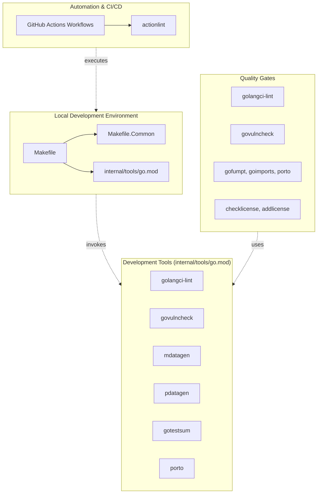
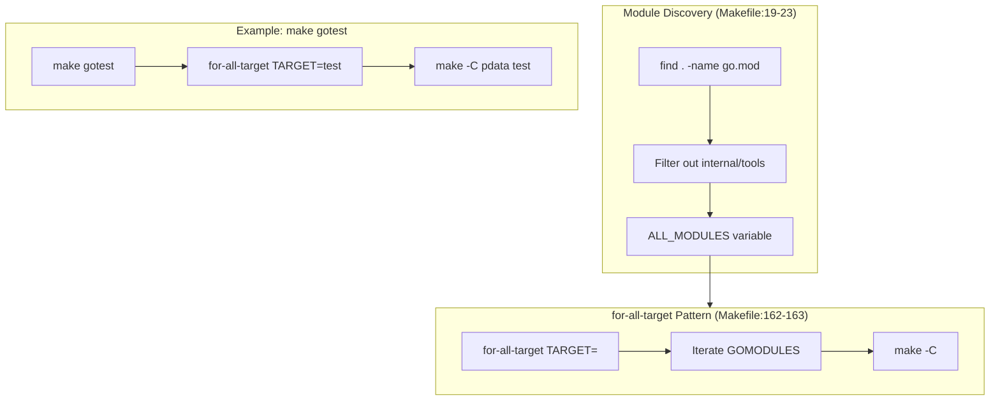
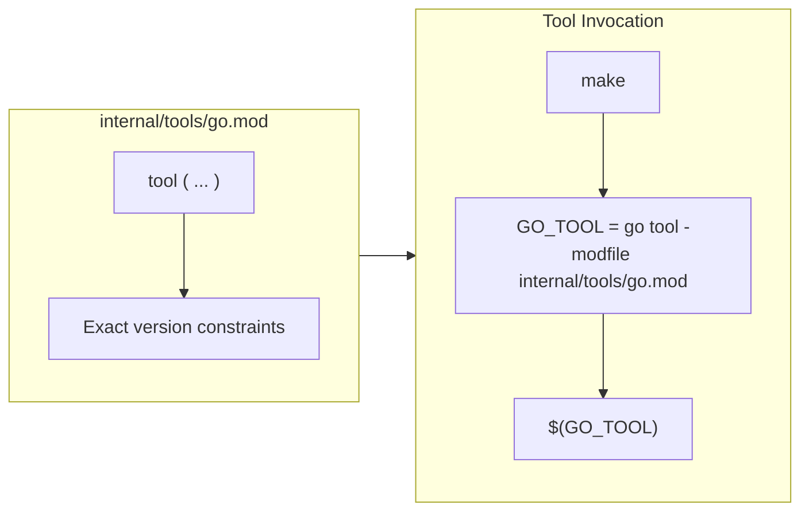
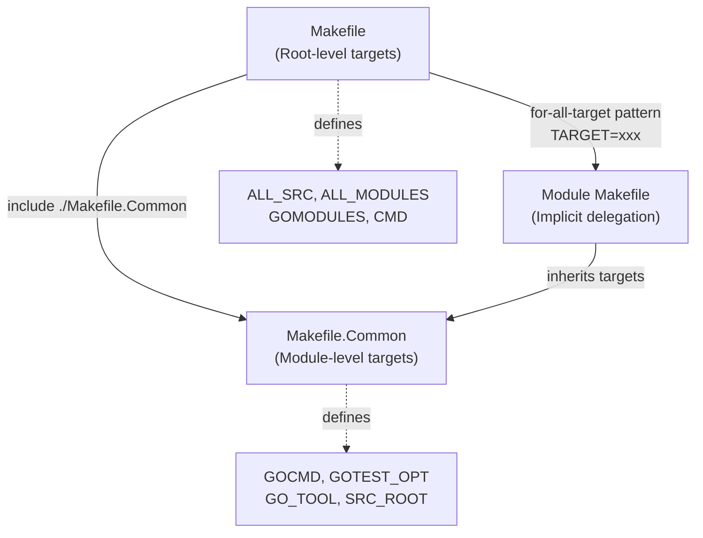
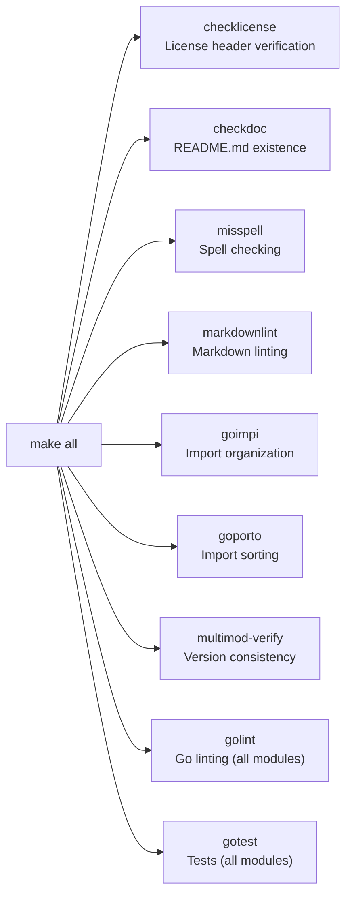
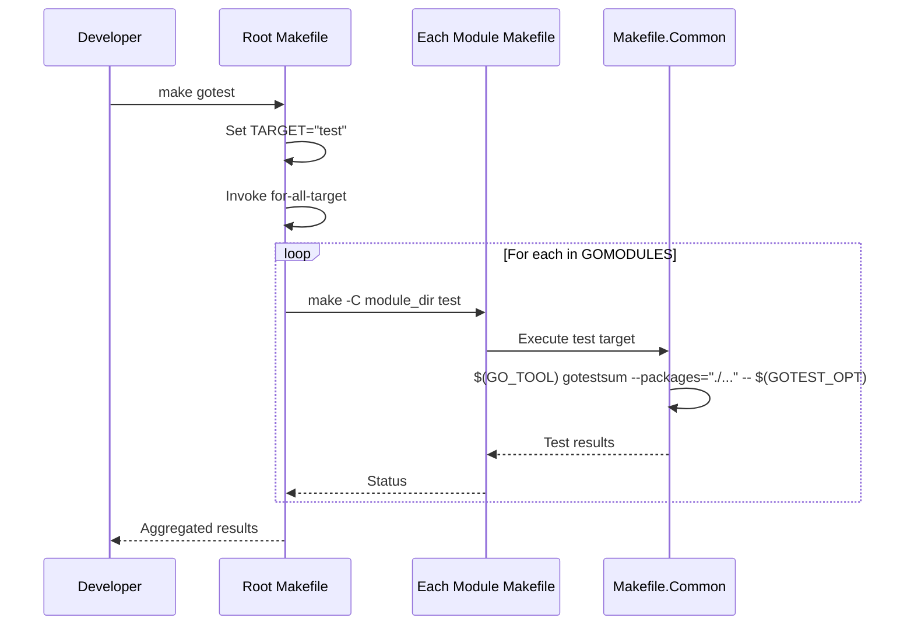
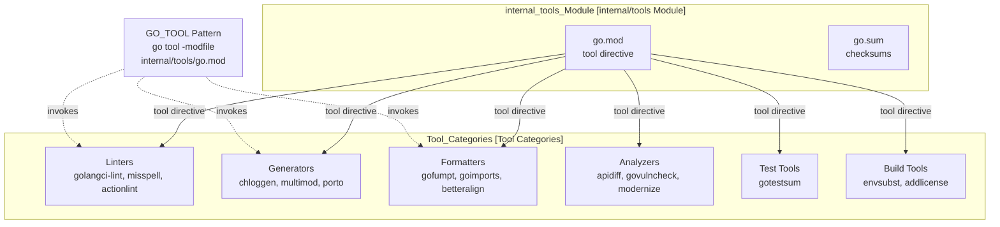
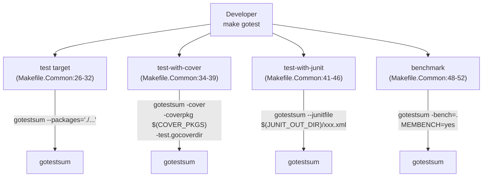
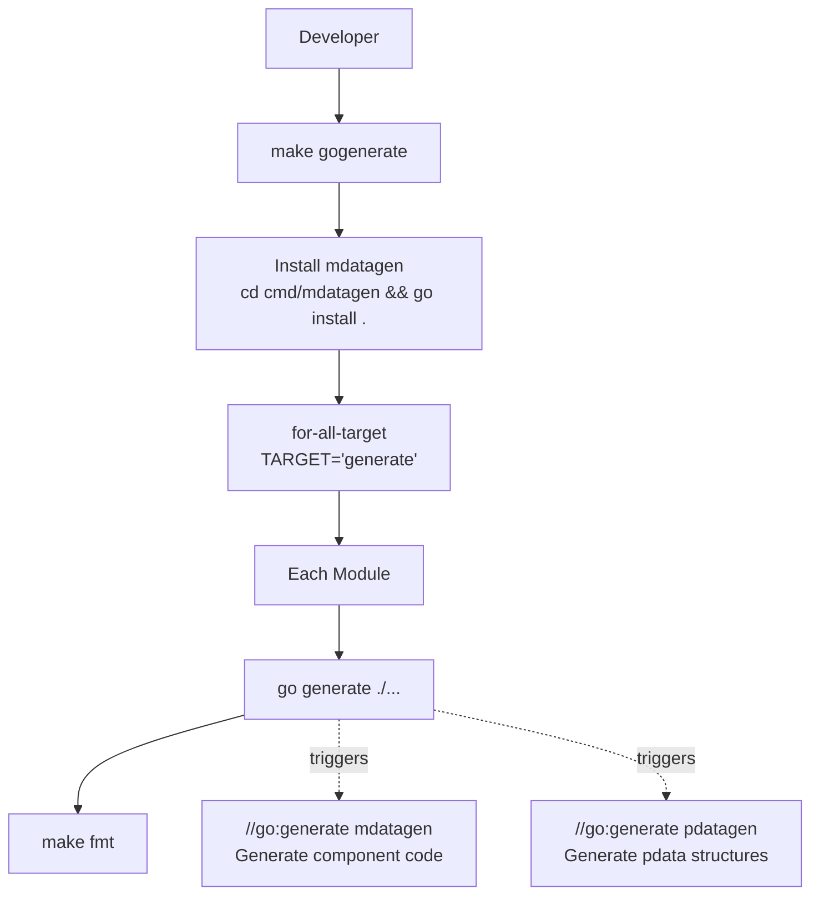
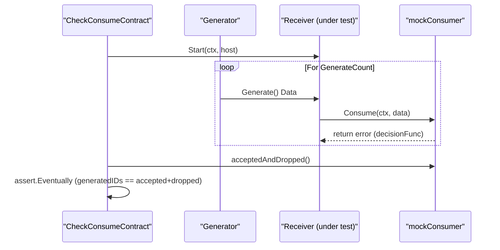

## Overview

The OpenTelemetry Collector development workflow provides comprehensive tooling and automation for building, testing, and maintaining the codebase. This infrastructure operates across 70+ Go modules organized in a multi-module repository structure [Makefile:19-23](), ensuring consistency and quality through automated workflows and standardized build processes.

The development workflow is organized into four main areas:

1.  **Build System and Makefile** (see page [Build System and Makefile](#9.1)) - Makefile-based orchestration using the `for-all` pattern to operate on all modules.
2.  **Testing Infrastructure** (see page [Testing Infrastructure](#9.2)) - Test execution modes, benchmarking, and specialized testing for different component types.
3.  **Code Generation Tools** (see page [Code Generation Tools](#9.3)) - Automated code generation for component metadata (`mdatagen`), internal data models (`pdatagen`), and API compatibility checks.
4.  **Code Quality and Linting** (see page [Code Quality and Linting](#9.4)) - Comprehensive linting (60+ linters), formatting, and license enforcement.

This page provides an architectural overview of how these systems interact. For implementation details, refer to the individual child pages.

## Architecture Overview

The development workflow integrates local development tools with cloud-based CI/CD automation. The system is designed around three core principles:

1.  **Tool Version Consistency** - All tools are version-pinned in `internal/tools/go.mod` [internal/tools/go.mod:5-26]() and invoked via the `GO_TOOL` pattern using `go tool -modfile` [Makefile.Common:21]().
2.  **Multi-Module Operation** - The `for-all-target` pattern enables executing targets across all Go modules uniformly [Makefile:162-163]().
3.  **Layered Validation** - Multiple independent validation stages (linting, testing, vulnerability scanning) provide comprehensive quality assurance [Makefile:43]().

### High-Level System Architecture



**Sources:** [Makefile:1-113](), [Makefile.Common:1-105](), [internal/tools/go.mod:1-26]()

## Multi-Module Operation

The repository contains dozens of independent Go modules that must be built, tested, and versioned together. The build system uses the **for-all pattern** to execute operations uniformly across all modules.

### Module Discovery and Delegation



The top-level `Makefile` delegates to module-specific Makefiles that include `Makefile.Common` [Makefile.Common:1-105](), which defines standard targets like `test`, `lint`, and `tidy`.

**Sources:** [Makefile:19-23](), [Makefile:153-163](), [Makefile.Common:1-105]()

## Tool Version Management

Development tools are version-pinned in a dedicated Go module at `internal/tools/go.mod` [internal/tools/go.mod:1-26]() to ensure consistent behavior across all development environments and CI runs.

### Tool Isolation Pattern



The `GO_TOOL` macro [Makefile.Common:21]() ensures tools are always invoked from the versioned tools module rather than relying on globally installed versions.

### Key Development Tools

| Tool | Purpose | Invocation | Version Source |
|------|---------|------------|----------------|
| `golangci-lint` | Code linting | `make golint` | [internal/tools/go.mod:9]() |
| `gotestsum` | Test execution | `make gotest` | [internal/tools/go.mod:24]() |
| `mdatagen` | Metadata generation | `make gogenerate` | [Makefile:105-109]() |
| `pdatagen` | Pdata generation | `make genpdata` | [Makefile:191-195]() |
| `govulncheck` | Vulnerability scanning | `make govulncheck` | [internal/tools/go.mod:23]() |
| `porto` | Import management | `make goporto` | [internal/tools/go.mod:11]() |
| `apidiff` | API Compatibility | `gen-apidiff.sh` | [internal/tools/go.mod:20]() |

**Sources:** [internal/tools/go.mod:1-26](), [Makefile.Common:19-21](), [Makefile:40-43]()

## Child Pages

For deep technical details on specific workflow areas, refer to the following child pages:

*   **[Build System and Makefile](#9.1)**: Explains the Makefile system, common targets, and the multi-module delegation pattern.
*   **[Testing Infrastructure](#9.2)**: Details test execution modes (unit, cover, junit), benchmarking, and how tests are organized.
*   **[Code Generation Tools](#9.3)**: Explains automated code generation with `mdatagen`, `pdatagen`, and `apidiff`.
*   **[Code Quality and Linting](#9.4)**: Details the `golangci-lint` setup, code formatting tools (`gofumpt`, `porto`), and license checking.

**Sources:** [Makefile:1-210](), [Makefile.Common:1-105](), [internal/tools/go.mod:1-26]()

# Build System and Makefile


The OpenTelemetry Collector uses a comprehensive Makefile-based build system that orchestrates testing, code generation, linting, formatting, and release processes across the project's 70+ Go modules. This system provides consistent commands for all development operations and enables efficient multi-module workflows through delegation patterns.

---

## Makefile Structure

The build system consists of two primary files that work together through inclusion and delegation.

### Architecture Overview



**Sources:** [Makefile:1](), [Makefile.Common:1]()

### Makefile (Root Level)

The root [Makefile:1-240]() defines project-wide operations and coordinates multi-module execution:

- **Variables:** Discovers all Go modules with `find` commands.
  - `ALL_SRC` [Makefile:4-9]() - All `.go` files excluding tools, third-party code, and specific generated paths like `protogen` or `tmplgen`.
  - `ALL_MODULES` [Makefile:19-23]() - All module directories (subdirectories with `go.mod`), excluding `internal/tools`.
  - `GOMODULES` [Makefile:153]() - `ALL_MODULES` plus the root directory (`PWD`).

- **Delegation Pattern:** The `for-all-target` mechanism [Makefile:162-163]() executes targets across all modules by iterating through `GOMODULES`.
- **Project-Specific Targets:** License checking, multi-module operations, and release preparation.

### Makefile.Common (Module Level)

[Makefile.Common:1-113]() defines targets that operate within a single module context and is included by both the root Makefile and individual module Makefiles:

- **Common Variables:**
  - `GOCMD` [Makefile.Common:9]() - Go command (defaults to `go`).
  - `GOTEST_OPT` [Makefile.Common:14]() - Test flags including timeout and `-race` detection (race is disabled on Windows ARM64).
  - `GO_TOOL` [Makefile.Common:21]() - Pattern for invoking tools from `internal/tools` using the `-modfile` flag.
  - `SRC_ROOT` [Makefile.Common:17]() - Repository root determined by `git rev-parse --show-toplevel`.

- **Standard Targets:** `test`, `fmt`, `lint`, `tidy`, `generate`, `vulncheck`, etc.

**Sources:** [Makefile:1-240](), [Makefile.Common:1-113]()

---

## Common Make Targets

The build system provides standardized targets that developers use daily. The root `all` target chains together the most critical checks.

### Main Target Chain



**Sources:** [Makefile:42-43]()

### Core Development Targets

| Target | Purpose | Implementation |
|--------|---------|----------------|
| `gotest` | Run tests across all modules | Delegates `TARGET="test"` via `for-all-target` [Makefile:52-54]() |
| `gotest-with-cover` | Generate coverage reports | Uses `gotestsum` with `-cover` and aggregates via `covdata` [Makefile:61-64]() |
| `gotest-with-junit` | Output JUnit XML reports | Delegates `TARGET="test-with-junit"` [Makefile:67-68]() |
| `golint` | Run linters on all modules | Delegates `TARGET="lint"` [Makefile:85-86]() |
| `gofmt` | Format code | Delegates `TARGET="fmt"` [Makefile:97-98]() |
| `gotidy` | Tidy go.mod files | Delegates `TARGET="tidy"` [Makefile:101-102]() |
| `gogenerate` | Run code generators | Installs `mdatagen`, delegates `TARGET="generate"`, then runs `fmt` [Makefile:104-109]() |

**Sources:** [Makefile:52-112](), [Makefile.Common:26-101]()

---

## Multi-Module Operations

The collector's multi-module structure requires coordinated operations. The `for-all-target` pattern enables executing the same target across all modules efficiently.

### The for-all-target Pattern



**Sources:** [Makefile:156-163]()

### Implementation Details

The delegation mechanism [Makefile:156-163]() works as follows:

1. **Define module targets:** Each directory in `GOMODULES` becomes a phony target [Makefile:156-159]().
   ```makefile
   .PHONY: $(GOMODULES)
   $(GOMODULES):
       @echo "Running target '$(TARGET)' in module '$@'"
       $(MAKE) -C $@ $(TARGET)
   ```

2. **Trigger delegation:** The `for-all-target` depends on all module targets [Makefile:162-163]().
   ```makefile
   .PHONY: for-all-target
   for-all-target: $(GOMODULES)
   ```

3. **Invoke from root:** Root targets set `TARGET` and invoke `for-all-target`.
   ```makefile
   .PHONY: gotest
   gotest:
       @$(MAKE) for-all-target TARGET="test"
   ```

**Sources:** [Makefile:156-163](), [Makefile:52-54](), [Makefile:85-86]()

---

## Tool Management and GO_TOOL Pattern

All development tools are managed through the `internal/tools` module to ensure version consistency across the project. This avoids "dependency hell" where different developers use different tool versions.

### Tools Module Structure



**Sources:** [internal/tools/go.mod:1-26](), [Makefile.Common:19-21]()

### GO_TOOL Pattern

The `GO_TOOL` variable [Makefile.Common:21]() ensures all tools use the versions specified in `internal/tools/go.mod` by using the `go tool -modfile` feature:

```makefile
TOOLS_MOD_DIR   := $(SRC_ROOT)/internal/tools
TOOLS_MOD_FILE  := $(TOOLS_MOD_DIR)/go.mod
GO_TOOL         := $(GOCMD) tool -modfile $(TOOLS_MOD_FILE)
```

**Usage examples:**
- **Linting:** `$(GO_TOOL) golangci-lint run` [Makefile.Common:71]()
- **Testing:** `$(GO_TOOL) gotestsum --packages="./..." -- $(GOTEST_OPT)` [Makefile.Common:32]()
- **Modernizing:** `$(GO_TOOL) modernize -fix ... ./...` [Makefile.Common:59]()
- **Import Management:** `$(GO_TOOL) porto -w ... ./` [Makefile:72]()

**Sources:** [Makefile.Common:19-21](), [Makefile.Common:32](), [Makefile.Common:71](), [Makefile:72]()

### Declared Tools

The `tool` block in [internal/tools/go.mod:5-26]() declares the toolset:

| Tool | Code Identifier | Purpose |
|------|-----------------|---------|
| `golangci-lint` | `github.com/golangci/golangci-lint/v2/cmd/golangci-lint` | Primary Go linter runner |
| `gotestsum` | `gotest.tools/gotestsum` | Test runner and report generator |
| `multimod` | `go.opentelemetry.io/build-tools/multimod` | Multi-module version management |
| `chloggen` | `go.opentelemetry.io/build-tools/chloggen` | Changelog entry generator |
| `apidiff` | `golang.org/x/exp/cmd/apidiff` | API compatibility checker |
| `modernize` | `golang.org/x/tools/go/analysis/passes/modernize/cmd/modernize` | Code modernization analyzer |
| `porto` | `github.com/jcchavezs/porto/cmd/porto` | Vanity import path management |
| `gofumpt` | `mvdan.cc/gofumpt` | Stricter code formatter |
| `envsubst` | `github.com/a8m/envsubst/cmd/envsubst` | Environment variable substitution |

**Sources:** [internal/tools/go.mod:5-26]()

---

## Testing Infrastructure

The build system provides multiple test execution modes with different output formats and coverage options.

### Test Configuration

The `Makefile.Common` defines the core test parameters:

- `GOTEST_TIMEOUT` [Makefile.Common:12](): Defaults to `240s`.
- `GOTEST_OPT` [Makefile.Common:14](): Includes the timeout and the `-race` flag (except on Windows ARM64).
- `JUNIT_OUT_DIR` [Makefile.Common:24](): Defaults to `$(TOOLS_MOD_DIR)/testresults`.

### Test Execution Targets



**Notes:**
- **Coverage:** `test-with-cover` [Makefile.Common:35-39]() creates a `coverage/unit` directory and uses `atomic` covermode. The root Makefile aggregates this into `coverage.txt` using `go tool covdata` [Makefile:64]().
- **JUnit:** `test-with-junit` [Makefile.Common:42-46]() generates XML reports named after the module (e.g., `go-opentelemetry-io-collector-junit.xml`) [Makefile.Common:45]().
- **Benchmarks:** `benchmark` [Makefile.Common:49-52]() sets `MEMBENCH=yes` and pipes output to `benchmark.txt`.

**Sources:** [Makefile.Common:12-52](), [Makefile:61-64]()

---

## Code Quality and Linting

The build system enforces code quality through `golangci-lint` and several specialized tools.

### golangci-lint Configuration

The [.golangci.yml:1-278]() configuration enables over 50 linters [.golangci.yml:28-53](), including:

- **Correctness:** `errcheck`, `govet`, `staticcheck`, `unused`.
- **Style:** `revive`, `gocritic`, `misspell`, `unconvert`.
- **Modernization:** `modernize`, `usestdlibvars`, `usetesting`.
- **Best Practices:** `contextcheck`, `errorlint`, `fatcontext`, `perfsprint`.
- **Test Quality:** `testifylint`, `thelper`.

**Linter Settings:**
- `depguard` [.golangci.yml:67-100](): Denies specific packages like `go.uber.org/atomic` (use `sync/atomic`) and `github.com/pkg/errors` (use `errors` or `fmt`).
- `govet` [.golangci.yml:119-134](): Disables `fieldalignment` to prioritize readability over struct packing [.golangci.yml:125]().
- `revive` [.golangci.yml:159-218](): Enforces rules including `context-as-argument` and `error-naming`.

### Specialized Quality Tools

- **impi** [Makefile.Common:94-97](): Verifies the import scheme (`stdThirdPartyLocal`) and ensures the local prefix is `go.opentelemetry.io/collector`.
- **porto** [Makefile:71-72](): Adds vanity import paths and manages internal import visibility.
- **modernize** [Makefile.Common:58-62](): Automatically applies Go modernization fixes (e.g., `slicescontains`, `stringscut`, `mapsloop`).
- **misspell** [Makefile:137-138](): Checks documentation and source files for spelling errors using `ALL_DOC` [Makefile:12]().

**Sources:** [.golangci.yml:1-278](), [Makefile.Common:58-97](), [Makefile:12-138]()

---

## Code Generation

The build system coordinates multiple code generation tools to maintain consistency.

### Generation Workflow



### Generation Targets

| Target | Command | Purpose |
|--------|---------|---------|
| `gogenerate` | [Makefile:105-109]() | Orchestrates global generation: installs `mdatagen`, runs module generation, and formats. |
| `genpdata` | [Makefile:191-194]() | Runs `pdatagen` from `internal/cmd/pdatagen` and applies `betteralign` to generated files. |
| `genproto` | [Makefile:204-208]() | Uses a Docker-based `protoc` [Makefile:201]() to generate Go code from `.proto` files in `PROTO_SRC_DIRS` [Makefile:199](). |
| `genotelcorecol` | [Makefile:177-179]() | Uses the `builder` tool to regenerate the core collector distribution based on `builder-config.yaml`. |
| `schemagen` | [Makefile.Common:110-113]() | Runs the `schemagen` tool to generate configuration schemas for components. |

**Sources:** [Makefile:105-208](), [Makefile.Common:110-113]()

---

## Module Versioning Strategy

The build system supports a dual-versioning strategy managed through `versions.yaml`.

- **Stable Modules:** Modules under `go.opentelemetry.io/collector/*` (e.g., `pdata`, `component`) use `v1.x` versions [versions.yaml:5-32]().
- **Beta Modules:** The core collector and experimental packages use `v0.x` versions [versions.yaml:33-103]().
- **Tooling:** The `multimod` tool [internal/tools/go.mod:19]() is used to synchronize these versions across the multi-module repository.

**Sources:** [versions.yaml:1-111](), [internal/tools/go.mod:19]()

# Testing Infrastructure


This page documents the testing infrastructure used for developing and validating the OpenTelemetry Collector. It covers test execution modes, coverage reporting, benchmarking, integration testing, and common test utilities.

## Purpose and Scope

The testing infrastructure provides mechanisms for:
- Executing unit tests across 70+ Go modules.
- Generating code coverage reports in multiple formats.
- Running benchmark tests for performance validation.
- Executing end-to-end integration tests for component interoperability.
- Validating API and contract compatibility between components.
- Providing "nop" (no-operation) and "sink" components for component-level testing.

## Test Execution Modes

The collector supports three primary test execution modes, configured via Makefile targets in the root `Makefile` and `Makefile.Common`.

### Basic Test Execution

The `test` target in [Makefile.Common:26-32]() executes tests using `gotestsum`. It defaults to a 240-second timeout and enables the race detector except on Windows ARM64 [Makefile.Common:12-14]().

```makefile
test:
	$(GO_TOOL) gotestsum --packages="./..." -- $(GOTEST_OPT)
```

The test can be invoked at the root level with `make gotest` [Makefile:52-54](), which delegates to all modules via the `for-all-target` pattern [Makefile:162-164]().

### Coverage Reporting

The `test-with-cover` target [Makefile.Common:34-40]() generates code coverage data using Go's native coverage toolset.

```makefile
test-with-cover:
	mkdir -p $(PWD)/coverage/unit
	$(GO_TOOL) gotestsum \
		--packages="./..." -- \
		$(GOTEST_OPT) -cover -covermode=atomic -coverpkg $(COVER_PKGS) -args -test.gocoverdir="$(PWD)/coverage/unit"
```

The root `gotest-with-cover` target then aggregates these results into a single `coverage.txt` file using the `covdata` tool [Makefile:61-64]().

### JUnit XML Reporting

For CI/CD integration, the `test-with-junit` target [Makefile.Common:41-47]() generates JUnit XML reports. These are stored in a centralized directory defined by `JUNIT_OUT_DIR`, typically `internal/tools/testresults` [Makefile.Common:24]().

#### Test Execution Flow
Title: Test Execution and Delegation Flow
```mermaid
graph TB
    subgraph "Execution_Layer"
        ["make gotest"] --> ForAll
        ["make gotest-with-cover"] --> ForAll
        ["make test-with-junit"] --> ForAll
    end

    subgraph "Orchestration"
        ForAll["for-all-target"] --> Delegator["$(GOMODULES)"]
    end

    subgraph "Tooling"
        Delegator --> GTS["gotestsum"]
        GTS --> GoTest["go test -race"]
    end
```
**Sources:** [Makefile:52-69](), [Makefile:157-164](), [Makefile.Common:26-47]()

## Test Tools and Dependencies

Test-related tools are managed in the `internal/tools` module to isolate them from production dependencies [internal/tools/go.mod:1-26]().

| Tool | Role | Reference |
| :--- | :--- | :--- |
| `gotestsum` | Primary test runner and formatter | [internal/tools/go.mod:24]() |
| `golangci-lint` | Static analysis including test-specific linters | [internal/tools/go.mod:9]() |
| `testifylint` | Validates usage of `testify` assertions | [internal/tools/go.mod:41]() |
| `porto` | Adds vanity import aliases to Go files | [internal/tools/go.mod:11]() |
| `modernize` | Simplifies code to use modern Go patterns | [internal/tools/go.mod:22]() |

### Linting Configuration
The project uses `golangci-lint` with specific test linters enabled in [.golangci.yml:46-52](), such as `testifylint`, `thelper`, and `usetesting`. It also enforces `depguard` rules to prevent the use of `go.opentelemetry.io/proto` in production code, directing developers to use `pdata` instead, while allowing it in specific test scenarios via the `ignore-in-test` rule [.golangci.yml:93-99]().

**Sources:** [internal/tools/go.mod:5-26](), [.golangci.yml:46-52](), [.golangci.yml:93-99]()

## Benchmark Testing

Benchmarks are executed via the `benchmark` target [Makefile.Common:48-52](). It sets `MEMBENCH=yes` to enable memory allocation tracking and filters for benchmark functions only using `-run=notests`.

```makefile
benchmark:
	MEMBENCH=yes $(GO_TOOL) gotestsum \
		--packages="$(ALL_PKGS)" -- \
		-bench=. -run=notests ./... | tee benchmark.txt
```

The root `gobenchmark` target aggregates results from all modules into a single `benchmarks.txt` file using `find` and `cat` [Makefile:56-59]().

**Sources:** [Makefile:56-59](), [Makefile.Common:48-52]()

## Component Testing Utilities

The codebase provides standard "nop" (no-operation) and "sink" implementations to simplify testing of pipelines and individual components.

### Nop Components
Nop components implement the required interfaces but perform no actions. They are used when a test requires a valid component (e.g., to satisfy a factory requirement) but doesn't need to verify its behavior.

- **Receiver**: `receivertest.NewNopFactory()` [receiver/receivertest/nop_receiver.go:31-40]()
- **Processor**: `processortest.NewNopFactory()` [processor/processortest/nop_processor.go:30-39]()
- **Exporter**: `exportertest.NewNopFactory()` [exporter/exportertest/nop_exporter.go:30-39]()
- **Extension**: `extensiontest.NewNopFactory()` [extension/extensiontest/nop_extension.go:27-36]()

### Sink Consumers
Sinks are used to capture data emitted by a component for assertion. The `consumertest` package provides sinks for all signal types [consumer/consumertest/sink.go:25-30]().

- **TracesSink**: Captures `ptrace.Traces`.
- **MetricsSink**: Captures `pmetric.Metrics`.
- **LogsSink**: Captures `plog.Logs`.

#### Testing Entity Relationships
Title: Component Testing Mock Entities
```mermaid
classDiagram
    class "nopReceiver"["nopReceiver"] {
        +Start(ctx, host)
        +Shutdown(ctx)
    }
    class "nopProcessor"["nopProcessor"] {
        +ConsumeTraces(ctx, td)
        +ConsumeMetrics(ctx, md)
        +ConsumeLogs(ctx, ld)
    }
    class "nopExporter"["nopExporter"] {
        +ConsumeTraces(ctx, td)
        +ConsumeMetrics(ctx, md)
        +ConsumeLogs(ctx, ld)
    }

    class "TracesSink"["TracesSink"] {
        +traces []ptrace.Traces
        +ConsumeTraces(ctx, td)
    }

    "nopReceiver" --|> "component.Component"
    "nopProcessor" --|> "processor.Traces"
    "nopExporter" --|> "exporter.Traces"
    "TracesSink" --|> "consumer.Traces"
```
**Sources:** [exporter/exportertest/nop_exporter.go:59-68](), [processor/processortest/nop_processor.go:59-68](), [receiver/receivertest/nop_receiver.go:63-66](), [consumer/consumertest/sink.go:25-30]()

## End-to-End and Contract Testing

### Receiver Contract Testing
The `receivertest` package provides `CheckConsumeContract` to ensure receivers adhere to the Collector's consumer contract. This utility tests various scenarios including success paths, non-permanent error retries, and permanent error handling.

### Distribution Testing
The `otelcorecol` distribution is validated by building the binary and running it against sample configurations. The `run` target [Makefile:148-150]() builds the collector and starts it. The builder tool also has a dedicated test script `cmd/builder/test/test.sh` that validates custom distributions by checking service health [cmd/builder/test/test.sh:77-80]().

#### Contract Testing Flow
Title: Receiver Contract Validation Flow


**Sources:** [receiver/receivertest/nop_receiver.go:31-40](), [cmd/builder/test/test.sh:59-87]()

### Code Generation Validation
Tests for generated code (via `pdatagen`) are critical. The `genpdata` target [Makefile:191-195]() runs the generator and ensures the output is formatted and aligned.

```makefile
genpdata:
	cd internal/cmd/pdatagen && $(GOCMD) run main.go -C $(SRC_ROOT)
	$(MAKE) -C pdata fmt
	cd pdata && $(GO_TOOL) betteralign --generated_files --apply ./... || true
```

**Sources:** [Makefile:191-195]()