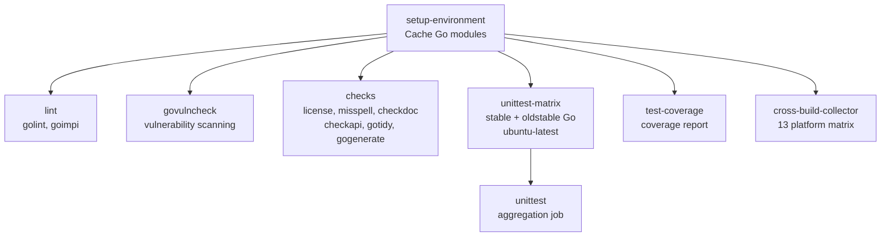

## Purpose and Scope

This page documents the GitHub Actions-based CI/CD system that validates, tests, and automates releases for the OpenTelemetry Collector repository. It covers the structure, triggers, and job dependencies of all workflows, common patterns for caching and environment setup, and the integration between different workflow types.

For information about release management and versioning, see [Release Management](#11). For details on the build system and Makefile targets invoked by these workflows, see [Build System and Makefile](#9.1). For builder-specific workflows, see [OpenTelemetry Collector Builder (ocb)](#8.1).

## Workflow Overview

The repository contains 15+ GitHub Actions workflows organized into several categories: build validation, security scanning, release automation, and cross-repository integration testing.

### Workflow Categories

| Category | Workflows | Primary Purpose |
|----------|-----------|----------------|
| **Build Validation** | `build-and-test.yml`, `build-and-test-windows.yaml`, `build-and-test-arm.yml` | Execute tests across platforms and architectures |
| **Security & Quality** | `codeql-analysis.yml`, `scorecard.yml`, `api-compatibility.yml`, `govulncheck` (job) | Static analysis, vulnerability scanning, and compatibility checks |
| **Dependency Management** | `changelog.yml`, `tidy-dependencies.yml` | Enforce changelog entries and tidy dependencies |
| **Cross-Repository** | `contrib-tests.yml` | Validate changes against `opentelemetry-collector-contrib` |
| **Builder Tools** | `builder-integration-test.yaml`, `builder-snapshot.yaml` | Test and snapshot the `ocb` tool |
| **Release Automation** | `prepare-release.yml`, `release-branch.yml` | Automate release preparation and branching |
| **Infrastructure** | `lint-workflow-files.yml`, `perf.yml`, `go-benchmarks.yml` | Workflow linting and performance tracking |

### Workflow Trigger Architecture

```mermaid
graph TB
    subgraph "Event Sources"
        PR["Pull Request<br/>opened, synchronize, labeled"]
        Push["Push to main"]
        MergeQueue["Merge Group<br/>checks_requested"]
        Tag["Tag Push<br/>v[0-9]+.[0-9]+.[0-9]+*"]
        Schedule["Scheduled<br/>cron triggers"]
        Manual["workflow_dispatch<br/>manual trigger"]
    end

    subgraph "Primary Workflows"
        BAT["build-and-test.yml"]
        BATWin["build-and-test-windows.yaml"]
        BATARM["build-and-test-arm.yml"]
        CodeQL["codeql-analysis.yml"]
        Scorecard["scorecard.yml"]
        Changelog["changelog.yml"]
        ContribTests["contrib-tests.yml"]
        APICompat["api-compatibility.yml"]
    end

    subgraph "Specialized Workflows"
        PrepRelease["prepare-release.yml"]
        BuilderInt["builder-integration-test.yaml"]
        BuilderSnap["builder-snapshot.yaml"]
        TidyDeps["tidy-dependencies.yml"]
        Perf["perf.yml"]
    end

    PR --> BAT
    PR --> BATWin
    PR --> BATARM
    PR --> CodeQL
    PR --> Changelog
    PR --> ContribTests
    PR --> APICompat
    PR --> BuilderInt
    PR --> BuilderSnap

    Push --> BAT
    Push --> BATWin
    Push --> BATARM
    Push --> CodeQL
    Push --> Scorecard
    Push --> ContribTests
    Push --> BuilderInt
    Push --> BuilderSnap
    Push --> Perf

    MergeQueue --> BAT
    MergeQueue --> BATWin
    MergeQueue --> BATARM
    MergeQueue --> Changelog
    MergeQueue --> ContribTests
    MergeQueue --> BuilderInt

    Tag --> BAT
    Tag --> BATWin
    Tag --> BATARM

    Schedule --> Scorecard
    Schedule --> BuilderInt

    Manual --> PrepRelease
    Manual --> BuilderInt

    PR -.special label.-> TidyDeps
```



**Sources:** [.github/workflows/build-and-test.yml:2-9](), [.github/workflows/build-and-test-windows.yaml:2-9](), [.github/workflows/build-and-test-arm.yml:2-9](), [.github/workflows/codeql-analysis.yml:2-5](), [.github/workflows/scorecard.yml:3-12](), [.github/workflows/changelog.yml:7-13](), [.github/workflows/contrib-tests.yml:2-11](), [.github/workflows/api-compatibility.yml:8-11](), [.github/workflows/prepare-release.yml:3-20](), [.github/workflows/builder-integration-test.yaml:3-20]()

### Concurrency Control

All workflows implement concurrency control to prevent wasteful parallel runs and optimize CI/CD resource usage. The standard pattern groups workflows by `workflow` and `ref_name` with `cancel-in-progress: true`.

```yaml
concurrency:
  group: ${{ github.workflow }}-${{ github.ref_name }}
  cancel-in-progress: true
```

This configuration ensures that when a new commit is pushed to a PR, any in-progress workflow run for that PR is cancelled.

**Sources:** [.github/workflows/build-and-test.yml:13-15](), [.github/workflows/codeql-analysis.yml:7-9](), [.github/workflows/changelog.yml:15-17](), [.github/workflows/build-and-test-windows.yaml:11-13]()

## Main Build and Test Workflow

The `build-and-test.yml` workflow is the primary validation workflow, implementing a multi-stage pipeline with job dependencies and parallelization.

### Job Dependency Graph



**Sources:** [.github/workflows/build-and-test.yml:17-207]()

### Setup Environment Job

The `setup-environment` job creates a shared Go module cache used by all subsequent jobs. It uses `oldstable` Go version and triggers `make gomoddownload` if the cache is missed.

**Sources:** [.github/workflows/build-and-test.yml:18-41]()

### Lint and Vulnerability Jobs

The `lint` job executes Go linting and import organization checks using Makefile targets.
- `make -j2 golint`: Runs `golangci-lint` in parallel.
- `make goimpi`: Validates import organization.

The `govulncheck` job scans the codebase for known vulnerabilities in Go dependencies.
- `make govulncheck`: Invokes the Go vulnerability scanner.

**Sources:** [.github/workflows/build-and-test.yml:43-69](), [.github/workflows/build-and-test.yml:70-94]()

### Checks Job

The `checks` job performs comprehensive validation of code generation, API compatibility, and documentation.

```mermaid
graph TB
    ChecksJob["checks job<br/>ubuntu-latest, stable Go"]

    subgraph "Validation Steps"
        CheckLicense["checklicense<br/>Verify license headers"]
        Misspell["misspell<br/>Check spelling"]
        CheckDoc["checkdoc<br/>Validate documentation"]
        Markdown["markdownlint<br/>Lint markdown files"]
        CheckAPI["checkapi<br/>API compatibility"]
        GoTidy["gotidy<br/>go.mod/go.sum sync"]
        Porto["goporto<br/>Porto link validation"]
        Generate["gogenerate<br/>Generated code sync"]
        GenProto["genproto<br/>Protocol buffer generation"]
        GenPdata["genpdata<br/>pdata generation"]
        GenOtel["genotelcorecol<br/>Builder generation"]
        MultiMod["multimod-verify<br/>Module version sync"]
        CrossLink["crosslink<br/>Replace statements"]
        ChlogGen["generate-chloggen-components<br/>Changelog config"]
    end

    ChecksJob --> CheckLicense
    ChecksJob --> Misspell
    ChecksJob --> CheckDoc
    ChecksJob --> Markdown
    ChecksJob --> CheckAPI
    ChecksJob --> GoTidy
    ChecksJob --> Porto
    ChecksJob --> Generate
    ChecksJob --> GenProto
    ChecksJob --> GenPdata
    ChecksJob --> GenOtel
    ChecksJob --> MultiMod
    ChecksJob --> CrossLink
    ChecksJob --> ChlogGen
```



**Sources:** [.github/workflows/build-and-test.yml:96-166]()

### Cross-Compilation Matrix

The `cross-build-collector` job validates that the collector builds on 13 different platform combinations, including `aix/ppc64`, `js/wasm`, and various `linux` and `windows` architectures.

**Sources:** [.github/workflows/build-and-test.yml:239-304]()

## Windows Testing Workflows

The `build-and-test-windows.yaml` workflow provides Windows-specific testing across multiple Windows versions (`windows-2022`, `windows-2025`, `windows-11-arm`).

### Windows Service Testing

The `windows-service-test` job validates that the collector functions correctly as a Windows service by installing it via `New-Service` and running specialized tests with the `win32service` build tag. It also ensures required ports are available using `win-required-ports.ps1`.

**Sources:** [.github/workflows/build-and-test-windows.yaml:50-98]()

## Security and Quality Gate Workflows

### CodeQL Analysis

The `codeql-analysis.yml` workflow performs static security analysis using GitHub's CodeQL engine for the Go language. It uses `github/codeql-action/init`, `autobuild`, and `analyze` steps.

**Sources:** [.github/workflows/codeql-analysis.yml:1-53]()

### OpenSSF Scorecard

The `scorecard.yml` workflow evaluates the repository's supply-chain security posture. It publishes results to the OpenSSF REST API to allow for the Scorecard badge and uploads SARIF results to GitHub's code scanning dashboard.

**Sources:** [.github/workflows/scorecard.yml:1-70]()

### API Compatibility Checks

The `api-compatibility.yml` workflow prevents breaking changes to stable APIs using the `apidiff` tool. It generates states for the base branch using `make apidiff-build` and compares them against the PR branch using `make apidiff-compare`.

**Sources:** [.github/workflows/api-compatibility.yml:1-73]()

## Changelog Enforcement

The `changelog.yml` workflow enforces that all PRs (excluding chores, dependency updates, or those with "Skip Changelog" labels) include a changelog entry in `.chloggen/`. It validates entries using `make chlog-validate` and performs link checking on a rendered preview using the `lychee` action.

**Sources:** [.github/workflows/changelog.yml:1-88]()

## Cross-Repository Testing

The `contrib-tests.yml` workflow validates changes against `opentelemetry-collector-contrib`. It clones the contrib repository, prepares it with the local collector changes using `make prepare-contrib`, and runs tests in parallel groups (e.g., `receiver-0`, `processor`, `exporter-0`) via `make check-contrib`.

**Sources:** [.github/workflows/contrib-tests.yml:1-110]()

## Release Automation Workflows

### Prepare Release Workflow

The `prepare-release.yml` workflow is a manual `workflow_dispatch` that automates release preparation. It validates version formats for both stable and beta module sets and checks for blockers in both core and contrib repositories.

| Parameter | Required | Description |
|-----------|----------|-------------|
| `candidate-stable` | No | Next stable version (e.g., `1.3.0`) |
| `current-stable` | Yes | Current stable version |
| `candidate-beta` | No | Next beta version (e.g., `0.96.0`) |
| `current-beta` | Yes | Current beta version |

**Sources:** [.github/workflows/prepare-release.yml:3-20](), [.github/workflows/prepare-release.yml:25-67]()

### Release Blocker Checks

The workflow uses custom scripts to check for issues labeled `release:blocker` and ensures that the main branch builds are passing in both core and contrib.

**Sources:** [.github/workflows/prepare-release.yml:68-101]()

## Dependency Management

### Tidy Dependencies Workflow

The `tidy-dependencies.yml` workflow automatically runs `make gotidy` on Renovate bot PRs and pushes the resulting changes back to the branch. It is restricted to non-fork repositories and specifically targets `renovate[bot]`.

**Sources:** [.github/workflows/tidy-dependencies.yml:1-48]()

## Common Workflow Patterns

### Caching Strategy

All workflows implement a consistent caching strategy for Go modules and build artifacts to optimize execution time, typically using `actions/cache` with a key based on the hash of `go.sum` files.

**Sources:** [.github/workflows/build-and-test.yml:30-38](), [.github/workflows/codeql-analysis.yml:33-41]()

### Action Pinning

All third-party GitHub Actions are pinned to specific SHA hashes for security, such as `actions/checkout@9c091bb21b7c1c1d1991bb908d89e4e9dddfe3e0`.

**Sources:** [.github/workflows/build-and-test.yml:22](), [.github/workflows/build-and-test.yml:48](), [.github/workflows/build-and-test.yml:76]()