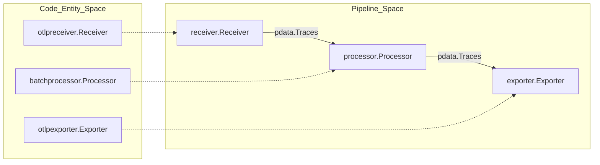
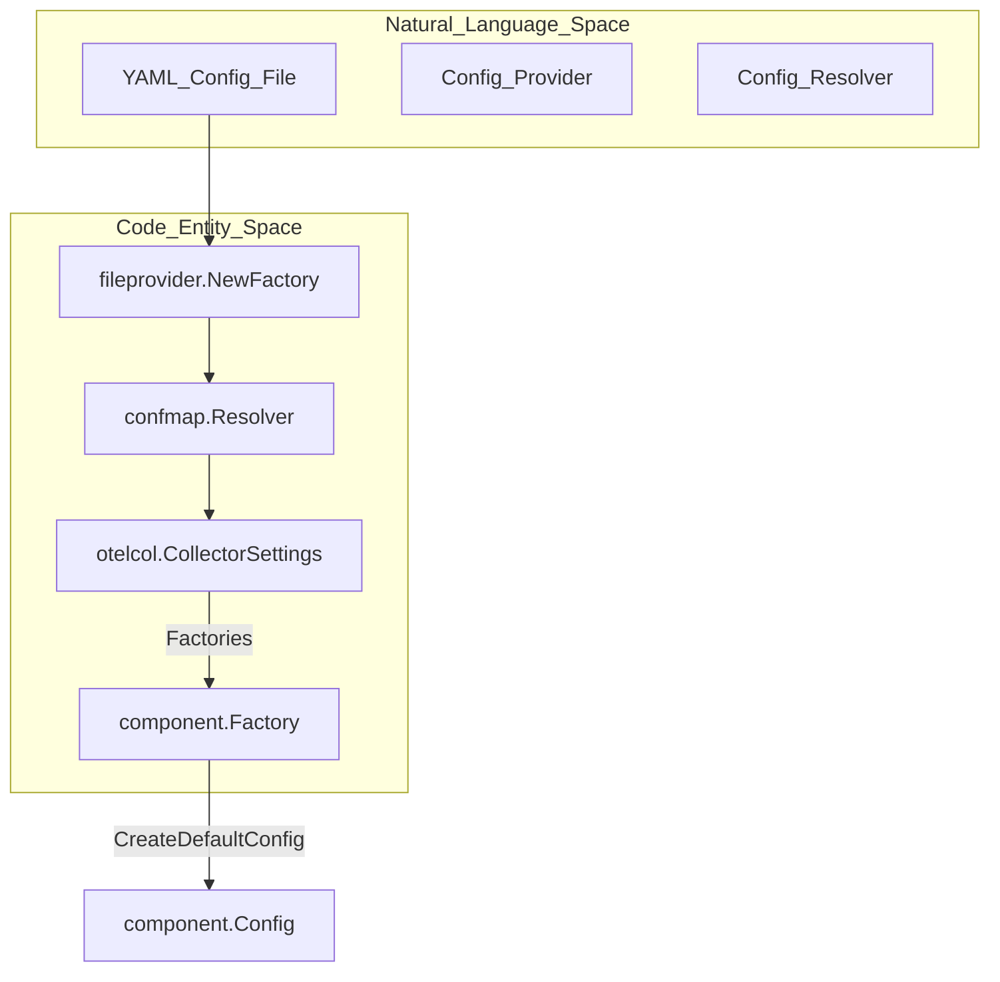

This page provides definitions for codebase-specific terms, abbreviations, and domain concepts used throughout the OpenTelemetry Collector repository. It serves as a technical reference for onboarding engineers to bridge the gap between high-level concepts and their implementation in code.

## Core Data Model & Formats

### pdata (Pipeline Data)
The internal high-performance data model used by the Collector to represent telemetry. It is a wrapper around OTLP (OpenTelemetry Protocol) Protobuf structures, optimized for zero-copy access and efficient memory management. It is divided into signal-specific packages: `ptrace`, `pmetric`, `plog`, and the experimental `pprofile`.

*   **Implementation**: Defined in the `pdata` module. Base common types are in `pcommon`.
*   **Key Functions**: `NewTraces()`, `NewMetrics()`, `NewLogs()`.
*   **Stability**: The `pdata` module is part of the `stable` module set [versions.yaml:10-10]().
*   **Code Pointers**:
    *   [pdata/ptrace/traces.go:1-20]()
    *   [pdata/pmetric/metrics.go:1-20]()
    *   [pdata/plog/logs.go:1-20]()
    *   [versions.yaml:10-10]()
    *   [CHANGELOG.md:58-58]()

### OTLP (OpenTelemetry Protocol)
The primary wire protocol for OpenTelemetry. The Collector uses OTLP as its native internal representation (via `pdata`) and supports it for both ingestion and egress. The codebase currently tracks OTLP v1.10.0, which is considered stable.

*   **Implementation**: Supported via `otlpreceiver` and `otlpexporter`.
*   **Code Pointers**:
    *   [README.md:99-104]()
    *   [cmd/otelcorecol/builder-config.yaml:17-22]()
    *   [versions.yaml:67-68]()
    *   [versions.yaml:92-92]()

---

## Configuration & Management

### confmap
A mechanism for representing and manipulating configuration maps. It provides a generic way to handle configuration regardless of the source (YAML, environment variables, etc.).

*   **Resolver**: `confmap.Resolver` is the core entity that retrieves and merges configuration from various `Providers`.
*   **Provider**: An interface for loading configuration from a specific URI scheme (e.g., `file:`, `env:`, `http:`, `yaml:`).
*   **Code Pointers**:
    *   [confmap/resolver.go:1-50]()
    *   [confmap/provider.go:1-30]()
    *   [cmd/otelcorecol/main.go:29-39]()
    *   [versions.yaml:12-17]()

### featuregate
A mechanism to enable or disable specific functionality (features) within the Collector at runtime. This is used for phased rollouts of new features or breaking changes.

*   **Lifecycle**: Feature gates progress through stages: `Alpha`, `Beta`, `Stable`, and `Deprecated`.
*   **Code Pointers**:
    *   [featuregate/registry.go:1-30]()
    *   [featuregate/gate.go:1-25]()
    *   [CHANGELOG.md:52-58]()

### mdatagen (Metadata Generator)
A build tool used to generate boilerplate code for components based on a `metadata.yaml` file. It generates configuration structs, metric builders, status information, and documentation.

*   **Capabilities**: Supports defining stability levels for resource attributes and versioned metrics [CHANGELOG.md:14-15](), [CHANGELOG.md:74-75]().
*   **Code Pointers**:
    *   [cmd/builder/internal/builder/config.go:45-45]()
    *   [versions.yaml:45-45]()
    *   [CHANGELOG.md:101-102]()

### ocb (OpenTelemetry Collector Builder)
A command-line tool that allows users to build a custom Collector distribution by specifying the desired components in a manifest file. It generates the `main.go` and `go.mod` for the distribution.

*   **Configuration**: Uses a `builder-config.yaml` to define modules, exporters, and receivers [cmd/otelcorecol/builder-config.yaml:1-31]().
*   **Code Pointers**:
    *   [cmd/builder/internal/builder/config.go:30-59]()
    *   [CHANGELOG.md:113-115]()

---

## Component Kinds

The Collector architecture is built on five primary component types, defined in the `component` package.

| Kind | Role | Interface / Helper |
| :--- | :--- | :--- |
| **Receiver** | Ingests data from external sources. | `receiver.Receiver`, `receiverhelper` |
| **Processor** | Modifies, filters, or batches data. | `processor.Processor`, `processorhelper` |
| **Exporter** | Sends data to external backends. | `exporter.Exporter`, `exporterhelper` |
| **Connector** | Connects two pipelines (acts as exporter and receiver). | `connector.Connector` |
| **Extension** | Provides cross-cutting functionality (e.g., health checks). | `extension.Extension` |

**Code Pointers**:
*   [component/component.go:86-97]()
*   [processor/README.md:1-17]()
*   [receiver/README.md:1-10]()
*   [exporter/README.md:1-10]()

### Data Flow Logic (Pipeline Signals)

The Collector organizes data flow into `pipelines` based on the signal type (traces, metrics, logs, profiles). Data ownership is passed from receivers through processors to exporters.

**Pipeline to Code Entity Mapping**

**Sources**: [processor/README.md:38-44](), [component/component.go:91-95](), [cmd/otelcorecol/builder-config.yaml:15-30]()

---

## Stability Levels

Components and resource attributes are assigned stability levels to indicate their readiness for production use.

| Level | Description |
| :--- | :--- |
| **Development** | Under active development. May change in the future [component/component.go:169-169](). |
| **Alpha** | Early stage. Functional but may have significant changes [component/component.go:171-171](). |
| **Beta** | Feature-complete and tested. Minimal breaking changes expected [component/component.go:173-173](). |
| **Stable** | Production-ready. Backwards compatibility is guaranteed [component/component.go:175-175](). |
| **Deprecated** | Scheduled for removal in future releases [component/component.go:167-167](). |

**Code Pointers**:
*   [component/component.go:107-117]()
*   [component/component.go:162-179]()
*   [README.md:104-106]()

---

## Tooling & Project Terms

### Module Sets
The Collector project uses a multi-module Go workspace. Modules are grouped into `stable` and `beta` sets for versioning purposes.

*   **Stable Set**: Modules like `component`, `confmap`, and `pdata` that follow SemVer `v1.x.x` [versions.yaml:5-32]().
*   **Beta Set**: Modules like `otelcol`, `service`, and `cmd/builder` following `v0.x.x` [versions.yaml:33-103]().
*   **Code Pointers**:
    *   [versions.yaml:1-103]()
    *   [cmd/builder/internal/builder/config.go:21-24]()

### chloggen
A tool used to manage changelog entries. It prevents merge conflicts by requiring contributors to add a YAML file to `.chloggen/` instead of editing `CHANGELOG.md` directly.

*   **Code Pointers**:
    *   [CHANGELOG.md:1-5]()
    *   [docs/release.md:58-58]()

### System Interaction Diagram

This diagram bridges the natural language concepts of configuration and component instantiation to the specific code entities involved.

**Configuration to Component Instantiation**

**Sources**: [cmd/otelcorecol/main.go:26-48](), [component/component.go:182-194](), [confmap/resolver.go:1-30]()

---
**Sources**:
* [component/component.go:1-195]()
* [versions.yaml:1-111]()
* [README.md:97-106]()
* [CHANGELOG.md:1-131]()
* [cmd/otelcorecol/main.go:1-64]()
* [cmd/otelcorecol/builder-config.yaml:1-110]()
* [cmd/builder/internal/builder/config.go:1-170]()
* [processor/README.md:1-115]()
* [featuregate/registry.go:1-30]()
* [docs/release.md:1-76]()