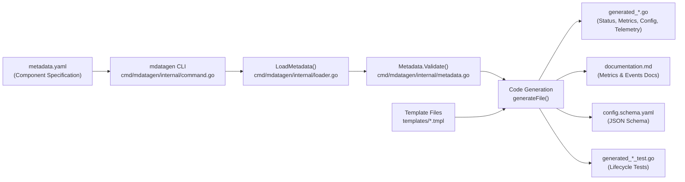
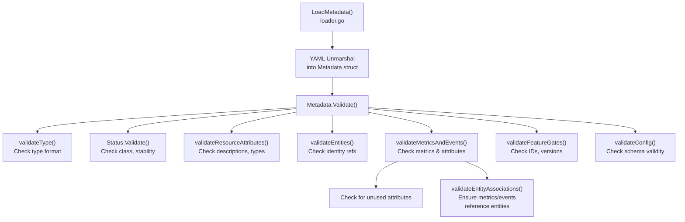
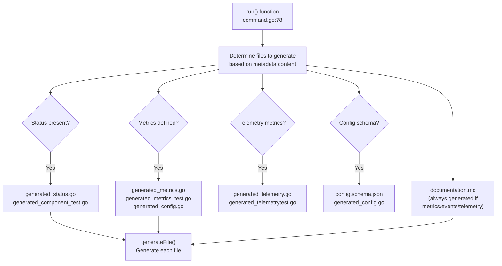
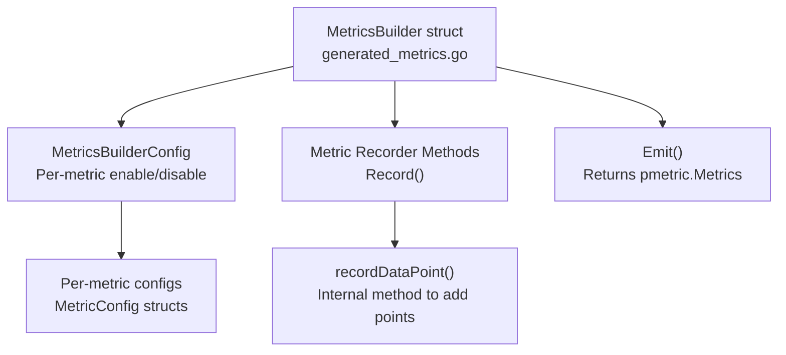
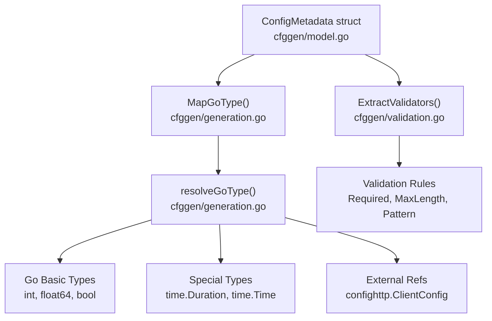

The Metadata Generator (`mdatagen`) is a code generation tool that produces boilerplate code, documentation, and configuration schemas for OpenTelemetry Collector components based on declarative metadata specifications. It ensures consistency across component implementations by generating standardized code for metrics, telemetry, status reporting, configuration handling, and documentation.

For information about using the OpenTelemetry Collector Builder to create custom collector distributions, see [OpenTelemetry Collector Builder (ocb)](#8.1).

## Purpose and Workflow

The `mdatagen` tool reads a `metadata.yaml` file that declaratively specifies a component's characteristics (type, status, metrics, attributes, configuration schema, etc.) and generates multiple artifacts including Go source files, Markdown documentation, JSON schemas, and test files. This eliminates repetitive boilerplate writing and ensures components follow consistent patterns.



**Sources:** [cmd/mdatagen/internal/command.go:78-238](), [cmd/mdatagen/README.md:1-27]()

## Command-Line Interface

The `mdatagen` tool is invoked with a single argument: the path to a `metadata.yaml` file.

```bash
mdatagen path/to/metadata.yaml
```

The tool is typically integrated via Go generate directives in component packages:

```go
//go:generate mdatagen metadata.yaml
```

**Key Functions:**
- `NewCommand()` [cmd/mdatagen/internal/command.go:61-75]() - Constructs the Cobra command using `debug.ReadBuildInfo()` for versioning.
- `run()` [cmd/mdatagen/internal/command.go:78-238]() - Main execution logic that orchestrates loading via `LoadMetadata`, validation of YAML key order, and file generation.

**Sources:** [cmd/mdatagen/internal/command.go:47-75](), [cmd/mdatagen/internal/command.go:78-238](), [cmd/mdatagen/README.md:46-59]()

## Metadata Schema Structure

The `metadata.yaml` file follows a well-defined schema with the following major sections:

```mermaid
graph TD
    Root["metadata.yaml"]

    Root --> Type["type: string<br/>(Component identifier)"]
    Root --> Status["status:<br/>(Stability & Distribution info)"]
    Root --> Config["config:<br/>(Configuration schema)"]
    Root --> Metrics["metrics:<br/>(Emitted metrics)"]
    Root --> Events["events:<br/>(Emitted events)"]
    Root --> Attributes["attributes:<br/>(Metric attributes)"]
    Root --> ResourceAttrs["resource_attributes:<br/>(Resource attributes)"]
    Root --> Entities["entities:<br/>(Entity definitions)"]
    Root --> Telemetry["telemetry:<br/>(Internal telemetry)"]
    Root --> FeatureGates["feature_gates:<br/>(Feature flags)"]
    Root --> Tests["tests:<br/>(Test configuration)"]

    Status --> Class["class:<br/>receiver|processor|exporter|<br/>connector|extension|scraper"]
    Status --> Stability["stability:<br/>Map of stability levels<br/>to signal types"]
    Status --> Distributions["distributions:<br/>List of included distros"]
    Status --> Codeowners["codeowners:<br/>active & emeritus"]

    Config --> Properties["properties:<br/>Configuration fields"]
    Config --> Required["required:<br/>Required field names"]
    Config --> Defs["$defs:<br/>Reusable definitions"]

    Metrics --> MetricDef["<metric.name>:<br/>enabled, description, unit,<br/>sum|gauge|histogram"]
    Events --> EventDef["<event.name>:<br/>enabled, description,<br/>attributes"]
```



**Sources:** [cmd/mdatagen/metadata-schema.yaml:1-383](), [cmd/mdatagen/internal/metadata.go:28-77]()

## Core Data Structures

The metadata is loaded into structured Go types that are validated before code generation:

| Type | Purpose | Location |
|------|---------|----------|
| `Metadata` | Root structure containing all metadata fields | [cmd/mdatagen/internal/metadata.go:28-77]() |
| `Status` | Component status, stability levels, distributions | [cmd/mdatagen/internal/status.go:13-33]() |
| `Metric` | Metric definition with type (sum/gauge/histogram) | [cmd/mdatagen/internal/metric.go:33-55]() |
| `Event` | Event (log) definition with attributes | [cmd/mdatagen/internal/event.go:25-27]() |
| `Attribute` | Attribute definition with type and requirement level | [cmd/mdatagen/internal/metadata.go:563-584]() |
| `Entity` | Entity definition with identity and description attributes | [cmd/mdatagen/internal/entity.go:12-25]() |
| `FeatureGate` | Feature flag definition with lifecycle stage | [cmd/mdatagen/internal/featuregate.go:10-16]() |
| `ConfigMetadata` | JSON Schema-based configuration definition | [cmd/mdatagen/internal/cfggen/model.go:13-88]() |

**Validation Flow:**



**Sources:** [cmd/mdatagen/internal/metadata.go:109-141](), [cmd/mdatagen/internal/loader.go:20-53]()

## Code Generation Process

Once metadata is loaded and validated, the `run()` function determines which files to generate based on the metadata content. It utilizes a map of template paths to target file paths.



**Sources:** [cmd/mdatagen/internal/command.go:103-238]()

## Template System

All code generation uses Go templates. The tool uses `generateFile` [cmd/mdatagen/internal/command.go:403]() to process templates with a function map provided by `getTemplateFuncMap` [cmd/mdatagen/internal/command.go:240]().

**Template Files:**

| Template | Generated Output | Purpose |
|----------|------------------|---------|
| `status.go.tmpl` | `generated_status.go` | Component status reporting via `component.StatusReporter` |
| `metrics.go.tmpl` | `generated_metrics.go` | Metrics builder for emitted metrics |
| `resource.go.tmpl` | `generated_resource.go` | Resource attribute configuration |
| `telemetry.go.tmpl` | `generated_telemetry.go` | Internal telemetry (component self-monitoring) |
| `config.go.tmpl` | `generated_config.go` | Configuration structs for metrics/events |
| `feature_gates.go.tmpl` | `generated_feature_gates.go` | Feature gate registration |
| `documentation.md.tmpl` | `documentation.md` | Markdown documentation for metrics/events |
| `component_test.go.tmpl` | `generated_component_test.go` | Lifecycle tests |
| `package_test.go.tmpl` | `generated_package_test.go` | TestMain with goleak checks |

**Template Function Map:**
The function map includes helpers like `isReceiver`, `isProcessor`, `isExporter` [cmd/mdatagen/internal/command.go:247-249](), and config-specific functions from `cfggen.NewCfgFns` [cmd/mdatagen/internal/cfggen/generation.go:20]().

**Sources:** [cmd/mdatagen/internal/command.go:240-401](), [cmd/mdatagen/internal/cfggen/generation.go:20-111]()

## Generated File Organization

Generated files are placed in specific locations within the component package. The core logic is typically placed in an `internal/<generated_package_name>` directory, where `generated_package_name` defaults to `metadata` [cmd/mdatagen/metadata-schema.yaml:19-20]().

**Layout Example:**
- `documentation.md`: High-level metrics/events docs [cmd/mdatagen/internal/command.go:189]().
- `internal/metadata/generated_config.go`: Configuration structs [cmd/mdatagen/internal/command.go:206]().
- `internal/metadata/generated_metrics.go`: Metrics builder implementation [cmd/mdatagen/internal/command.go:207]().
- `internal/metadata/generated_status.go`: Component status reporting [cmd/mdatagen/internal/command.go:114]().

**Sources:** [cmd/mdatagen/internal/command.go:103-213]()

## Status and Component Lifecycle

The `generated_status.go` file implements status reporting for components that are not marked as `cmd`, `converter`, `pkg`, or `provider` [cmd/mdatagen/internal/command.go:113]().

The `generated_component_test.go` file contains lifecycle tests, including factory verification and basic start/stop sequences [cmd/mdatagen/internal/command.go:115-116]().

**Sources:** [cmd/mdatagen/internal/command.go:40-45](), [cmd/mdatagen/internal/command.go:112-133]()

## Metrics and Events Generation

For components emitting metrics, `mdatagen` generates a `MetricsBuilder` in `generated_metrics.go`.



The builder includes:
- `NewMetricsBuilder`: Factory for the builder [cmd/mdatagen/internal/samplereceiver/internal/metadata/generated_metrics.go:486]().
- `Record<MetricName>DataPoint`: Methods to add data points to a specific metric [cmd/mdatagen/internal/samplereceiver/internal/metadata/generated_metrics.go:190]().
- `Emit`: Aggregates recorded points into `pmetric.Metrics` [cmd/mdatagen/internal/samplereceiver/internal/metadata/generated_metrics.go:264]().

**Sources:** [cmd/mdatagen/internal/samplereceiver/internal/metadata/generated_metrics.go:171-264](), [cmd/mdatagen/internal/templates/metrics.go.tmpl]()

## Resource Attributes and Entities

Resource attributes are generated into `generated_resource.go`. This includes:
- `ResourceAttributeConfig`: Struct for enabling/disabling specific resource attributes [cmd/mdatagen/internal/samplereceiver/internal/metadata/generated_config.go:457-465]().
- `TelemetryBuilder.ApplyResourceAttributes`: Helper to apply configured attributes to a resource [cmd/mdatagen/internal/samplereceiver/internal/metadata/generated_resource.go:110]().

Entities organize resource attributes into logical groups. Validation ensures that entity identity attributes refer to defined resource attributes [cmd/mdatagen/internal/metadata.go:203-205]().

**Sources:** [cmd/mdatagen/internal/metadata.go:166-218](), [cmd/mdatagen/internal/samplereceiver/internal/metadata/generated_config.go:457-465]()

## Internal Telemetry Generation

Components can define self-monitoring metrics in `telemetry.metrics` [cmd/mdatagen/internal/metadata.go:48]().

- `generated_telemetry.go`: Contains the `TelemetryBuilder` which initializes `metric.Meter` and instruments [cmd/mdatagen/internal/command.go:157]().
- `generated_telemetrytest.go`: Generated in a `...test` package to provide helpers for verifying telemetry in unit tests [cmd/mdatagen/internal/command.go:159]().

**Sources:** [cmd/mdatagen/internal/command.go:152-186](), [cmd/mdatagen/internal/metadata.go:48]()

## Configuration Schema Generation

The `config` section in `metadata.yaml` uses JSON Schema concepts to define the component's configuration structure [cmd/mdatagen/metadata-schema.yaml:64-145]().



**Key Features:**
- `MapGoType`: Maps JSON Schema types to Go types (e.g., `integer` to `int`, `duration` format to `time.Duration`) [cmd/mdatagen/internal/cfggen/generation.go:180-195]().
- `ExtractImports`: Scans the schema to determine necessary Go imports (e.g., `time`, `regexp`, `go.opentelemetry.io/collector/config/configoptional`) [cmd/mdatagen/internal/cfggen/generation.go:26-30]().
- `configoptional`: Support for optional fields using the `configoptional.Optional[T]` wrapper [cmd/mdatagen/internal/cfggen/generation.go:191-193]().

**Sources:** [cmd/mdatagen/internal/cfggen/generation.go:136-213](), [cmd/mdatagen/internal/cfggen/model.go:13-88](), [cmd/mdatagen/metadata-schema.yaml:64-145]()

## Feature Gates Documentation

Feature gates are managed via the `feature_gates` section [cmd/mdatagen/internal/metadata.go:72]().

Validation requires:
- `id`: Must match `^[0-9a-zA-Z.]*$` [cmd/mdatagen/internal/metadata.go:24]().
- `stage`: Must be one of `alpha`, `beta`, `stable`, or `deprecated` [cmd/mdatagen/internal/metadata.go:415-420]().
- `reference_url`: Must match `^https://github\.com/[^/]+/[^/]+/issues/\d+$` [cmd/mdatagen/internal/metadata.go:25]().

**Sources:** [cmd/mdatagen/internal/metadata.go:376-444](), [cmd/mdatagen/metadata-schema.yaml:369-383]()

## Documentation Generation

The `documentation.md` file is generated whenever metrics, events, resource attributes, or feature gates are defined [cmd/mdatagen/internal/command.go:188-189]().

It includes:
- Tables for metrics with unit, type, and stability [cmd/mdatagen/internal/samplereceiver/documentation.md:21-23]().
- Attribute tables with descriptions and allowed values [cmd/mdatagen/internal/samplereceiver/documentation.md:29-39]().
- Feature gate lifecycle information.

**Sources:** [cmd/mdatagen/internal/command.go:188-189](), [cmd/mdatagen/internal/templates/documentation.md.tmpl]()

## Testing Infrastructure

Generated test files ensure components meet standards:
- `generated_package_test.go`: Implements `TestMain` with `goleak.VerifyTestMain` to prevent goroutine leaks [cmd/mdatagen/internal/command.go:135-139]().
- `generated_component_test.go`: Verifies the component factory and lifecycle (Start/Shutdown) [cmd/mdatagen/internal/command.go:115-119]().

**Sources:** [cmd/mdatagen/internal/command.go:112-146](), [cmd/mdatagen/internal/tests.go:10-26]()

## Validation and Error Handling

The `Metadata.Validate()` method [cmd/mdatagen/internal/metadata.go:109]() performs deep structural checks:
- **Unused Attributes**: Checks if any defined attributes are not used by metrics or events [cmd/mdatagen/internal/metadata.go:343-353]().
- **Stability Levels**: Validates stability levels against the `component` package's definitions [cmd/mdatagen/internal/status.go:46-70]().
- **Metric Types**: Ensures each metric has exactly one type (sum, gauge, or histogram) [cmd/mdatagen/internal/metadata.go:273-282]().
- **YAML Key Order**: Enforces a specific order of keys in `metadata.yaml` to maintain consistency [cmd/mdatagen/internal/command.go:99-101]().

**Sources:** [cmd/mdatagen/internal/metadata.go:109-353](), [cmd/mdatagen/internal/status.go:46-70](), [cmd/mdatagen/internal/command.go:99-101]()