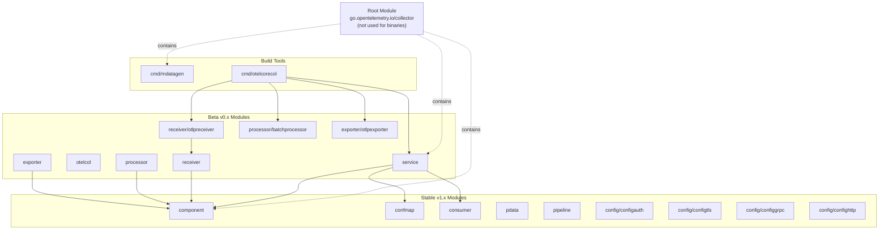
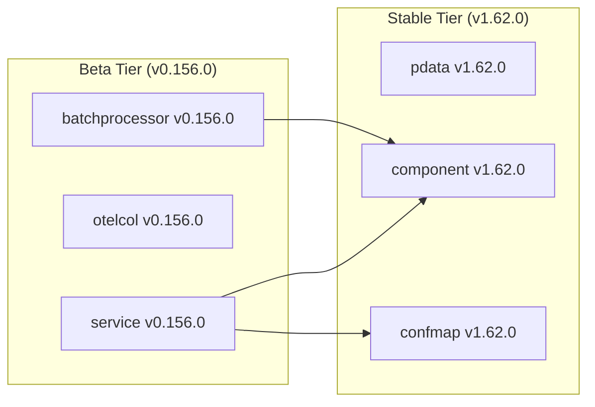
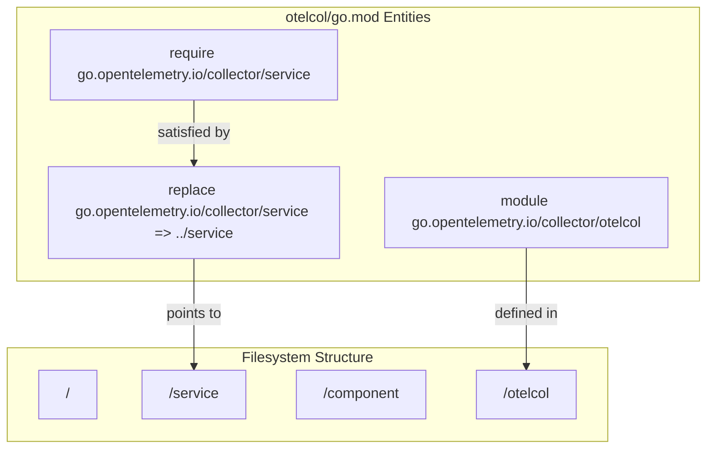

## Purpose and Scope

This document explains the OpenTelemetry Collector's multi-module Go project structure, including how the 70+ modules are organized, the versioning strategy distinguishing stable (v1.x) from beta (v0.x) modules, dependency management patterns, and the extensive use of `replace` directives for local development. This covers the physical organization of code into Go modules and how they depend on each other.

For information about the logical component abstractions (receivers, processors, exporters, etc.), see [Component Model](#2.1). For details about the build system that assembles these modules into collector distributions, see [Building Custom Collectors](#8).

## Module Organization Overview

The OpenTelemetry Collector repository contains over 70 Go modules organized into a hierarchical structure. The root module at [go.mod:1-1]() is `go.opentelemetry.io/collector`, but this module is explicitly **not used to build official binaries** [go.mod:3-6](). Instead, it serves as the repository root while actual collector binaries are built by the `otelcol` module or custom distributions created via the builder tool [go.mod:8-9]().

### Module Relationship Diagram
The following diagram illustrates the relationship between the root module, stable core modules, and the beta implementation modules.


**Sources:** [go.mod:1-11](), [cmd/otelcorecol/go.mod:3-32](), [service/go.mod:1-51](), [otelcol/go.mod:1-32]()

## Module Categories and Import Paths

Modules are organized into clear categories with predictable import path patterns. All modules follow the base path `go.opentelemetry.io/collector/` plus a category-specific path.

### Core Stable Modules (v1.x)
These modules have reached API stability and guarantee backward compatibility.

| Module | Import Path | Purpose |
|--------|-------------|---------|
| `component` | `go.opentelemetry.io/collector/component` | Base component interfaces and lifecycle [cmd/otelcorecol/go.mod:8-8]() |
| `confmap` | `go.opentelemetry.io/collector/confmap` | Configuration resolution system [cmd/otelcorecol/go.mod:9-9]() |
| `consumer` | `go.opentelemetry.io/collector/consumer` | Data consumption interfaces [cmd/otelcorecol/go.mod:105-105]() |
| `pdata` | `go.opentelemetry.io/collector/pdata` | Protocol data model [cmd/otelcorecol/go.mod:125-125]() |
| `pipeline` | `go.opentelemetry.io/collector/pipeline` | Pipeline definitions [internal/e2e/go.mod:43-43]() |

**Sources:** [cmd/otelcorecol/go.mod:8-125](), [internal/e2e/go.mod:43-43](), [versions.yaml:5-32]()

### Service Layer and Component Bases (v0.x Beta)
These modules orchestrate the collector runtime and define base implementations for components.

| Module | Import Path | Purpose |
|--------|-------------|---------|
| `service` | `go.opentelemetry.io/collector/service` | Central service orchestration [cmd/otelcorecol/go.mod:32-32]() |
| `otelcol` | `go.opentelemetry.io/collector/otelcol` | CLI application structure [cmd/otelcorecol/go.mod:25-25]() |
| `receiver` | `go.opentelemetry.io/collector/receiver` | Receiver base package [cmd/otelcorecol/go.mod:29-29]() |
| `processor` | `go.opentelemetry.io/collector/processor` | Processor base package [cmd/otelcorecol/go.mod:26-26]() |
| `exporter` | `go.opentelemetry.io/collector/exporter` | Exporter base package [cmd/otelcorecol/go.mod:17-17]() |

**Sources:** [cmd/otelcorecol/go.mod:17-32](), [service/go.mod:1-1](), [otelcol/go.mod:1-1](), [versions.yaml:33-103]()

### Experimental Modules (x-prefix)
Experimental features use an `x` prefix in the module path to signal that they are subject to breaking changes.

| Module | Import Path | Purpose |
|--------|-------------|---------|
| `confmap/xconfmap` | `go.opentelemetry.io/collector/confmap/xconfmap` | Experimental confmap features [cmd/otelcorecol/go.mod:102-102]() |
| `exporter/xexporter` | `go.opentelemetry.io/collector/exporter/xexporter` | Experimental exporter features [cmd/otelcorecol/go.mod:113-113]() |
| `pdata/xpdata` | `go.opentelemetry.io/collector/pdata/xpdata` | Experimental pdata features [internal/e2e/go.mod:125-125]() |

**Sources:** [cmd/otelcorecol/go.mod:102-113](), [internal/e2e/go.mod:125-125]()

## Versioning Strategy

The collector uses a semantic versioning strategy defined in `versions.yaml` with distinct major versions to communicate stability [versions.yaml:4-33]().

- **v1.x modules**: Stable APIs (e.g., `component v1.62.0` [cmd/otelcorecol/go.mod:8-8]())
- **v0.x modules**: Beta APIs (e.g., `service v0.156.0` [cmd/otelcorecol/go.mod:32-32]())

### Stability Mapping
The following diagram maps the stability tiers to specific code entities and their versions as defined in the current project metadata.



**Sources:** [versions.yaml:4-103](), [cmd/otelcorecol/go.mod:8-32](), [service/go.mod:11-32]()

## Dependency Management with Replace Directives

The collector relies heavily on Go `replace` directives to link local modules together. This is necessary because the repository contains dozens of independent modules that frequently reference each other's latest unreleased changes.

### Implementation in go.mod
The `replace` directives point to relative filesystem paths. This ensures that a change in `service/` is immediately available to `otelcol/` without requiring a network fetch or a published release.

Example from [otelcol/go.mod:124-140]():
```go
replace go.opentelemetry.io/collector/service => ../service
replace go.opentelemetry.io/collector/connector => ../connector
replace go.opentelemetry.io/collector/component => ../component
replace go.opentelemetry.io/collector/pdata => ../pdata
```

### Dependency Flow Diagram
This diagram shows how `replace` directives bridge the "Natural Language Space" (Project Structure) to the "Code Entity Space" (Filesystem paths).



**Sources:** [otelcol/go.mod:1-140](), [internal/e2e/go.mod:1-55](), [service/go.mod:1-66]()

## Build System and Multi-Module Tooling

Managing 70+ modules requires specialized tooling and metadata synchronization.

### Versions Metadata
The file `versions.yaml` serves as the source of truth for the release process, categorizing modules into `stable` and `beta` sets [versions.yaml:4-103](). It also identifies `excluded-modules` like `cmd/otelcorecol` which are not part of the standard versioning flow [versions.yaml:105-111]().

### Release Retractions
The project uses Go's `retract` directive to mark versions with critical bugs as unusable. For example, version `v0.76.0` was retracted due to a dependency on a retracted `pdata` module, and several others were retracted due to release failures [go.mod:32-38]().

### Changelog Management
The project distinguishes between user-facing changes in `CHANGELOG.md` and developer-facing API changes in `CHANGELOG-API.md` [CHANGELOG.md:1-7](). Versioning in the changelog reflects the dual-tier strategy, often listing both the stable and beta version numbers (e.g., `v1.62.0/v0.156.0`) [CHANGELOG.md:10-10]().

**Sources:** [versions.yaml:1-111](), [go.mod:32-38](), [CHANGELOG.md:1-10]()

## External Dependencies

The Collector depends on several high-profile external libraries. Key dependencies found in [go.mod:13-20]() and [cmd/otelcorecol/go.mod:36-85]() include:

- **gRPC**: `google.golang.org/grpc` [go.mod:18-18]()
- **Protobuf**: `google.golang.org/protobuf` [go.mod:19-19]()
- **Compression**: `github.com/klauspost/compress` [go.mod:15-15]()
- **CLI**: `github.com/spf13/cobra` [cmd/otelcorecol/go.mod:80-80]()
- **Testing**: `github.com/stretchr/testify` [go.mod:16-16]()
- **Utilities**: `github.com/google/uuid` [service/go.mod:6-6]() and `go.uber.org/zap` for logging [service/go.mod:64-64]().

**Sources:** [go.mod:13-20](), [cmd/otelcorecol/go.mod:36-85](), [service/go.mod:6-64]()