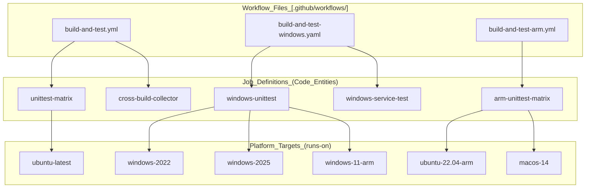
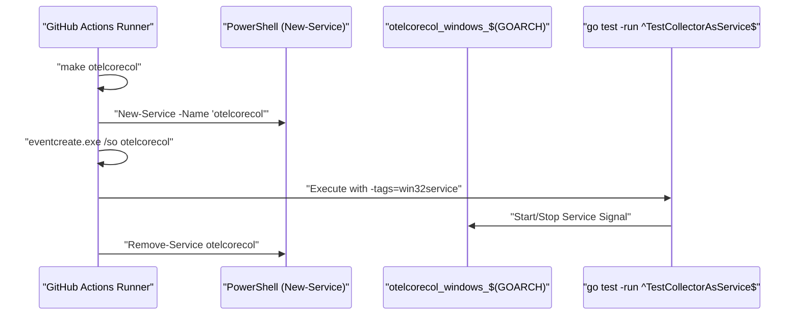

## Purpose and Scope

Multi-Platform Testing ensures the OpenTelemetry Collector builds correctly and functions properly across diverse operating systems and architectures. This document covers the GitHub Actions workflows that validate the collector on Linux (amd64/arm64), Windows (2022/2025/11-arm), macOS (Apple Silicon), and cross-compilation targets including AIX, JS/WASM, and various Linux architectures.

For information about the broader CI/CD system, see [GitHub Actions Workflows](#10.1). For security and quality gates, see [Security and Quality Gates](#10.3).

## Platform Testing Overview

The collector's multi-platform testing strategy consists of three primary workflows:

1. **Cross-Compilation Testing** - Validates that the collector builds for 13 different platform/architecture combinations.
2. **Windows Native Testing** - Runs unit tests and service integration tests on multiple Windows versions.
3. **ARM Native Testing** - Executes tests on actual ARM hardware (Linux ARM64 and macOS Apple Silicon).

### Code Entity Mapping: Workflows to Platforms

The following diagram maps the GitHub Actions workflow files to the specific infrastructure and Go environments they orchestrate.

**Diagram: Workflow to Infrastructure Mapping**



**Sources:** [.github/workflows/build-and-test.yml:169-174](), [.github/workflows/build-and-test-windows.yaml:18-23](), [.github/workflows/build-and-test-arm.yml:24-29]()

## Cross-Compilation Matrix

The `cross-build-collector` job in the main build workflow validates that the collector can be built for diverse platforms without actually running tests on those platforms. This ensures portability and catches platform-specific build issues early.

### Supported Platform Matrix

The cross-compilation matrix is defined in the `build-and-test.yml` workflow and includes:

| Operating System | Architecture | Notes |
|-----------------|--------------|-------|
| `aix` | `ppc64` | IBM AIX on PowerPC |
| `darwin` | `amd64` | macOS Intel |
| `darwin` | `arm64` | macOS Apple Silicon |
| `js` | `wasm` | WebAssembly |
| `linux` | `386` | 32-bit Linux |
| `linux` | `amd64` | 64-bit Linux (primary) |
| `linux` | `arm64` | ARM64 Linux |
| `linux` | `ppc64le` | PowerPC 64-bit LE |
| `linux` | `riscv64` | RISC-V 64-bit |
| `linux` | `arm` (v7) | 32-bit ARM with hardware floating point |
| `linux` | `s390x` | IBM Z mainframe |
| `windows` | `386` | 32-bit Windows |
| `windows` | `amd64` | 64-bit Windows (primary) |
| `windows` | `arm64` | Windows on ARM |

### Build Process

Each platform combination is built with the following environment variables set:

```yaml
env:
  GOOS: ${{matrix.goos}}
  GOARCH: ${{matrix.goarch}}
  GOARM: ${{matrix.goarm}}  # Only for ARM v7
```

The build executes `make otelcorecol`, which compiles the core collector distribution for the target platform.

**Sources:** [.github/workflows/build-and-test.yml:256-303]()

## Windows Platform Testing

Windows testing is handled by a dedicated workflow that runs both unit tests and Windows service integration tests across three Windows versions.

### Windows Test Matrix

The workflow defines two separate job matrices for comprehensive Windows coverage:

**Unit Test Matrix** ([.github/workflows/build-and-test-windows.yaml:18-23]()):
- `windows-2022`
- `windows-2025`
- `windows-11-arm`

**Service Test Matrix** ([.github/workflows/build-and-test-windows.yaml:50-55]()):
- Tests collector running as a Windows service using the `win32service` build tag.

### Windows Service Testing

The `windows-service-test` job validates that the collector can be installed and started as a native service.

### Code Flow: Windows Service Validation

This diagram traces the flow from the binary build to the service test execution.

**Diagram: Windows Service Lifecycle Test**



**Service Installation:**
[.github/workflows/build-and-test-windows.yaml:83-86]() shows the service installation:
```powershell
New-Service -Name "otelcorecol" -StartupType "Manual" -BinaryPathName "${PWD}\bin\otelcorecol_windows_$(go env GOARCH) --config ${PWD}\examples\local\otel-config.yaml"
```

**Service Test Execution:**
The test specifically targets `TestCollectorAsService` with the `win32service` tag [.github/workflows/build-and-test-windows.yaml:90-91](). Before running tests, a PowerShell script `win-required-ports.ps1` is executed to ensure port availability in the dynamic range [.github/workflows/build-and-test-windows.yaml:76-78]().

**Sources:** [.github/workflows/build-and-test-windows.yaml:50-98]()

## ARM Platform Testing

ARM testing runs on actual ARM64 hardware (Linux ARM64 and macOS Apple Silicon) to catch architecture-specific issues.

### ARM Test Matrix

The `arm-unittest-matrix` job runs on:
- `ubuntu-22.04-arm`
- `macos-14`

**Sources:** [.github/workflows/build-and-test-arm.yml:24-29]()

### Conditional Execution

ARM tests are only run when pushed to `main`, in a `merge_group`, or when the PR is labeled with `Run ARM`. It explicitly excludes `dependabot[bot]` from triggering these runs [.github/workflows/build-and-test-arm.yml:28]().

## Test Execution Strategy

### Go Version Matrix

The primary `unittest-matrix` job tests against both `stable` and `oldstable` Go versions to ensure backward compatibility with the previous Go release [.github/workflows/build-and-test.yml:170-173]().

### Test Output and Artifacts

Unit tests are executed via `make gotest` on Windows [.github/workflows/build-and-test-windows.yaml:48]() and `make -j4 gotest` on ARM [.github/workflows/build-and-test-arm.yml:52]().

### Performance Benchmarking

A dedicated `go-benchmarks.yml` workflow and `perf.yml` track performance. `perf.yml` executes `make run-benchmarks` to monitor regressions.

**Sources:** [.github/workflows/perf.yml:28-28](), [.github/workflows/go-benchmarks.yml:1-10]()

## Concurrency Control

All platform testing workflows use a concurrency strategy to cancel in-progress runs when new commits are pushed to the same branch or PR, optimizing runner availability.

| Workflow | Concurrency Configuration Site |
|----------|--------------------------------|
| `build-and-test.yml` | [.github/workflows/build-and-test.yml:13-15]() |
| `build-and-test-windows.yaml` | [.github/workflows/build-and-test-windows.yaml:11-13]() |
| `build-and-test-arm.yml` | [.github/workflows/build-and-test-arm.yml:19-21]() |

**Sources:** [.github/workflows/build-and-test.yml:13-15](), [.github/workflows/build-and-test-windows.yaml:11-13](), [.github/workflows/build-and-test-arm.yml:19-21]()