This document describes the two OTLP (OpenTelemetry Protocol) exporter implementations in the collector: the gRPC-based `otlpexporter` and the HTTP-based `otlphttpexporter`. These exporters send telemetry data (traces, metrics, logs, and profiles) to OTLP-compatible backends.

For information about the OTLP receiver that accepts OTLP data, see [OTLP Receiver](#5.1). For general exporter infrastructure (queue, retry, observability), see [Exporter Infrastructure](#6).

## Overview

The collector provides two distinct OTLP exporter implementations, each using a different transport protocol:

| Exporter | Package | Transport | Default Port | Encoding |
|----------|---------|-----------|--------------|----------|
| **otlpexporter** | `exporter/otlpexporter` | gRPC | 4317 | Protobuf |
| **otlphttpexporter** | `exporter/otlphttpexporter` | HTTP/HTTPS | 4318 | Protobuf or JSON |

Both exporters:
- Support all signal types: traces, metrics, logs, and profiles [exporter/otlpexporter/factory.go:33-36](), [exporter/otlphttpexporter/factory.go:36-39]()
- Use the `exporterhelper` infrastructure for queue management and retry logic [exporter/otlpexporter/factory.go:85-87](), [exporter/otlphttpexporter/factory.go:118-119]()
- Handle partial success responses from backends [exporter/otlpexporter/otlp.go:103-109](), [exporter/otlphttpexporter/otlp.go:210]()
- Classify errors as permanent or retryable [exporter/otlpexporter/otlp.go:189-192](), [exporter/otlphttpexporter/otlp.go:229-231]()
- Set a user-agent header based on build information [exporter/otlpexporter/otlp.go:57-58](), [exporter/otlphttpexporter/otlp.go:70-71]()

### OTLP Protocol Architecture

Title: OTLP Exporter Architecture and Data Flow
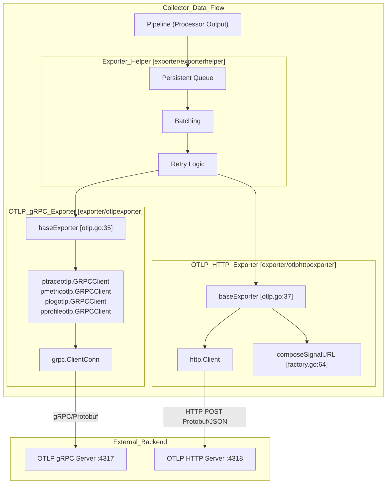
**Sources:** [exporter/otlpexporter/otlp.go:35-52](), [exporter/otlphttpexporter/otlp.go:37-49](), [exporter/otlpexporter/factory.go:72-147](), [exporter/otlphttpexporter/factory.go:95-209]()

## OTLP gRPC Exporter (otlpexporter)

The gRPC-based OTLP exporter uses native gRPC clients to send telemetry data over HTTP/2.

### Configuration

The exporter is configured through the `Config` struct [exporter/otlpexporter/config.go:20-28]():

```yaml
otlp:
  endpoint: "otelcol.example.com:4317"
  compression: gzip  # gzip, snappy, zstd, or none
  tls:
    insecure: false
    ca_file: /path/to/ca.pem
  headers:
    api-key: "my-secret-key"
  keepalive:
    time: 30s
    timeout: 10s
  timeout: 10s
  retry_on_failure:
    enabled: true
  sending_queue:
    enabled: true
```

**Key Configuration Fields:**

| Field | Type | Default | Description |
|-------|------|---------|-------------|
| `endpoint` | string | (required) | Target gRPC server address [config/configgrpc/configgrpc.go:84]() |
| `compression` | string | `gzip` | Compression type [exporter/otlpexporter/factory.go:43]() |
| `tls` | ClientConfig | insecure | TLS configuration [config/configgrpc/configgrpc.go:89-90]() |
| `headers` | map | {} | Static headers [config/configgrpc/configgrpc.go:109]() |
| `keepalive` | KeepaliveClientConfig | 10s/10s | gRPC keepalive parameters [config/configgrpc/configgrpc.go:65-66]() |
| `balancer_name` | string | `round_robin` | Load balancer name [config/configgrpc/configgrpc.go:49]() |

The default configuration is created in `createDefaultConfig` [exporter/otlpexporter/factory.go:40-55]() with gzip compression and a 512KB write buffer [exporter/otlpexporter/factory.go:45]().

**Sources:** [exporter/otlpexporter/config.go:20-55](), [exporter/otlpexporter/factory.go:40-55](), [config/configgrpc/configgrpc.go:79-132]()

### Architecture and Data Flow

Title: OTLP gRPC Exporter Logic Flow
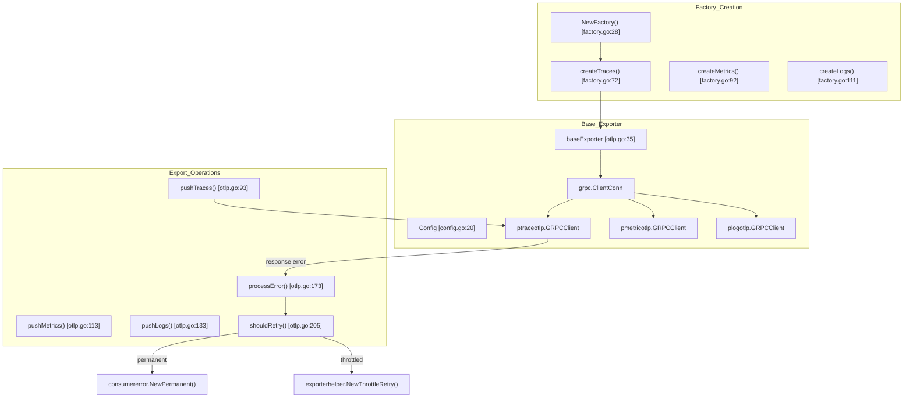
**Sources:** [exporter/otlpexporter/factory.go:28-147](), [exporter/otlpexporter/otlp.go:35-171]()

### Initialization and Startup

The exporter is initialized in two phases:

1. **Factory Creation**: Creates a `baseExporter` via `newExporter` [exporter/otlpexporter/otlp.go:54-61]().
2. **Start**: Establishes the gRPC connection in `start` [exporter/otlpexporter/otlp.go:65-84](). It uses `config.ClientConfig.ToClientConn` to obtain the `grpc.ClientConn` [exporter/otlpexporter/otlp.go:67]().

Title: gRPC Connection Initialization Sequence
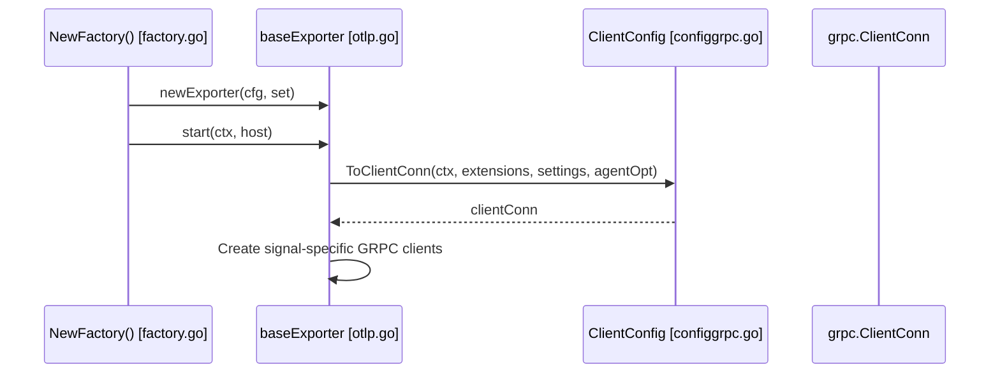
**Sources:** [exporter/otlpexporter/otlp.go:54-84](), [exporter/otlpexporter/factory.go:72-147]()

### Export Logic and Error Handling

Each signal type has a dedicated push method (e.g., `pushTraces`) [exporter/otlpexporter/otlp.go:93-171]().

**Error Classification Logic** [exporter/otlpexporter/otlp.go:173-203]():
The `processError` function classifies gRPC errors:
1. **Success**: `codes.OK` or `nil` error returns `nil` [exporter/otlpexporter/otlp.go:174-184]().
2. **Permanent Errors**: If `shouldRetry` returns false, returns `consumererror.NewPermanent(err)` [exporter/otlpexporter/otlp.go:189-192]().
3. **Throttled Errors**: If `RetryInfo` contains a non-zero duration, returns `exporterhelper.NewThrottleRetry(err, duration)` [exporter/otlpexporter/otlp.go:194-199]().

**Retryable Status Codes** [exporter/otlpexporter/otlp.go:205-222]():
- `codes.Canceled`, `codes.DeadlineExceeded`, `codes.Aborted`, `codes.OutOfRange`, `codes.Unavailable`, `codes.DataLoss`.
- `codes.ResourceExhausted` is only retryable if the server provides `RetryInfo` [exporter/otlpexporter/otlp.go:215-217]().

**Sources:** [exporter/otlpexporter/otlp.go:93-222]()

### Partial Success Handling

The exporter logs warnings when the backend reports partial success [exporter/otlpexporter/otlp.go:103-109]():

```go
partialSuccess := resp.PartialSuccess()
if partialSuccess.ErrorMessage() != "" || partialSuccess.RejectedSpans() != 0 {
    e.settings.Logger.Warn("Partial success response",
        zap.String("message", resp.PartialSuccess().ErrorMessage()),
        zap.Int64("dropped_spans", resp.PartialSuccess().RejectedSpans()),
    )
}
```
**Sources:** [exporter/otlpexporter/otlp.go:103-109](), [exporter/otlpexporter/otlp.go:123-129](), [exporter/otlpexporter/otlp.go:143-149]()

## OTLP HTTP Exporter (otlphttpexporter)

The HTTP-based OTLP exporter sends telemetry data using standard HTTP POST requests.

### Configuration

The exporter is configured through the `Config` struct [exporter/otlphttpexporter/config.go:29-45]():

```yaml
otlphttp:
  endpoint: "https://otelcol.example.com:4318"
  encoding: proto  # proto or json
  traces_endpoint: "https://custom.example.com/v1/traces"
```

**Key Configuration Differences:**
- **Encoding**: Supports `proto` (default) or `json` [exporter/otlphttpexporter/factory_test.go:42]().
- **Endpoints**: Allows signal-specific overrides like `traces_endpoint` [exporter/otlphttpexporter/config.go:34]().

**Sources:** [exporter/otlphttpexporter/config.go:29-45](), [exporter/otlphttpexporter/factory.go:43-57]()

### URL Composition

The final URL for each signal is determined by signal-specific endpoint configurations [exporter/otlphttpexporter/otlp.go:41-44](). If an override URL (e.g., `traces_endpoint`) is provided, it is used directly; otherwise, it appends standard paths like `/v1/traces` to the base `endpoint` [receiver/otlpreceiver/README.md:62-63]().

**Sources:** [exporter/otlphttpexporter/otlp.go:41-44](), [receiver/otlpreceiver/README.md:59-68]()

### Architecture and Export Flow

Title: OTLP HTTP Export Sequence
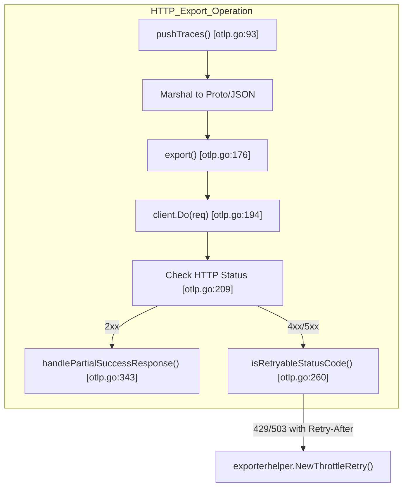
**Sources:** [exporter/otlphttpexporter/otlp.go:93-256]()

### HTTP Request and Response Handling

**Request Construction** [exporter/otlphttpexporter/otlp.go:176-192]():
The exporter sets `Content-Type` based on encoding (`application/x-protobuf` or `application/json`) and includes the `User-Agent`.

**Response Status Code Classification** [exporter/otlphttpexporter/otlp.go:260-273]():
- **Permanent**: 400, 402, 404, 405, 413, 414, 431, 500.
- **Retryable**: 429, 502, 503, 504.

**Sources:** [exporter/otlphttpexporter/otlp.go:176-273]()

### Retry-After Header Handling

The HTTP exporter implements the OTLP specification for throttling [exporter/otlphttpexporter/otlp.go:233-254]():
- If status is 429 or 503, it checks the `Retry-After` header [exporter/otlphttpexporter/otlp.go:235-236]().
- It parses both integer seconds and HTTP-date formats [exporter/otlphttpexporter/otlp.go:240-252]().

**Sources:** [exporter/otlphttpexporter/otlp.go:233-254]()

### Partial Success Response Handling

The HTTP exporter parses the response body for partial success details [exporter/otlphttpexporter/otlp.go:343-427](). It supports unmarshaling both JSON and Protobuf responses to extract rejection counts for each signal [exporter/otlphttpexporter/otlp.go:357-362]().

**Sources:** [exporter/otlphttpexporter/otlp.go:343-427]()

## Common Patterns

### User-Agent Header Construction

Both exporters construct a user-agent header from build information [exporter/otlpexporter/otlp.go:57-58](), [exporter/otlphttpexporter/otlp.go:70-71]():
`{BuildInfo.Description}/{BuildInfo.Version} ({GOOS}/{GOARCH})`

**Sources:** [exporter/otlpexporter/otlp.go:57-58](), [exporter/otlphttpexporter/otlp.go:70-71]()

### Configuration Validation

**otlpexporter**: Validates the endpoint format and TLS settings. The endpoint must be a non-empty string [exporter/otlpexporter/config_test.go:132]().

**otlphttpexporter**: Validates that the endpoint is a valid URL if provided [exporter/otlphttpexporter/otlp.go:63-68]().

**Sources:** [exporter/otlpexporter/config_test.go:122-175](), [exporter/otlphttpexporter/otlp.go:60-69]()

# Exporter Infrastructure


## Purpose and Scope

The `exporterhelper` package provides common infrastructure for building robust, production-ready exporters in the OpenTelemetry Collector. It handles cross-cutting concerns like retry logic, queuing, batching, timeouts, observability, and lifecycle management, allowing exporter developers to focus on implementing the actual data export logic.

This page provides an overview of the exporterhelper infrastructure and its core abstractions. For detailed information about specific features, see:
- [Exporter Helpers and Options](#6.1) — Configuration patterns, available options, and signal-specific factory functions.
- [Queue Management and Batching](#6.2) — Persistent and in-memory queue management and request batching strategies.
- [Retry Logic and Error Handling](#6.3) — Exponential backoff retry mechanisms and error classification.

## Architecture Overview

The exporterhelper package follows a layered architecture where signal-specific factory functions wrap common infrastructure to create fully-featured exporters.

### Signal to Infrastructure Mapping

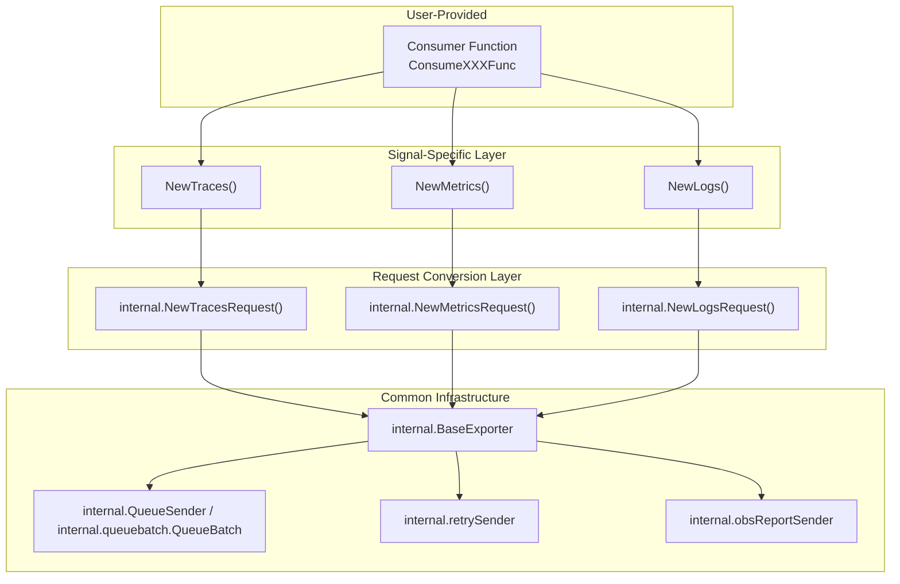

**Sources:** [exporter/exporterhelper/traces.go:17-32](), [exporter/exporterhelper/metrics.go:17-32](), [exporter/exporterhelper/logs.go:17-32](), [exporter/exporterhelper/internal/base_exporter.go:57-109]()

## Signal-Specific Factory Functions

The exporterhelper package provides factory functions for each telemetry signal type. These functions follow a consistent pattern and signature.

### Factory Function Pattern

| Signal | Factory Function | Consumer Type | Conversion Helper |
|--------|-----------------|---------------|-------------------|
| Traces | `NewTraces()` | `consumer.ConsumeTracesFunc` | `queuebatch.RequestFromTraces()` |
| Metrics | `NewMetrics()` | `consumer.ConsumeMetricsFunc` | `queuebatch.RequestFromMetrics()` |
| Logs | `NewLogs()` | `consumer.ConsumeLogsFunc` | `queuebatch.RequestFromLogs()` |

**Sources:** [exporter/exporterhelper/traces.go:30-31](), [exporter/exporterhelper/metrics.go:30-31](), [exporter/exporterhelper/logs.go:30-31]()

### Example: Creating a Traces Exporter

```go
// From traces.go:17-32
func NewTraces(
    ctx context.Context,
    set exporter.Settings,
    cfg component.Config,
    pusher consumer.ConsumeTracesFunc,
    options ...Option,
) (exporter.Traces, error)
```

The factory function requires:
- **Context**: For initialization.
- **Settings**: Exporter settings including logger and telemetry [exporter/exporterhelper/internal/base_exporter.go:33-36]().
- **Config**: Component-specific configuration [exporter/exporterhelper/traces.go:20-20]().
- **Pusher**: User-provided function that actually exports the data [exporter/exporterhelper/traces.go:21-21]().
- **Options**: Variadic options for customizing behavior [exporter/exporterhelper/common.go:15-17]().

## Request Abstraction

The exporterhelper uses a request abstraction to unify handling of different signal types. Each signal type is converted to a `request.Request` interface that provides common methods.

### Request Interface and Implementations

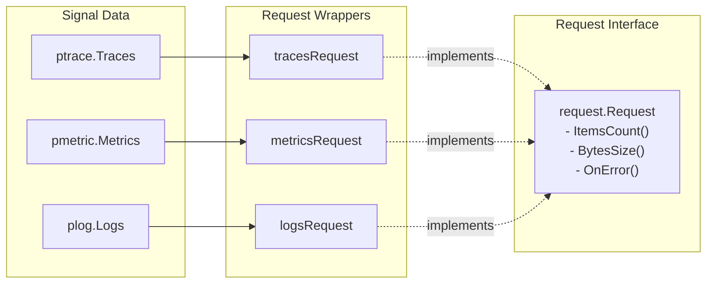

**Sources:** [exporter/exporterhelper/internal/queuebatch/traces.go:1-20](), [exporter/exporterhelper/internal/queuebatch/metrics.go:1-20](), [exporter/exporterhelper/internal/queuebatch/logs.go:1-20](), [exporter/exporterhelper/internal/base_exporter.go:112-115]()

## Data Flow Through Exporter Infrastructure

The data flow is managed by a chain of "senders" inside the `BaseExporter` [exporter/exporterhelper/internal/base_exporter.go:38-44]().

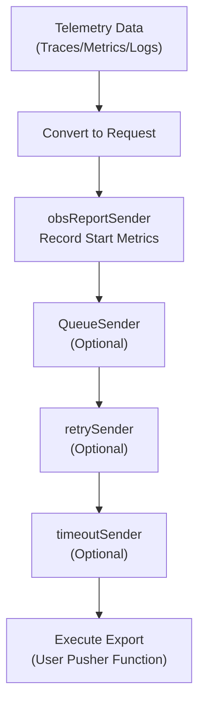

### Flow Steps

1. **Conversion**: Signal-specific data is converted to a `request.Request` [exporter/exporterhelper/traces.go:30-31]().
2. **Observability**: The `obsReportSender` records metrics and initiates trace spans [exporter/exporterhelper/internal/base_exporter.go:84-84]().
3. **Queueing**: If enabled, the `QueueSender` handles in-memory or persistent queuing and optional batching [exporter/exporterhelper/internal/base_exporter.go:101-106]().
4. **Retry**: The `retrySender` applies exponential backoff logic on transient failures [exporter/exporterhelper/internal/base_exporter.go:78-81]().
5. **Timeout**: The `timeoutSender` ensures the export operation does not exceed the configured limit [exporter/exporterhelper/internal/base_exporter.go:74-76]().
6. **Export**: The final `pusher` (SendFunc) is invoked to send data to the backend [exporter/exporterhelper/internal/base_exporter.go:70-70]().

**Sources:** [exporter/exporterhelper/internal/base_exporter.go:57-109](), [exporter/exporterhelper/internal/queue_sender.go:39-58]()

## Option Pattern

The exporterhelper uses the functional options pattern to configure exporter behavior.

### Common Options

| Option | Purpose | Default |
|--------|---------|---------|
| `WithStart()` | Custom start function [exporter/exporterhelper/common.go:20-22]() | No-op |
| `WithShutdown()` | Custom shutdown function [exporter/exporterhelper/common.go:26-28]() | No-op |
| `WithTimeout()` | Request timeout configuration [exporter/exporterhelper/common.go:32-34]() | 5 seconds |
| `WithRetry()` | Retry configuration [exporter/exporterhelper/common.go:38-40]() | Disabled |
| `WithQueue()` | Queue configuration [exporter/exporterhelper/internal/base_exporter.go:198-205]() | Disabled |
| `WithCapabilities()` | Consumer capabilities [exporter/exporterhelper/common.go:45-47]() | `MutatesData: false` |

**Sources:** [exporter/exporterhelper/common.go:18-53](), [exporter/exporterhelper/internal/base_exporter.go:155-205]()

## Lifecycle Management

The exporterhelper integrates with the component lifecycle system.

### Start Phase
During `Start()`, the `BaseExporter` starts the wrapped exporter and then the `QueueSender` (if present) [exporter/exporterhelper/internal/base_exporter.go:124-136]().

### Shutdown Phase
During `Shutdown()`, the infrastructure shuts down components in reverse order:
1. **Retry Sender**: Stops accepting new retries [exporter/exporterhelper/internal/base_exporter.go:142-144]().
2. **Queue Sender**: Flushes the queue [exporter/exporterhelper/internal/base_exporter.go:147-149]().
3. **Wrapped Exporter**: Final cleanup of the user-provided component [exporter/exporterhelper/internal/base_exporter.go:152-152]().

**Sources:** [exporter/exporterhelper/internal/base_exporter.go:124-153]()

## Validation and Error Handling

Factory functions perform validation to ensure essential dependencies are provided:

- **`errNilConfig`**: Configuration object is nil [exporter/exporterhelper/traces.go:24-26]().
- **`errNilLogger`**: Logger is missing from settings [exporter/exporterhelper/metrics_test.go:59-63]().
- **`errNilPushTraces`**: Consumer function is nil [exporter/exporterhelper/traces.go:27-29]().

If exporting fails, the infrastructure logs the failure and includes the count of rejected items [exporter/exporterhelper/internal/base_exporter.go:117-121]().

**Sources:** [exporter/exporterhelper/traces.go:24-32](), [exporter/exporterhelper/internal/base_exporter.go:112-122](), [exporter/exporterhelper/traces_test.go:53-70]()

# Exporter Helpers and Options


The `exporterhelper` package provides factory functions and a flexible option pattern for creating exporters with standardized observability, retry, and queue capabilities. This page covers the core helper functions and customization options available when building exporters.

For details on queue management and batching, see [Queue Management and Batching](#6.2). For retry logic and error handling mechanisms, see [Retry Logic and Error Handling](#6.3).

## Purpose and Scope

The exporter helpers eliminate boilerplate code by providing:

- **Signal-specific factory functions** (`NewTraces`, `NewMetrics`, `NewLogs`) that wrap user-provided export logic [exporter/exporterhelper/traces.go:17-32](), [exporter/exporterhelper/metrics.go:17-32](), [exporter/exporterhelper/logs.go:17-32]().
- **Automatic observability** integration with metrics and distributed tracing.
- **Standardized lifecycle management** with customizable Start and Shutdown hooks [exporter/exporterhelper/common.go:18-28]().
- **Option pattern** for flexible configuration without API breaking changes [exporter/exporterhelper/common.go:15-16]().
- **Common infrastructure** for timeouts, retries, queuing, and capabilities.

These helpers are used by all built-in exporters and serve as the foundation for custom exporter implementations.

**Sources:** [exporter/exporterhelper/README.md:1-5](), [exporter/exporterhelper/common.go:1-53]()

## Signal-Specific Factory Functions

The package provides primary factory functions for each telemetry signal, including experimental support for profiles.

### Exporter Construction Flow
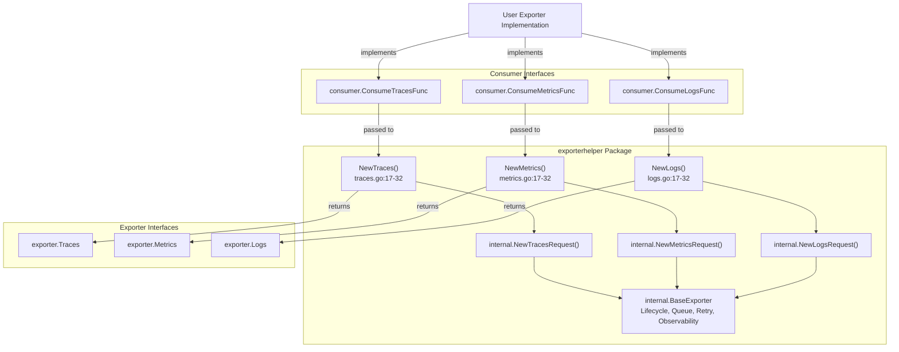

**Sources:** [exporter/exporterhelper/traces.go:17-32](), [exporter/exporterhelper/metrics.go:17-32](), [exporter/exporterhelper/logs.go:17-32]()

### Function Signatures

All factory functions follow a consistent signature pattern:

| Function | Signature |
|----------|-----------|
| **NewTraces** | `NewTraces(ctx context.Context, set exporter.Settings, cfg component.Config, pusher consumer.ConsumeTracesFunc, options ...Option) (exporter.Traces, error)` |
| **NewMetrics** | `NewMetrics(ctx context.Context, set exporter.Settings, cfg component.Config, pusher consumer.ConsumeMetricsFunc, options ...Option) (exporter.Metrics, error)` |
| **NewLogs** | `NewLogs(ctx context.Context, set exporter.Settings, cfg component.Config, pusher consumer.ConsumeLogsFunc, options ...Option) (exporter.Logs, error)` |
| **NewProfiles** | `NewProfiles(ctx context.Context, set exporter.Settings, cfg component.Config, pusher xconsumer.ConsumeProfilesFunc, options ...exporterhelper.Option) (xexporter.Profiles, error)` |

**Parameters:**
- **ctx**: Context for initialization.
- **set**: `exporter.Settings` containing logger, telemetry providers, component ID, and build info.
- **cfg**: Component configuration struct (must be non-nil) [exporter/exporterhelper/traces.go:24-26]().
- **pusher**: Signal-specific consume function that implements the actual export logic [exporter/exporterhelper/traces.go:27-29]().
- **options**: Variadic `Option` values for customization.

**Sources:** [exporter/exporterhelper/traces.go:17-32](), [exporter/exporterhelper/metrics.go:17-32](), [exporter/exporterhelper/logs.go:17-32](), [exporter/exporterhelper/xexporterhelper/profiles.go:130-139]()

### Input Validation

Each factory function performs validation before creating the exporter:

### Validation Sequence
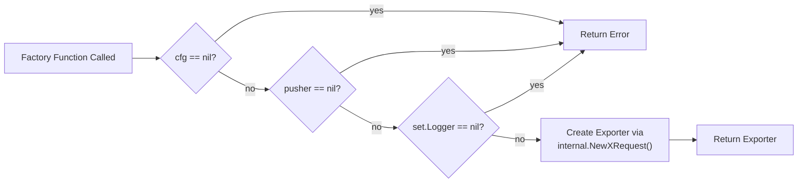

**Error Constants:**
- `errNilConfig`: Returned when `cfg` parameter is nil [exporter/exporterhelper/traces_test.go:55]().
- `errNilPushTraces` / `errNilPushMetrics` / `errNilPushLogs`: Returned when pusher function is nil [exporter/exporterhelper/traces_test.go:67]().
- `errNilLogger`: Returned when `set.Logger` is nil [exporter/exporterhelper/traces_test.go:61]().

**Sources:** [exporter/exporterhelper/traces_test.go:53-69](), [exporter/exporterhelper/metrics_test.go:52-68](), [exporter/exporterhelper/logs_test.go:52-68]()

## The Option Pattern

The `exporterhelper` package uses the functional options pattern to allow flexible exporter customization without breaking API compatibility.

### Option Types
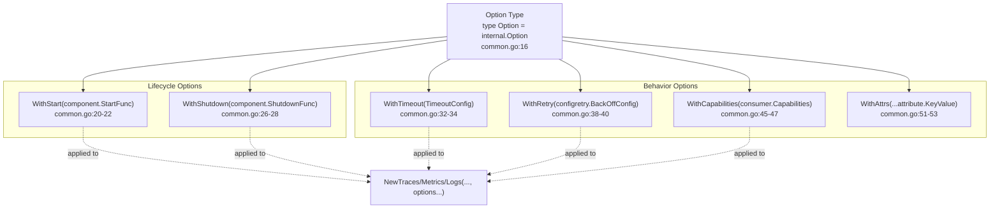

**Sources:** [exporter/exporterhelper/common.go:15-53]()

## Available Options

### WithStart
Overrides the default `Start` function for the exporter component lifecycle [exporter/exporterhelper/common.go:20-22]().
- **Default Behavior**: Does nothing and returns `nil` [exporter/exporterhelper/common.go:19]().

### WithShutdown
Overrides the default `Shutdown` function for graceful termination [exporter/exporterhelper/common.go:26-28]().
- **Default Behavior**: Does nothing and returns `nil` [exporter/exporterhelper/common.go:25]().

### WithTimeout
Configures timeout behavior for individual export attempts [exporter/exporterhelper/common.go:32-34]().
- **Default Behavior**: 5 seconds [exporter/exporterhelper/common.go:31]().

### WithRetry
Configures exponential backoff retry behavior for transient failures [exporter/exporterhelper/common.go:38-40]().
- **Default Behavior**: Retries are disabled by default [exporter/exporterhelper/common.go:37]().

### WithCapabilities
Declares the exporter's data mutability capabilities [exporter/exporterhelper/common.go:45-47]().
- **Default Behavior**: `MutatesData: false` (non-mutable) [exporter/exporterhelper/common.go:43]().

### WithAttrs
Adds extra attributes to the metrics produced by the exporter [exporter/exporterhelper/common.go:51-53]().
- **Default Behavior**: Empty set of extra attributes [exporter/exporterhelper/common.go:50]().

**Sources:** [exporter/exporterhelper/common.go:18-53]()

## Request Types and Sizing

The `exporterhelper` package defines how data is measured for queuing and batching through `RequestSizerType` [exporter/exporterhelper/request.go:10]():

| Sizer Type | Code Entity | Description |
|--------------|-------------|-------------|
| **Bytes** | `RequestSizerTypeBytes` | Size of serialized data in bytes [exporter/exporterhelper/request.go:13]() |
| **Items** | `RequestSizerTypeItems` | Number of smallest parts (spans, data points, log records) [exporter/exporterhelper/request.go:14]() |
| **Requests** | `RequestSizerTypeRequests` | Number of incoming batches [exporter/exporterhelper/request.go:15]() |

**Sources:** [exporter/exporterhelper/request.go:10-16](), [exporter/exporterhelper/README.md:26-30]()

## Experimental Profiles Support

The `xexporterhelper` package provides experimental support for the profiles signal using the same patterns as stable signals.

### Profiles Implementation
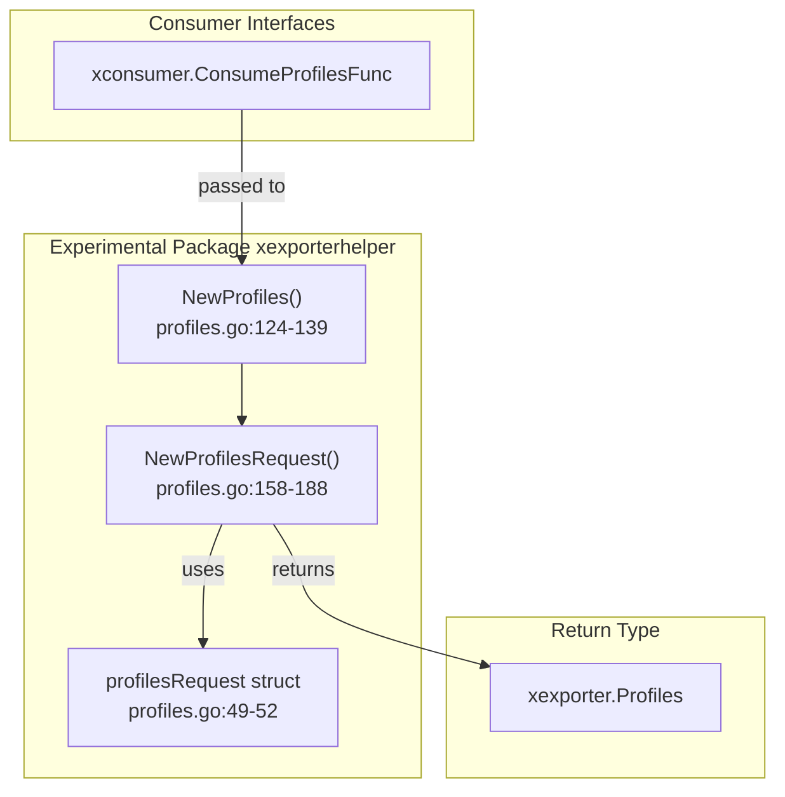

**Sources:** [exporter/exporterhelper/xexporterhelper/profiles.go:49-188]()

## Internal Telemetry and Observability

The `exporterhelper` automatically records metrics and traces for every export operation.

### Persistent Queue Context Propagation
Request context, including client metadata and span context, is preserved when using persistent queues [exporter/exporterhelper/README.md:90-91](). Tests confirm that `spanCtx` is persisted across queue operations when the feature is active [exporter/exporterhelper/traces_test.go:157-161](). However, context set by Auth extensions is **not** propagated through the persistent queue [exporter/exporterhelper/README.md:91-92]().

**Sources:** [exporter/exporterhelper/README.md:90-92](), [exporter/exporterhelper/traces_test.go:102-165](), [exporter/exporterhelper/metrics_test.go:100-163](), [exporter/exporterhelper/logs_test.go:100-163]()

# Queue Management and Batching


## Purpose and Scope

This document details the queue management and batching infrastructure within the OpenTelemetry Collector's exporter system. These mechanisms provide reliability by buffering telemetry data, persisting it to disk during failures, and aggregating small requests into larger batches to optimize network and storage efficiency.

The system is primarily implemented in `exporter/exporterhelper/internal/queuebatch` and `exporter/exporterhelper/internal/queue`, providing a unified interface for memory-based and file-backed persistence.

## Queue System Architecture

The queue system is a central component of the `BaseExporter` [exporter/exporterhelper/internal/base_exporter.go:29-55](). It sits between the observation layer and the retry mechanism, ensuring that data is safely buffered before transmission attempts.

### Component Relationship

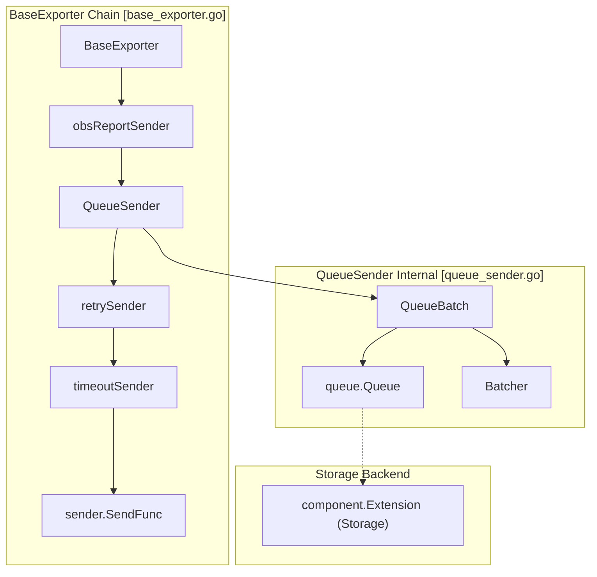
**Diagram: Exporter Sender Chain and Queue Internal Structure**

The `BaseExporter` initializes the `QueueSender` if a queue configuration is provided [exporter/exporterhelper/internal/base_exporter.go:94-106](). The `QueueSender` uses `QueueBatch` to coordinate between a storage queue and an asynchronous batcher [exporter/exporterhelper/internal/queuebatch/queue_batch.go:33-36]().

Sources: [exporter/exporterhelper/internal/base_exporter.go:29-109](), [exporter/exporterhelper/internal/queuebatch/queue_batch.go:33-42]()

## Persistent Queue Implementation

The persistent queue allows telemetry data to survive collector restarts by utilizing a storage extension.

### Configuration
The queue is configured via `queuebatch.Config` [exporter/exporterhelper/internal/queuebatch/config.go:19-47]().

| Parameter | Type | Default | Description |
|-----------|------|---------|-------------|
| `storage` | `*component.ID` | `nil` | References a storage extension for persistence [exporter/exporterhelper/internal/queuebatch/config.go:39](). |
| `queue_size` | `int64` | `1000` | Maximum size of the queue [exporter/exporterhelper/internal/queue_sender.go:29](). |
| `num_consumers` | `int` | `10` | Concurrent workers reading from the queue [exporter/exporterhelper/internal/queue_sender.go:28](). |
| `sizer` | `request.SizerType` | `requests` | Measurement unit: `requests`, `items`, or `bytes` [exporter/exporterhelper/internal/queuebatch/config.go:26](). |
| `block_on_overflow`| `bool` | `false` | If true, blocks the pipeline when the queue is full [exporter/exporterhelper/internal/queuebatch/config.go:33](). |
| `wait_for_result` | `bool` | `false` | Blocks the caller until the request is processed [exporter/exporterhelper/internal/queuebatch/config.go:22](). |

### Data Flow and Persistence
When a request is sent to the `QueueBatch`, it is offered to the underlying `queue.Queue` via `Offer` [exporter/exporterhelper/internal/queuebatch/queue_batch.go:98-100](). If a `StorageID` is configured, the queue uses an `Encoding` to serialize the `request.Request` into bytes for the storage extension [exporter/exporterhelper/internal/queuebatch/queue_batch.go:59-71]().

Sources: [exporter/exporterhelper/internal/queuebatch/config.go:19-47](), [exporter/exporterhelper/internal/queue_sender.go:18-37](), [exporter/exporterhelper/internal/queuebatch/queue_batch.go:59-71]()

## Request Batching

The `Batcher` interface is in charge of reading items from the queue and sending them out asynchronously [exporter/exporterhelper/internal/queuebatch/batcher.go:19-23]().

### Batcher Types
The system supports three primary batching modes determined by `NewBatcher` [exporter/exporterhelper/internal/queuebatch/batcher.go:33-52]():
1.  **partitionBatcher**: A single batcher instance used when no partitioning is configured [exporter/exporterhelper/internal/queuebatch/batcher.go:44]().
2.  **multiBatcher**: Multiple batchers partitioned by metadata keys (e.g., tenant ID) [exporter/exporterhelper/internal/queuebatch/batcher.go:47]().
3.  **disabledBatcher**: A no-op batcher used when batching is explicitly disabled [exporter/exporterhelper/internal/queuebatch/batcher.go:35, 41]().

### Batching Logic
The `partitionBatcher` accumulates requests until one of the following conditions is met [exporter/exporterhelper/internal/queuebatch/partition_batcher.go:112-136]():
*   **MinSize**: The accumulated data exceeds the `min_size` threshold [exporter/exporterhelper/internal/queuebatch/partition_batcher.go:176]().
*   **MaxSize**: The data exceeds `max_size`, triggering a split via `MergeSplit` [exporter/exporterhelper/internal/queuebatch/partition_batcher.go:131-136]().
*   **FlushTimeout**: The `flush_timeout` (default 200ms) expires, triggering the timer to flush the current batch [exporter/exporterhelper/internal/queue_sender.go:32](), [exporter/exporterhelper/internal/queuebatch/partition_batcher.go:73-77]().

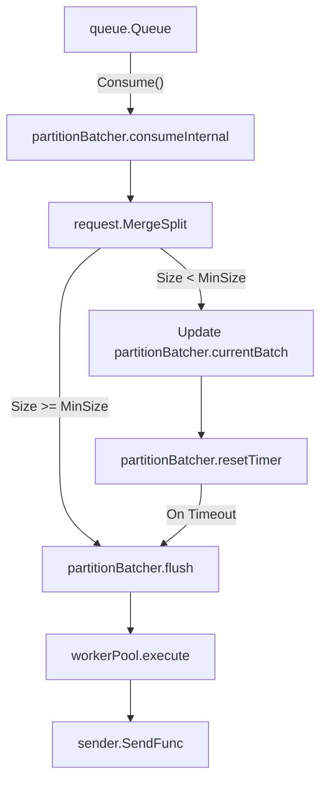
**Diagram: partitionBatcher Consumption and Flush Logic**

Sources: [exporter/exporterhelper/internal/queuebatch/partition_batcher.go:33-206](), [exporter/exporterhelper/internal/queuebatch/batcher.go:33-52](), [exporter/exporterhelper/internal/queue_sender.go:31-35]()

## Metadata Partitioning

Exporters can partition batches based on request metadata (e.g., `client.Metadata`). This is configured via `PartitionConfig` [exporter/exporterhelper/internal/queuebatch/config.go:111-121]().

### Implementation: MultiBatcher
When `MetadataKeys` are defined, a `multiBatcher` is created [exporter/exporterhelper/internal/queuebatch/batcher.go:47-51](). It maintains an LRU cache of `partitionBatcher` instances [exporter/exporterhelper/internal/queuebatch/multi_batcher.go:18-28]().

*   **Key Generation**: The `Partitioner.GetKey` function extracts values from the context to determine the shard [exporter/exporterhelper/internal/queuebatch/multi_batcher.go:64]().
*   **LRU Management**: The cache defaults to 10,000 active partitions. Evicted partitions are automatically shut down and flushed via `mb.wp.execute(pb.shutdownInternal)` [exporter/exporterhelper/internal/queuebatch/multi_batcher.go:51-54]().
*   **Idle Cleanup**: Partitions are removed from the cache after an idle period (defined by `partitionIdleCycles`) via an `onEmpty` callback [exporter/exporterhelper/internal/queuebatch/multi_batcher.go:75-79](), [exporter/exporterhelper/internal/queuebatch/partition_batcher.go:22]().

Sources: [exporter/exporterhelper/internal/queuebatch/config.go:111-121](), [exporter/exporterhelper/internal/queuebatch/multi_batcher.go:30-83](), [exporter/exporterhelper/internal/queuebatch/partition_batcher.go:21-22]()

## Observability and Telemetry

The queue and batching system emits detailed telemetry to monitor performance and health. Metrics are defined in `metadata.yaml` and generated in `generated_telemetry.go` [exporter/exporterhelper/metadata.yaml:14-140](), [exporter/exporterhelper/internal/metadata/generated_telemetry.go:31-47]().

| Metric Name | Type | Description |
|-------------|------|-------------|
| `otelcol_exporter_queue_size` | Gauge | Current number of batches in the queue [exporter/exporterhelper/metadata.yaml:132-139](). |
| `otelcol_exporter_queue_capacity` | Gauge | Maximum capacity of the queue [exporter/exporterhelper/metadata.yaml:123-130](). |
| `otelcol_exporter_enqueue_failed_*` | Counter | Number of items (spans/metrics/logs) that failed to enter the queue [exporter/exporterhelper/metadata.yaml:16-51](). |
| `otelcol_exporter_queue_batch_send_size` | Histogram | Number of units in the sent batch [exporter/exporterhelper/metadata.yaml:61-92](). |
| `otelcol_exporter_in_flight_requests` | UpDownCounter | Number of export requests currently in-flight [exporter/exporterhelper/metadata.yaml:52-60](). |

Sources: [exporter/exporterhelper/metadata.yaml:14-212](), [exporter/exporterhelper/internal/metadata/generated_telemetry.go:119-174]()

## Summary of Default Strategies

| Feature | Default Behavior | Source |
|---------|------------------|--------|
| **Queue Size** | 1,000 requests | [exporter/exporterhelper/internal/queue_sender.go:29]() |
| **Consumers** | 10 concurrent workers | [exporter/exporterhelper/internal/queue_sender.go:28]() |
| **Batch Flush** | 200ms timeout | [exporter/exporterhelper/internal/queue_sender.go:32]() |
| **Batch Min Size**| 8,192 items | [exporter/exporterhelper/internal/queue_sender.go:34]() |
| **Overflow** | Non-blocking (drop data) | [exporter/exporterhelper/internal/queue_sender.go:30]() |
| **Sizer** | Items (for batch), Requests (for queue) | [exporter/exporterhelper/internal/queue_sender.go:27, 33]() |

Sources: [exporter/exporterhelper/internal/queue_sender.go:18-37]()

# Retry Logic and Error Handling


This document explains the retry logic and error handling mechanisms in the OpenTelemetry Collector's exporter infrastructure. The retry system provides resilient data export through exponential backoff, intelligent error classification, and throttle detection. This system works in conjunction with the persistent queue to ensure reliable data delivery even during transient failures.

## Error Classification

The collector classifies errors into categories that determine retry behavior. This classification is primarily handled by the `retrySender` and specific protocol implementations like the OTLP exporter.

| Error Type | Behavior | Use Case | Detection Method |
|-----------|----------|----------|-----------------|
| **Permanent Error** | Fail immediately, do not retry | Invalid data, configuration errors, 400/404 HTTP status | `consumererror.IsPermanent()` |
| **Retryable Error** | Queue and retry with backoff | Network timeouts, connection failures, 502/503/504 HTTP status | Standard Go errors |
| **Throttle Error** | Retry after specific delay | Rate limiting (429 status code, `ResourceExhausted` gRPC) | `exporterhelper.NewThrottleRetry()` |

### Data Flow and Code Entities
The following diagram bridges the logical error handling flow with the specific code entities in the `exporterhelper` and `otlpexporter` packages.

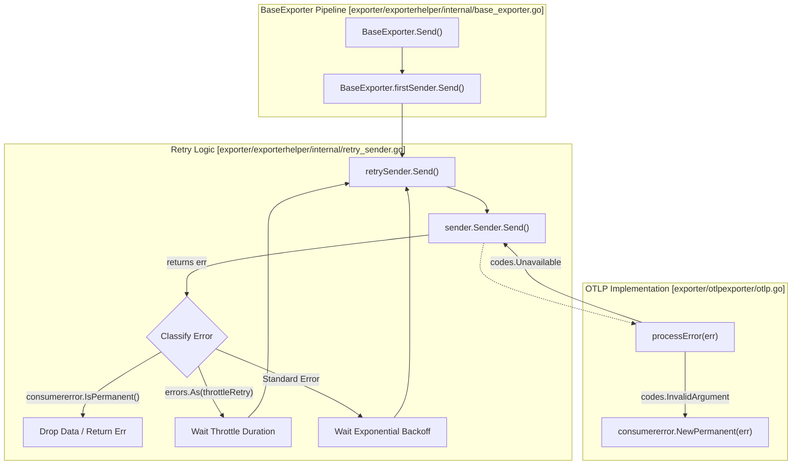
**Diagram: Error Classification Data Flow**

Sources: [exporter/exporterhelper/internal/base_exporter.go:112-122](), [exporter/exporterhelper/internal/retry_sender.go:71-149](), [exporter/otlpexporter/otlp.go:173-203]()

## Retry Configuration

Retry behavior is controlled by `configretry.BackOffConfig`. In the `BaseExporter`, the retry sender is initialized if `retryCfg.Enabled` is true [exporter/exporterhelper/internal/base_exporter.go:78-81]().

| Field | Default | Description |
|-------|---------|-------------|
| `Enabled` | `true` | Enable/disable retry logic |
| `InitialInterval` | `5s` | Time to wait after first failure [exporter/exporterhelper/README.md:14]() |
| `RandomizationFactor` | `0.5` | Jitter factor (0.0 to 1.0) to prevent thundering herd |
| `Multiplier` | `1.5` | Backoff multiplier for each attempt [exporter/exporterhelper/README.md:17]() |
| `MaxInterval` | `30s` | Maximum time between retries [exporter/exporterhelper/README.md:15]() |
| `MaxElapsedTime` | `5m` | Give up after this duration from first attempt [exporter/exporterhelper/README.md:16]() |

The OTLP exporters (both gRPC and HTTP) use these defaults via `CreateDefaultConfig` [exporter/otlpexporter/factory_test.go:30-42]().

Sources: [exporter/exporterhelper/internal/base_exporter.go:51](), [exporter/exporterhelper/README.md:12-17](), [exporter/otlpexporter/factory_test.go:30-42]()

## Throttle Error Handling

Throttle errors represent rate limiting or backpressure from the downstream system. The collector detects these via specific protocol status codes and headers.

### The NewThrottleRetry Mechanism
When a throttle condition is detected by an exporter implementation, it returns a specialized error created via `exporterhelper.NewThrottleRetry(err, delay)` [exporter/otlpexporter/otlp.go:198]().

*   **OTLP gRPC**: Detects `codes.ResourceExhausted` and extracts delay from `errdetails.RetryInfo` using `statusutil.GetRetryInfo` [exporter/otlpexporter/otlp.go:187-199]().
*   **OTLP HTTP**: Detects `429` status codes and parses the `Retry-After` header [exporter/otlphttpexporter/otlp.go:235-246]().

The `retrySender` detects this error using `errors.As` and prioritizes the throttle delay over the standard exponential backoff calculation [exporter/exporterhelper/internal/retry_sender.go:110-113]().

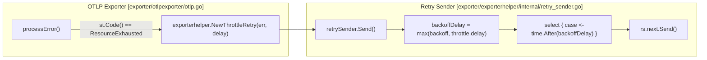
**Diagram: Throttle Detection and Execution**

Sources: [exporter/otlpexporter/otlp.go:187-199](), [exporter/otlphttpexporter/otlp.go:235-246](), [exporter/exporterhelper/internal/retry_sender.go:110-113]()

## Permanent Error Handling

Permanent errors indicate that the request is invalid and should not be retried. The `exporterhelper` infrastructure uses `consumererror.IsPermanent(err)` to identify these cases [exporter/exporterhelper/internal/retry_sender.go:97-99]().

### Behavior on Permanent Error
1.  **Immediate Failure**: The `retrySender` stops retrying immediately and returns the error to the caller [exporter/exporterhelper/internal/retry_sender.go:98]().
2.  **Logging**: The `BaseExporter` logs the failure with the error details and the number of items rejected [exporter/exporterhelper/internal/base_exporter.go:117-121]().
3.  **Item Tracking**: The collector tracks the `itemsCount` before sending to ensure accurate logging of rejected data even if a batcher modifies the request [exporter/exporterhelper/internal/base_exporter.go:115-121]().

Sources: [exporter/exporterhelper/internal/retry_sender.go:97-99](), [exporter/exporterhelper/internal/base_exporter.go:112-122](), [exporter/otlphttpexporter/otlp.go:229-231]()

## Context and Lifecycle Management

The retry logic is sensitive to the request context and the collector's lifecycle:

*   **Context Deadline**: If the `context.Context` has a deadline that expires before the next retry attempt, the `retrySender` aborts the retry loop with a "request will be cancelled before next retry" error [exporter/exporterhelper/internal/retry_sender.go:121-125]().
*   **Shutdown**: During collector shutdown, the `retrySender` receives a signal on its `stopCh`. It then returns a `ShutdownErr`, which informs the `QueueSender` to stop processing [exporter/exporterhelper/internal/retry_sender.go:144-145]().
*   **Shutdown Sequence**: The `BaseExporter` ensures that the `RetrySender` is shut down before the `QueueSender`. This allows the queue to flush remaining items without entering long retry loops during the shutdown period [exporter/exporterhelper/internal/base_exporter.go:141-144]().

Sources: [exporter/exporterhelper/internal/retry_sender.go:121-148](), [exporter/exporterhelper/internal/base_exporter.go:138-153]()

# Service Runtime


The Service Runtime is the core orchestration layer of the OpenTelemetry Collector. Implemented in the `service` package, it manages the complete lifecycle of the collector from initialization through shutdown. The runtime creates and coordinates all components (receivers, processors, exporters, connectors, extensions), establishes the pipeline graph, configures internal telemetry, and ensures proper startup and shutdown sequencing.

This page provides an overview of the service runtime architecture and its key responsibilities. For detailed information, see:
- **[Service Initialization and Lifecycle](#7.1)** — Explain `service.New`, telemetry setup (logger, meter, tracer), `Settings` structure, and the complete initialization sequence.
- **[Pipeline Orchestration](#7.2)** — Detail `graph.Build` for pipeline construction, component validation, cycle detection, and the Start/Shutdown sequences for extensions and pipelines.
- **[Observability and Telemetry](#7.3)** — Explain the `obsreport` system, internal telemetry metrics (receiver_accepted, processor_dropped, exporter_sent), traces for operations, telemetry levels, and the `otelconftelemetry` factory.

---

## Service Architecture

The service runtime centers around the `service.Service` struct, which acts as the central orchestrator for the collector. The Service owns all component instances, manages their lifecycles, and provides them with telemetry providers and host capabilities.

### Core Service Structure

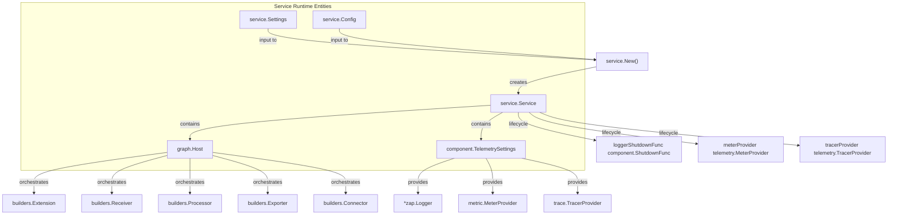

**Diagram: Service Core Structure and Dependencies**

The `service.Service` struct owns all runtime state including telemetry providers, the `graph.Host` component registry, and configuration. The `graph.Host` provides component access and status reporting to all managed components.

Sources: [service/service.go:110-118](), [service/service.go:45-107](), [service/service.go:121-141]()

---

## Service Settings and Configuration

The service runtime uses two configuration structures to define its behavior and component inventory:

- **`service.Settings`**: Build-time configuration containing component factories (e.g., `ReceiversFactories`) and instance configurations. It also holds the `TelemetryFactory` used to bootstrap internal observability. [service/service.go:45-107]()
- **`service.Config`**: Runtime configuration typically defined in YAML, specifying which `Pipelines`, `Extensions`, and `Telemetry` settings are active.

### Settings Structure

The `Settings` struct aggregates all information needed to construct a `Service` instance:

| Field | Type | Purpose |
|-------|------|---------|
| `BuildInfo` | `component.BuildInfo` | Collector version and build information. [service/service.go:47]() |
| `ConfigSnapshot` | `extensioncapabilities.ConfigSnapshot` | Current configuration representation. [service/service.go:52]() |
| `ReceiversFactories` | `map[component.Type]receiver.Factory` | Registry of available receiver types. [service/service.go:63]() |
| `ProcessorsFactories` | `map[component.Type]processor.Factory` | Registry of available processor types. [service/service.go:67]() |
| `ExportersFactories` | `map[component.Type]exporter.Factory` | Registry of available exporter types. [service/service.go:71]() |
| `ConnectorsFactories` | `map[component.Type]connector.Factory` | Registry of available connector types. [service/service.go:75]() |
| `ExtensionsFactories` | `map[component.Type]extension.Factory` | Registry of available extension types. [service/service.go:82]() |
| `AsyncErrorChannel` | `chan error` | Channel for reporting fatal asynchronous errors. [service/service.go:88]() |
| `TelemetryFactory` | `telemetry.Factory` | Factory for creating internal telemetry providers. [service/service.go:106]() |

Sources: [service/service.go:45-107]()

---

## Service Creation

The `service.New()` function creates and initializes a `Service` instance. It follows a strict initialization order to ensure dependencies (like logging) are available when building subsequent components.

### High-Level Initialization Flow

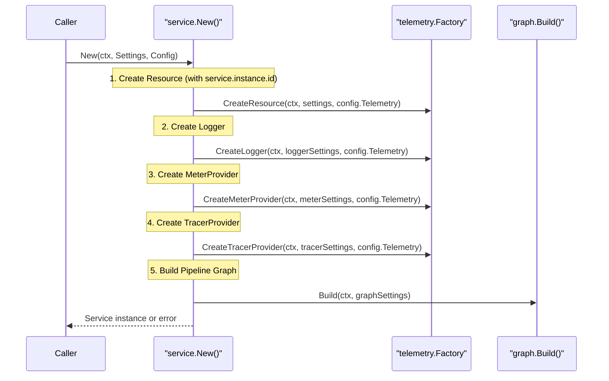

**Diagram: Service Initialization Sequence**

The initialization follows a strict dependency order. Telemetry providers are created first so they can observe all subsequent operations. If any step fails, deferred error handlers ensure proper cleanup of already-initialized components.

Sources: [service/service.go:121-232]()

---

## Runtime Lifecycle

Once created, the `Service` provides `Start()` and `Shutdown()` methods to manage runtime execution.

### Start Sequence

The `Start()` method executes these steps in order:
1. **Start Extensions**: Extensions start first to provide shared infrastructure (e.g., auth, health checks). [service/service.go:246-248]()
2. **Notify Configuration**: Extensions receive the collector's effective configuration via `NotifyConfig`. [service/service.go:250-253]()
3. **Start Pipelines**: All pipeline components (receivers, processors, exporters) start and begin data processing via `pipelines.StartAll`. [service/service.go:256-258]()
4. **Notify Pipeline Ready**: Extensions are informed that pipelines are ready via `NotifyPipelineReady`. [service/service.go:260-262]()

### Shutdown Sequence

The shutdown sequence reverses the startup order and uses error accumulation via `multierr` to ensure every component gets a chance to clean up. [service/service.go:273-307]()

1. **Notify Pipeline Not Ready**: Extensions are informed shutdown is starting. [service/service.go:280-282]()
2. **Shutdown Pipelines**: All pipeline components stop processing. [service/service.go:284-286]()
3. **Shutdown Extensions**: Extensions clean up resources. [service/service.go:288-290]()
4. **Shutdown Telemetry**: Tracer, Meter, and Logger providers are shut down last to capture all logs/metrics from the shutdown process. [service/service.go:296-304]()

Sources: [service/service.go:234-307]()

---

## Component Registry and Host

The `graph.Host` struct serves as the component registry and implements the `component.Host` interface that all components receive during creation.

### Host Structure

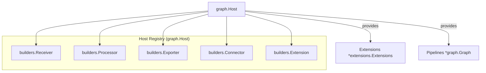

**Diagram: Host Component Registry Structure**

The `graph.Host` acts as the `component.Host` implementation passed to all components. It provides access to extensions, status reporting, and module information. Component builders create instances on-demand during pipeline graph construction.

Sources: [service/service.go:129-139](), [service/internal/graph/host.go:25-36]()

---

## Configuration Validation

The service runtime provides mechanisms to validate configuration before full startup. The `otelcol.Collector` uses `col.configProvider.Get(ctx, factories)` to ensure the configuration is semantically correct and that all referenced components are available. [otelcol/collector.go:186-193]()

During `graph.Build`, the runtime performs deeper validation:
- **Reference Integrity**: All referenced components exist and are properly configured.
- **Connector Logic**: Connectors are correctly used as both exporters and receivers. [service/internal/graph/graph.go:141-184]()
- **Graph Integrity**: No cycles or invalid connections exist in the pipeline graph. [service/internal/graph/graph.go:74-94]()

Sources: [otelcol/collector.go:178-199](), [service/internal/graph/graph.go:74-94]()