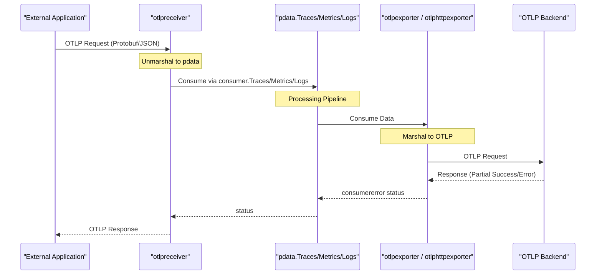

## Purpose and Scope

This document provides an overview of the OpenTelemetry Protocol (OTLP) implementation within the OpenTelemetry Collector. OTLP is the native protocol of the OpenTelemetry project, designed to efficiently transport telemetry data between collectors, agents, and backends.

This page covers:
- The OTLP protocol structure and variants (gRPC and HTTP)
- High-level architecture of OTLP receiver and exporters
- Protocol configuration mechanisms
- Data encoding and error handling patterns

For detailed implementation of the OTLP receiver, see [OTLP Receiver](#5.1). For exporter-specific details, see [OTLP Exporters](#5.2).

## OTLP Protocol Overview

The OpenTelemetry Protocol (OTLP) defines a standardized way to transmit telemetry data. The collector implements both receiving and exporting OTLP data through two transport protocols:

| Transport | Encoding | Content Type | Default Ports |
|-----------|----------|--------------|---------------|
| **gRPC** | Protobuf | `application/x-protobuf` | Receiver: 4317 |
| **HTTP** | Protobuf or JSON | `application/x-protobuf` or `application/json` | Receiver: 4318 |

### Signal Types

OTLP supports distinct signal types, each with its own service definition and data structures. In the collector, these are represented by the `pdata` internal model:

- **Traces**: Distributed tracing spans [receiver/otlpreceiver/go.mod:26-26]()
- **Metrics**: Measurements and aggregations [receiver/otlpreceiver/go.mod:26-26]()
- **Logs**: Event records with structured metadata [receiver/otlpreceiver/go.mod:26-26]()
- **Profiles**: Performance profiling data (alpha) [receiver/otlpreceiver/go.mod:27-27]()

**Sources:** [receiver/otlpreceiver/go.mod:26-27](), [exporter/otlpexporter/go.mod:26-27]()

## Architecture Overview

The collector implements OTLP support through three primary components: the OTLP receiver for ingesting data, and two exporters (gRPC and HTTP) for sending data to OTLP-compatible backends.

### System Architecture Diagram

```mermaid
graph TB
    subgraph "ExternalSources"
        ["ExternalApplications<br/>(SDKs, Agents)"]
    end

    subgraph "OTLPReceiver"
        OTLPRcv["otlpreceiver"]
        GRPCServer["configgrpc.ServerConfig"]
        HTTPServer["confighttp.ServerConfig"]

        OTLPRcv --> GRPCServer
        OTLPRcv --> HTTPServer
    end

    subgraph "InternalDataModel"
        PData["pdata (Traces, Metrics, Logs, Profiles)"]
    end

    subgraph "OTLPExporters"
        subgraph "gRPCExporter"
            GRPCExp["otlpexporter"]
            GRPCClient["configgrpc.ClientConfig"]
        end

        subgraph "HTTPExporter"
            HTTPExp["otlphttpexporter"]
            HTTPClient["confighttp.ClientConfig"]
        end

        GRPCExp --> GRPCClient
        HTTPExp --> HTTPClient
    end

    subgraph "ExternalBackends"
        Backend["OTLP-Compatible Backends"]
    end

    ExternalSources -->|"OTLP/gRPC or OTLP/HTTP"| OTLPRcv
    OTLPRcv --> PData
    PData --> GRPCExp
    PData --> HTTPExp

    GRPCClient -->|"OTLP/gRPC"| Backend
    HTTPClient -->|"OTLP/HTTP"| Backend
```

**Sources:** [receiver/otlpreceiver/go.mod:13-14](), [exporter/otlpexporter/go.mod:12-12](), [exporter/otlphttpexporter/go.mod:11-11]()

### Data Flow Through OTLP Components



**Sources:** [receiver/otlpreceiver/go.mod:19-22](), [exporter/otlpexporter/go.mod:18-21]()

## OTLP Receiver

The OTLP receiver (`otlpreceiver`) implements both gRPC and HTTP servers to accept telemetry data. It is the primary ingestion point for OTLP data in the collector.

### Key Components

- **Protocols**: Supports both `grpc` and `http` protocols simultaneously.
- **Signal Handling**: Dispatches incoming requests to signal-specific consumers (Traces, Metrics, Logs, Profiles).
- **Authentication**: Integrates with `configauth` to provide extensible authentication mechanisms [receiver/otlpreceiver/go.mod:12-12]().

### Configuration Structure

The OTLP receiver leverages shared configuration helpers:
- **gRPC**: Uses `configgrpc.ServerConfig` for transport settings [config/configgrpc/configgrpc.go:193-205]().
- **HTTP**: Uses `confighttp.ServerConfig` for transport settings [config/confighttp/go.mod:11-20]().

**Sources:** [receiver/otlpreceiver/go.mod:12-17](), [config/configgrpc/configgrpc.go:193-205]()

For detailed receiver implementation, see [OTLP Receiver](#5.1).

## OTLP Exporters

The collector provides two OTLP exporters that send telemetry data to OTLP-compatible backends: a gRPC-based exporter (`otlpexporter`) and an HTTP-based exporter (`otlphttpexporter`).

### gRPC Exporter (otlpexporter)

The gRPC exporter uses persistent connections and protocol buffer encoding. It relies on `configgrpc.ClientConfig` for connection management, including TLS, keepalive, and load balancing [config/configgrpc/configgrpc.go:80-132]().

### HTTP Exporter (otlphttpexporter)

The HTTP exporter supports both Protobuf and JSON encodings. It uses `confighttp.ClientConfig` for client configuration, including timeout and compression settings [exporter/otlphttpexporter/go.mod:10-15]().

### Exporter Comparison

| Feature | gRPC Exporter | HTTP Exporter |
|---------|---------------|---------------|
| **Transport** | gRPC (HTTP/2) | HTTP/1.1 or HTTP/2 |
| **Encoding** | Protobuf | Protobuf or JSON |
| **Configuration** | `configgrpc.ClientConfig` | `confighttp.ClientConfig` |
| **Retries** | `configretry.BackOffConfig` | `configretry.BackOffConfig` |

**Sources:** [exporter/otlpexporter/go.mod:12-15](), [exporter/otlphttpexporter/go.mod:11-14](), [config/configgrpc/configgrpc.go:80-132]()

For detailed exporter implementation, see [OTLP Exporters](#5.2).

## Protocol Configuration

Both OTLP receiver and exporters rely on shared configuration infrastructure.

### gRPC Configuration (`configgrpc`)

Standardized gRPC configuration including:
- **ClientConfig**: Defines settings for outgoing RPCs like `Endpoint`, `Compression`, and `TLS` [config/configgrpc/configgrpc.go:80-132]().
- **ServerConfig**: Defines settings for incoming RPCs like `NetAddr` and `Keepalive` [config/configgrpc/configgrpc.go:193-205]().
- **Keepalive**: Configurable client and server keepalive parameters [config/configgrpc/configgrpc.go:54-60]().

### HTTP Configuration (`confighttp`)

Standardized HTTP configuration including:
- **Compression**: Support for `gzip`, `snappy`, `zstd`, and `lz4` [config/confighttp/go.mod:6-8]().
- **CORS**: Support for Cross-Origin Resource Sharing [config/confighttp/go.mod:9-9]().
- **TLS**: Standard client and server TLS settings [config/confighttp/go.mod:20-20]().

**Sources:** [config/configgrpc/configgrpc.go:80-205](), [config/confighttp/go.mod:6-20]()

## Data Model and Protocol Conversion

The collector uses strongly-typed internal data structures from the `pdata` package. OTLP implementations marshal/unmarshal between these internal types and the wire format:

- **Internal**: `pdata.Traces`, `pdata.Metrics`, `pdata.Logs`, `pprofile.Profiles` [receiver/otlpreceiver/go.mod:26-27]().
- **Wire**: OTLP Protobuf as defined in `google.golang.org/protobuf` [receiver/otlpreceiver/go.mod:39-39]().

**Sources:** [receiver/otlpreceiver/go.mod:26-39](), [exporter/otlpexporter/go.mod:26-34]()

## Error Handling and Partial Success

### Error Classification

OTLP implementations categorize errors to determine behavior:
- **Permanent Errors**: Invalid data; results in dropping data via `consumererror` [exporter/otlpexporter/go.mod:19-19]().
- **Retryable Errors**: Transient issues; triggers logic via `configretry` [exporter/otlpexporter/go.mod:15-15]().

### Partial Success Responses

OTLP supports "Partial Success," where a backend accepts some data but rejects others. The collector handles these responses by processing the `PartialSuccess` message returned in the OTLP response [exporter/otlpexporter/go.mod:32-32]().

**Sources:** [exporter/otlpexporter/go.mod:15-32](), [exporter/otlphttpexporter/go.mod:14-30]()

## Observability

OTLP components are instrumented using standard collector telemetry:
- **Metrics**: Track data points using `go.opentelemetry.io/otel/sdk/metric` [receiver/otlpreceiver/go.mod:34-34]().
- **Logs**: Detailed component activity using `go.uber.org/zap` [receiver/otlpreceiver/go.mod:36-36]().
- **Traces**: Internal spans for request processing via `go.opentelemetry.io/otel` [receiver/otlpreceiver/go.mod:33-33]().

**Sources:** [receiver/otlpreceiver/go.mod:33-36](), [exporter/otlpexporter/go.mod:29-31]()