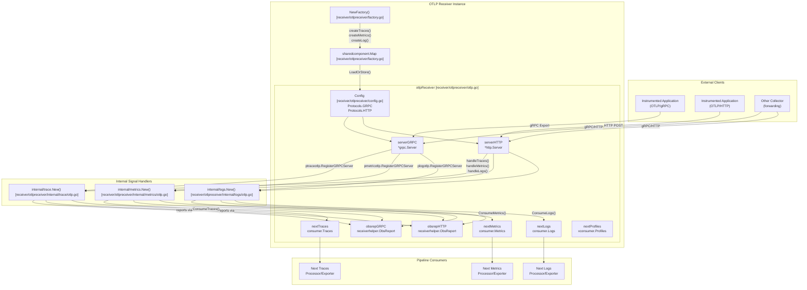
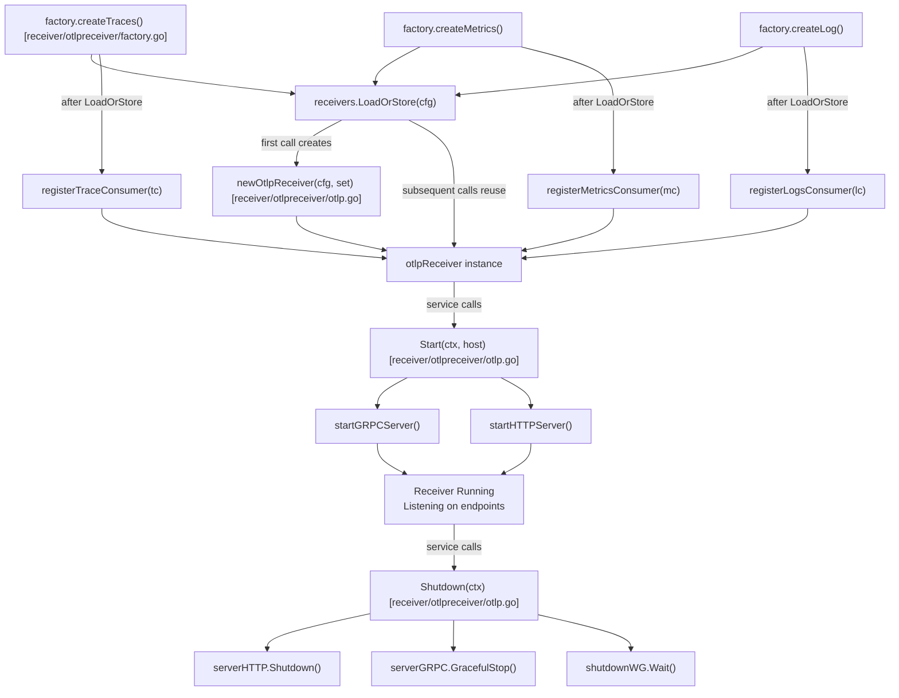
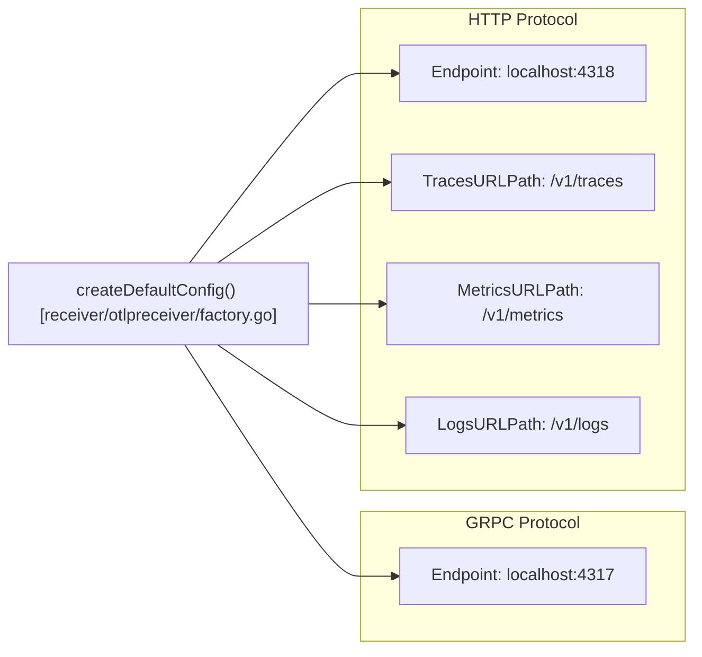

The OTLP Receiver accepts telemetry data in the OpenTelemetry Protocol (OTLP) format over both gRPC and HTTP transports. It supports all four signal types: traces, metrics, logs, and profiles. This receiver serves as the primary ingestion point for applications and other collectors sending data using the OTLP standard.

For information about exporting data using OTLP, see [OTLP Exporters](#5.2). For details on the overall receiver architecture and lifecycle, see [Receivers](#4.2).

## Architecture Overview

The OTLP Receiver implements a dual-protocol architecture, supporting simultaneous gRPC and HTTP endpoints. The receiver uses a shared component pattern to ensure that a single instance handles all signal types configured for the same endpoint.



Sources: [receiver/otlpreceiver/otlp.go:35-50](), [receiver/otlpreceiver/factory.go:30-39](), [receiver/otlpreceiver/factory.go:157-163]()

## Component Lifecycle

The OTLP Receiver uses the shared component pattern to ensure that receivers for different signal types share the same server instances when configured with the same settings. This is managed by a `sharedcomponent.Map` which uses the component configuration as a key to retrieve or create the underlying `otlpReceiver` instance.



Sources: [receiver/otlpreceiver/factory.go:70-155](), [receiver/otlpreceiver/otlp.go:187-215](), [receiver/otlpreceiver/factory.go:157-163]()

## Configuration Structure

The OTLP Receiver configuration supports both gRPC and HTTP protocols, with independent settings for each. At least one protocol must be enabled for the receiver to start.

### Configuration Schema

| Field | Type | Description |
|-------|------|-------------|
| `protocols` | `Protocols` | Protocol configurations (GRPC and/or HTTP) |
| `protocols.grpc` | `configgrpc.ServerConfig` | gRPC server configuration (optional) |
| `protocols.http` | `HTTPConfig` | HTTP server configuration (optional) |

Sources: [receiver/otlpreceiver/config.go:54-67](), [receiver/otlpreceiver/config.go:72-77]()

### Default Configuration

Default endpoints are `localhost:4317` for gRPC and `localhost:4318` for HTTP. The default HTTP paths follow the OTLP specification.



Sources: [receiver/otlpreceiver/factory.go:42-67](), [receiver/otlpreceiver/factory.go:22-27]()

## gRPC Server Implementation

The gRPC server registers OTLP service implementations for each signal type using the generated gRPC server registration functions. It leverages `configgrpc` for server lifecycle management and security (TLS/Auth).

The gRPC server implementation performs the following steps:

1. **Server Creation**: Uses `configgrpc.ServerConfig.ToServer()` to create a `grpc.Server` with configured options [receiver/otlpreceiver/otlp.go:96-98]().
2. **Handler Registration**: For each enabled signal type, creates a handler using the internal signal packages and registers it with the gRPC server [receiver/otlpreceiver/otlp.go:100-114]().
3. **Network Binding**: Creates a network listener on the configured endpoint [receiver/otlpreceiver/otlp.go:116-119]().
4. **Serving**: Starts the gRPC server in a goroutine using `shutdownWG` to track its lifecycle [receiver/otlpreceiver/otlp.go:122-126]().

Sources: [receiver/otlpreceiver/otlp.go:88-128](), [receiver/otlpreceiver/otlp.go:100-114]()

## HTTP Server Implementation

The HTTP server configures separate URL paths for each signal type and handles both JSON and Protobuf encodings. It utilizes `confighttp` for transport-level configuration.

### HTTP Request Handling

Each HTTP handler processes requests with the following logic:

1. **Method Validation**: Only `POST` requests are accepted via `readContentType` [receiver/otlpreceiver/otlphttp.go:154-157]().
2. **Content-Type Detection**: Supports `application/json` (`jsEncoder`) and `application/x-protobuf` (`pbEncoder`) [receiver/otlpreceiver/otlphttp.go:159-167]().
3. **Content-Encoding**: Supports decompression during read via `readAndCloseBody` [receiver/otlpreceiver/otlphttp.go:170-181]().
4. **Request Unmarshaling**: Decodes the request body into OTLP data structures via `encoder` interfaces [receiver/otlpreceiver/otlphttp.go:40-44]().
5. **Consumer Invocation**: Passes data to the next consumer in the pipeline [receiver/otlpreceiver/otlphttp.go:46]().
6. **Error Handling**: Maps errors to appropriate HTTP status codes and gRPC status messages via `writeError` [receiver/otlpreceiver/otlphttp.go:184-192]().

Sources: [receiver/otlpreceiver/otlphttp.go:29-151](), [receiver/otlpreceiver/otlphttp.go:153-181]()

### HTTP Status Code Mapping

The receiver encodes HTTP errors inside a `rpc.Status` message as required by the OTLP protocol.

| Error Type | HTTP Status | gRPC Code |
|------------|-------------|-----------|
| Success | 200 OK | OK |
| Invalid request format | 400 Bad Request | InvalidArgument |
| Permanent consumer error | 500 Internal Server Error | Internal |
| Retryable consumer error | 503 Service Unavailable | Unavailable |

Sources: [receiver/otlpreceiver/otlphttp.go:184-192](), [receiver/otlpreceiver/otlp_test.go:96-127]()

## Observability and Metrics

The OTLP Receiver emits telemetry about its own operation using `receiverhelper.ObsReport`. It maintains separate reports for gRPC and HTTP transports to provide granular observability.

### Telemetry Initialization

The receiver drops injected telemetry attributes to create signal-agnostic loggers [receiver/otlpreceiver/otlp.go:56-57]():
```go
set.TelemetrySettings = telemetry.DropInjectedAttributes(set.TelemetrySettings, telemetry.SignalKey)
```
This ensures that a single logger instance can be used for all signal types without signal-specific attributes being inappropriately included in logs generated by the shared servers.

Sources: [receiver/otlpreceiver/otlp.go:56-57](), [receiver/otlpreceiver/otlp.go:68-83]()

## Throttling Support

The receiver handles throttling by setting the `Retry-After` header in HTTP responses when status codes `429` (Too Many Requests) or `503` (Service Unavailable) are returned [receiver/otlpreceiver/otlphttp.go:215-216](). This value is extracted from the `RetryInfo` detail in the gRPC status if present [receiver/otlpreceiver/otlphttp.go:218-228]().

Sources: [receiver/otlpreceiver/otlphttp.go:214-228]()