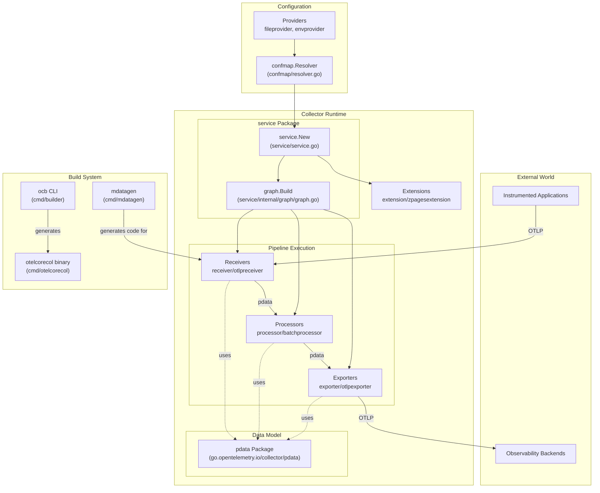
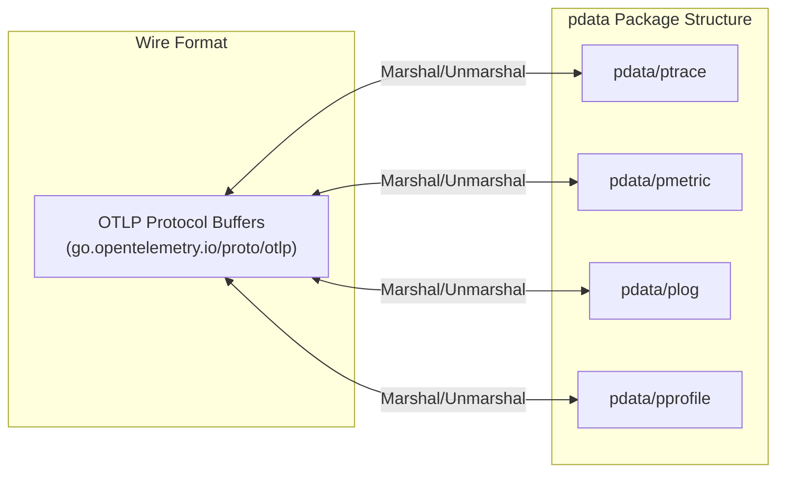

## Purpose and Scope

The OpenTelemetry Collector is a vendor-agnostic telemetry data pipeline that receives, processes, and exports traces, metrics, logs, and profiles. It provides a unified solution for collecting observability data from instrumented applications and forwarding it to various backends, eliminating the need to run, operate, and maintain multiple specialized agents (e.g., Jaeger, Prometheus) for different backends. [README.md:49-53]()

The project is structured as a multi-module Go repository consisting of 70+ modules. [go.mod:1-11](). The core framework, data model, and primary OTLP protocol implementation reside in this repository, while additional vendor-specific or niche components are maintained in the `opentelemetry-collector-contrib` repository. [docs/release.md:5-9]()

**Sources:** [README.md:49-53](), [go.mod:1-11](), [docs/release.md:5-9]()

## Key Concepts

### Telemetry Signals

The collector handles four types of telemetry data (signals):
- **Traces**: Distributed transaction tracking.
- **Metrics**: Numerical measurements and aggregations.
- **Logs**: Timestamped text records.
- **Profiles**: Performance profiling data (experimental). [versions.yaml:80-82]()

All signals are represented internally using the `pdata` data model, which provides a unified, efficient representation based on the OpenTelemetry Protocol (OTLP). The collector is currently built against OTLP protocol v1.10.0, which is considered stable. [README.md:99-102]()

**Sources:** [README.md:99-102](), [versions.yaml:80-82]()

### Component Types

The collector is built from five types of pluggable components, defined in the `component` module and instantiated via factories: [CONTRIBUTING.md:68-74]()

| Component Type | Purpose | Examples |
|---------------|---------|----------|
| **Receivers** | Ingest telemetry data from external sources | `otlpreceiver`, `nopreceiver` |
| **Processors** | Transform, filter, or enrich data in-flight | `batchprocessor`, `memorylimiterprocessor` |
| **Exporters** | Send telemetry data to backends | `otlpexporter`, `debugexporter` |
| **Connectors** | Route data between pipelines (act as both exporter and receiver) | `forwardconnector` |
| **Extensions** | Provide cross-cutting capabilities outside the data path | `zpagesextension`, `memorylimiterextension` |

**Sources:** [cmd/otelcorecol/builder-config.yaml:15-30](), [README.md:49-53](), [CONTRIBUTING.md:68-74](), [versions.yaml:11-32]()

## System Architecture

The following diagram illustrates the relationship between the natural language concepts of the collector pipeline and the specific code entities that implement them.

Title: Bridge from Conceptual Pipeline to Code Entities

**System Architecture Overview**

The collector runtime is orchestrated by the `service` package, which manages component lifecycles and pipeline construction. [versions.yaml:100]() The service ensures that receivers always start after all other components to prevent data loss during startup. [CHANGELOG.md:29-32]() Components communicate using the `pdata` internal data model, ensuring type-safe, efficient data transfer. [versions.yaml:10]()

**Sources:** [versions.yaml:4-103](), [CHANGELOG.md:29-32](), [CONTRIBUTING.md:51-53]()

## Core Abstractions

### Component Interface

All components implement base lifecycle methods (e.g., `Start`, `Shutdown`) defined in the `component` module. [CONTRIBUTING.md:70]() Each component type (Receiver, Processor, Exporter) implements signal-specific consumer interfaces from the `consumer` package. [versions.yaml:26]()

**Receiver Interfaces:**
- `receiver.Traces`, `receiver.Metrics`, `receiver.Logs` [versions.yaml:32]()

**Processor Interfaces:**
- `processor.Traces`, `processor.Metrics`, `processor.Logs` [versions.yaml:31]()

**Exporter Interfaces:**
- `exporter.Traces`, `exporter.Metrics`, `exporter.Logs` [versions.yaml:27]()

**Sources:** [versions.yaml:26-32](), [CONTRIBUTING.md:68-74]()

### Data Model (pdata)

Title: Mapping pdata Internal Signal Types to OTLP Wire Format

**pdata Internal Data Model**

The `pdata` package provides the internal representation of telemetry. It is designed to be highly efficient, allowing for direct mapping to OTLP wire formats. It includes sub-packages like `ptrace`, `pmetric`, `plog`, and the experimental `pprofile`. [versions.yaml:10,80-82]()

**Sources:** [versions.yaml:10,80-82](), [README.md:99-102]()

## Module Organization

The collector uses a multi-module Go project structure to manage dependencies and versioning independently. [go.mod:1-11]()

### Stable Modules (v1.x)
Core modules providing stable APIs:
- `component`: Core interfaces and factory patterns. [versions.yaml:11]()
- `confmap`: Configuration resolution and provider logic. [versions.yaml:12]()
- `pdata`: Internal telemetry data model. [versions.yaml:10]()
- `consumer`: Interfaces for data consumption. [versions.yaml:26]()

### Beta Modules (v0.x)
Modules containing implementations or the runtime engine:
- `service`: The runtime orchestration engine. [versions.yaml:100]()
- `otelcol`: CLI and command-line entry points. [versions.yaml:78]()
- `receiver/otlpreceiver`: The OTLP receiver implementation. [versions.yaml:92]()
- `processor/batchprocessor`: The batching processor. [versions.yaml:86]()
- `exporter/otlpexporter`: The OTLP gRPC exporter. [versions.yaml:67]()

**Sources:** [versions.yaml:4-103](), [go.mod:1-38]()

## Distribution and Build System

### OpenTelemetry Collector Builder (ocb)

The collector uses the `ocb` (OpenTelemetry Collector Builder) CLI tool, found in `cmd/builder`, to generate custom collector distributions. This tool allows developers to specify exactly which components (receivers, processors, etc.) to include in a binary via a configuration file. [cmd/builder/internal/builder/config.go:30-59](), [docs/release.md:7]()

**Sources:** [cmd/builder/internal/builder/config.go:30-59](), [docs/release.md:7]()

### Core Distribution

The `otelcorecol` is a local testing distribution defined in this repository. [cmd/otelcorecol/builder-config.yaml:10-12]() It includes the following core components: [cmd/otelcorecol/builder-config.yaml:15-30]()

| Category | Included Components |
|----------|---------------------|
| Receivers | `otlpreceiver`, `nopreceiver` |
| Processors | `batchprocessor`, `memorylimiterprocessor` |
| Exporters | `otlpexporter`, `otlphttpexporter`, `debugexporter`, `nopexporter` |
| Extensions | `zpagesextension`, `memorylimiterextension` |
| Connectors | `forwardconnector` |

**Sources:** [cmd/otelcorecol/builder-config.yaml:15-30]()

## Release and Versioning

The project follows a rigorous release procedure involving coordination across `core`, `contrib`, and `releases` repositories. [docs/release.md:5-9]()

- **Release Cycle**: Releases are automated via the `Automation - Prepare Release` and `Automation - Release Branch` workflows. [docs/release.md:34-47]()
- **Versioning**: Uses a "module set" strategy (`MODSET=beta` or `MODSET=stable`) where modules in a set are tagged together. [docs/release.md:44-45]()
- **Stability Levels**: Components and modules are assigned stability levels (e.g., alpha, beta, stable). [README.md:104-105]()

**Sources:** [docs/release.md:1-60](), [versions.yaml:4-33](), [README.md:104-105]()