## Purpose and Scope

This document describes how telemetry data flows through the OpenTelemetry Collector pipeline, from ingestion to export. It covers the pipeline architecture, internal data format, consumer interfaces, and the mechanisms for routing and data ownership.

For details on individual component types and their interfaces, see [Component Model](2.1). For information about the `pdata` data structures themselves, see [Telemetry Data Model](2.4).

## Pipeline Overview

A pipeline in the OpenTelemetry Collector represents a directed flow of telemetry data. Each pipeline is defined for a specific signal type (traces, metrics, or logs) and consists of three types of components arranged in sequence: receivers, processors, and exporters.

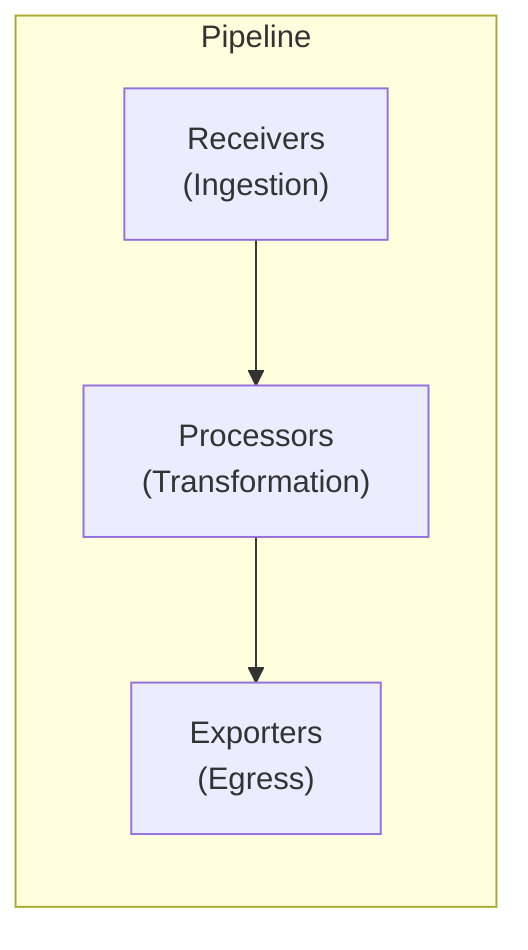

Sources: [processor/README.md:3-6](), [receiver/README.md:3-6](), [exporter/README.md:3-3]()

### Signal Types and Pipeline IDs

The collector supports multiple signal types. Each pipeline is identified by a `pipeline.ID`, which includes the signal type and an optional string name to allow multiple pipelines of the same type in the configuration.

| Signal Type | Code Constant | Configuration Key |
|-------------|---------------|-------------------|
| Traces | `pipeline.SignalTraces` | `traces` |
| Metrics | `pipeline.SignalMetrics` | `metrics` |
| Logs | `pipeline.SignalLogs` | `logs` |

Sources: [pipeline/pipeline.go:15-34](), [pipeline/signal.go:12-25]()

## Data Flow Architecture

### Consumer Interfaces

The core of the data flow is defined by consumer interfaces. Components pass data to the next stage by calling methods on these interfaces.

*   `consumer.Traces`: `ConsumeTraces(ctx, ptrace.Traces) error` [consumer/consumer.go:19-22]()
*   `consumer.Metrics`: `ConsumeMetrics(ctx, pmetric.Metrics) error` [consumer/consumer.go:30-33]()
*   `consumer.Logs`: `ConsumeLogs(ctx, plog.Logs) error` [consumer/consumer.go:41-44]()

The following diagram maps the Natural Language concepts to the Code Entity Space:

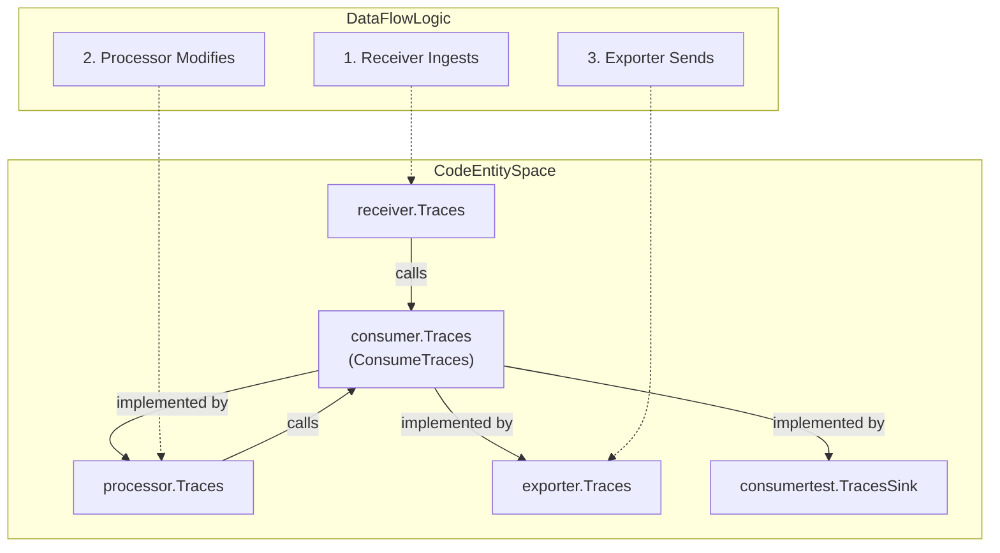

Sources: [consumer/consumer.go:12-45](), [receiver/receiver.go:15-40](), [processor/processor.go:14-36](), [exporter/exporter.go:15-31](), [consumer/consumertest/sink.go:31-40]()

## Internal Data Format (pdata)

All data within the pipeline is represented using the `pdata` format. Receivers are responsible for unmarshaling wire formats (like OTLP, Jaeger, or Prometheus) into `pdata` structures. Exporters then marshal `pdata` back into the required egress format.

| pdata Type | Signal | Package |
|------------|--------|---------|
| `ptrace.Traces` | Traces | `go.opentelemetry.io/collector/pdata/ptrace` |
| `pmetric.Metrics` | Metrics | `go.opentelemetry.io/collector/pdata/pmetric` |
| `plog.Logs` | Logs | `go.opentelemetry.io/collector/pdata/plog` |

Sources: [receiver/README.md:3-6](), [processor/README.md:38-41](), [consumer/go.mod:7-7]()

## Data Ownership and Mutability

The ownership of `pdata` is passed as data travels through the pipeline. This model is critical for performance and safety when data is shared across multiple pipelines or exporters.

### Exclusive vs. Shared Ownership

Ownership mode is determined at startup based on the `MutatesData` capability reported by processors.

1.  **Exclusive Ownership**: If a processor declares `MutatesData=true`, the pipeline operates in exclusive mode. Data is cloned at fan-out points to ensure the processor has a private copy to modify. [processor/README.md:58-79]()
2.  **Shared Ownership**: If no processors in the branch mutate data, they receive a shared reference. Processors must not modify the data in this mode. [processor/README.md:80-103]()

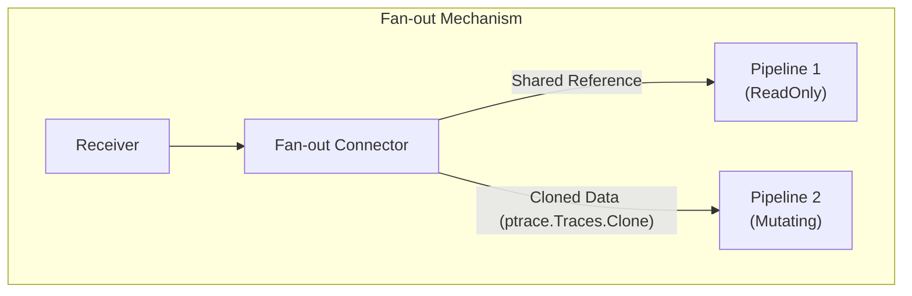

Sources: [processor/README.md:36-103](), [exporter/README.md:65-75]()

## Routing with Connectors

Connectors are special components that bridge two pipelines. They act as an **exporter** at the end of one pipeline and a **receiver** at the beginning of another. This allows for complex routing, such as generating metrics from spans.

| Connector Interface | Source Signal | Target Signal | Factory Method |
|---------------------|---------------|---------------|----------------|
| `connector.Traces` | Traces | Traces/Metrics/Logs | `CreateTracesToTraces`, etc. |
| `connector.Metrics`| Metrics | Traces/Metrics/Logs | `CreateMetricsToMetrics`, etc. |
| `connector.Logs` | Logs | Traces/Metrics/Logs | `CreateLogsToLogs`, etc. |

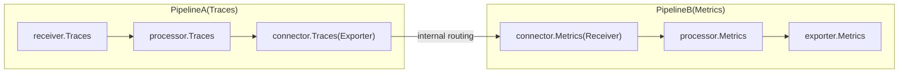

Sources: [connector/connector.go:16-62](), [connector/connector.go:93-103]()

## Shared Components

When a component needs to be reused across different signal types (e.g., an OTLP receiver handling both traces and metrics on the same port), the collector uses `internal/sharedcomponent`. This ensures that the underlying resource is started only once and shared by multiple pipeline instances.

### Lifecycle Management
The `sharedcomponent.Component` wrapper ensures that `Start` and `Shutdown` are called only once, regardless of how many pipelines use the component.

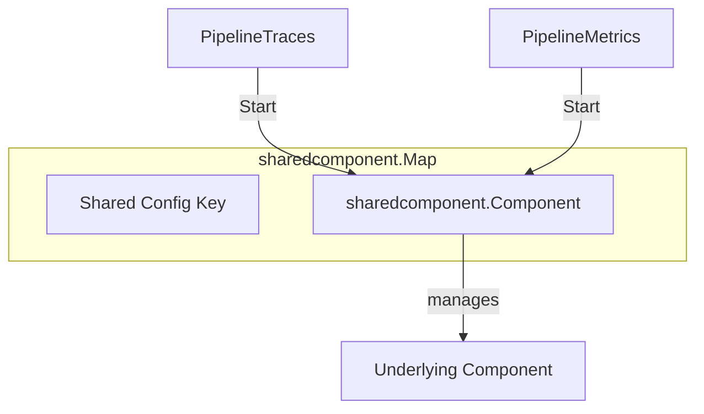

Sources: [internal/sharedcomponent/sharedcomponent.go:18-35](), [internal/sharedcomponent/sharedcomponent.go:73-95]()

---
**Sources:**
* [pipeline/pipeline.go:15-34]()
* [consumer/consumer.go:1-45]()
* [processor/README.md:1-115]()
* [exporter/README.md:1-88]()
* [receiver/README.md:1-68]()
* [connector/connector.go:1-160]()
* [internal/sharedcomponent/sharedcomponent.go:1-132]()

# Telemetry Data Model


## Purpose and Scope

This page documents the **pdata** package (`go.opentelemetry.io/collector/pdata`), which provides the internal telemetry data model used throughout the OpenTelemetry Collector. The pdata package defines vendor-agnostic, type-safe structures for representing traces, metrics, logs, and profiles. All telemetry data flowing through the collector pipeline is converted to and processed using these structures, ensuring consistent handling regardless of the original protocol or destination format. [pdata/go.mod:1-17]()

For information about how data flows through the collector pipeline, see [Pipeline and Data Flow](#2.3). For details on how components consume and produce pdata, see [Component Model](#2.1).

---

## Overview

The pdata package is the foundational data model of the OpenTelemetry Collector. It serves as the lingua franca for telemetry data, providing a protocol-agnostic internal representation that decouples receivers from exporters. This design allows any receiver to work with any exporter without requiring format-specific adapters.

### Key Characteristics

| Characteristic | Description |
|---------------|-------------|
| **Module Path** | `go.opentelemetry.io/collector/pdata` |
| **API Stability** | Stable (v1.x) for traces, metrics, and logs |
| **Generation** | Generated from OTLP protobuf definitions via `pdatagen` |
| **Memory Model** | Zero-copy where possible, with state-tracked mutability |
| **Thread Safety** | Not thread-safe; requires external synchronization |

**Sources:** [pdata/go.mod:1](), [pdata/pmetric/metrics.go:6-14]()

### Architecture Position

```mermaid
graph LR
    ["Receiver"] -->|"Converts to"| ["pdata"]
    ["pdata"] -->|"Flows to"| ["Processor"]
    ["Processor"] -->|"Transforms"| ["pdata"]
    ["pdata"] -->|"Flows to"| ["Exporter"]

    subgraph "External Protocols"
        ["OTLP"]
        ["Jaeger"]
        ["Prometheus"]
    end

    ["OTLP"] --> ["Receiver"]
    ["Jaeger"] --> ["Receiver"]
    ["Prometheus"] --> ["Receiver"]

    ["Exporter"] --> ["OTLP"]
```

**Sources:** [pdata/ptrace/json.go:27-41](), [pdata/pmetric/json.go:29-43](), [pdata/plog/json.go:29-43]()

---

## Module Structure

The pdata package is organized into signal-specific sub-packages. While traces, metrics, and logs are stable, profiles remain experimental and reside in the `pprofile` package.

```mermaid
graph TB
    ["pdata/pcommon"] -- "Shared Types" --> ["ptrace"]
    ["pdata/pcommon"] -- "Shared Types" --> ["pmetric"]
    ["pdata/pcommon"] -- "Shared Types" --> ["plog"]
    ["pdata/pcommon"] -- "Shared Types" --> ["pprofile"]

    subgraph "Signal Packages"
        ["ptrace"]
        ["pmetric"]
        ["plog"]
        ["pprofile"]
    end

    subgraph "Internal Utilities"
        ["pdata/internal"]
    end
```

**Sources:** [pdata/go.mod:1-17](), [pdata/pcommon/map.go:11-18](), [pdata/testdata/profile.go:9-11]()

---

## Signal Types

### 1. Traces (ptrace)
The `ptrace` package manages distributed tracing data. It handles `Traces`, `ResourceSpans`, `ScopeSpans`, and `Span` entities.
- **Marshaling**: Supports OTLP/JSON via `JSONMarshaler` which uses a borrowed stream for performance [pdata/ptrace/json.go:14-25]().
- **Unmarshaling**: Converts OTLP/JSON to `Traces` using `JSONUnmarshaler`. It supports a `DisallowUnknownFields` mode for strict OTLP schema validation [pdata/ptrace/json.go:28-41](), [pdata/ptrace/json_test.go:13-28]().
- **Migration**: Performs migration via `otlp.MigrateTraces` to handle legacy field formats during unmarshaling [pdata/ptrace/json.go:51-51]().

### 2. Metrics (pmetric)
The `pmetric` package supports complex metric structures including Gauges, Sums, Histograms, Exponential Histograms, and Summaries [pdata/pmetric/metrics.go:32-57]().
- **Counters**: Provides `MetricCount()` to count individual metrics and `DataPointCount()` to aggregate statistics across all metric types [pdata/pmetric/metrics.go:17-58]().
- **Read-Only State**: Supports `MarkReadOnly()` and `IsReadOnly()` to manage shared state in the pipeline, preventing illegal modifications [pdata/pmetric/metrics.go:6-14]().

### 3. Logs (plog)
The `plog` package represents structured log data. Like other signals, it follows the Resource -> Scope -> Record hierarchy.
- **Marshaling**: Uses `JSONMarshaler` for OTLP/JSON format [pdata/plog/json.go:14-25]().
- **Migration**: `JSONUnmarshaler` uses `otlp.MigrateLogs` to ensure compatibility with older OTLP formats during the unmarshaling process [pdata/plog/json.go:53-53]().

### 4. Profiles (pprofile) - Experimental
The `pprofile` package handles continuous profiling data. It uses a dictionary-based approach for efficient storage [pdata/testdata/profile.go:16-54]().
- **Dictionary**: Centralizes strings and attributes in `ProfilesDictionary` (via `StringTable` and `AttributeTable`) to reduce redundancy in `Sample` data via indices [pdata/testdata/profile.go:19-38](), [pdata/pprofile/string_table.go:1-10]().
- **Attributes**: Uses `FromAttributeIndices` to resolve attributes from the dictionary and `SetAttribute` to deduplicate attributes within the `KeyValueAndUnitSlice` [pdata/pprofile/attributes.go:15-40](), [pdata/pprofile/attributes_test.go:17-76]().
- **Batching**: Experimental support for merging and splitting profile requests exists in `xexporterhelper` via `ProfilesRequest` [exporter/exporterhelper/xexporterhelper/profiles_batch.go:1-20]().

**Sources:** [pdata/pmetric/metrics.go:17-58](), [pdata/ptrace/json.go:14-41](), [pdata/testdata/profile.go:16-54](), [pdata/pprofile/attributes.go:15-40]()

---

## Common Types (pcommon)

The `pcommon` package defines the fundamental building blocks used by all signals.

### Map and Value
`pcommon.Map` is a high-performance wrapper around a slice of key-value pairs (`internal.KeyValue`) [pdata/pcommon/map.go:14-24]().
- **Type Safety**: Supports specialized setters like `PutStr`, `PutInt`, `PutDouble`, `PutBool`, and `PutEmptyBytes` [pdata/pcommon/map.go:138-200]().
- **Mutability**: Methods like `Clear`, `Remove`, and `PutEmpty` check for mutability using `m.getState().AssertMutable()` to prevent illegal modifications to read-only data [pdata/pcommon/map.go:39-42, 78-81, 114-117]().
- **Raw Access**: Provides `AsRaw()` and `FromRaw()` to convert between pdata types and standard Go types [pdata/pcommon/value_test.go:74-74](), [pdata/pcommon/map_test.go:93-94]().

### Timestamps
Timestamps are represented as `pcommon.Timestamp` (uint64 nanoseconds since the Unix epoch). Helper functions like `NewTimestampFromTime` bridge standard Go `time.Time` to pdata [pdata/testdata/profile.go:13-13](), [pdata/pmetric/metrics_test.go:18-21]().

**Sources:** [pdata/pcommon/map.go:14-200](), [pdata/pcommon/value.go:1-30](), [pdata/pmetric/metrics_test.go:18-21]()

---

## Implementation Details

### The pdata Internal Wrapper
pdata uses an internal wrapper pattern to bridge the gap between user-facing Go interfaces and the underlying OTLP protobuf messages. This is managed via the `internal` package which tracks object state.

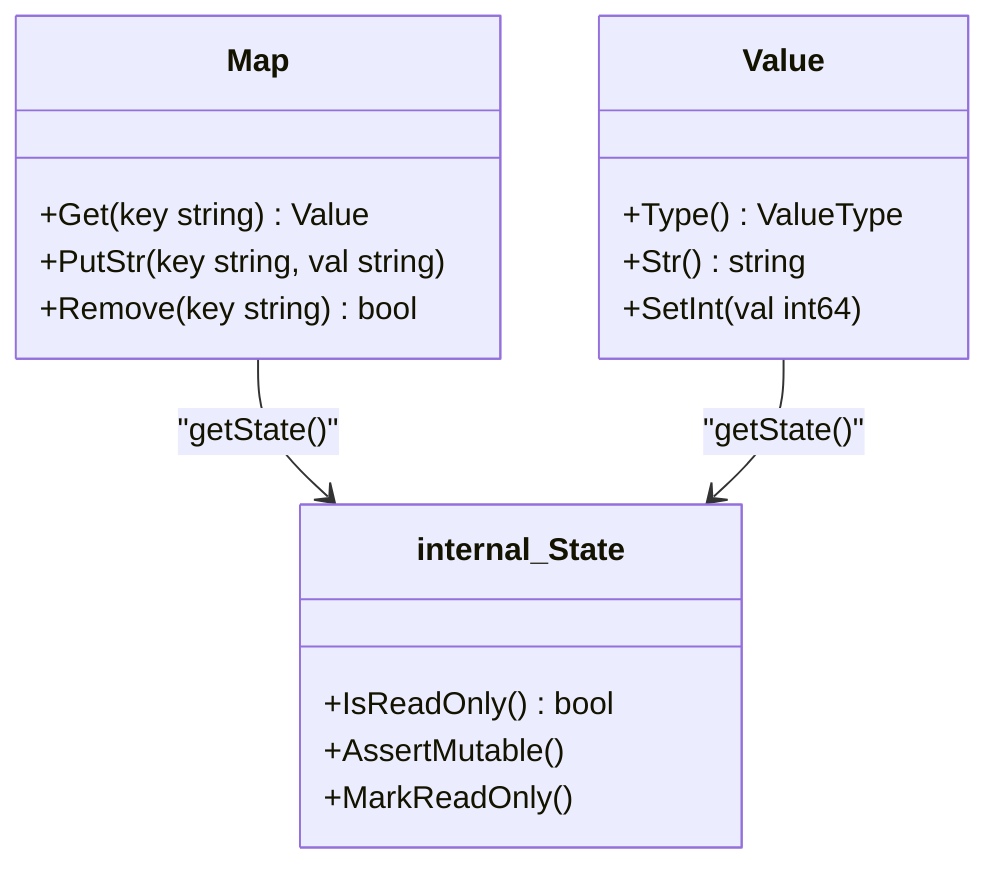

**Sources:** [pdata/pcommon/map.go:18-32](), [pdata/pcommon/value_test.go:48-76](), [pdata/pmetric/metrics.go:6-14]()

### Marshaling and Encoding
pdata supports both Protobuf and JSON encoding for wire transport.
- **JSON**: Implemented using `github.com/json-iterator/go` for high performance, utilizing a pool of streams and iterators [pdata/go.mod:6](), [pdata/ptrace/json.go:18-33]().
- **Protobuf**: Uses `google.golang.org/protobuf` and `go.opentelemetry.io/proto/slim/otlp` [pdata/go.mod:10, 16]().

### Merge and Split Logic
Data is often filtered or merged during transit. The `MergeSplit` functionality (experimental for profiles) allows combining or partitioning telemetry payloads based on item count or byte size. This is utilized by `profilesBatch` to manage memory and network efficiency [exporter/exporterhelper/xexporterhelper/profiles_batch.go:20-40](), [exporter/exporterhelper/xexporterhelper/profiles_batch_test.go:35-138]().

**Sources:** [pdata/go.mod:6-16](), [pdata/ptrace/json.go:14-41](), [exporter/exporterhelper/xexporterhelper/profiles_batch.go:1-50]()

---

## Data Flow and Instrumentation

When data passes through the collector, it is instrumented for observability. Components consume pdata signals via standard interfaces.

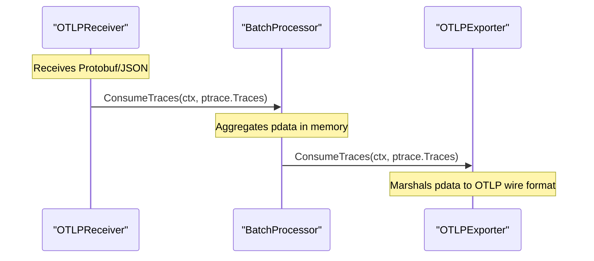

**Sources:** [pdata/ptrace/json.go:14-41](), [pdata/pmetric/metrics.go:17-29](), [service/internal/graph/obs_test.go:174-192]()

# Configuration System


## Overview

The Configuration System is implemented in the `confmap` package and provides the foundation for loading, merging, and monitoring collector configuration. It orchestrates configuration retrieval from multiple sources (files, environment variables, remote endpoints), performs URI expansion for dynamic values using `${scheme:opaque}` syntax, and supports hot-reload through configuration watching.

**Core responsibilities:**
- **Multi-source configuration loading**: Merge configs from multiple URIs via pluggable Providers [confmap/resolver.go:68-70]().
- **URI expansion**: Resolve `${scheme:opaque}` references recursively [confmap/expand.go:28-40]().
- **Type-safe unmarshaling**: Convert raw config maps to typed structs using `mapstructure` [confmap/confmap.go:30-31]().
- **Dynamic updates**: Watch providers for changes and trigger re-resolution [confmap/resolver.go:71-80]().
- **Extensible transformation**: Apply Converters for migration or validation [confmap/resolver.go:203-207]().

The `confmap.Resolver` serves as the central orchestrator, coordinating Providers (data sources), performing URI expansion, and applying Converters (transformers) to produce a final `confmap.Conf` that the service layer unmarshals into component configurations [confmap/confmap.go:29-31]().

**Related pages:**
- For details on retrieval and merging, see [Configuration Resolution and Providers](#3.1).
- For details on substitution and hot-reloading, see [URI Expansion and Dynamic Configuration](#3.2).
- For details on shared network structures, see [Protocol Configuration](#3.3).

**Sources:** [confmap/README.md:1-95](), [confmap/confmap.go:1-52](), [confmap/resolver.go:1-160]()

---

## Architecture Components

The configuration system is structured around four primary layers:

**System Architecture Diagram**
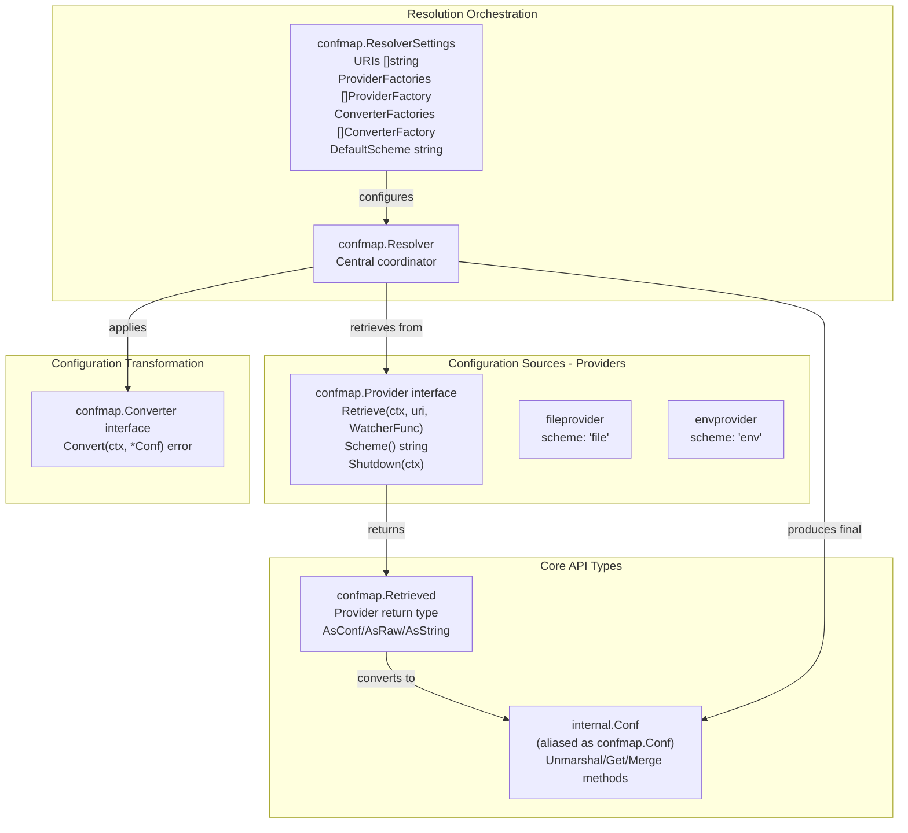

**Key Types and Their Roles:**

| Type | Module | Purpose |
|------|--------|---------|
| `confmap.Resolver` | [confmap/resolver.go:24-36]() | Orchestrates Providers and Converters to produce final config. |
| `confmap.Conf` | [confmap/confmap.go:31]() | Wraps raw configuration data with unmarshal/merge capabilities. |
| `confmap.Provider` | [confmap/provider.go:54-94]() | Interface for retrieving config from a source (file, env, etc.). |
| `confmap.Retrieved` | [confmap/provider.go:108-116]() | Wraps retrieved data with type conversion methods. |
| `confmap.Converter` | [confmap/converter.go]() | Interface for transforming/validating configuration. |
| `confmap.ResolverSettings` | [confmap/resolver.go:39-67]() | Settings for creating a Resolver (URIs, factories, defaults). |

**Sources:** [confmap/confmap.go:1-31](), [confmap/resolver.go:24-160](), [confmap/provider.go:54-116](), [confmap/README.md:13-95]()

---

## Configuration Data Types

### Conf

The `Conf` type represents the raw configuration map for the collector. It provides methods for accessing, merging, and unmarshaling configuration data. It is internally defined in the `internal` package and aliased in the public API [confmap/confmap.go:31]().

| Type | File | Key Methods | Purpose |
|------|------|-------------|---------|
| `Conf` | [confmap/confmap.go:31]() | `Unmarshal()`, `Get()`, `Merge()`, `ToStringMap()` | Container for configuration data. |
| `UnmarshalOption` | [confmap/confmap.go:33]() | `WithIgnoreUnused()` | Customizes unmarshaling behavior. |
| `Unmarshaler` | [confmap/confmap.go:44-46]() | `Unmarshal(*Conf)` | Custom type unmarshaling. |
| `Marshaler` | [confmap/confmap.go:48-51]() | `Marshal(*Conf)` | Custom type marshaling. |

Key constants:
- **KeyDelimiter**: `"::"` - Default separator for nested keys [confmap/confmap.go:13]().
- **MapstructureTag**: `"mapstructure"` - Struct field tag for marshaling [confmap/confmap.go:17]().

**Sources:** [confmap/confmap.go:1-52](), [confmap/internal/mapstructure/encoder.go:1-25]()

### Retrieved

The `Retrieved` type wraps data retrieved from a provider and provides conversion methods [confmap/provider.go:108-116]():

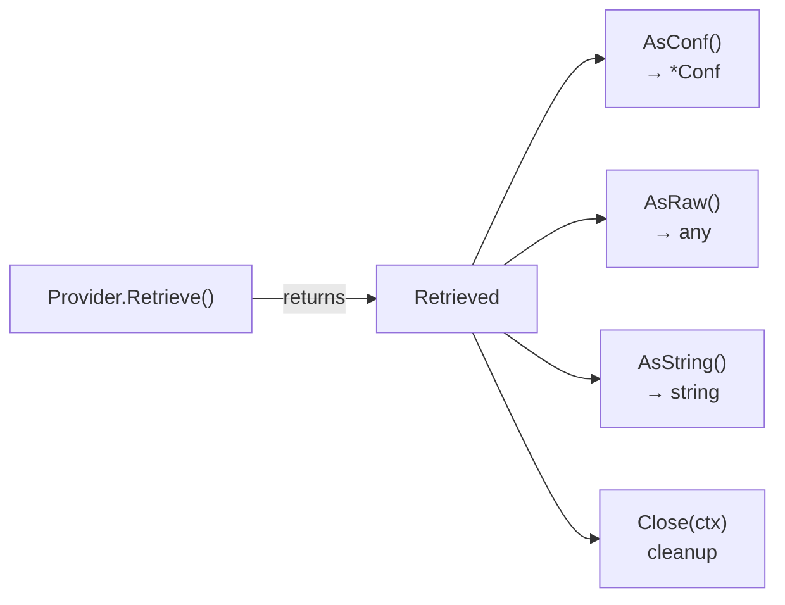

**Sources:** [confmap/provider.go:108-181](), [confmap/README.md:19-27]()

---

## Provider Interface

Providers retrieve configuration from different sources. Each provider has a unique scheme that identifies it in URIs [confmap/provider.go:80]().

### Provider Contract

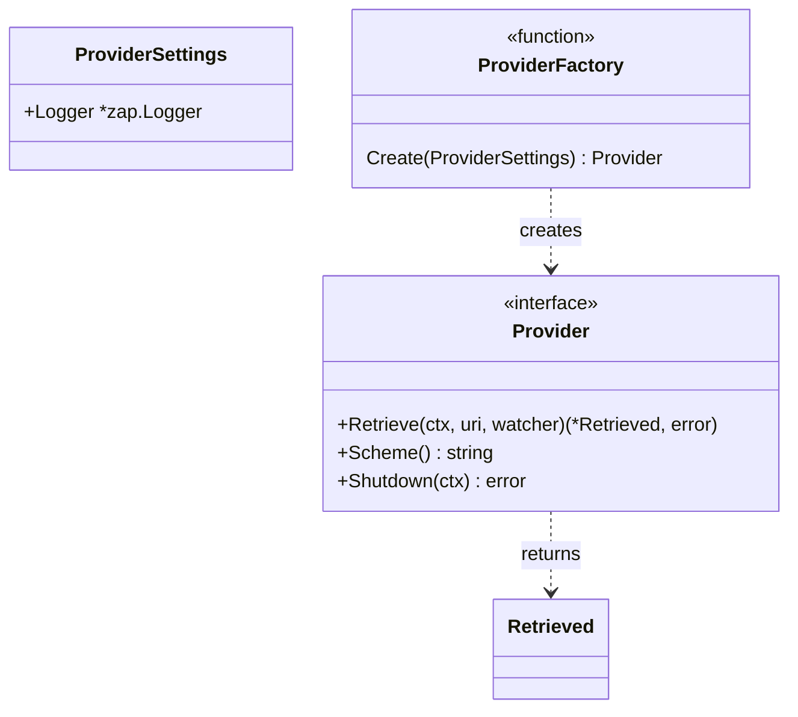

**Key Requirements:**
- **Scheme format**: Must consist of letters, digits, `+`, `.`, or `-`, and be at least 2 characters long [confmap/provider.go:61-66]().
- **URI format**: `<scheme>:<opaque_data>` compatible with RFC 3986 [confmap/provider.go:59-60]().
- **Watcher callback**: Called when configuration changes [confmap/provider.go:69-73]().
- **Shutdown guarantee**: Must stop goroutines calling watcher and release resources [confmap/provider.go:82-93]().

**Sources:** [confmap/provider.go:15-94](), [confmap/resolver.go:106-120]()

---

## Resolver: Configuration Resolution

The `Resolver` orchestrates the entire configuration loading process by coordinating providers, merging configurations, and applying converters [confmap/resolver.go:69-85]().

### Resolver Creation

```go
// From confmap/resolver.go:39-67
type ResolverSettings struct {
    URIs               []string           // Config source URIs
    ProviderFactories  []ProviderFactory  // Provider factories
    DefaultScheme      string             // Default for ${} expansion
    ProviderSettings   ProviderSettings   // Settings for providers
    ConverterFactories []ConverterFactory // Converter factories
    ConverterSettings  ConverterSettings  // Settings for converters
}
```

**Sources:** [confmap/resolver.go:39-67](), [confmap/resolver.go:88-160]()

### Resolution Flow

The `confmap.Resolver.Resolve()` method executes a multi-stage pipeline [confmap/resolver.go:164-208]():

1. **Retrieve & Merge** [confmap/resolver.go:171-186]():
   - Call `retrieveValue()` for each URI in `mr.uris`.
   - Convert `Retrieved` to `*Conf` via `AsConf()`.
   - Merge into result using `retMap.Merge(retCfgMap)`.

2. **Capture Unexpanded State** [confmap/resolver.go:189]():
   - Stores the merged map before URI expansion in `mr.unexpandedConfMap`.

3. **Recursive URI Expansion** [confmap/resolver.go:191-200]():
   - For each key, call `expandValueRecursively()`.
   - Find `${scheme:opaque}` patterns and retrieve values.

4. **Converter Application** [confmap/resolver.go:203-207]():
   - Apply each `Converter.Convert()` in order to allow transformations.

For deep technical details on how providers are prioritized and merged, see [Configuration Resolution and Providers](#3.1).

**Sources:** [confmap/resolver.go:164-208](), [confmap/README.md:87-95]()

---

## URI Expansion Mechanism

The configuration system supports dynamic variable substitution using `${scheme:opaque}` syntax. This allows referencing values from different providers within configuration files [confmap/README.md:46-49]().

### Expansion Syntax

| Pattern | Behavior | Example |
|---------|----------|---------|
| `${scheme:value}` | Explicit scheme | `${env:PORT}` |
| `${value}` | Default scheme (if set) | `${PORT}` with `DefaultScheme: "env"` |
| `$$` | Escape to single `$` | `$$VAR` → `$VAR` |

**Key Expansion Logic:**
- **Recursive resolution**: Expansion happens recursively until no more `${}` patterns remain, limited to a depth of 1000 to prevent infinite loops [confmap/expand.go:28-40]().
- **Escaping**: Odd numbers of `$` preceding `${` indicate an escaped expansion [confmap/expand.go:128-143]().
- **Provider lookup**: The `Resolver` uses the `scheme` part of the expansion to select the appropriate `Provider` [confmap/expand.go:189-211]().

For details on recursive expansion and escaping rules, see [URI Expansion and Dynamic Configuration](#3.2).

**Sources:** [confmap/expand.go:1-229](), [confmap/resolver.go:184-201]()

---

## Configuration Watching and Hot-Reload

The Resolver supports watching for configuration changes, enabling hot-reload without collector restart [confmap/resolver.go:75-83]().

**Resolver Methods:**
- `Watch()`: Returns a channel that signals configuration changes or errors from providers.
- `Shutdown()`: Closes all closers associated with retrieved values and terminates watchers [confmap/provider.go:82-93]().
- `WatcherFunc`: Callback invoked by Providers when a configuration source changes [confmap/provider.go:96-105]().

For details on how to implement watchers in providers and handle reload events, see [URI Expansion and Dynamic Configuration](#3.2).

**Sources:** [confmap/resolver.go:24-36](), [confmap/provider.go:39-105](), [confmap/README.md:177-223]()

---

## Protocol Configuration

The configuration system provides shared structures for standard protocols like gRPC and HTTP. These are used across receivers and exporters to ensure consistent configuration of TLS, timeouts, and authentication.

The unmarshaling logic for these structures relies on `mapstructure` tags [confmap/confmap.go:15-17]() and the `Encoder` which processes various `reflect.Kind` types including structs, maps, and slices [confmap/internal/mapstructure/encoder.go:61-75]().

For details on these shared structures, see [Protocol Configuration](#3.3).

**Sources:** [confmap/internal/mapstructure/encoder.go:1-133](), [confmap/confmap.go:17]()

# Configuration Resolution and Providers


## Overview

The configuration resolution system is the core mechanism for loading, processing, and monitoring OpenTelemetry Collector configurations. The `confmap.Resolver` type in [confmap/resolver.go:24-36]() orchestrates the entire resolution process by:

1.  **Retrieving** configuration from multiple URIs via `Provider` instances.
2.  **Merging** configurations from multiple sources in order.
3.  **Expanding** embedded URI references using `${scheme:uri}` syntax.
4.  **Transforming** the merged configuration via `Converter` instances.
5.  **Watching** for configuration changes and notifying consumers.

**Natural Language to Code Entity Space: Resolver Components**

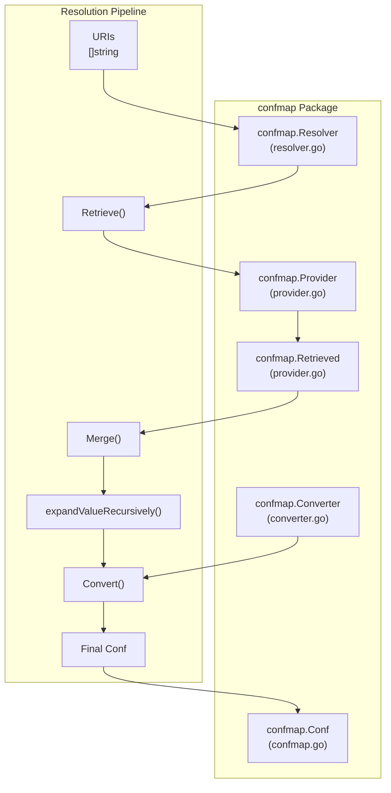

Sources: [confmap/resolver.go:24-36](), [confmap/provider.go:54-94]()

## Resolver Lifecycle

The `Resolver` follows a create-resolve-watch-shutdown lifecycle managed by four primary methods:

| Method | Purpose | File Reference |
| :--- | :--- | :--- |
| `NewResolver(ResolverSettings)` | Creates and validates a new Resolver | [confmap/resolver.go:88-160]() |
| `Resolve(context.Context)` | Resolves configuration from all sources | [confmap/resolver.go:164-210]() |
| `Watch()` | Returns channel for change notifications | [confmap/resolver.go:244-246]() |
| `Shutdown(context.Context)` | Closes providers and terminates watch | [confmap/resolver.go:252-262]() |

### Resolver Creation

The `NewResolver()` function in [confmap/resolver.go:88-160]() creates a new `Resolver` instance with validation:

```go
type ResolverSettings struct {
	URIs []string
	ProviderFactories []ProviderFactory
	DefaultScheme string
	ProviderSettings ProviderSettings
	ConverterFactories []ConverterFactory
	ConverterSettings ConverterSettings
}
```

**Key validation steps:**
*   At least one URI must be provided [confmap/resolver.go:89-91]().
*   At least one `ProviderFactory` must be provided [confmap/resolver.go:93-95]().
*   Provider schemes must match the pattern `[A-Za-z][A-Za-z0-9+.-]+` [confmap/resolver.go:110-112]().
*   Provider schemes must be unique [confmap/resolver.go:114-116]().
*   If `DefaultScheme` is set, it must exist in the providers list [confmap/resolver.go:121-126]().

URIs are normalized to support backwards compatibility:
*   Empty scheme defaults to `file` [confmap/resolver.go:139-142]().
*   Windows drive letters (e.g., `C:\path`) are treated as `file:` scheme via `driverLetterRegexp` [confmap/resolver.go:21](), [confmap/resolver.go:139-142]().

Sources: [confmap/resolver.go:21-22](), [confmap/resolver.go:38-67](), [confmap/resolver.go:88-160]()

### Resolution Process

The `Resolve(ctx context.Context)` method in [confmap/resolver.go:164-210]() performs a five-phase resolution process:

**Code Entity Space: Resolve() Flow**

```mermaid
flowchart TD
    Start["mr.Resolve(ctx)"] --> Phase1["Phase 1: Cleanup"]

    Phase1 --> CloseOld["mr.closeIfNeeded(ctx)"]
    CloseOld --> Phase2["Phase 2: Retrieve & Merge"]

    Phase2 --> InitMap["retMap = confmap.New()"]
    InitMap --> LoopURIs["for _, uri := range mr.uris"]
    LoopURIs --> Retrieve["mr.retrieveValue(ctx, uri)"]
    Retrieve --> AsConf["ret.AsConf()"]
    AsConf --> Merge["retMap.Merge(retCfgMap)"]
    Merge --> StoreCloser["mr.closers = append(...)"]
    StoreCloser --> NextURI{More URIs?}
    NextURI -->|Yes| LoopURIs
    NextURI -->|No| Phase3["Phase 3: Expand References"]

    Phase3 --> Capture["mr.unexpandedConfMap = retMap.ToStringMap()"]
    Capture --> BuildMap["cfgMap = make(map[string]any)"]
    BuildMap --> LoopKeys["for _, k := range retMap.AllKeys()"]
    LoopKeys --> GetValue["ug = internal.UnsanitizedGetter{Conf: retMap}"]
    GetValue --> Expand["mr.expandValueRecursively(ctx, ug.UnsanitizedGet(k))"]
    Expand --> Escape["escapeDollarSigns(val)"]
    Escape --> SetValue["cfgMap[k] = val"]
    SetValue --> NextKey{More keys?}
    NextKey -->|Yes| LoopKeys
    NextKey -->|No| NewMap["retMap = NewFromStringMap(cfgMap)"]

    NewMap --> Phase4["Phase 4: Apply Converters"]
    Phase4 --> LoopConv["for _, confConv := range mr.converters"]
    LoopConv --> Convert["confConv.Convert(ctx, retMap)"]
    Convert --> NextConv{More converters?}
    NextConv -->|Yes| LoopConv
    NextConv -->|No| Phase5["Phase 5: Return"]

    Phase5 --> Return["return retMap, nil"]
```

**Phase Details:**

| Phase | Function Calls | Purpose |
| :--- | :--- | :--- |
| **1. Cleanup** | `closeIfNeeded(ctx)` [confmap/resolver.go:166-168]() | Close watchers and resources from previous `Resolve()` call. |
| **2. Retrieve & Merge** | `retrieveValue()` → `Merge()` [confmap/resolver.go:171-186]() | Fetch from each URI and merge into `retMap`. |
| **3. Expand References** | `expandValueRecursively()` [confmap/resolver.go:188-200]() | Expand all `${}` references recursively. |
| **4. Apply Converters** | `Convert(ctx, retMap)` [confmap/resolver.go:203-207]() | Apply transformation pipeline (e.g., config migration). |
| **5. Return** | Return `*Conf` [confmap/resolver.go:209]() | Final configuration ready for unmarshaling. |

**Key Implementation Details:**

*   `retrieveValue()` [confmap/resolver.go:277-283]() looks up the provider by scheme and calls `Provider.Retrieve()`.
*   The `unexpandedConfMap` is captured before expansion [confmap/resolver.go:189]() to store the raw state with provider references intact.
*   `internal.UnsanitizedGetter` [confmap/resolver.go:193]() is used to preserve original types during expansion to avoid YAML auto-casting issues.
*   `escapeDollarSigns()` [confmap/resolver.go:212-235]() converts `$$` to `$` after expansion completes.

Sources: [confmap/resolver.go:164-235](), [confmap/resolver.go:277-283]()

## Configuration Providers

The `Provider` interface [confmap/provider.go:54-94]() is responsible for retrieving raw configuration data.

### Available Providers

The collector includes several built-in providers:
*   **file**: Loads configuration from local files [confmap/provider/fileprovider/go.mod]().
*   **env**: Retrieves values from environment variables. Supports `${env:VAR_NAME}` and `${env:VAR_NAME:-default}` [confmap/provider/envprovider/provider.go:30-36]().
*   **http / https**: Fetches configuration via HTTP/S requests [confmap/provider/httpprovider/go.mod](), [confmap/provider/httpsprovider/go.mod]().
*   **yaml**: Allows providing configuration as a YAML string [confmap/provider/yamlprovider/provider.go]().

### The Provider Interface

```go
type Provider interface {
	Retrieve(ctx context.Context, uri string, watcher WatcherFunc) (*Retrieved, error)
	Scheme() string
	Shutdown(ctx context.Context) error
}
```

The `Retrieve` method [confmap/provider.go:77]() returns a `Retrieved` object. `Retrieved` can be created from raw types using `NewRetrieved` [confmap/provider.go:181-198]() or from YAML bytes using `NewRetrievedFromYAML` [confmap/provider.go:159-179]().

The `env` provider specifically validates variable names against a regex [confmap/provider/envprovider/provider.go:52-54]() and logs warnings for unset variables [confmap/provider/envprovider/provider.go:68]().

Sources: [confmap/provider.go:54-198](), [confmap/provider/envprovider/provider.go:24-83]()

## Watch Mechanism

The `Resolver` supports monitoring configuration sources for changes through a `WatcherFunc` callback [confmap/provider.go:96]().

**Watch Notification Flow**

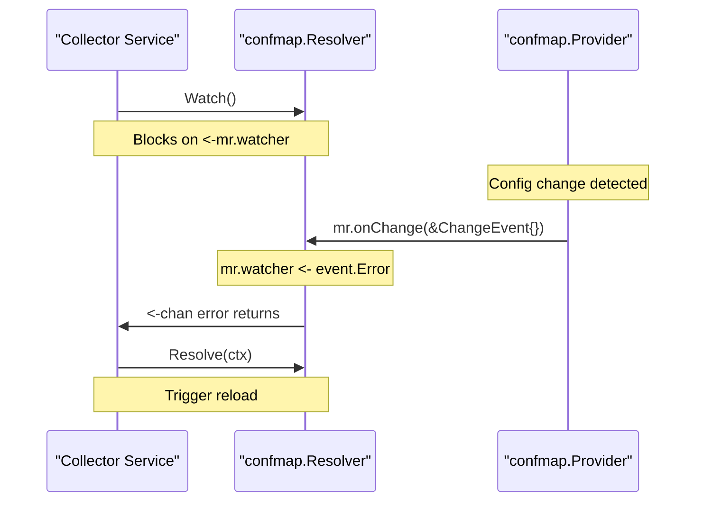

**Implementation Details:**
*   **Registration**: The `Resolver` passes its internal `onChange` callback to `Provider.Retrieve` [confmap/resolver.go:280]().
*   **Notification**: When a provider detects a change, it calls the `WatcherFunc` [confmap/provider.go:77](). The resolver then pushes the error (or `nil`) into the `mr.watcher` channel [confmap/resolver.go:265]().
*   **Cleanup**: Before a new resolution, `closeIfNeeded` [confmap/resolver.go:268-275]() is called to execute the `CloseFunc` of all previously retrieved configurations, allowing providers to stop their respective watch goroutines.

Sources: [confmap/resolver.go:244-283](), [confmap/provider.go:77-105]()

## Key Data Structures

### Resolver
```go
type Resolver struct {
	uris          []location
	providers     map[string]Provider
	defaultScheme string
	converters    []Converter
	closers []CloseFunc
	watcher chan error
	unexpandedConfMap map[string]any
}
```
*   `unexpandedConfMap`: Holds the merged configuration captured during the most recent `Resolve` call before provider/env-var references were expanded [confmap/resolver.go:35]().

### Retrieved
```go
type Retrieved struct {
	rawConf   any
	errorHint error
	closeFunc CloseFunc
	stringRepresentation string
	isSetString          bool
}
```
`Retrieved` objects provide `AsConf()` [confmap/provider.go:203]() to convert the raw data into a `confmap.Conf` for merging.

Sources: [confmap/resolver.go:24-36](), [confmap/provider.go:108-115]()