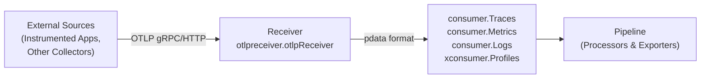
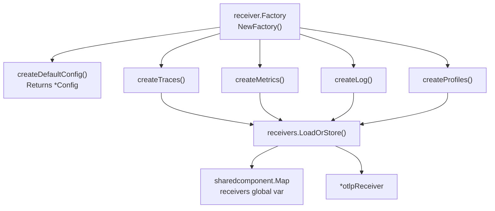
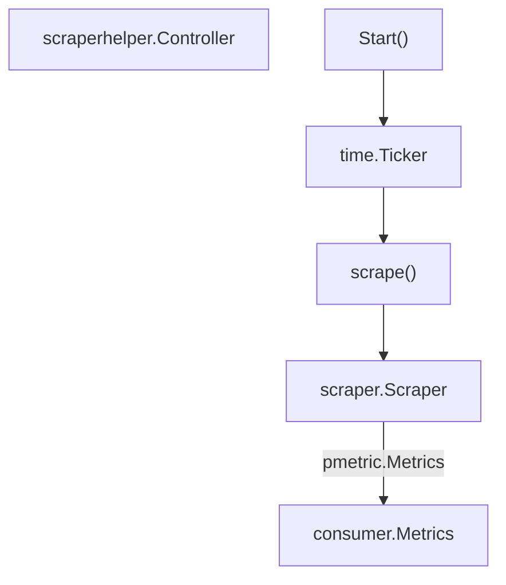
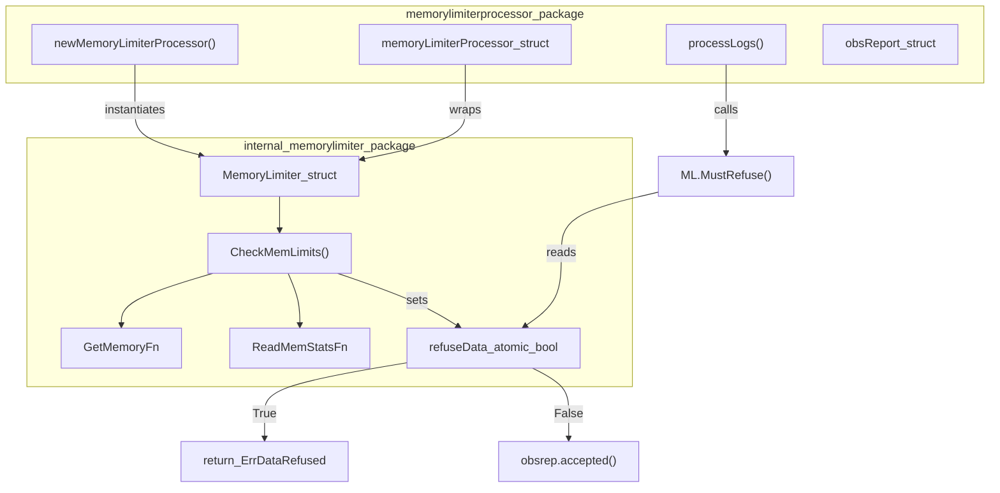
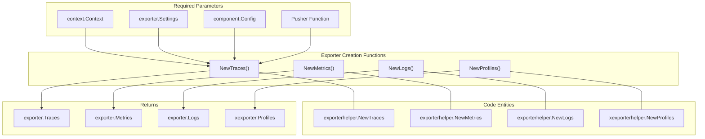
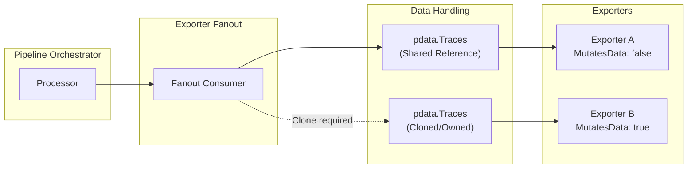
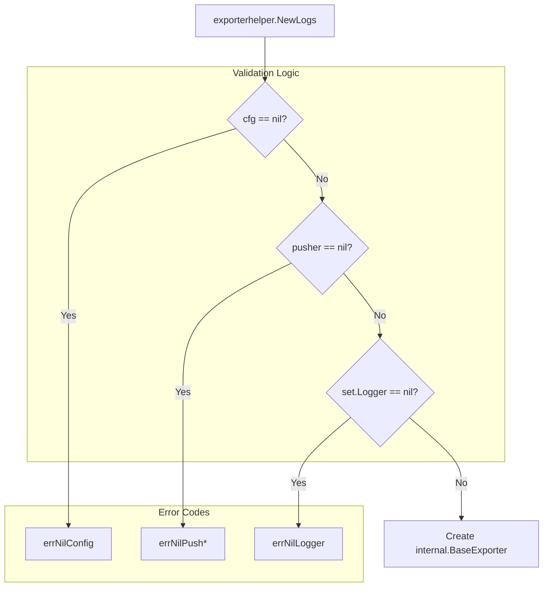

Receivers are the entry point for telemetry data into the OpenTelemetry Collector. A receiver accepts data in a specific format (e.g., OTLP, Jaeger, Prometheus), translates it into the collector's internal `pdata` format, and passes it to processors and exporters defined in the configured pipelines. This page documents the receiver component system and focuses on the OTLP receiver implementation in the core collector.

For information about the broader component model and lifecycle, see [Component Model](). For details on the internal data format used by receivers, see [Telemetry Data Model](). For information about exporting data out of the collector, see [Exporters]().

## Overview

The core collector repository contains one primary receiver: the OTLP receiver ([receiver/otlpreceiver/]()), which accepts telemetry data via the OpenTelemetry Protocol. Additional receivers are available in the [collector-contrib](https://github.com/open-telemetry/opentelemetry-collector-contrib) repository.

### Receiver Role in Pipeline



**Sources:** [receiver/otlpreceiver/otlp.go:35-50]()

## OTLP Receiver

The OTLP receiver (`otlpreceiver`) accepts telemetry data via the OpenTelemetry Protocol over both gRPC and HTTP transports. It supports all four signal types: traces, metrics, logs, and profiles.

### Supported Protocols and Transports

| Transport | Protocol | Default Endpoint | URL Path |
|-----------|----------|------------------|----------|
| gRPC | OTLP/gRPC | `localhost:4317` | N/A (gRPC service) |
| HTTP | OTLP/HTTP | `localhost:4318` | `/v1/traces`, `/v1/metrics`, `/v1/logs`, `/v1development/profiles` |

**Sources:** [receiver/otlpreceiver/factory.go:22-27](), [receiver/otlpreceiver/factory.go:42-54]()

### OTLP Receiver Architecture

The `otlpReceiver` struct manages both gRPC and HTTP servers simultaneously. It maintains references to the next consumers in the pipeline for each signal type.

```mermaid
graph TB
    subgraph "otlpreceiver.otlpReceiver"
        Config["cfg *Config"]
        GRPCServer["serverGRPC *grpc.Server"]
        HTTPServer["serverHTTP *http.Server"]

        NextTraces["nextTraces consumer.Traces"]
        NextMetrics["nextMetrics consumer.Metrics"]
        NextLogs["nextLogs consumer.Logs"]
        NextProfiles["nextProfiles xconsumer.Profiles"]

        ObsrepGRPC["obsrepGRPC *receiverhelper.ObsReport"]
        ObsrepHTTP["obsrepHTTP *receiverhelper.ObsReport"]
    end

    subgraph "gRPC Handlers"
        TraceGRPC["trace.New()<br/>ptraceotlp.RegisterGRPCServer"]
        MetricGRPC["metrics.New()<br/>pmetricotlp.RegisterGRPCServer"]
        LogGRPC["logs.New()<br/>plogotlp.RegisterGRPCServer"]
        ProfileGRPC["profiles.New()<br/>pprofileotlp.RegisterGRPCServer"]
    end

    subgraph "HTTP Handlers"
        TraceHTTP["handleTraces()<br/>HTTP POST handler"]
        MetricHTTP["handleMetrics()<br/>HTTP POST handler"]
        LogHTTP["handleLogs()<br/>HTTP POST handler"]
        ProfileHTTP["handleProfiles()<br/>HTTP POST handler"]
    end

    GRPCServer --> TraceGRPC
    GRPCServer --> MetricGRPC
    GRPCServer --> LogGRPC
    GRPCServer --> ProfileGRPC

    HTTPServer --> TraceHTTP
    HTTPServer --> MetricHTTP
    HTTPServer --> LogHTTP
    HTTPServer --> ProfileHTTP

    TraceGRPC --> NextTraces
    MetricGRPC --> NextMetrics
    LogGRPC --> NextLogs
    ProfileGRPC --> NextProfiles

    TraceHTTP --> NextTraces
    MetricHTTP --> NextMetrics
    LogHTTP --> NextLogs
    ProfileHTTP --> NextProfiles
```



**Sources:** [receiver/otlpreceiver/otlp.go:35-50](), [receiver/otlpreceiver/otlp.go:88-128](), [receiver/otlpreceiver/otlp.go:130-183]()

## Receiver Factory Pattern

Receivers use a factory pattern for instantiation. The factory creates receiver instances based on configuration and signal type requirements. The OTLP factory is created via `xreceiver.NewFactory` [receiver/otlpreceiver/factory.go:31-38]().

### Factory Implementation

The factory uses `sharedcomponent.Map` to ensure that multiple pipeline signal types (traces, metrics, logs, profiles) share the same receiver instance when configured with identical settings. This prevents opening duplicate network listeners.



**Sources:** [receiver/otlpreceiver/factory.go:29-39](), [receiver/otlpreceiver/factory.go:69-155](), [receiver/otlpreceiver/factory.go:163]()

## Receiver Lifecycle

Receivers implement the `component.Component` interface with `Start()` and `Shutdown()` methods.

### Lifecycle Sequence

1.  **Start**: The `Start` method [receiver/otlpreceiver/otlp.go:187-199]() initializes the gRPC and HTTP servers.
2.  **gRPC Initialization**: `startGRPCServer` [receiver/otlpreceiver/otlp.go:88-128]() uses `configgrpc.ServerConfig.ToServer` to create the server and registers signal-specific handlers like `ptraceotlp.RegisterGRPCServer`.
3.  **HTTP Initialization**: `startHTTPServer` [receiver/otlpreceiver/otlp.go:130-183]() sets up an `http.NewServeMux` and registers routes for each signal (e.g., `handleTraces`).
4.  **Shutdown**: `Shutdown` [receiver/otlpreceiver/otlp.go:202-215]() gracefully stops the HTTP server and gRPC server, waiting for all goroutines to finish via `shutdownWG`.

**Sources:** [receiver/otlpreceiver/otlp.go:88-215]()

## Configuration

The OTLP receiver configuration is defined in the `Config` struct, which contains protocol-specific settings for gRPC and HTTP.

### Configuration Structure

The configuration supports optional gRPC and HTTP blocks.

```go
type Config struct {
	Protocols Protocols `mapstructure:"protocols"`
}

type Protocols struct {
	GRPC configoptional.Optional[configgrpc.ServerConfig] `mapstructure:"grpc"`
	HTTP configoptional.Optional[HTTPConfig]              `mapstructure:"http"`
}
```

**Sources:** [receiver/otlpreceiver/config.go:54-67]()

### Default Configuration

| Setting | Default Value |
|---------|---------------|
| `grpc.endpoint` | `localhost:4317` |
| `grpc.read_buffer_size` | `512 KB` |
| `http.endpoint` | `localhost:4318` |
| `http.traces_url_path` | `/v1/traces` |
| `http.metrics_url_path` | `/v1/metrics` |
| `http.logs_url_path` | `/v1/logs` |

**Sources:** [receiver/otlpreceiver/factory.go:42-66]()

## HTTP Data Handling

The HTTP transport handles OTLP requests by unmarshaling payloads (JSON or Protobuf) and invoking signal receivers.

### HTTP Processing Flow

1.  **Content-Type Detection**: Handlers check for `application/x-protobuf` or `application/json` headers via `readContentType` [receiver/otlpreceiver/otlphttp.go:153-168]().
2.  **Unmarshaling**: Handlers unmarshal the request body into signal types like `ptraceotlp.ExportRequest` [receiver/otlpreceiver/otlphttp.go:40-44]().
3.  **Export**: The request is passed to the signal-specific consumer (e.g., `NextTraces`) via `Export` calls [receiver/otlpreceiver/otlphttp.go:46-50]().
4.  **Response**: The response is marshaled and written back with appropriate status codes. Errors are handled via `writeError` [receiver/otlpreceiver/otlphttp.go:184-192]() which converts errors to OTLP-compliant `rpc.Status` messages.

**Sources:** [receiver/otlpreceiver/otlphttp.go:29-58](), [receiver/otlpreceiver/otlphttp.go:153-211]()

## Observability

The OTLP receiver uses `receiverhelper.ObsReport` to emit standardized metrics and traces for both gRPC and HTTP transports.

### Metrics and Telemetry

- **ObsReport Initialization**: Two reports are created during receiver instantiation, one for each transport [receiver/otlpreceiver/otlp.go:68-83]().
- **ObsReport Utility**: The `receiverhelper.NewObsReport` creates a helper that tracks accepted/refused items and request counts [receiver/receiverhelper/obsreport.go:31-40]().
- **Internal Telemetry**: The `receiverhelper` package defines metrics for monitoring receiver performance, including accepted and dropped counts for spans, metric points, and log records [receiver/receiverhelper/obsreport.go:42-60]().

**Sources:** [receiver/otlpreceiver/otlp.go:68-83](), [receiver/receiverhelper/obsreport.go:31-60]()

## Scraper-Based Receivers

The `scraperhelper` package provides a controller for pull-based data collection, commonly used for host metrics or third-party service monitoring.

### Scraper Controller

The `Controller` manages the lifecycle of multiple scrapers, executing them at configured intervals [scraper/scraperhelper/controller.go:44-58]().



- **Scheduling**: The controller runs scrapers periodically based on the configured collection interval [scraper/scraperhelper/controller.go:137-145]().
- **Data Aggregation**: It collects metrics from multiple scrapers into a single `pmetric.Metrics` object before passing them to the next consumer [scraper/scraperhelper/controller.go:160-175]().
- **Observability**: Standard metrics for scrapers are tracked, including counts of scraped and errored metric points [scraper/scraperhelper/obs_metrics.go:25-35]().

**Sources:** [scraper/scraperhelper/controller.go:44-175](), [scraper/scraperhelper/obs_metrics.go:25-35]()

## Summary of Key Classes and Functions

| Entity | Role | Location |
|--------|------|----------|
| `otlpReceiver` | Main OTLP receiver implementation | [receiver/otlpreceiver/otlp.go:35]() |
| `NewFactory` | Creates the OTLP receiver factory | [receiver/otlpreceiver/factory.go:30]() |
| `Config` | Defines OTLP receiver configuration | [receiver/otlpreceiver/config.go:62]() |
| `HTTPConfig` | HTTP-specific OTLP configuration | [receiver/otlpreceiver/config.go:37]() |
| `Protocols` | Supported OTLP transport protocols | [receiver/otlpreceiver/config.go:54]() |
| `Controller` | Manages periodic scraper execution | [scraper/scraperhelper/controller.go:44]() |

**Sources:** [receiver/otlpreceiver/otlp.go:35](), [receiver/otlpreceiver/factory.go:30](), [receiver/otlpreceiver/config.go:62](), [receiver/otlpreceiver/config.go:37](), [receiver/otlpreceiver/config.go:54](), [scraper/scraperhelper/controller.go:44]()

# Processors


## Overview

Processors are pipeline components that consume telemetry data from receivers, perform transformations or filtering, and forward the data to exporters or other processors. The OpenTelemetry Collector core distribution includes two primary processors: `batchprocessor` and `memorylimiterprocessor`.

Processors implement signal-specific interfaces (e.g., `processor.Traces`, `processor.Metrics`) and corresponding `consumer` interfaces. This dual implementation allows them to receive data and forward it through the pipeline. All core processors are built using the `processorhelper` package, which provides factory creation, lifecycle management, and the Option pattern for configuration.

**Sources:** [processor/processorhelper/processor.go:1-82](), [processor/batchprocessor/batch_processor.go:33-40](), [processor/memorylimiterprocessor/memorylimiter.go:1-18]()

## Core Processor Implementations

The collector core includes two fundamental processor implementations:

| Processor | Module | Function |
|-----------|--------|----------|
| `batchprocessor` | `go.opentelemetry.io/collector/processor/batchprocessor` | Groups telemetry data into batches based on size and time thresholds. |
| `memorylimiterprocessor` | `go.opentelemetry.io/collector/processor/memorylimiterprocessor` | Refuses data when memory usage exceeds configured limits. |

**Sources:** [processor/batchprocessor/batch_processor.go:4-28](), [processor/memorylimiterprocessor/memorylimiter.go:4-18]()

## Processor Helper Package

The `processorhelper` package provides a standardized way to build processors, reducing boilerplate for lifecycle management and observability. It offers signal-specific constructors like `NewTraces`, `NewMetrics`, and `NewLogs`.

### Factory Creation and Option Pattern
Processors configure behavior using functional options defined in the `processorhelper` package.

| Option | Function | Purpose |
|--------|----------|---------|
| `WithStart` | [processor/processorhelper/processor.go:37-41]() | Override default `Start` function. |
| `WithShutdown` | [processor/processorhelper/processor.go:45-49]() | Override default `Shutdown` function. |
| `WithCapabilities` | [processor/processorhelper/processor.go:53-57]() | Override default capabilities (default: `MutatesData: true`). |

**Sources:** [processor/processorhelper/traces.go:19-33](), [processor/processorhelper/metrics.go:19-33](), [processor/processorhelper/logs.go:19-33]()

### ErrSkipProcessingData Mechanism
The package defines a sentinel error `ErrSkipProcessingData` at [processor/processorhelper/processor.go:19-22](). When a processor returns this error:
1. Data is not forwarded to the next component in the pipeline.
2. No error is reported to upstream components (the drop is considered intentional).
3. The helper ensures the telemetry indicates the data was processed but not sent via the `obsReport` logic.

**Sources:** [processor/processorhelper/processor.go:19-77](), [processor/processorhelper/logs_test.go:65-69](), [processor/processorhelper/metrics_test.go:64-68](), [processor/processorhelper/traces_test.go:64-68]()

## Batch Processor

The `batchprocessor` groups telemetry data into batches. Batching helps better compress the data and reduce the number of outgoing connections.

### Implementation Detail
The `batchProcessor` struct at [processor/batchprocessor/batch_processor.go:41-58]() uses a `batcher` interface to handle data accumulation. It supports both a `singleShardBatcher` (for standard operations) and a `multiShardBatcher` for scenarios where batching must be partitioned by client metadata.

**Key Components:**
- **`shard`**: A single instance of batch logic containing a timer and a channel for new items [processor/batchprocessor/batch_processor.go:75-93]().
- **`batch` interface**: Generalizes signal types (Traces, Metrics, Logs) for the batching logic [processor/batchprocessor/batch_processor.go:96-111]().
- **`startLoop`**: The main processing loop that handles both timer-based (`triggerTimeout`) and size-based (`triggerBatchSize`) triggers [processor/batchprocessor/batch_processor.go:189-225]().

### Data Flow and Sharding

The following diagram bridges the logical pipeline flow to the specific code entities in the `batchprocessor` package.

**Title: Batch Processor Data Flow**
```mermaid
graph TD
    subgraph "batchProcessor[T]"
        Consume["ConsumeTraces/Metrics/Logs"]
        BatcherInt["batcher[T] interface"]
        Single["singleShardBatcher"]
        Multi["multiShardBatcher"]
        Shard["shard[T] struct"]
        NewItem["newItem chan T"]
        Loop["startLoop()"]
        BatchInt["batch[T] interface"]
    end

    Consume --> BatcherInt
    BatcherInt -->|MetadataKeys Empty| Single
    BatcherInt -->|MetadataKeys Configured| Multi
    Single --> Shard
    Multi -->|Lookup by Metadata| Shard
    Shard --> NewItem
    NewItem --> Loop
    Loop -->|add()| BatchInt
    Loop -->|triggerBatchSize| Export["batch.export()"]
    Loop -->|triggerTimeout| Export
```
**Sources:** [processor/batchprocessor/batch_processor.go:41-111](), [processor/batchprocessor/batch_processor.go:189-225](), [processor/batchprocessor/batch_processor.go:130-141]()

### Batch Splitting
If `send_batch_max_size` is configured, the processor splits incoming data that exceeds the limit. For example, `splitMetrics` at [processor/batchprocessor/splitmetrics.go:11-78]() recursively traverses the `pmetric.Metrics` structure to extract exactly the requested number of data points. Similar logic exists for logs in `splitLogs` and traces in `splitTraces`.

**Sources:** [processor/batchprocessor/splitmetrics.go:11-144](), [processor/batchprocessor/splitlogs.go:11-48](), [processor/batchprocessor/splittraces.go:11-48](), [processor/batchprocessor/batch_processor.go:101]()

## Memory Limiter Processor

The `memorylimiterprocessor` prevents the collector from crashing due to Out-Of-Memory (OOM) conditions by refusing data when memory pressure is high.

### Architecture
The processor wraps an internal `MemoryLimiter` from the internal package which performs periodic memory checks.

**Title: Memory Limiter Implementation Mapping**

**Sources:** [processor/memorylimiterprocessor/memorylimiter.go:20-42](), [processor/memorylimiterprocessor/memorylimiter.go:82-95](), [processor/memorylimiterprocessor/memorylimiter_test.go:176-212]()

### Memory Check Logic
The processor checks memory at a configured `check_interval`. It uses `runtime.ReadMemStats` to get the current `Alloc` (heap memory) and compares it against limits.

- **Limit Types**: Supports `MemoryLimitMiB`, `MemoryLimitPercentage`, `MemorySpikeLimitMiB`, and `MemorySpikePercentage` [processor/memorylimiterprocessor/config.go:16-35]().
- **Behavior**: If usage exceeds the limit, `MustRefuse()` returns true, and the processor returns `memorylimiter.ErrDataRefused` [processor/memorylimiterprocessor/memorylimiter.go:82-95]().

**Sources:** [processor/memorylimiterprocessor/memorylimiter_test.go:126-175](), [processor/memorylimiterprocessor/memorylimiter.go:52-65]()

## Telemetry and Observability

Both processors integrate with the collector's telemetry system via `TelemetryBuilder` generated from `metadata.yaml`.

- **Batch Processor**: Tracks triggers (`triggerTimeout` and `triggerBatchSize`) and batch sizes in both count and bytes [processor/batchprocessor/metrics.go:53-63](). It also monitors metadata cardinality through a callback [processor/batchprocessor/metrics.go:38-41]().
- **Memory Limiter**: Uses `obsReport` to record `refused` and `accepted` telemetry per signal type (traces, metrics, logs, profiles) [processor/memorylimiterprocessor/memorylimiter.go:52-110]().
- **Processor Helper**: Provides `obsReport` to record incoming/outgoing item counts and internal processing duration [processor/processorhelper/obsreport.go:21-48]().

**Sources:** [processor/batchprocessor/metrics.go:24-63](), [processor/memorylimiterprocessor/memorylimiter.go:20-23](), [processor/processorhelper/obsreport.go:40-49]()

# Exporters


## Purpose and Scope

Exporters define how telemetry data leaves the OpenTelemetry Collector pipeline. They receive data from processors (or directly from receivers if no processors are configured) and send it to external destinations such as observability backends, storage systems, or other collectors.

This page covers exporter implementations available in the core repository and the `exporterhelper` package that simplifies exporter creation. For detailed information about the exporter infrastructure (queue management, retry logic, and observability), see [Exporter Infrastructure](#6). For information about component lifecycle and factories, see [Component Lifecycle and Factories](#4.1). For configuration system details, see [Configuration System](#3).

**Sources:** [exporter/exporterhelper/common.go:1-46](), [exporter/exporterhelper/logs.go:1-32]()

## Available Exporter Implementations

The core repository provides several standard exporter implementations. These components are instantiated via factories and support various telemetry signals.

| Exporter Type | Purpose | Stability |
|--------------|---------|-----------|
| **OTLP gRPC** | Export via OTLP over gRPC | Stable |
| **OTLP HTTP** | Export via OTLP over HTTP | Stable |
| **Debug** | Output to console for debugging | Alpha |
| **Nop** | No-operation exporter for testing | Stable |

### Debug Exporter
The `debug` exporter (formerly `logging` exporter) outputs telemetry data to the console. It supports `basic`, `normal`, and `detailed` verbosity levels [exporter/debugexporter/config.go:34-40](). It can use the collector's internal logger or a custom output path [exporter/debugexporter/config.go:42-43](). It also supports sampling to control the volume of log messages [exporter/debugexporter/config.go:45-46]().

### Nop Exporter
The `nopexporter` provides a no-op implementation of all telemetry signals. It is primarily used for performance benchmarking and testing where data export needs to be discarded [exporter/exportertest/nop_exporter.go:59-68](). It is created via `xexporter.NewFactory` and supports traces, metrics, logs, and profiles [exporter/exportertest/nop_exporter.go:31-39]().

**Sources:** [exporter/debugexporter/config.go:25-50](), [exporter/exportertest/nop_exporter.go:18-68]()

## Creating Exporters with exporterhelper

The `exporterhelper` package provides factory functions that handle common exporter concerns including observability reporting, span wrapping, lifecycle management, and error handling. Exporter authors implement a simple "pusher" function and use these helpers to create full-featured exporters.

### Factory Functions by Signal Type



**Diagram: Exporter Helper Factory Functions**

**Sources:** [exporter/exporterhelper/traces.go:17-32](), [exporter/exporterhelper/metrics.go:17-32](), [exporter/exporterhelper/logs.go:17-32](), [exporter/exporterhelper/xexporterhelper/profiles.go:124-139]()

### The Pusher Function Pattern

Each signal type requires a corresponding pusher function that implements the actual data export logic:

| Signal Type | Pusher Function Type | Signature |
|-------------|---------------------|-----------|
| Traces | `consumer.ConsumeTracesFunc` | `func(context.Context, ptrace.Traces) error` |
| Metrics | `consumer.ConsumeMetricsFunc` | `func(context.Context, pmetric.Metrics) error` |
| Logs | `consumer.ConsumeLogsFunc` | `func(context.Context, plog.Logs) error` |
| Profiles | `xconsumer.ConsumeProfilesFunc` | `func(context.Context, pprofile.Profiles) error` |

The `exporterhelper` package wraps these pushers in `internal.NewLogsRequest`, `internal.NewMetricsRequest`, or `internal.NewTracesRequest` to add observability metrics and queue/retry management [exporter/exporterhelper/logs.go:30-31](), [exporter/exporterhelper/metrics.go:30-31](), [exporter/exporterhelper/traces.go:30-31]().

**Sources:** [exporter/exporterhelper/traces.go:21-23](), [exporter/exporterhelper/metrics.go:21-23](), [exporter/exporterhelper/logs.go:21-23](), [exporter/exporterhelper/xexporterhelper/profiles.go:128-129]()

### Exporter Options

The `exporterhelper` package uses functional options to customize behavior:

| Option | Function | Default |
|--------|----------|---------|
| `WithStart` | `WithStart(component.StartFunc)` | No-op [exporter/exporterhelper/common.go:18-22]() |
| `WithShutdown` | `WithShutdown(component.ShutdownFunc)` | No-op [exporter/exporterhelper/common.go:24-28]() |
| `WithTimeout` | `WithTimeout(TimeoutConfig)` | 5 seconds [exporter/exporterhelper/common.go:30-34]() |
| `WithRetry` | `WithRetry(configretry.BackOffConfig)` | Disabled [exporter/exporterhelper/common.go:36-40]() |
| `WithCapabilities` | `WithCapabilities(consumer.Capabilities)` | Non-mutable [exporter/exporterhelper/common.go:42-47]() |
| `WithAttrs` | `WithAttrs(...attribute.KeyValue)` | Empty [exporter/exporterhelper/common.go:51-53]() |

**Sources:** [exporter/exporterhelper/common.go:15-53]()

## Data Ownership and Multi-Exporter Scenarios

When multiple exporters are configured in a pipeline, the collector manages data ownership to prevent race conditions and unnecessary copies.



**Diagram: Data Ownership and Mutation Model**

### Mutation Rules
1. **Immutability**: By default, exporters receive a shared reference to telemetry data. They **must not** modify this data [exporter/exporterhelper/common.go:42-47]().
2. **Declaration**: If an exporter needs to modify data (e.g., to redact fields), it must declare `MutatesData: true` via `WithCapabilities` [exporter/exporterhelper/metrics_test.go:83-89]().
3. **Automatic Cloning**: The collector's fanout mechanism automatically clones data for exporters that declare mutation capabilities, ensuring other exporters in the same pipeline are not affected.

**Sources:** [exporter/exporterhelper/common.go:42-47](), [exporter/exporterhelper/metrics_test.go:82-90](), [exporter/exporterhelper/logs_test.go:82-90]()

## Validation and Lifecycle

Exporter helpers perform strict validation during creation. If a required field (like `Config` or the `pusher` function) is missing, the factory returns an error immediately.



**Diagram: Exporter Validation Flow**

**Sources:** [exporter/exporterhelper/logs.go:24-29](), [exporter/exporterhelper/metrics.go:24-29](), [exporter/exporterhelper/traces.go:24-29](), [exporter/exporterhelper/xexporterhelper/profiles.go:165-180]()

## Persistent Queue Support

Exporters can be configured with a persistent queue to buffer data during downstream outages. This uses the `WithQueue` option and can be backed by storage extensions like `file_storage` [exporter/exporterhelper/metrics_test.go:100-108]().

Key features include:
- **Request Persistence**: Telemetry data is marshaled and stored to disk using signal-specific marshalers like `pprofile.ProtoMarshaler` for profiles [exporter/exporterhelper/xexporterhelper/profiles.go:30-32](), [exporter/exporterhelper/xexporterhelper/profiles.go:74-76]().
- **Context Preservation**: Spans and trace context can be persisted along with the data if the corresponding feature gate is enabled [exporter/exporterhelper/metrics_test.go:123-128]().
- **Reference Counting**: For experimental signals like profiles, the queue manages memory via reference counting using `profilesReferenceCounter` to ensure memory safety across asynchronous operations [exporter/exporterhelper/xexporterhelper/profiles.go:78-88]().

**Sources:** [exporter/exporterhelper/metrics_test.go:100-163](), [exporter/exporterhelper/xexporterhelper/profiles.go:30-88]()