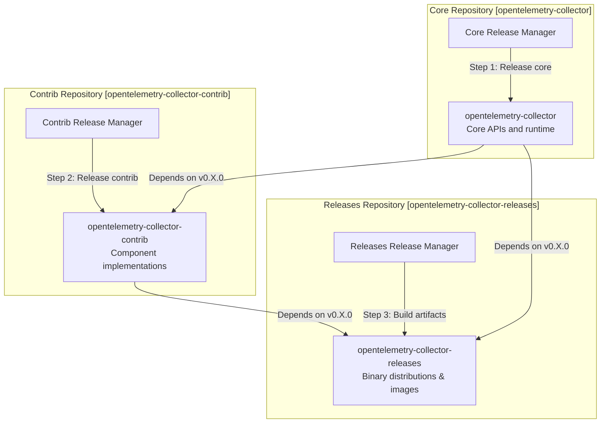
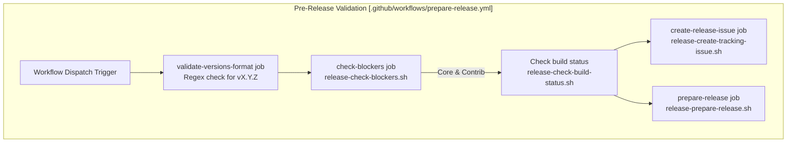

This document describes the step-by-step procedures for releasing new versions of the OpenTelemetry Collector. It covers the coordinated release of three repositories: `opentelemetry-collector` (core), `opentelemetry-collector-contrib` (components), and `opentelemetry-collector-releases` (binary artifacts and container images).

For information about module versioning and stability guarantees, see [Module Versioning and Stability](#11.2). For information about changelog management, see [Changelog Management](#11.3).

## Overview

The OpenTelemetry Collector follows a coordinated release process across three repositories, each with an assigned release manager. Releases occur on a bi-weekly schedule, with both core and contrib using the same version numbers. The core repository must be released first, as contrib depends on it. [docs/release.md:3-10]()

### Repository Coordination Flow

Title: Repository Coordination Flow


**Sources:** [docs/release.md:1-10](), [docs/release.md:26-74]()

### Version Numbering Scheme

The Collector maintains two parallel module sets with independent version numbers:

| Module Set | Version Pattern | Status | Examples |
|------------|----------------|--------|----------|
| **Beta** | `v0.X.Y` | Under active development | `v0.127.0`, `v0.128.0` |
| **Stable** | `v1.X.Y` | API-stable, semver guarantees | `v1.21.0`, `v1.22.0` |

Beta versions increment the minor version for each release (e.g., `v0.127.0` → `v0.128.0`). Stable versions follow semantic versioning with major version >= 1. [docs/release.md:32-33](), [.github/workflows/prepare-release.yml:32-46]()

**Sources:** [docs/release.md:32-39](), [.github/workflows/prepare-release.yml:5-20]()

## Release Managers

Release managers rotate through all core, contrib, and releases approvers on a defined schedule. Each release has three release managers (one per repository), though the same person may serve multiple roles. [docs/release.md:13-19]()

### Responsibilities

The **core release manager** is responsible for:
- Opening a discussion thread in `#otel-collector-dev` Slack channel. [docs/release.md:21-22]()
- Coordinating with contrib and releases managers. [docs/release.md:19]()
- Executing the core release process. [docs/release.md:26]()
- Updating the release schedule after completion. [docs/release.md:70-75]()

### Release Schedule

The release schedule is maintained in `docs/release.md`. After each release, the completed entry is removed and a new entry is added to the bottom. [docs/release.md:17-18]()

**Sources:** [docs/release.md:13-23](), [docs/release.md:70-76]()

## Prerequisites and Pre-Release Checks

Before starting a release, several automated checks must pass to ensure readiness.

### Release Blocker Check

The `prepare-release.yml` workflow checks for open issues labeled `release:blocker` in both core and contrib repositories via the `release-check-blockers.sh` script. [.github/workflows/prepare-release.yml:71-82]()

Title: Release Preparation Workflow


**Sources:** [.github/workflows/prepare-release.yml:25-163](), [.github/workflows/scripts/release-check-blockers.sh](), [docs/release.md:24]()

### GPG Signing Setup

Release managers must have GPG configured for signing git commits and tags. [docs/release.md:11]()

## Core Release Process

### Step 1: Update Contrib Dependencies

The core release manager triggers the "Update contrib to the latest core source" workflow in the contrib repository. This runs `make update-otel` to ensure the latest core changes do not break contrib. [docs/release.md:28]()

**Important:** Merging in core is halted via the `check-merge-freeze.yml` workflow while this PR is open. [.github/workflows/check-merge-freeze.yml:1-15]()

### Step 2: Run Prepare Release Workflow

Trigger the `Automation - Prepare Release` workflow via `workflow_dispatch`. [docs/release.md:34](), [.github/workflows/prepare-release.yml:3-4]()

#### Workflow Inputs
- `candidate-beta`: Release version (e.g., `0.85.0`). [.github/workflows/prepare-release.yml:15]()
- `current-beta`: Current version (e.g., `0.84.0`). [.github/workflows/prepare-release.yml:18]()
- `candidate-stable`: Release version for stable modules. [.github/workflows/prepare-release.yml:8]()
- `current-stable`: Current version for stable modules. [.github/workflows/prepare-release.yml:11]()

The workflow executes `release-prepare-release.sh`, which updates `CHANGELOG.md` (via `chloggen`) and version numbers across modules. [.github/workflows/prepare-release.yml:162-170]()

**Sources:** [docs/release.md:32-46](), [.github/workflows/prepare-release.yml:1-171]()

### Step 3: Tag and Push Module Sets

After the prepare-release PR is merged, the manager tags modules locally on the `main` branch. [docs/release.md:40-41]()

```bash