## Purpose and Scope

This page documents how the `service.Service` is created, started, and shut down. It covers the `New()`, `Start()`, and `Shutdown()` methods that manage the collector's lifecycle from initialization through graceful termination.

For information about how the service manages component lifecycles and pipeline orchestration, see page 7.2. For details about internal telemetry and observability, see page 7.3.

## Service Structure

The `service.Service` struct serves as the top-level orchestrator for the entire collector runtime. It manages telemetry providers, the component host, and configuration. It implements the `component.Host` interface via its internal `host` field.

| Field | Type | Purpose |
|-------|------|---------|
| `buildInfo` | `component.BuildInfo` | Collector version and command name [service/service.go:111-111]() |
| `telemetrySettings` | `component.TelemetrySettings` | Logger, meter provider, tracer provider, and resource [service/service.go:112-112]() |
| `host` | `*graph.Host` | Manages component builders, pipelines, extensions, and status reporting [service/service.go:113-113]() |
| `configSnapshot` | `extensioncapabilities.ConfigSnapshot` | Current collector configuration representation [service/service.go:114-114]() |
| `loggerShutdownFunc` | `component.ShutdownFunc` | Cleanup function for logger [service/service.go:115-115]() |
| `meterProvider` | `telemetry.MeterProvider` | OpenTelemetry meter provider for internal metrics [service/service.go:116-116]() |
| `tracerProvider` | `telemetry.TracerProvider` | OpenTelemetry tracer provider for internal traces [service/service.go:117-117]() |

**Sources:** [service/service.go:110-118]()

## Settings Structure

The `Settings` struct provides all the inputs required to construct a `Service`. This structure is populated by the configuration loader (typically in the `otelcol` package) before calling `New()`.

```mermaid
graph TB
    Settings["service.Settings"]

    BuildInfo["component.BuildInfo<br/>Version & Command"]
    ConfigSnapshot["extensioncapabilities.ConfigSnapshot<br/>ConfigSnapshot"]

    Receivers["Receivers<br/>Configs & Factories"]
    Processors["Processors<br/>Configs & Factories"]
    Exporters["Exporters<br/>Configs & Factories"]
    Connectors["Connectors<br/>Configs & Factories"]
    ExtensionsBuilder["Extensions<br/>builders.Extension"]

    ModuleInfos["service.ModuleInfos<br/>Component Metadata"]
    AsyncErrorChannel["AsyncErrorChannel<br/>chan error"]
    LoggingOptions["LoggingOptions<br/>[]zap.Option"]
    TelemetryFactory["telemetry.Factory<br/>telemetry.Factory"]

    Settings --> BuildInfo
    Settings --> ConfigSnapshot
    Settings --> Receivers
    Settings --> Processors
    Settings --> Exporters
    Settings --> Connectors
    Settings --> ExtensionsBuilder
    Settings --> ModuleInfos
    Settings --> AsyncErrorChannel
    Settings --> LoggingOptions
    Settings --> TelemetryFactory
```

**Sources:** [service/service.go:45-107]()

## Initialization Sequence

The `service.New` function creates a new `Service` and initializes all telemetry providers and components. The initialization follows a strict order to ensure dependencies are satisfied.

### Initialization Flow Diagram

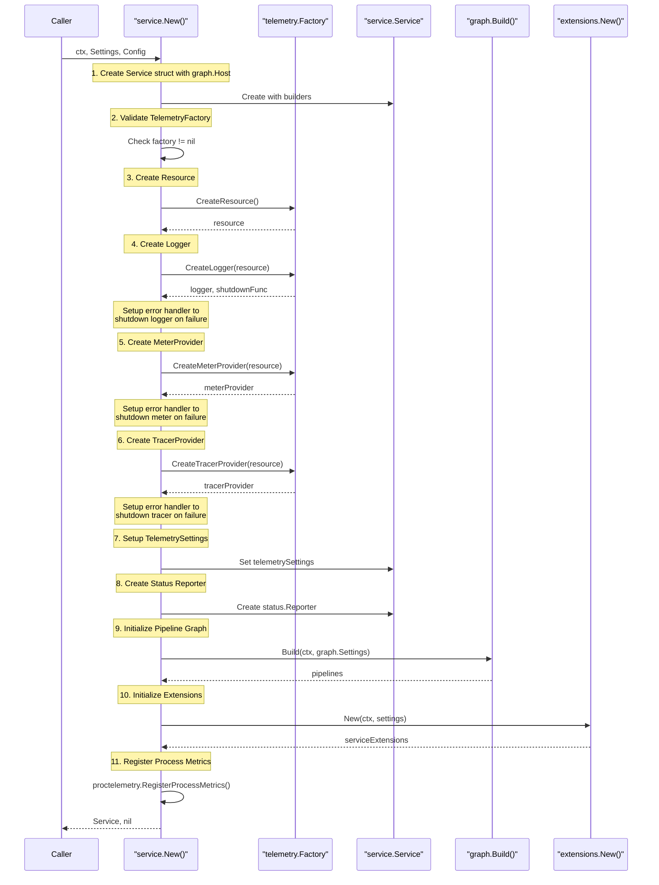

**Sources:** [service/service.go:121-240]()

### Initialization Steps

#### Step 1: Service Struct Creation

The function first creates the `Service` struct and initializes the `graph.Host` with component builders for all component types:

- **Receivers Builder:** `builders.NewReceiver(set.ReceiversConfigs, set.ReceiversFactories)` [service/service.go:130-130]()
- **Processors Builder:** `builders.NewProcessor(set.ProcessorsConfigs, set.ProcessorsFactories)` [service/service.go:131-131]()
- **Exporters Builder:** `builders.NewExporter(set.ExportersConfigs, set.ExportersFactories)` [service/service.go:132-132]()
- **Connectors Builder:** `builders.NewConnector(set.ConnectorsConfigs, set.ConnectorsFactories)` [service/service.go:133-133]()
- **Extensions Builder:** `builders.NewExtension(set.ExtensionsConfigs, set.ExtensionsFactories)` [service/service.go:134-134]()

The `Host` also receives `ModuleInfos`, `BuildInfo`, and `AsyncErrorChannel` [service/service.go:136-138]().

#### Step 2: Telemetry Factory Validation

The function validates that a `telemetry.Factory` was provided in `Settings`. If nil, initialization fails immediately with an error [service/service.go:143-145]().

#### Step 3: Resource Creation

The telemetry resource is created first to ensure all telemetry providers (logger, meter, tracer) use the same resource with a consistent `service.instance.id` [service/service.go:149-150]().

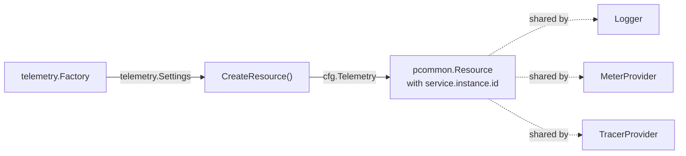

**Sources:** [service/service.go:149-154]()

#### Step 4: Logger Creation

The logger is created using `set.TelemetryFactory.CreateLogger()` with the shared resource. The function stores the `loggerShutdownFunc` for later cleanup [service/service.go:174-184](). If a `BuildZapLogger` function is provided in `Settings`, it is used to instantiate the logger; otherwise, it defaults to `zap.Config.Build` [service/service.go:158-161]().

#### Step 5: MeterProvider Creation

The `MeterProvider` is created with the shared resource and logger. It uses `metricviews.DefaultViews` for internal telemetry [service/service.go:186-200]().

#### Step 6: TracerProvider Creation

The `TracerProvider` is created with the shared resource and logger [service/service.go:202-215]().

#### Step 7: TelemetrySettings Assembly

The function assembles `component.TelemetrySettings` with the logger, meter provider, tracer provider, and resource [service/service.go:217-222]().

#### Step 8: Status Reporter Creation

A `status.Reporter` is created to track component status changes. This reporter is passed to the graph builder to enable component status updates [service/service.go:223-229]().

#### Step 9: Pipeline Graph Initialization

The `graph.Build()` function constructs the pipeline graph from the configuration, creating nodes for each component and validating connections [service/service.go:231-233]().

#### Step 10: Extensions Initialization

Extensions are created using `extensions.New()` based on the provided configuration and factories [service/service.go:236-239]().

#### Step 11: Process Metrics Registration

Finally, `proctelemetry.RegisterProcessMetrics()` registers process-level metrics (CPU, memory, uptime) using the service's telemetry settings [service/service.go:241-243]().

## Start Sequence

The `Start()` method brings the collector to a running state by starting extensions and pipelines in a specific order.

### Start Flow Diagram

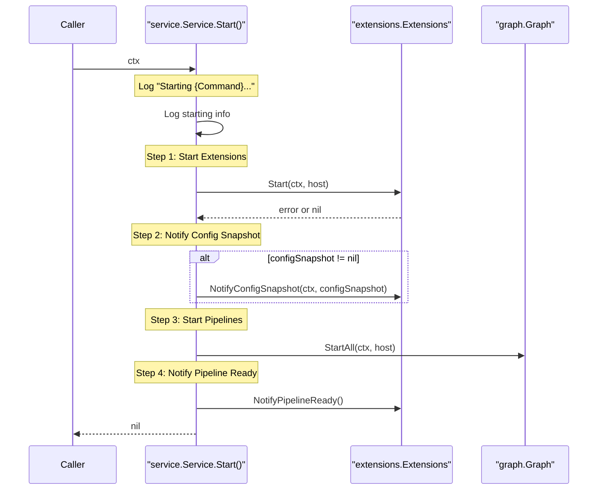

**Sources:** [service/service.go:253-280]()

### Start Steps

1. **Log Starting Information:** Logs the collector command name, version, and runtime context (OS/Arch) [service/service.go:254-257]().
2. **Start Extensions:** Calls `extensions.Extensions.Start()` to initialize all configured extensions [service/service.go:259-261]().
3. **Notify Config Snapshot:** If a configuration snapshot is available, notifies extensions via `NotifyConfigSnapshot()` [service/service.go:263-267]().
4. **Start All Pipelines:** Calls `graph.Graph.StartAll()` which triggers the `Start` method of every receiver, processor, exporter, and connector in the graph [service/service.go:269-271]().
5. **Notify Pipeline Ready:** Notifies extensions that all pipelines are operational and ready to process data [service/service.go:273-275]().

## Shutdown Sequence

The `Shutdown()` method performs graceful termination by shutting down components and telemetry in reverse order of startup.

### Shutdown Flow Diagram

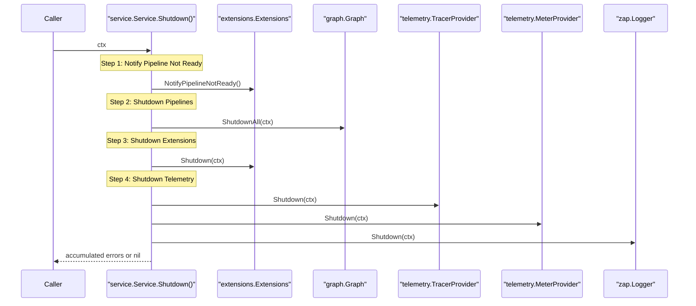

**Sources:** [service/service.go:286-320]()

### Shutdown Steps

1. **Notify Pipeline Not Ready:** Signals extensions that pipelines are beginning their shutdown sequence [service/service.go:293-295]().
2. **Shutdown Pipelines:** Calls `graph.Graph.ShutdownAll()` to stop all components in the pipelines [service/service.go:297-299]().
3. **Shutdown Extensions:** Calls `extensions.Extensions.Shutdown()` to stop extensions [service/service.go:301-303]().
4. **Shutdown Telemetry:** Shuts down TracerProvider, MeterProvider, and finally the Logger [service/service.go:309-317]().

## Service Validation

The `service.Validate` function provides a way to validate the service configuration without actually starting any components. It creates no-op telemetry providers and attempts to build the pipeline graph to ensure the configuration is semantically correct [service/service.go:361-381]().

**Sources:** [service/service.go:361-381]()

# Pipeline Orchestration


This page describes how the `service` package orchestrates the construction, validation, startup, and shutdown of telemetry pipelines in the OpenTelemetry Collector. It covers the `graph.Build` function that constructs the pipeline graph, the validation logic that prevents invalid configurations, and the coordinated startup and shutdown sequences that ensure components are started and stopped in the correct order.

For details on the initial service creation and telemetry setup that precedes pipeline orchestration, see [7.1 Service Initialization and Lifecycle](). For information on how data flows through constructed pipelines, see [2.3 Pipeline and Data Flow](). For component lifecycle details, see [2.1 Component Model]().

## Pipeline Graph Construction

The service constructs the pipeline graph by calling `graph.Build` during initialization. This function takes the component builders (for receivers, processors, exporters, and connectors), pipeline configurations, and telemetry settings, then builds a complete directed graph of all components and their connections [[service/internal/graph/graph.go:76-95]]().

### Graph Builder Settings

The `graph.Settings` structure passed to `graph.Build` contains all the information needed to construct pipelines:

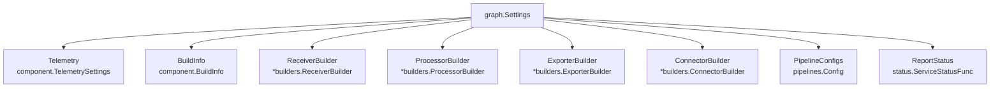

**Sources:** [[service/internal/graph/graph.go:46-59]]()

### Graph Construction Process

The `initGraph` method in the `Service` struct invokes `graph.Build` to construct the pipeline graph [[service/service.go:343-358]]():

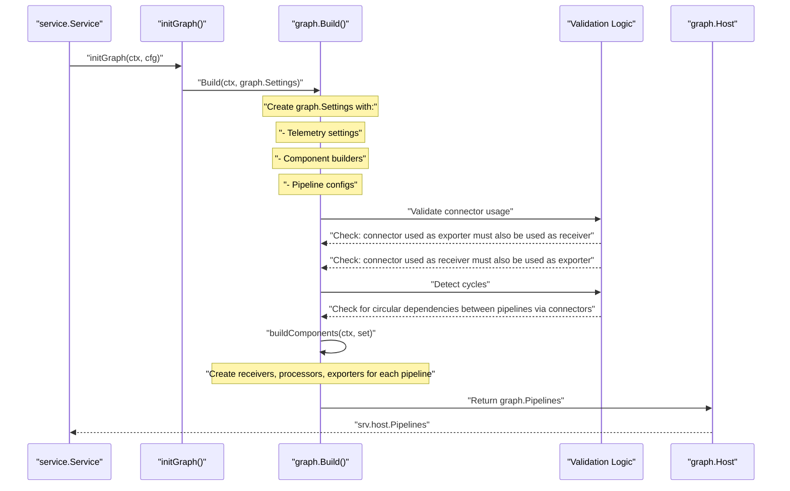

**Sources:** [[service/service.go:343-358]](), [[service/internal/graph/graph.go:76-95]](), [[service/internal/graph/graph.go:93-94]]()

### Component Validation

The graph builder performs several validation checks to ensure the pipeline configuration is valid before creating any components.

#### Connector Validation Rules

Connectors have special validation rules because they route data between pipelines. `graph.Build` calls `createNodes` which implements these checks [[service/internal/graph/graph.go:99-186]]():

| Validation Rule | Description | Implementation Site |
|----------------|-------------|---------------------|
| **Exporter-Receiver Pairing** | A connector used as an exporter in one pipeline must be used as a receiver in at least one pipeline | [[service/internal/graph/graph.go:174-179]]() |
| **Receiver-Exporter Pairing** | A connector used as a receiver in one pipeline must be used as an exporter in at least one pipeline | [[service/internal/graph/graph.go:180-185]]() |
| **Stability Check** | Validates that the connector supports the signal types (e.g., Traces to Metrics) | [[service/internal/graph/graph.go:164-172]]() |

**Sources:** [[service/internal/graph/graph.go:99-186]]()

### Validation Without Service Instantiation

The `Validate` function allows validation of a pipeline configuration without creating a full service instance. This is useful for configuration validation in CLI tools or pre-flight checks:

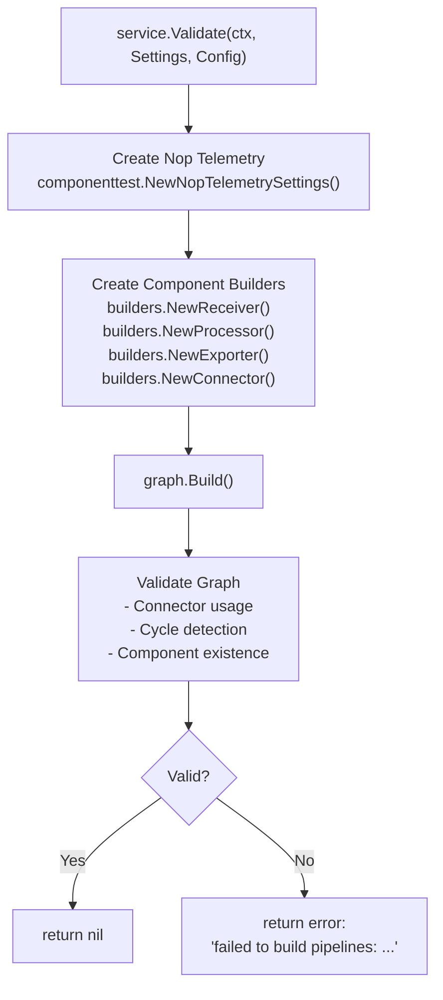

**Sources:** [[service/service.go:366-387]]()

## Pipeline Startup Sequence

Once the graph is built and validated, the service follows a strict startup sequence to ensure components are started in the correct order.

### Start Method Execution Flow

The `Start` method executes five distinct phases [[service/service.go:253-285]]():

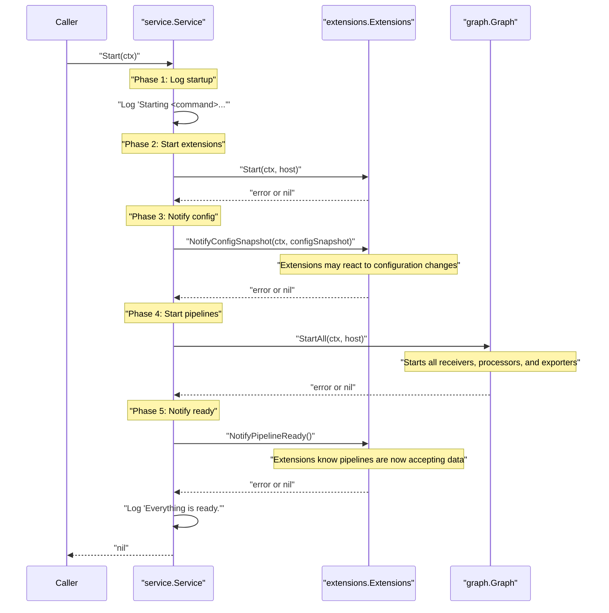

**Sources:** [[service/service.go:253-285]]()

### Start Phase Details

Each phase in the startup sequence has a specific purpose [[service/service.go:253-285]]():

| Phase | Method Call | Purpose |
|-------|-------------|---------|
| **1. Logging** | `srv.telemetrySettings.Logger.Info` | Records startup with version and CPU count [[service/service.go:255-258]]() |
| **2. Extensions Start** | `srv.host.ServiceExtensions.Start` | Starts all extensions (e.g., health check, zpages, auth providers) [[service/service.go:261-264]]() |
| **3. Config Notification** | `srv.host.ServiceExtensions.NotifyConfigSnapshot` | Informs extensions of the effective collector configuration [[service/service.go:267-270]]() |
| **4. Pipelines Start** | `srv.host.Pipelines.StartAll` | Starts all receivers, processors, and exporters in all pipelines [[service/service.go:273-276]]() |
| **5. Pipeline Ready** | `srv.host.ServiceExtensions.NotifyPipelineReady` | Notifies extensions that pipelines are ready to process data [[service/service.go:279-282]]() |

**Sources:** [[service/service.go:253-285]](), [[service/extensions/extensions.go:40-65]]()

## Pipeline Shutdown Sequence

Shutdown follows the reverse order of startup to ensure components are stopped cleanly.

### Shutdown Method Execution Flow

The `Shutdown` method executes four phases in reverse order of startup [[service/service.go:287-326]]():

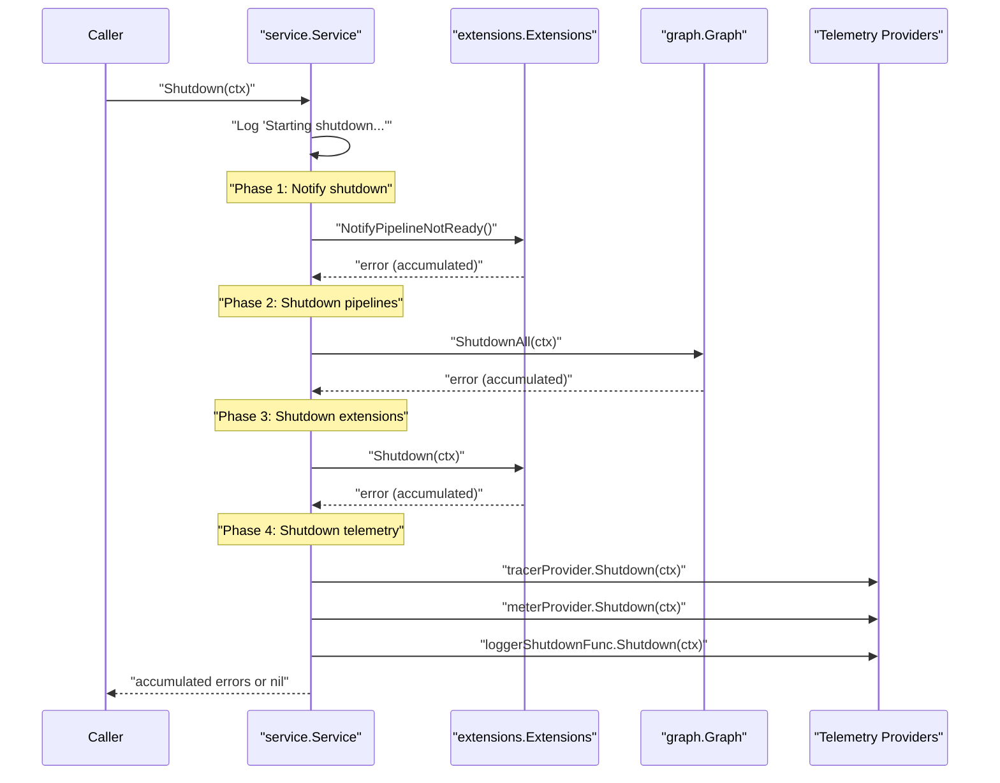

**Sources:** [[service/service.go:287-326]]()

### Error Accumulation

The shutdown process accumulates all errors using `multierr.Append` rather than failing fast. This ensures that even if one component fails to shut down, all other components still get a chance to clean up [[service/service.go:292-326]]().

### Telemetry Shutdown Order

Telemetry providers are shut down in reverse order of creation because the tracer and meter providers may use the logger for final error reporting [[service/service.go:313-323]]():
1. `tracerProvider.Shutdown(ctx)`
2. `meterProvider.Shutdown(ctx)`
3. `loggerShutdownFunc.Shutdown(ctx)`

**Sources:** [[service/service.go:313-323]]()

## Graph Host Structure

The `graph.Host` structure holds all the component builders, module information, and provides the communication channel for async errors. It implements the `component.Host` interface [[service/internal/graph/host.go:31-46]]().

### Host Components

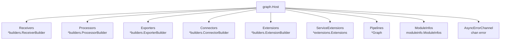

**Sources:** [[service/internal/graph/host.go:31-46]]()

### Status Reporting

The `Host` acts as a central hub for component status changes via `NotifyComponentStatusChange`. When a component reports a fatal error, it is sent to the `AsyncErrorChannel` to trigger a service shutdown [[service/internal/graph/host.go:82-87]]().

```go
func (host *Host) NotifyComponentStatusChange(source *componentstatus.InstanceID, event *componentstatus.Event) {
	host.ServiceExtensions.NotifyComponentStatusChange(source, event)
	if event.Status() == componentstatus.StatusFatalError {
		host.AsyncErrorChannel <- event.Err()
	}
}
```

**Sources:** [[service/internal/graph/host.go:82-87]]()

## Extension Orchestration

Extensions are managed by the `extensions.Extensions` struct, which handles their ordered lifecycle and specialized notifications [[service/extensions/extensions.go:31-37]]().

### Extension Lifecycle Order

Extensions are started in the order they appear in the configuration. Shutdown occurs in the exact reverse order [[service/extensions/extensions.go:42-90]](). This is critical for extensions that depend on others (e.g., an auth extension depending on a storage extension).

| Method | Behavior | Source |
|--------|----------|--------|
| `Start` | Iterates through `extensionIDs` and calls `ext.Start(ctx, host)` | [[service/extensions/extensions.go:40-65]]() |
| `Shutdown` | Iterates through `extensionIDs` in reverse using `slices.Backward` | [[service/extensions/extensions.go:68-93]]() |

### Specialized Notifications

The orchestration layer provides several hooks for extensions to react to the collector's state:

*   **Pipeline Readiness**: `NotifyPipelineReady` and `NotifyPipelineNotReady` are called when pipelines have finished starting or are about to stop [[service/extensions/extensions.go:95-116]]().
*   **Config Watcher**: `NotifyConfigSnapshot` sends the final resolved configuration to extensions implementing `extensioncapabilities.ConfigSnapshotWatcher` or `extensioncapabilities.ConfigWatcher` [[service/extensions/extensions.go:129-147]]().
*   **Status Watcher**: `NotifyComponentStatusChange` allows extensions to observe the status of any other component in the system [[service/extensions/extensions.go:149-156]]().

**Sources:** [[service/extensions/extensions.go:95-156]]()

## Integration with Service Lifecycle

The pipeline orchestration integrates with the overall service lifecycle. If graph construction fails during `service.New`, the service cleans up any telemetry that was already created using deferred functions [[service/service.go:178-183]]().

### Complete Service Initialization to Shutdown

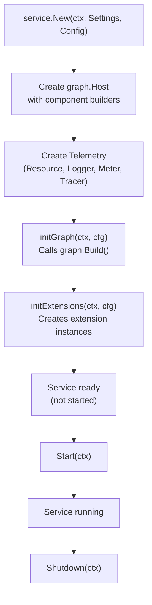

**Sources:** [[service/service.go:121-232]](), [[service/service.go:253-285]](), [[service/service.go:287-326]]()

# Observability and Telemetry


## Purpose and Scope

This document describes the observability and internal telemetry infrastructure of the OpenTelemetry Collector. This encompasses two interconnected systems:

1.  **Internal Telemetry**: The logger, meter provider, and tracer provider that the collector uses to instrument itself, managed via the `otelconftelemetry` factory.
2.  **Observability Reporting (obsreport)**: The standardized system for components to report operational metrics (e.g., `receiver_accepted`, `processor_dropped`, `exporter_sent`) and traces for internal operations.

These systems enable operators to monitor the collector's health and performance using OpenTelemetry SDKs.

## Internal Telemetry Infrastructure

The collector's internal telemetry is orchestrated by the `service` package and instantiated through the `otelconftelemetry` factory.

### Telemetry Factory and Configuration
The `otelconftelemetry` factory implements the `telemetry.Factory` interface, providing methods to create resources, loggers, meter providers, and tracer providers based on declarative configuration [service/telemetry/telemetry.go:86-112]().

| Class/Function | File Path | Role |
|----------------|-----------|------|
| `NewFactory` | [service/telemetry/otelconftelemetry/factory.go:20-28]() | Returns a factory for creating OTel-based telemetry components using `otelconf`. |
| `Config` | [service/telemetry/otelconftelemetry/config.go:17-23]() | Defines the schema for internal telemetry (Logs, Metrics, Traces, Resource). |
| `createMeterProvider` | [service/telemetry/otelconftelemetry/metrics.go:119-122]() | Configures the OTel SDK MeterProvider based on `MetricsConfig`. |
| `createLogger` | [service/telemetry/otelconftelemetry/logger.go:175-177]() | Initializes a Zap logger integrated with OTel log SDK processors. |
| `createTracerProvider` | [service/telemetry/otelconftelemetry/tracer.go:31-35]() | Initializes the SDK TracerProvider and sets global propagators. |

The `otelconftelemetry` factory provides a default configuration that includes a Prometheus exporter listening on `localhost:8888` [service/telemetry/otelconftelemetry/factory.go:49-64](). It leverages the `otelconf` library to provide a declarative configuration format for the OpenTelemetry SDK [service/telemetry/telemetry.go:9]().

Sources: [service/telemetry/telemetry.go:79-112](), [service/telemetry/otelconftelemetry/factory.go:20-71](), [service/telemetry/otelconftelemetry/metrics.go:119-122](), [service/telemetry/otelconftelemetry/config.go:17-23]()

### Telemetry Levels
The collector defines levels for internal telemetry to control overhead and verbosity [config/configtelemetry/configtelemetry.go:28-30]():
*   **LevelNone**: No telemetry is collected [config/configtelemetry/configtelemetry.go:14]().
*   **LevelBasic**: Only core Collector telemetry [config/configtelemetry/configtelemetry.go:16]().
*   **LevelNormal**: Low-overhead telemetry (Default) [config/configtelemetry/configtelemetry.go:18]().
*   **LevelDetailed**: All available telemetry [config/configtelemetry/configtelemetry.go:20]().

Sources: [config/configtelemetry/configtelemetry.go:12-44]()

### Resource Identification
The collector identifies itself via a resource. The `service.instance.id` is typically generated to distinguish multiple collector instances [service/telemetry/otelconftelemetry/metrics_test.go:105-113](). The factory uses `createResource` to build this identity, which includes the `service.name` and `service.version` [service/telemetry/otelconftelemetry/resource.go:34-40]().

Sources: [service/telemetry/otelconftelemetry/resource.go:34-40](), [service/telemetry/otelconftelemetry/metrics_test.go:105-113]()

## Component Observability (obsreport)

The `obsreport` system provides a unified way for receivers, processors, and exporters to report their internal state. It abstracts the complexity of OTel SDK calls into simple reporting patterns.

### Standardized Metrics
The collector tracks the flow of data through several primary metric types defined in metadata [service/metadata.yaml:12-190]():

1.  **Receivers**: Track `receiver.produced.items` and `receiver.produced.size` [service/metadata.yaml:171-189]().
2.  **Processors**: Track `processor.consumed.items` and `processor.produced.items` [service/metadata.yaml:131-169]().
3.  **Exporters**: Track `exporter.consumed.items` and `exporter.consumed.size` [service/metadata.yaml:54-73]().
4.  **Connectors**: Track `connector.consumed.items` and `connector.produced.items` [service/metadata.yaml:14-53]().

### Process Telemetry
The collector also provides host and runtime metrics via the `proctelemetry` package [service/internal/proctelemetry/process_telemetry.go:57-90]():
*   `process_cpu_seconds`: Total CPU time [service/metadata.yaml:74-82]().
*   `process_memory_rss`: Resident set size [service/metadata.yaml:84-92]().
*   `process_runtime_heap_alloc_bytes`: Current heap allocation [service/metadata.yaml:93-101]().
*   `process_uptime`: Process uptime in seconds [service/metadata.yaml:121-130]().

Sources: [service/metadata.yaml:74-130](), [service/internal/proctelemetry/process_telemetry.go:57-90]()

### Data Flow and Code Entities

The following diagram maps the logical data flow to the specific code entities responsible for telemetry reporting.

**Telemetry Reporting Architecture**

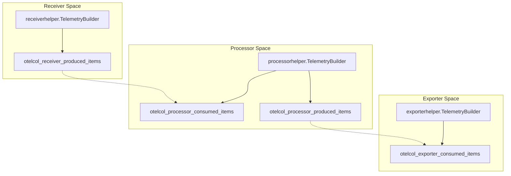

Sources: [service/metadata.yaml:14-189](), [service/internal/proctelemetry/process_telemetry.go:78-89]()

## Implementation Details

### Metadata-Driven Telemetry (mdatagen)

Most internal telemetry code is generated using the `mdatagen` tool. Components define their metrics and telemetry in a `metadata.yaml` file, which is then compiled into a `TelemetryBuilder`.

| Generated Component | Role |
|---------------------|------|
| `TelemetryBuilder` | Struct containing metric instruments like `ExporterConsumedItems` [service/metadata.yaml:54](). |
| `NewTelemetryBuilder` | Factory to initialize the builder with `component.TelemetrySettings` [service/internal/proctelemetry/process_telemetry.go:78](). |
| `Register...Callback` | Methods to register asynchronous callbacks for gauges and counters [service/internal/proctelemetry/process_telemetry.go:83-88](). |

This ensures consistency across the codebase and allows the `mdatagen` tool to enforce stability levels (Alpha, Development, Stable) on internal metrics [service/metadata.yaml:17]().

### Exporter Observability
Exporter telemetry is primarily managed within the `exporterhelper` package. It tracks the lifecycle of requests as they are consumed and processed by exporters.

**Exporter Telemetry Builder Structure**

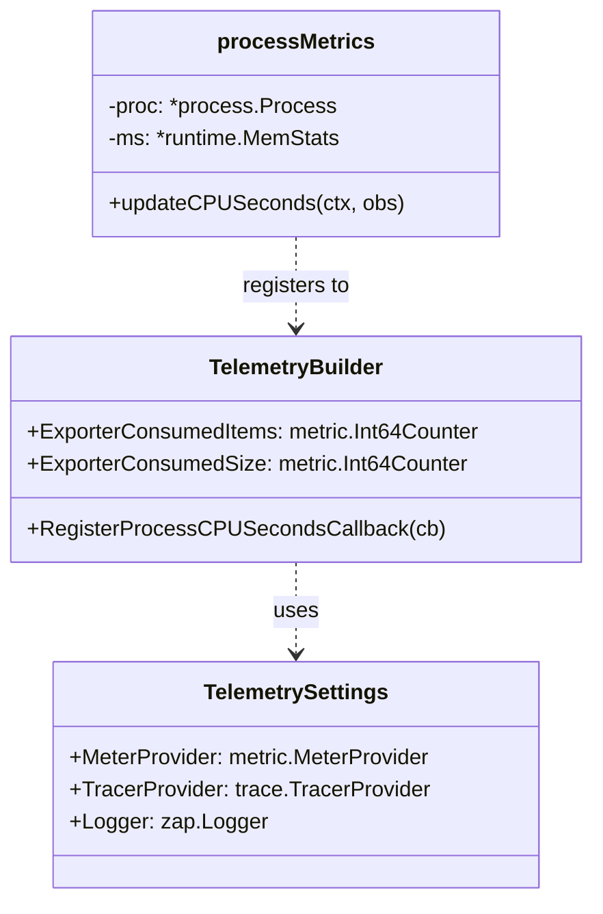

Sources: [service/metadata.yaml:54-73](), [service/internal/proctelemetry/process_telemetry.go:23-32](), [service/telemetry/telemetry.go:40-68]()

## Feature Gates

The collector uses feature gates to manage the lifecycle of telemetry features [service/metadata.yaml:191-210]().

| Feature Gate ID | Description | Stage |
|-----------------|-------------|-------|
| `telemetry.newPipelineTelemetry` | Injects component-identifying scope attributes in internal metrics [service/metadata.yaml:204-209](). | alpha |
| `service.profilesSupport` | Controls whether profiles support can be enabled [service/metadata.yaml:198-203](). | alpha |
| `service.AllowNoPipelines` | Allow starting the Collector without starting any pipelines [service/metadata.yaml:192-197](). | alpha |

Sources: [service/metadata.yaml:191-210]()

# Building Custom Collectors


The OpenTelemetry Collector uses a modular architecture where users can create custom distributions containing only the components they need. This page provides an overview of how custom collector distributions are created using the OpenTelemetry Collector Builder (`ocb`) tool.

**Related Documentation:**
- For detailed `ocb` tool usage, see [OpenTelemetry Collector Builder (ocb)](#8.1)
- For configuration file format, see [Builder Configuration](#8.2)
- For metadata generation, see [Metadata Generator (mdatagen)](#8.3)
- For build process internals and examples, see [Build Process and Distribution Examples](#8.4)

## Why Custom Distributions?

The OpenTelemetry Collector follows a "batteries included but removable" philosophy. While the core distribution (`otelcorecol`) includes common components, production deployments often benefit from custom distributions that:

- **Reduce binary size**: Include only needed components, reducing attack surface and deployment footprint.
- **Simplify maintenance**: Lock component versions explicitly for reproducible builds.
- **Add proprietary components**: Include internal or third-party receivers, processors, or exporters.
- **Optimize for specific use cases**: Bundle domain-specific component combinations.

The builder tool automates the creation of these custom distributions by generating Go source code that imports and registers selected components.

Sources: [cmd/builder/README.md:1-30](), [cmd/otelcorecol/builder-config.yaml:1-12]()

## Builder Tool Overview

The OpenTelemetry Collector Builder (`ocb`) is a code generation tool that creates custom collector distributions from declarative YAML configuration. The tool generates a complete Go application with:

- Component factory registration code.
- Dependency management (`go.mod` with proper versions and replace directives).
- Main entry point that initializes the service runtime.
- Configuration provider setup.

The builder itself is located at [cmd/builder/]() and can be installed via `go install` [cmd/builder/README.md:86-92]().

**High-Level Build Flow Diagram**

```mermaid
graph TB
    subgraph "InputSpace [Natural Language & Config]"
        ["CONFIG"] -- "builder-config.yaml" --> ["PARSE"]
        ["USER"] -- "User-defined component list" --> ["CONFIG"]
    end

    subgraph "CodeEntitySpace [cmd/builder/internal/builder]"
        ["PARSE"] -- "Config.ParseModules()" --> ["GENERATE"]
        ["GENERATE"] -- "Generate()" --> ["SOURCES"]
        ["SOURCES"] -- "GenerateAndCompile()" --> ["COMPILE"]
    end

    subgraph "OutputSpace [Filesystem]"
        ["SOURCES"] -- "Generated Go Sources" --> ["BINARY"]
        ["BINARY"] -- "Custom Collector Binary" --> ["END"]
    end

    subgraph "ComponentRegistry [go.opentelemetry.io/collector]"
        ["RECEIVERS"] -- "receiver/*" --> ["CONFIG"]
        ["PROCESSORS"] -- "processor/*" --> ["CONFIG"]
        ["EXPORTERS"] -- "exporter/*" --> ["CONFIG"]
        ["EXTENSIONS"] -- "extension/*" --> ["CONFIG"]
        ["CONNECTORS"] -- "connector/*" --> ["CONFIG"]
        ["PROVIDERS"] -- "confmap/provider/*" --> ["PARSE"]
    end
```

Sources: [cmd/builder/internal/builder/main.go:66-77](), [cmd/builder/internal/builder/config.go:30-59](), [cmd/builder/internal/builder/main_test.go:250-255]()

## Build Workflow

Creating a custom collector involves four main steps:

### 1. Define Configuration
Create a `builder-config.yaml` file specifying the distribution metadata and component list. The `Config` struct in [cmd/builder/internal/builder/config.go:30-59]() defines the schema, including `dist`, `receivers`, `processors`, `exporters`, `extensions`, and `connectors`.

### 2. Run Builder
Execute the builder tool. It parses the YAML into a `Config` object and calls `Generate()` [cmd/builder/internal/builder/main.go:80](). This produces:
- `main.go`: Entry point with service initialization.
- `components.go`: Component factory registration logic.
- `go.mod`: Dependency management file.

### 3. Resolve Dependencies
The builder automatically manages the `go.mod` file. It handles `replaces` and `excludes` directives [cmd/builder/internal/builder/config.go:53-54]() to ensure the correct versions of modules are used.

### 4. Compile Binary
The builder calls the Go compiler via `Compile()` [cmd/builder/internal/builder/main.go:115-156]() to produce the final executable. On Windows, it automatically appends `.exe` to the output binary name [cmd/builder/internal/builder/main.go:158-171]().

Sources: [cmd/builder/internal/builder/main.go:66-153](), [cmd/builder/internal/builder/config.go:30-59]()

## Key Concepts

### Distribution Metadata
Defined in the `dist` section of the config [cmd/builder/internal/builder/config.go:69-80](), this includes:
- `name`: The name of the output binary.
- `module`: The Go module name for the generated collector.
- `output_path`: Where the generated source and binary will be placed.
- `version`: The version string for the distribution.

### Module References
Components are added by specifying their Go module path and version in the `Module` struct [cmd/builder/internal/builder/config.go:83-88](). For example, the `otelcorecol` distribution includes the OTLP receiver [cmd/otelcorecol/builder-config.yaml:17-17]().

### Configuration Providers
By default, the builder includes a set of standard `confmap` providers (env, file, http, https, yaml) to ensure the resulting collector can load configuration from common sources [cmd/builder/internal/builder/config.go:120-136]().

## Generated Code Structure

The builder generates a standard Go application structure designed to interface with the `otelcol` package.

**Generated Code Entity Association**

```mermaid
graph LR
    subgraph "BuilderTemplates [cmd/builder/internal/builder]"
        ["MOD_TMPL"] -- "goModTemplate" --> ["GOMOD"]
        ["MAIN_TMPL"] -- "mainTemplate" --> ["MAIN"]
        ["COMP_TMPL"] -- "componentsTemplate" --> ["COMP"]
    end

    subgraph "GeneratedOutput [otelcorecol example]"
        ["GOMOD"] -- "go.mod" --> ["MAIN"]
        ["MAIN"] -- "main.go" --> ["COL_SETTINGS"]
        ["COMP"] -- "components.go" --> ["COL_SETTINGS"]
    end

    subgraph "CollectorRuntime [go.opentelemetry.io/collector/otelcol]"
        ["COL_SETTINGS"] -- "otelcol.CollectorSettings" --> ["CMD_EXEC"]
        ["CMD_EXEC"] -- "otelcol.NewCommand().Execute()" --> ["RUN"]
    end
```

Sources: [cmd/builder/internal/builder/main.go:95-108](), [cmd/otelcorecol/main.go:19-55](), [cmd/builder/internal/builder/config.go:108-113]()

### main.go
The entry point file contains the `main` function which sets up `otelcol.CollectorSettings` and calls the command execution logic. It imports the generated `components` package to register factories [cmd/otelcorecol/main.go:19-55]().

### components.go
This file contains the factory registration logic, which aggregates all factories for receivers, processors, exporters, extensions, and connectors into a single `otelcol.Factories` struct used during startup [cmd/otelcorecol/main.go:28-28]().

### go.mod
The builder generates a `go.mod` that pins versions of the collector modules. It uses default versions (Stable `v1.62.0` [cmd/builder/internal/builder/config.go:23-23]() and Beta `v0.156.0` [cmd/builder/internal/builder/config.go:22-22]()) as targets for core components.

Sources: [cmd/otelcorecol/main.go:1-55](), [cmd/builder/internal/builder/config.go:21-24](), [versions.yaml:4-102]()

# OpenTelemetry Collector Builder (ocb)


## Overview

The OpenTelemetry Collector Builder (`ocb`) is a code generation and compilation tool that creates custom OpenTelemetry Collector distributions. Instead of using a pre-built collector binary with all possible components, `ocb` generates a tailored collector containing only the components specified in a configuration file [cmd/builder/README.md:1-4]().

**Key Benefits:**
- **Reduced Binary Size:** Include only needed components [cmd/builder/README.md:118-119]().
- **Simplified Dependency Management:** Control exact component versions [cmd/builder/internal/builder/main.go:184-194]().
- **Custom Branding:** Set custom module paths, binary names, and versions [cmd/builder/internal/builder/config.go:69-76]().
- **Local Development:** Use local module paths for component development via `path` fields [cmd/builder/internal/builder/config.go:83-88]().

**Sources:** [cmd/builder/README.md:1-4](), [cmd/builder/README.md:118-119](), [cmd/builder/internal/builder/main.go:184-194](), [cmd/builder/internal/builder/config.go:69-88]()

## How It Works

The builder operates in three sequential phases orchestrated by the `GenerateAndCompile` function [cmd/builder/internal/builder/main.go:66-77]():

1. **Generate:** Creates Go source files (`main.go`, `components.go`, `go.mod`) from internal templates [cmd/builder/internal/builder/main.go:80-112]().
2. **GetModules:** Runs `go mod tidy` and validates component versions against strict criteria [cmd/builder/internal/builder/main.go:174-183]().
3. **Compile:** Builds the final collector binary using `go build` with specified flags [cmd/builder/internal/builder/main.go:115-156]().

### Workflow and Data Flow

The following diagram maps the natural language phases to the specific code entities responsible for the build process.

**Diagram: OCB Build Pipeline Logic**
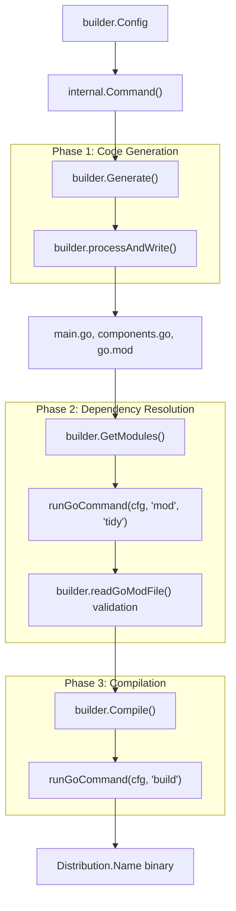
**Sources:** [cmd/builder/internal/builder/main.go:66-156](), [cmd/builder/internal/command.go:35-64]()

## Installation

There are three supported installation methods [cmd/builder/README.md:53-59]():

### Method 1: Official Release Docker Image (Recommended)
Official images are available at `otel/opentelemetry-collector-builder`. Mount your configuration to `/build/builder-config.yaml` and specify the output directory in your manifest [cmd/builder/README.md:60-81]().

### Method 2: Official Release Binaries
Download pre-compiled binaries from the [GitHub Releases page](https://github.com/open-telemetry/opentelemetry-collector-releases/releases?q=cmd/builder) [cmd/builder/README.md:82-84]().

### Method 3: `go install`
```bash
go install go.opentelemetry.io/collector/cmd/builder@latest
```
**Important:** Requires a compatible Go version. If installed via this method, the binary is called `builder` [cmd/builder/README.md:86-96]().

**Sources:** [cmd/builder/README.md:53-96]()

## Configuration

The builder is configured via a YAML file, typically named `builder-config.yaml`. The core structure is defined in the `Config` and `Distribution` structs [cmd/builder/internal/builder/config.go:30-80]().

### Configuration Structure (Code Mapping)

| YAML Key | Go Struct Field | Description |
|----------|-----------------|-------------|
| `dist` | `Distribution` | Output path, binary name, module name, and build tags [cmd/builder/internal/builder/config.go:69-80](). |
| `receivers` | `[]Module` | List of receiver modules to include [cmd/builder/internal/builder/config.go:47](). |
| `processors`| `[]Module` | List of processor modules to include [cmd/builder/internal/builder/config.go:48](). |
| `exporters` | `[]Module` | List of exporter modules to include [cmd/builder/internal/builder/config.go:45](). |
| `extensions`| `[]Module` | List of extension modules to include [cmd/builder/internal/builder/config.go:46](). |
| `connectors`| `[]Module` | List of connector modules to include [cmd/builder/internal/builder/config.go:49](). |
| `providers` | `[]Module` | List of confmap providers to include [cmd/builder/internal/builder/config.go:51](). |
| `converters`| `[]Module` | List of confmap converters to include [cmd/builder/internal/builder/config.go:52](). |
| `replaces`  | `[]string` | Go mod replace directives [cmd/builder/internal/builder/config.go:53](). |
| `excludes`  | `[]string` | Go mod exclude directives [cmd/builder/internal/builder/config.go:54](). |

**Sources:** [cmd/builder/internal/builder/config.go:30-88]()

### Module Specification
Each component is defined as a `Module` [cmd/builder/internal/builder/config.go:83-88]():
- `gomod`: The module path and version (e.g., `go.opentelemetry.io/collector/receiver/otlpreceiver v0.156.0`).
- `import`: The Go import path for the component factory.
- `path`: Optional local filesystem path for development (generates a `replace` directive).
- `name`: Unique name for the module (inferred from import if omitted) [cmd/builder/README.md:146-150]().

**Sources:** [cmd/builder/internal/builder/config.go:83-88](), [cmd/builder/README.md:146-150]()

## Command-Line Flags

The `ocb` CLI provides several flags to control the build process. These flags override values in the configuration file where applicable [cmd/builder/internal/command.go:132-163]().

| Flag | Description | Default |
|------|-------------|---------|
| `--config` | Path to the build configuration file [cmd/builder/internal/command.go:78](). | Embedded default [cmd/builder/internal/command.go:108](). |
| `--skip-generate` | Skip source code generation [cmd/builder/internal/command.go:80](). | `false` |
| `--skip-compilation`| Generate code only; do not build binary [cmd/builder/internal/command.go:81](). | `false` |
| `--skip-get-modules`| Skip `go mod tidy` and module retrieval. Does not regenerate `go.mod` [CHANGELOG.md:113-116](). | `false` |
| `--skip-strict-versioning`| Disable version compatibility checks [cmd/builder/internal/command.go:83](). | `false` |
| `--ldflags` | Custom `ldflags` for the `go build` command [cmd/builder/internal/command.go:85](). | `-s -w` [cmd/builder/internal/builder/main.go:122](). |
| `--gcflags` | Custom `gcflags` for the `go build` command [cmd/builder/internal/command.go:86](). | `""` |
| `--verbose` | Print detailed logs and sub-command output [cmd/builder/internal/command.go:84](). | `false` |

**Sources:** [cmd/builder/internal/command.go:77-90](), [cmd/builder/internal/builder/main.go:115-156](), [CHANGELOG.md:113-116]()

## Build Process Internals

### Code Generation (Generate Phase)
The `Generate` function uses several templates to produce the collector's boilerplate [cmd/builder/internal/builder/main.go:95-101]():
- `mainTemplate`: Generates `main.go` which initializes `otelcol.CollectorSettings` including `BuildInfo` and `Factories` [cmd/otelcorecol/main.go:19-55]().
- `componentsTemplate`: Generates `components.go` containing the `otelcol.Factories` registration logic [cmd/builder/internal/builder/main.go:99]().
- `goModTemplate`: Generates the `go.mod` file with all required dependencies, version constraints, and `replace` directives [cmd/builder/internal/builder/main.go:100]().

### Version Validation (GetModules Phase)
If strict versioning is enabled, `ocb` validates that the calculated dependency versions match the configured versions [cmd/builder/internal/builder/main.go:184-221](). It checks:
1. The core collector version (`go.opentelemetry.io/collector/otelcol`) [cmd/builder/internal/builder/main.go:195-204]().
2. Every individual component module version against the provided `gomod` spec [cmd/builder/internal/builder/main.go:206-220]().

### Compilation (Compile Phase)
The `Compile` function executes `go build`. It handles OS-specific binary naming (adding `.exe` for Windows) [cmd/builder/internal/builder/main.go:158-171]() and supports `debug_compilation` which preserves symbols and disables optimizations via `gcflags="all=-N -l"` [cmd/builder/internal/builder/main.go:127-131]().

**Diagram: Code Entity Association**
This diagram shows how the `builder.Config` struct fields map to the generated code in the output directory.

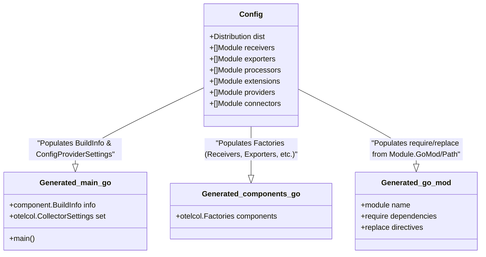
**Sources:** [cmd/builder/internal/builder/config.go:30-58](), [cmd/otelcorecol/main.go:19-55](), [cmd/builder/internal/builder/main.go:95-105]()

## Integration with Build System

The `ocb` tool is used within the OpenTelemetry Collector repository to build the `otelcorecol` (Core Distribution). The build configuration for this distribution is located at `cmd/otelcorecol/builder-config.yaml` [cmd/otelcorecol/builder-config.yaml:1-40]().

This configuration includes standard components like the `nopreceiver`, `otlpreceiver`, `debugexporter`, and `batchprocessor` [cmd/otelcorecol/builder-config.yaml:15-30](). It also defines extensive `replaces` to point to the local modules in the repository during development [cmd/otelcorecol/builder-config.yaml:43-107]().

By default, generated `replace` statements use relative paths, but this can be toggled using `dist::use_absolute_replace_paths` [cmd/builder/internal/builder/config.go:79]().

**Sources:** [cmd/otelcorecol/builder-config.yaml:1-107](), [cmd/builder/internal/builder/config.go:79]()