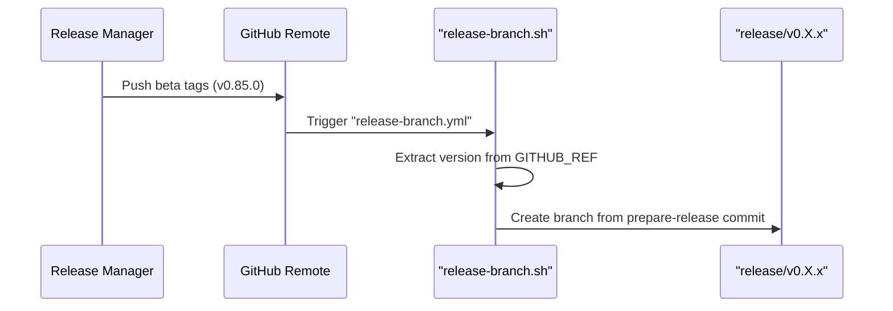
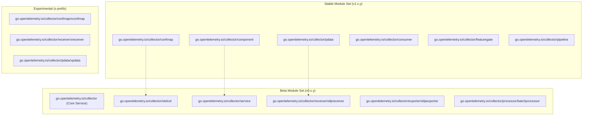
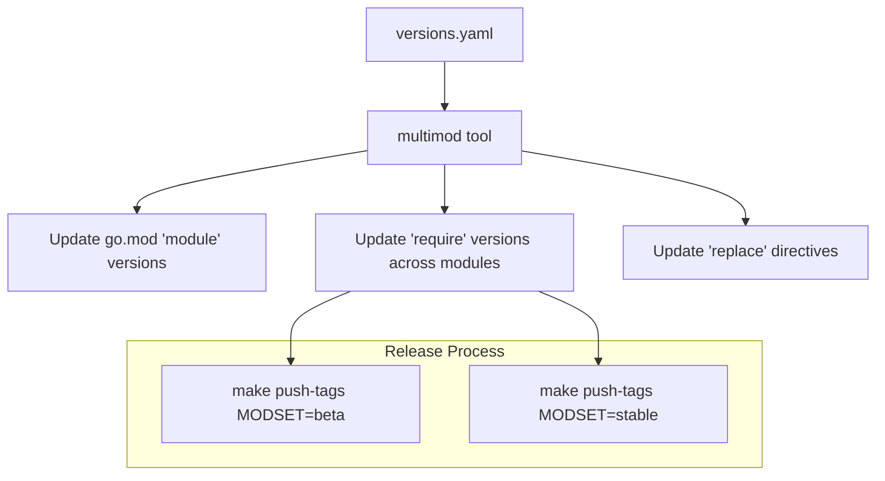
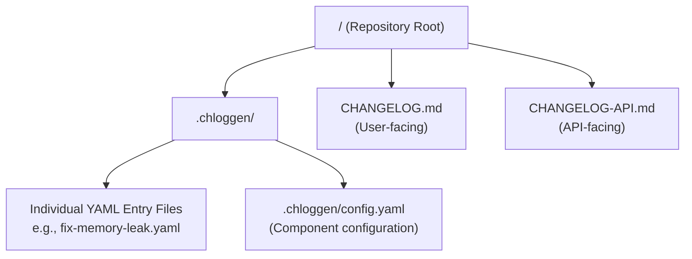
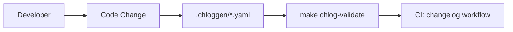
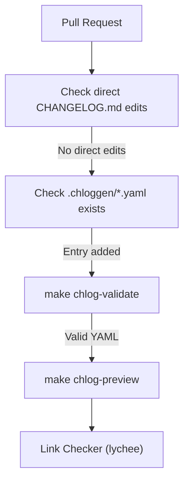
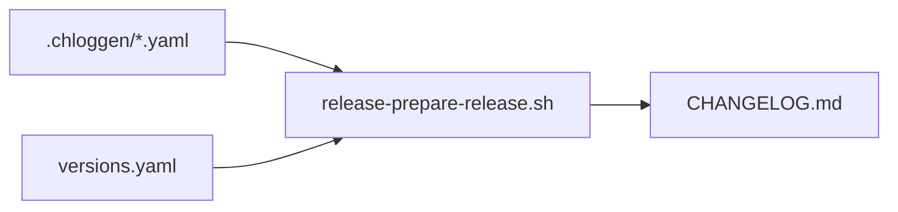
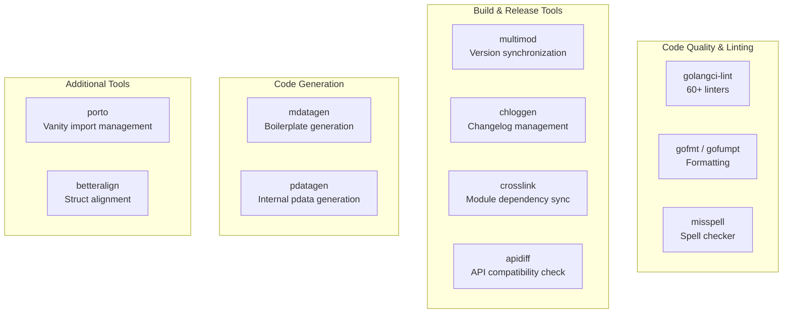
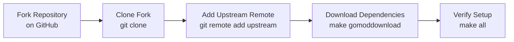
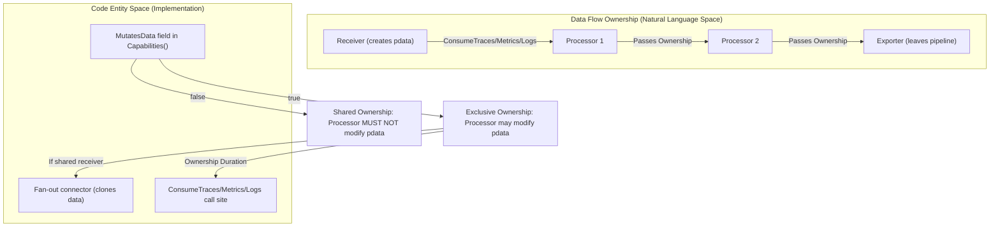

make push-tags MODSET=stable
```

**Sources:** [docs/release.md:44-46]()

### Step 4: Automatic Release Branch Creation

Pushing **beta** tags triggers the `Automation - Release Branch` workflow. [.github/workflows/release-branch.yml:1-10]()

Title: Automated Release Branch Logic


**Sources:** [docs/release.md:47-54](), [.github/workflows/scripts/release-branch.sh]()

## CI/CD and Verification

Once tags are pushed, the standard build workflows validate the release.

### Multi-Platform Testing
- **build-and-test.yml**: Runs unit tests, linting, and module verification on Linux. [.github/workflows/build-and-test.yml:1-191]()
- **build-and-test-windows.yaml**: Validates the collector on Windows 2022, 2025, and Windows 11 ARM, including `TestCollectorAsService` validation. [.github/workflows/build-and-test-windows.yaml:1-92]()
- **contrib-tests.yml**: Validates that core changes do not break the contrib repository by cloning and running `check-contrib`. [.github/workflows/contrib-tests.yml:1-101]()

### Security Gates
- **CodeQL Analysis**: Performs static analysis for security vulnerabilities in Go code. [.github/workflows/codeql-analysis.yml:1-50]()
- **Scorecard**: Evaluates supply-chain security via the OpenSSF Scorecard. [.github/workflows/scorecard.yml:1-70]()
- **API Compatibility**: Uses `apidiff` to compare current PR state against `main` to ensure no breaking changes are introduced to stable APIs. [.github/workflows/api-compatibility.yml:1-71]()

### Artifact Signing and Verification
Binary artifacts and images are built in the `releases` repository. Images `otel/opentelemetry-collector` and `otel/opentelemetry-collector-contrib` are signed using `cosign`. [README.md:127-128]()

```bash
cosign verify \
  --certificate-identity=https://github.com/open-telemetry/opentelemetry-collector-releases/.github/workflows/base-release.yaml@refs/tags/<RELEASE_TAG> \
  --certificate-oidc-issuer=https://token.actions.githubusercontent.com \
  <OTEL_COLLECTOR_IMAGE>
```

**Sources:** [README.md:129-134](), [.github/workflows/build-and-test.yml](), [.github/workflows/api-compatibility.yml]()

## Post-Release Steps

1. **Retrospective**: Create issues for problems encountered during release with the `release:retro` label. [docs/release.md:72-74]()
2. **Update Schedule**: Update the `Release Schedule` in `docs/release.md`. [docs/release.md:75-76]()
3. **Verify Contrib/Releases**: Ensure the contrib release and artifact production (managed in separate repositories) are successful. [docs/release.md:60-67]()

**Sources:** [docs/release.md:68-87]()

# Module Versioning and Stability


## Purpose and Scope

This document explains the OpenTelemetry Collector's module versioning strategy, stability guarantees, and the mechanisms used to coordinate versions across 70+ Go modules. It covers the distinction between stable (v1.x) and beta (v0.x) module sets, the synchronization process during releases via the `versions.yaml` manifest, and the criteria for graduating modules to stability.

For information about the overall release process and release management roles, see [Release Process](#11.1). For details about the multi-module repository structure and dependency management, see [Module Structure and Dependencies](#2.2).

## Module Versioning Strategy

The OpenTelemetry Collector uses a dual-track versioning approach that separates stable APIs from evolving components. This is reflected in the project's root `versions.yaml` file, which partitions modules into two primary sets: `stable` and `beta` [versions.yaml:4-33]().

### Version Tracks and Code Entities

The following diagram bridges the natural language stability levels to the specific Go modules defined in the codebase.



**Sources:** [versions.yaml:4-102](), [cmd/builder/internal/builder/config.go:21-24](), [versions.yaml:82]()

### Stability Guarantees

The codebase defines several stability levels within the `component` package [component/component.go:107-117]().

| Category | Version Pattern | Stability Level | Code Examples |
| :--- | :--- | :--- | :--- |
| **Stable** | `v1.x.y` | API compatibility guaranteed; Semantic Versioning applied. | `pdata`, `component`, `confmap` [versions.yaml:5-32]() |
| **Beta** | `v0.x.y` | Under development; breaking changes allowed in minor versions. | `service`, `otlpreceiver`, `batchprocessor` [versions.yaml:33-101]() |
| **Experimental** | `v0.x.y` | No guarantees; typically resides in `x` sub-packages. | `xconfmap`, `xreceiver`, `xpdata` [versions.yaml:49, 82, 94]() |

**Sources:** [versions.yaml:1-103](), [CHANGELOG.md:10](), [component/component.go:107-117]()

## Version Management with versions.yaml

The `versions.yaml` file is the source of truth for the synchronization of module versions across the repository.

### Structure of versions.yaml

The file defines `module-sets` and `excluded-modules`. Each set specifies a target version and the list of modules belonging to that set.

*   **Stable Set**: Targets a version such as `v1.62.0` [versions.yaml:6](). It includes core abstractions like `pdata` [versions.yaml:10](), `component` [versions.yaml:11](), and `confmap` [versions.yaml:12]().
*   **Beta Set**: Targets a version such as `v0.156.0` [versions.yaml:34](). It includes the main service/core [versions.yaml:36](), `otelcol` [versions.yaml:78](), and specific component implementations like `otlpreceiver` [versions.yaml:92]().
*   **Excluded Modules**: Modules like `otelcorecol` [versions.yaml:106](), internal tools [versions.yaml:109](), and `pdatagen` [versions.yaml:107]() are excluded from automatic versioning.

**Sources:** [versions.yaml:4-111]()

## The multimod and Release Workflow

The synchronization of these modules is handled by the `multimod` tool. This tool ensures that when modules are updated, their dependencies within the same repository are also updated to the correct version track.



### Dependency Synchronization in ocb

The Collector Builder (`ocb`) maintains hardcoded default versions for the beta and stable tracks to ensure consistency when generating new distributions.

*   `DefaultBetaOtelColVersion`: `v0.156.0` [cmd/builder/internal/builder/config.go:22]()
*   `DefaultStableOtelColVersion`: `v1.62.0` [cmd/builder/internal/builder/config.go:23]()

When `ocb` runs, it performs strict version checking unless `SkipStrictVersioning` is enabled [cmd/builder/internal/builder/config.go:37](). It defaults the `OtelColVersion` to the current beta track version [cmd/builder/internal/builder/config.go:108]().

**Sources:** [cmd/builder/internal/builder/config.go:21-24](), [cmd/builder/internal/builder/config.go:108]()

## Stabilization Criteria

Modules graduate through stability levels defined in the `StabilityLevel` type [component/component.go:107-117]().

*   **Stability Stages**: Components progress through `Development`, `Alpha`, `Beta`, and `Stable` [component/component.go:114-117]().
*   **Feature Gate Stabilization**: Feature gates undergo a stabilization process where they are eventually removed once the feature becomes the default. For example, `pkg/confighttp` recently removed the stabilized gate `confighttp.framedSnappy` [CHANGELOG.md:52](), and `pkg/confmap` removed `confmap.newExpandedValueSanitizer` [CHANGELOG.md:54]().
*   **Component Graduation**: Infrastructure gates like `exporter.PersistRequestContext` and `otelcol.printInitialConfig` were removed after reaching stability [CHANGELOG.md:55-56]().

**Sources:** [component/component.go:107-117](), [CHANGELOG.md:52-58]()

## Local Development and Replace Directives

To manage the complex inter-dependencies between 70+ modules during development, the Collector uses extensive `replace` directives.

The `otelcorecol` builder configuration serves as a comprehensive example, listing dozens of `replace` statements that map module paths (e.g., `go.opentelemetry.io/collector/pdata`) to local relative paths (e.g., `../../pdata`) [cmd/otelcorecol/builder-config.yaml:43-107]().

### Builder Path Logic

In the generated Collector source code, `ocb` uses relative paths for `replace` statements by default. This behavior is controlled by the `UseAbsoluteReplacePaths` field in the `Distribution` configuration [cmd/builder/internal/builder/config.go:79](). Relative paths allow the generated code to be portable across different machines.

The `go.mod` files of individual components like `processor/memorylimiterprocessor` also use `replace` directives to point to local versions of core modules during development [processor/memorylimiterprocessor/go.mod:74-124]().

**Sources:** [cmd/otelcorecol/builder-config.yaml:43-107](), [cmd/builder/internal/builder/config.go:69-80](), [processor/memorylimiterprocessor/go.mod:74-124]()

# Changelog Management


## Purpose and Scope

This document explains the changelog management system used in the OpenTelemetry Collector project. The collector uses the `chloggen` system to manage changelog entries in a distributed manner. Contributors add individual YAML files describing their changes to a dedicated directory, which are later aggregated into the main changelog files during the release process. This approach prevents merge conflicts and ensures that user-facing and developer-facing changes are tracked accurately across the project's many modules.

For information about the overall release process and how changelog updates fit into it, see [Release Process](#11.1). For module versioning policies, see [Module Versioning and Stability](#11.2).

---

## Chloggen System Overview

The OpenTelemetry Collector uses a changelog generation system called `chloggen` to manage entries. Instead of contributors directly editing a monolithic `CHANGELOG.md` file (which creates frequent merge conflicts in a high-velocity project), each change is documented as a separate YAML file in the `.chloggen/` directory [[.github/workflows/changelog.yml:50-54]](). During the release process, these individual entries are aggregated into the main changelog files [[CHANGELOG.md:1-2]]().

The system maintains two separate changelog files:
- **CHANGELOG.md**: Documents user-facing changes to the collector components and core functionality [[CHANGELOG.md:5-6]]().
- **CHANGELOG-API.md**: Documents developer-facing API changes, such as modifications to exported Go packages [[CHANGELOG.md:6]]().

**Benefits of the chloggen system:**
- Eliminates merge conflicts by using individual entry files [[.github/workflows/changelog.yml:50-54]]().
- Ensures every change is documented at the time of contribution via CI enforcement [[.github/workflows/changelog.yml:62-73]]().
- Allows for automated validation of changelog entries using `make chlog-validate` [[.github/workflows/changelog.yml:75-79]]().
- Enables preview of upcoming changelog contents using `make chlog-preview` [[.github/workflows/changelog.yml:81-82]]() and automated link checking [[.github/workflows/changelog.yml:83-88]]().

Sources: [[CHANGELOG.md:1-6]](), [[.github/workflows/changelog.yml:50-88]]()

---

## Directory Structure

Changelog data is stored in the `.chloggen/` directory at the repository root.

Title: Chloggen File Structure


The `.chloggen/` directory contains:
- **Individual YAML entry files**: One file per notable change (bug fix, enhancement, etc.) [[.github/workflows/changelog.yml:54]]().
- **config.yaml**: Contains a list of valid components used for validation during the `make chlog-validate` step [[.chloggen/config.yaml:1-10]](). This file is kept up-to-date via the `make generate-chloggen-components` target [[.github/workflows/build-and-test.yml:162-165]]().

Sources: [[CHANGELOG.md:1-6]](), [[.github/workflows/changelog.yml:50-65]](), [[.github/workflows/build-and-test.yml:162-165]]()

---

## YAML Entry Format

Each changelog entry is a YAML file that specifies the type of change, the affected component, and a note for the user.

### Change Type Categories

Entries are grouped into specific sections in the final `CHANGELOG.md`:
- **Breaking changes**: Changes that break backward compatibility [[CHANGELOG.md:50]]() [[CHANGELOG.md:111]]().
- **New components**: Introduction of new receivers, exporters, etc. [[CHANGELOG.md:61]]().
- **Enhancements**: New features or improvements to existing components [[CHANGELOG.md:12]]() [[CHANGELOG.md:72]]() [[CHANGELOG.md:118]]().
- **Bug fixes**: Corrections to existing functionality [[CHANGELOG.md:19]]() [[CHANGELOG.md:99]]() [[CHANGELOG.md:123]]().

### Component Naming Conventions

The system uses a `type/name` format for components to maintain organization. Valid components are derived from the project's module structure. Examples from the changelog include:
- `cmd/mdatagen` [[CHANGELOG.md:14]]()
- `processor/memory_limiter` [[CHANGELOG.md:16]]()
- `exporter/otlp_http` [[CHANGELOG.md:22]]()
- `pkg/service` [[CHANGELOG.md:29]]()
- `provider/env` [[CHANGELOG.md:41]]()
- `pkg/confmap` [[CHANGELOG.md:54]]()

Sources: [[CHANGELOG.md:10-130]](), [[.github/workflows/build-and-test.yml:162-165]]()

---

## Adding a Changelog Entry

Contributors must include a changelog entry for every PR unless it is a chore or specifically skipped via labels.

Title: Developer Workflow for Changelog Entries


### Step-by-Step Process

1. **Create a new YAML file** in `.chloggen/` named after the PR or change [[.github/workflows/changelog.yml:54]]().
2. **Fill in the fields** (change_type, component, note, and optional issue numbers).
3. **Validate locally** using the Makefile target to catch schema or component errors:
   - `make chlog-validate` [[.github/workflows/changelog.yml:77]]()
4. **Preview the result** to ensure formatting and links are correct:
   - `make chlog-preview` [[.github/workflows/changelog.yml:82]]()

Sources: [[.github/workflows/changelog.yml:53-82]]()

---

## Validation and Preview

### Validation Process

The `changelog` workflow ensures that no PR directly modifies the `CHANGELOG.md` or `CHANGELOG-API.md` files, as these are autogenerated during release [[.github/workflows/changelog.yml:49-60]](). It also verifies that at least one `.yaml` file has been added to `.chloggen/` [[.github/workflows/changelog.yml:62-73]]().

Title: CI Validation Logic


### Link Checking
The system renders entries to markdown and runs the `lycheeverse/lychee-action` to ensure all issue links and URLs in the changelog entry are valid and reachable [[.github/workflows/changelog.yml:81-88]]().

Sources: [[.github/workflows/changelog.yml:49-88]]()

---

## Integration with Release Process

Changelog management is a core part of the release automation handled by the `prepare-release` workflow [[.github/workflows/prepare-release.yml:1]]().

### During Release Preparation

The `Automation - Prepare Release` workflow performs the following steps:
1. **Aggregate Entries**: The `release-prepare-release.sh` script uses `chloggen` to aggregate all unreleased entries from `.chloggen/` into `CHANGELOG.md` and `CHANGELOG-API.md` [[.github/workflows/prepare-release.yml:159-170]]().
2. **Module Versioning**: It synchronizes versions across modules using `versions.yaml`, ensuring the changelog reflects the correct release versions for both stable (e.g., v1.62.0) and beta (e.g., v0.156.0) module sets [[versions.yaml:4-34]]() [[.github/workflows/prepare-release.yml:162-170]]().
3. **Cleanup**: After aggregation, the individual `.yaml` files are removed to clear the queue for the next release cycle [[.github/workflows/changelog.yml:54]]().

Title: Release Automation Data Flow


Sources: [[.github/workflows/prepare-release.yml:159-170]](), [[versions.yaml:4-34]]()

---

## Changelog Enforcement in CI

The `changelog` workflow is triggered on pull requests targeting the `main` branch [[.github/workflows/changelog.yml:7-11]]().

### Skip Conditions
The check is skipped if any of the following are true [[.github/workflows/changelog.yml:24]]():
- The PR title starts with `[chore]`.
- The PR has the `Skip Changelog` label.
- The PR is labeled as `dependencies` (e.g., Renovate or Dependabot updates).

### Failure States
- **Direct Modification**: If `CHANGELOG.md` or `CHANGELOG-API.md` are modified in the PR, the job fails with an instruction to use `.chloggen/` instead [[.github/workflows/changelog.yml:51-57]]().
- **Missing Entry**: If no new `.yaml` file is detected in `.chloggen/`, the job fails [[.github/workflows/changelog.yml:64-70]]().

Sources: [[.github/workflows/changelog.yml:24-70]]()

# Contributing


This page provides a comprehensive guide for developers who want to contribute to the OpenTelemetry Collector. It covers the complete development workflow from initial setup through code review and merge. For information about building custom collector distributions, see [Building Custom Collectors](#8). For details about the release process and release management, see [Release Management](#11).

## Target Audiences

The OpenTelemetry Collector project prioritizes its audiences in the following order when needs conflict:
1. **End-users**: Consumers of binary distributions (e.g., `otelcorecol`). Stability in behavior, configuration, and internal telemetry is paramount [CONTRIBUTING.md:18-29]().
2. **Component developers**: Developers creating receivers, processors, exporters, extensions, or connectors. They consume public Go APIs like `pdata`, `component`, and `confmap` [CONTRIBUTING.md:31-39]().
3. **Collector library users**: Advanced users building custom distributions using the Collector as a library (consuming `service` or `otelcol` modules) [CONTRIBUTING.md:49-55]().

**Sources:** [CONTRIBUTING.md:8-17]()

## Development Prerequisites

### Required Software

The OpenTelemetry Collector requires the following software for development:

| Tool | Version | Purpose |
|------|---------|---------|
| Go | 1.25.0+ | Primary development language (tracking N-2 policy) [internal/tools/go.mod:3](), [README.md:110-112]() |
| Git | Latest | Version control and commit signing [docs/release.md:11]() |
| Make | Latest | Build automation and multi-module task execution [Makefile:42-43]() |
| Docker | Latest (optional) | For container-based tests and Protobuf generation [Makefile:196-201]() |
| cosign | Latest (optional) | To verify image signatures [README.md:124-128]() |

The project tracks the currently supported versions of Go as defined by the Go team. Support is updated as follows:
1. First release after a new Go minor version `N` adds build and test steps for it [README.md:115-116]().
2. First release after a new Go minor version `N` removes support for Go version `N-2` [README.md:117-117]().

### Development Tools

All development tools are managed as Go tool dependencies in `internal/tools/go.mod`.



**Sources:** [internal/tools/go.mod:5-26](), [CONTRIBUTING.md:94-96](), [Makefile:136-147](), [Makefile:191-195]()

## Development Environment Setup

### Initial Setup



1. **Fork the repository** on GitHub to your personal account.
2. **Clone your fork** and add the upstream remote to stay synced with the main project.
3. **Download dependencies** using `make gomoddownload` [Makefile:48-50]().
4. **Verify setup** by running `make all`, which executes license checks, documentation linting, spelling checks, and unit tests [Makefile:42-43]().

**Sources:** [README.md:7-10](), [Makefile:42-50](), [docs/release.md:40-45]()

### GPG Signing Setup

Git commit signing is **required** for making releases. Release managers and contributors pushing tags must be able to sign git commits/tags [docs/release.md:11]().

## Development Workflow

### Coding Guidelines and PR Structure

The project recommends PRs be smaller than 500 lines (excluding `go.mod` and `go.sum`) to ensure thorough reviews [CONTRIBUTING.md:58-59]().

**Refactoring Work**: Any refactoring must be split into its own PR without behavior changes [CONTRIBUTING.md:99-101]().

### Adding a New Component

When contributing a new component (receiver, processor, exporter, connector, or extension), follow this staged PR approach [CONTRIBUTING.md:78-91]():

1. **First PR**: Overall structure including `README.md`, configuration, and factory implementation. Use `In Development` stability [CONTRIBUTING.md:80-85]().
2. **Second PR**: Concrete implementation of the component logic [CONTRIBUTING.md:86-88]().
3. **Final PR**: Mark as `Alpha` stability and add to the core binary by updating `cmd/otelcorecol/components.go` [CONTRIBUTING.md:89-91]().

**Sources:** [CONTRIBUTING.md:68-91](), [Makefile:29]()

### Makefile System

The project uses a multi-module structure. Common tasks are executed across all modules using the `for-all-target` pattern [Makefile:162-163]().

| Target | Purpose | Description |
|--------|---------|-------------|
| `make all` | Validation | Runs license checks, linting, and tests [Makefile:43](). |
| `make gotest` | Unit tests | Executes `go test` across all modules [Makefile:52-54](). |
| `make golint` | Linting | Runs `golangci-lint` across the codebase [Makefile:84-86](). |
| `make gogenerate` | Code Gen | Runs `go generate` and `mdatagen` [Makefile:104-109](). |
| `make crosslink` | Dependency sync | Syncs intra-repo `replace` statements [CONTRIBUTING.md:94-95](). |
| `make otelcorecol`| Binary Build | Compiles the default collector distribution [Makefile:172-174](). |

**Sources:** [Makefile:40-174](), [CONTRIBUTING.md:94-95]()

## Testing and Data Ownership

### Testing Infrastructure

The collector includes unit tests, performance tests, and benchmarks.

- **Unit Tests**: Run via `make gotest` [Makefile:52-54]().
- **Coverage**: Run via `make gotest-with-cover` [Makefile:61-64]().
- **Benchmarks**: Run via `make gobenchmark` [Makefile:56-59]().
- **Junit Output**: Run via `make gotest-with-junit` [Makefile:66-68]().

### Data Ownership Model

Contributors must respect the data ownership model when implementing processors or exporters to avoid race conditions.



- **Exclusive Ownership**: If a processor sets `MutatesData=true` in its `Capabilities()`, it owns the data exclusively and can modify it [processor/README.md:58-62]().
- **Shared Ownership**: If `MutatesData=false`, the processor must NOT modify the data. This avoids cloning costs at fan-out points [processor/README.md:80-91]().
- **Exporters**: Exporters must not modify data unless their capabilities explicitly include mutation [exporter/README.md:72-74]().

**Sources:** [processor/README.md:36-104](), [exporter/README.md:65-75]()

## Code Review and Quality

### Automated Quality Gates

CI enforces several quality gates before a PR can be merged:
- **Linting**: Strict `golangci-lint` configuration with 50+ enabled linters [.golangci.yml:27-53]().
- **Spell Check**: Uses `misspell` for documentation and code [Makefile:136-138]().
- **License Headers**: Verified by `make checklicense` [Makefile:126-134]().
- **Changelog**: Managed via `chloggen`. Direct modification of `CHANGELOG.md` is handled during release [docs/release.md:34-35]().
- **API Compatibility**: Verified using `apidiff` [internal/tools/go.mod:20]().

**Sources:** [.golangci.yml:27-53](), [Makefile:126-147](), [docs/release.md:34-35]()

## Community Interaction

The OpenTelemetry Collector SIG (Special Interest Group) is the primary forum for community interaction.

- **Slack**: [#otel-collector](https://cloud-native.slack.com/archives/C01N6P7KR6W) on CNCF Slack [README.md:65-66]().
- **Weekly SIG Meetings**: Video calls serving to meet the humans, get opinions on proposals, and unblock PRs. Rotated across three time slots [README.md:68-86]().
- **Source of Truth**: While Slack and calls are for discussion, all decisions must be recorded in GitHub issues or PRs [README.md:92-93]().

**Sources:** [README.md:63-96](), [CONTRIBUTING.md:3-5]()