## Purpose and Scope

This page documents the URI expansion mechanism in the OpenTelemetry Collector's configuration system, which enables dynamic value substitution and configuration updates at runtime. URI expansion allows configurations to reference external sources using the `${scheme:uri}` syntax, enabling secrets injection, environment variable substitution, and modularized configuration files.

For information about configuration providers and the overall resolution process, see [Configuration Resolution and Providers](3.1).

---

## URI Expansion Syntax

### Basic Format

URI expansion uses the syntax `${scheme:opaqueValue}` where:
- `scheme` identifies the `Provider` that will retrieve the value (e.g., `env`, `file`, `http`). [confmap/provider.go:54-80]()
- `opaqueValue` is passed to the `Provider.Retrieve` method for data acquisition. [confmap/provider.go:77]()

**Pattern Requirements**:
- Scheme must consist of a sequence of characters beginning with a letter and followed by any combination of letters, digits, `+`, `.`, or `-`. [confmap/expand.go:16-19]()
- Minimum 2 characters to avoid drive letter conflicts on Windows (e.g., `C:\`). [confmap/provider.go:65-66]()

### URI Types

| Type | Example | Description |
|------|---------|-------------|
| Standalone | `field: ${env:API_KEY}` | Entire value replaced; can return any type (map, slice, int). [confmap/expand.go:155-176]() |
| Embedded | `url: "https://${env:HOST}:${env:PORT}"` | Substituted inline; must resolve to string. [confmap/expand.go:177-187]() |
| Nested | `value: ${file:${env:CONFIG_PATH}}` | Inner URI expanded first. [confmap/expand.go:28-40]() |
| No-scheme | `field: ${MY_VAR}` | Uses `DefaultScheme` if configured in `ResolverSettings`. [confmap/resolver.go:48-52](), [confmap/expand.go:193-195]() |

---

## URI Expansion Process

### Resolution Flow

The resolution process occurs within the `confmap.Resolver`. It involves iterating through the configuration map and recursively expanding URIs until a stable state is reached or the recursion limit (1000) is hit. [confmap/expand.go:28-40]()

**Diagram: URI Expansion Flow in Resolver**

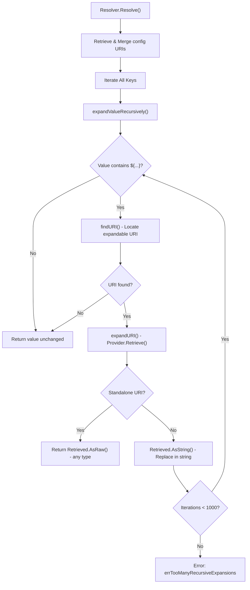
Sources: [confmap/expand.go:28-40](), [confmap/expand.go:72-78](), [confmap/expand.go:149-187]()

---

## Unmarshaling and Type Preservation

### The ExpandedValue Mechanism

When a value is loaded via a provider, the collector tracks both the parsed value and the original string representation. This allows the system to use the parsed value (like an `int` or `map`) for structured fields while preserving the string for inline expansion in templates. [confmap/internal/decoder.go:92-97]()

**Diagram: Data Flow from URI to Config Struct**

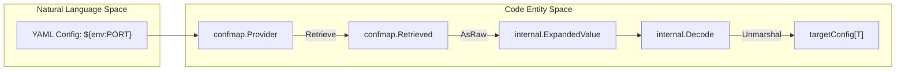
Sources: [confmap/internal/decoder.go:92-94](), [confmap/internal/decoder.go:98-131](), [confmap/expand.go:169-172]()

The `internal.Decode` function [confmap/internal/decoder.go:53-90]() uses a `mapstructure.Decoder` with custom hooks. The `useExpandValue` hook [confmap/internal/decoder.go:98-131]() determines which representation of an `internal.ExpandedValue` to use based on the target Go type.

**Type Selection Logic** [confmap/internal/decoder.go:104-128]():
- If the target field is a `reflect.String`, the decoder uses the original string representation.
- If the target is a pointer and the parsed value is `nil`, it uses the parsed value to allow `nil` pointer assignment.
- Otherwise, it uses the parsed/typed value (e.g., `int` for a port field).

Sources: [confmap/internal/decoder.go:53-170](), [confmap/confmap.go:20-31](), [confmap/internal/e2e/types_test.go:91-253]()

---

## Dynamic Configuration and Watching

### Configuration Hot-Reload

The configuration system supports hot-reloading by monitoring providers for changes. The `Resolver` maintains a list of `closers` for all retrieved values to clean up resources during re-resolution. [confmap/resolver.go:30](), [confmap/resolver.go:177]()

**Dynamic Reload Sequence**:
1. The `confmap.Resolver` registers a `confmap.WatcherFunc` with the provider during retrieval. [confmap/provider.go:77]()
2. A `confmap.Provider` monitors its source (e.g., a file or environment variable).
3. When a change is detected, the provider triggers the `WatcherFunc` with a `ChangeEvent`. [confmap/provider.go:98-105]()
4. The `Resolver` receives this on its `watcher` channel and signals the service to restart the resolution cycle. [confmap/resolver.go:158](), [confmap/resolver.go:78-84]()

**Diagram: Resolver Watcher Sequence**

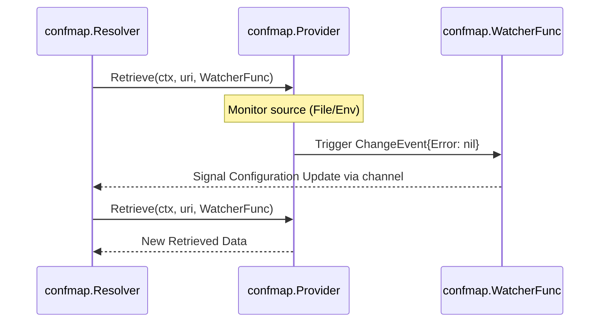
Sources: [confmap/provider.go:39-53](), [confmap/resolver.go:78-84](), [confmap/resolver.go:158]()

---

## Advanced Unmarshaling Features

### Custom Unmarshaling Logic
Components can implement the `confmap.Unmarshaler` interface to take full control over how they are loaded from a `Conf` object. [confmap/confmap.go:44-46]() The decoder recognizes this interface and executes the custom logic during the `unmarshalerHookFunc` phase. [confmap/internal/decoder.go:72]()

### Mapstructure Integration
The system heavily utilizes `mapstructure` tags for mapping configuration keys to Go struct fields. [confmap/internal/decoder.go:19-23]() The `internal.Decode` function configures the decoder with several specialized hooks [confmap/internal/decoder.go:61-77]():
- `mapstructure.StringToSliceHookFunc(",")`: Converts comma-separated strings to slices. [confmap/internal/decoder.go:64]()
- `mapstructure.StringToTimeDurationHookFunc()`: Decodes `time.Duration` from strings. [confmap/internal/decoder.go:66]()
- `mapstructure.TextUnmarshallerHookFunc()`: Supports types implementing `encoding.TextUnmarshaler`. [confmap/internal/decoder.go:67]()
- `expandNilStructPointersHookFunc`: Ensures nil values in maps resolve to zero-value struct pointers instead of remaining `nil`. [confmap/internal/decoder.go:148-170]()
- `scalarUnmarshalerHookFunc`: Handles types implementing `ScalarUnmarshaler` for wrapper types around primitives. [confmap/internal/decoder.go:71]()

### Configuration Merging and Converters
After URI expansion, the `Resolver` applies `Converters` to the final `Conf`. [confmap/resolver.go:203-207]() Converters are used to perform programmatic transformations, such as migrating legacy keys or injecting default values across the entire configuration map. [confmap/README.md:28-32]()

Sources: [confmap/internal/decoder.go:19-170](), [confmap/confmap.go:44-46](), [confmap/resolver.go:203-207](), [confmap/README.md:28-32]()

# Protocol Configuration


## Purpose and Scope

This document describes the shared configuration structures used across OpenTelemetry Collector components for network protocols. These reusable configuration packages (`configgrpc`, `confighttp`, `configtls`, `configauth`, `confignet`, `configcompression`, `configoptional`, `configmiddleware`) provide consistent, standardized settings for gRPC and HTTP communication, enabling receivers and exporters to configure network protocols uniformly.

## Configuration Package Architecture

The protocol configuration system is organized into specialized packages that compose together to provide comprehensive network protocol settings. The core packages handle gRPC and HTTP protocols, while supporting packages provide cross-cutting concerns like TLS, authentication, compression, and network addressing.

### Code Entity Space to System Names

The following diagram maps internal Go configuration structs to their functional roles within the Collector's network stack.

| System Name | Code Entity | File Path |
| :--- | :--- | :--- |
| **TLS Config** | `configtls.Config` | [config/configtls/configtls.go:34-90]() |
| **HTTP Client** | `confighttp.ClientConfig` | [config/confighttp/compression.go:165-169]() |
| **gRPC Client** | `configgrpc.ClientConfig` | [config/configgrpc/README.md:8-30]() |
| **Network Address** | `confignet.AddrConfig` | [config/confignet/confignet.go:76-93]() |
| **Auth Reference** | `configauth.Config` | [config/configauth/configauth.go:26-31]() |
| **Compression** | `configcompression.Type` | [config/configcompression/compressiontype.go:12-14]() |
| **Telemetry Level** | **`configtelemetry.Level`** | [config/configtelemetry/configtelemetry.go:30-30]() |
| **Optional Value** | **`configoptional.Optional[T]`** | [config/configoptional/optional.go:33-40]() |

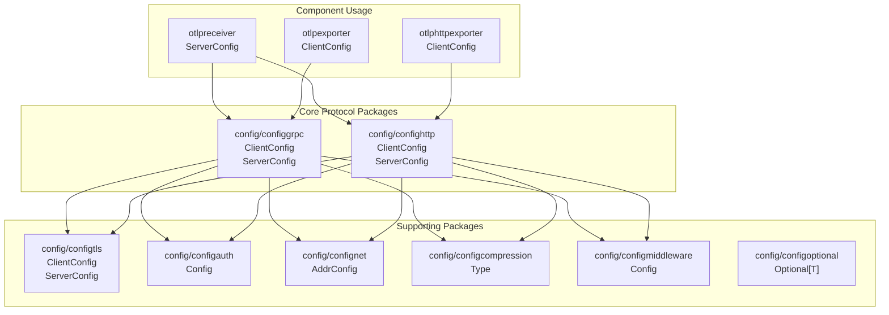

**Sources:** [config/configtls/configtls.go:34-90](), [config/configauth/configauth.go:26-31](), [config/confignet/confignet.go:76-93](), [config/configtelemetry/configtelemetry.go:30-30](), [config/configoptional/optional.go:33-40]()

## TLS Configuration (`configtls`)

The `configtls` package provides structures to configure TLS for both clients and servers. It supports loading certificates from files or PEM-encoded strings, and advanced features like certificate reloading and TPM integration.

### Configuration Structures
*   **`Config`**: The base structure containing common fields like `CAFile`, `CAPem`, `CertFile`, `KeyFile`, `MinVersion`, and `CipherSuites` [config/configtls/configtls.go:34-90]().
*   **`ClientConfig`**: Extends `Config` with client-specific fields such as `Insecure`, `InsecureSkipVerify`, and `ServerName` [config/configtls/configtls.go:100-119]().
*   **`ServerConfig`**: Extends `Config` with server-specific fields like `ClientCAFile` for mTLS [config/configtls/configtls.go:131-147]().

### Dynamic Behavior
*   **Certificate Reloading**: If `ReloadInterval` is set, the `certReloader` will check and reload certificates from disk without restarting the component [config/configtls/configtls.go:159-188]().
*   **TPM Support**: The configuration supports loading keys via TPM keyfiles, integrated through `github.com/foxboron/go-tpm-keyfiles` [config/configtls/go.mod:6-6](). It supports owner authorization and specific device paths [config/configtls/README.md:182-186]().
*   **Insecure Ciphers**: While deprecated, insecure cipher suites can be explicitly enabled via `IncludeInsecureCipherSuites` for legacy compatibility [config/configtls/configtls.go:72-77]().

**Sources:** [config/configtls/configtls.go:34-188](), [config/configtls/README.md:1-186]()

## HTTP Protocol Configuration (`confighttp`)

The `confighttp` package handles the complexities of HTTP/1.1 and HTTP/2 communication, including connection pooling, CORS, and content decompression.

### HTTP Client and Server Features
*   **Client**: Supports connection pooling (`max_idle_conns`), timeouts, cookies, and proxy settings [config/confighttp/README.md:17-65]().
*   **Server**: Integrates CORS (Cross-Origin Resource Sharing) allowing configuration of `allowed_origins`, `allowed_headers`, and `exposed_headers` [config/confighttp/README.md:94-111]().
*   **Timeouts**: Provides granular control over `read_timeout`, `read_header_timeout`, `write_timeout`, and `idle_timeout` [config/confighttp/README.md:119-122]().

### Content Decompression
The `httpContentDecompressor` middleware automatically handles compressed requests. It identifies the format via the `Content-Encoding` header and uses registered decoders [config/confighttp/compression_test.go:212-212]().
*   **Supported Algorithms**: `gzip`, `zstd`, `zlib`, `snappy`, `deflate`, `lz4`, and `x-snappy-framed` [config/confighttp/compression.go:28-30]().
*   **Snappy Auto-detection**: The `newSnappyHandler` can distinguish between snappy block format and framing format by peeking at the stream header [config/confighttp/compression.go:139-154](). It also validates `maxRequestBodySize` to prevent decompression bombs [config/confighttp/compression.go:168-171]().

### Data Flow: HTTP Request Processing
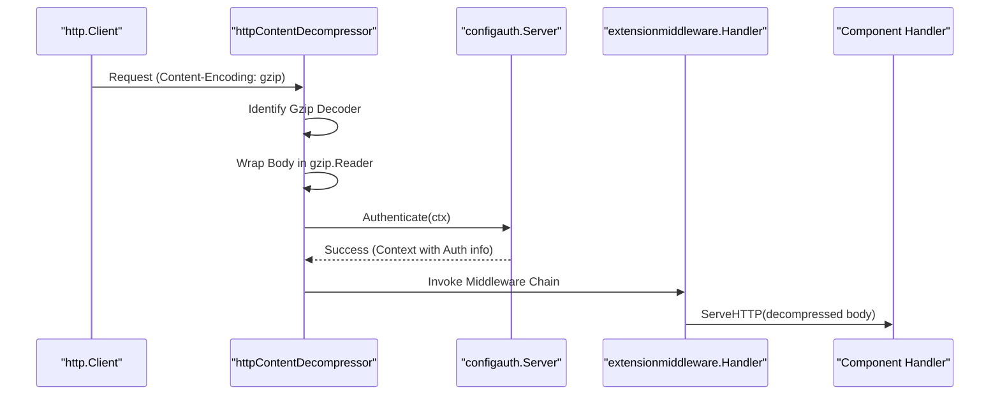
**Sources:** [config/confighttp/compression.go:64-118](), [config/confighttp/README.md:94-128](), [config/configauth/configauth.go:35-44]()

## Authentication Configuration (`configauth`)

Authentication in the Collector is handled by referencing `extension` components. The `configauth.Config` struct holds an `AuthenticatorID` which points to an auth extension [config/configauth/configauth.go:26-31]().

### Authenticator Resolution
Components resolve the actual authenticator at runtime using helper functions:
*   **`GetServerAuthenticator`**: Resolves an `extensionauth.Server` for receivers [config/configauth/configauth.go:35-44]().
*   **`GetHTTPClientAuthenticator`**: Resolves an `extensionauth.HTTPClient` for HTTP exporters [config/configauth/configauth.go:49-57]().
*   **`GetGRPCClientAuthenticator`**: Resolves an `extensionauth.GRPCClient` for gRPC exporters [config/configauth/configauth.go:62-70]().

**Sources:** [config/configauth/configauth.go:1-70]()

## Network Configuration (`confignet`)

The `confignet` package provides a unified way to define network endpoints and transport protocols.

### Address Configuration
The `AddrConfig` struct defines an `Endpoint` and a `Transport` type [config/confignet/confignet.go:76-93]().
*   **Supported Transports**: `tcp`, `udp`, `ip`, `unix`, and Windows named pipes (`npipe`) [config/confignet/confignet.go:17-32]().
*   **Functionality**: It provides `Dial` and `Listen` methods that abstract away the underlying `net.Dialer` or `net.ListenConfig` [config/confignet/confignet.go:103-118]().

**Sources:** [config/confignet/confignet.go:1-118]()

## Exporter Infrastructure (`exporterhelper`)

The `exporterhelper` provides common operational configuration for network-bound exporters.

### Retry and Queuing
Exporters leverage shared logic for:
*   **`retry_on_failure`**: Implements exponential backoff with `initial_interval` (default 5s) and `max_elapsed_time` (default 300s) [exporter/exporterhelper/README.md:10-17]().
*   **`sending_queue`**: Manages an in-memory or persistent buffer. Supports different `sizer` types: `requests`, `items`, or `bytes` [exporter/exporterhelper/README.md:21-31]().
*   **`batch`**: Allows partitioning data into separate batches based on `metadata_keys` [exporter/exporterhelper/README.md:61-68]().

### Persistent Queue
When `storage` is configured, the queue uses a storage extension (like `filestorage`) to survive collector restarts [exporter/exporterhelper/README.md:79-89](). Note that context from Auth extensions is **not** propagated through persistent storage [exporter/exporterhelper/README.md:91-92]().

**Sources:** [exporter/exporterhelper/README.md:1-92]()

## Optional Configuration and Telemetry

### Optional Values (`configoptional`)
The `configoptional.Optional[T]` generic type represents a value that may or may not be present [config/configoptional/optional.go:33-40](). It supports three "flavors":
1.  **`None`**: No value is present, behaving like a nil pointer during unmarshaling [config/configoptional/optional.go:103-108]().
2.  **`Some`**: A value is explicitly present [config/configoptional/optional.go:80-85]().
3.  **`Default`**: A default value used for unmarshaling struct types [config/configoptional/optional.go:90-95]().

It implements `confmap.Unmarshaler` to handle the `enabled` field logic: if `enabled: false` is set in configuration, the `Optional` becomes `None` regardless of other fields [config/configoptional/optional.go:173-208]().

### Telemetry Levels (`configtelemetry`)
Defines the `Level` of internal telemetry (metrics, logs, traces about the component itself) that components should generate [config/configtelemetry/configtelemetry.go:28-30]().
*   **`LevelNone`**: No telemetry collected [config/configtelemetry/configtelemetry.go:14-14]().
*   **`LevelBasic`**: Core Collector telemetry only [config/configtelemetry/configtelemetry.go:16-16]().
*   **`LevelNormal`**: Low-overhead telemetry [config/configtelemetry/configtelemetry.go:18-18]().
*   **`LevelDetailed`**: All available telemetry [config/configtelemetry/configtelemetry.go:20-20]().

**Sources:** [config/configoptional/optional.go:33-208](), [config/configtelemetry/configtelemetry.go:12-30]()

# Component System


## Purpose and Scope

This document provides a comprehensive overview of the component system in the OpenTelemetry Collector. The component system defines the fundamental component types (receivers, processors, exporters, connectors, and extensions), their common abstractions, factory patterns, and how they are instantiated from configuration.

For detailed information about specific component types and their lifecycle methods, see [Component Lifecycle and Factories](#4.1). For implementation details of individual component types, see [Receivers](#4.2), [Processors](#4.3), [Exporters](#4.4), and [Connectors and Extensions](#4.5). For information about how components are wired together into pipelines, see [Pipeline and Data Flow](#2.3).

## Component Types

The OpenTelemetry Collector organizes functionality into five distinct component types, each serving a specific role in the telemetry data processing pipeline. Components are identified by their `component.Kind` [component/component.go:87-97]().

### Component Abstraction Map

The following diagram bridges the natural language concepts of the collector to the specific code entities defined in the `component` package and signal-specific packages.

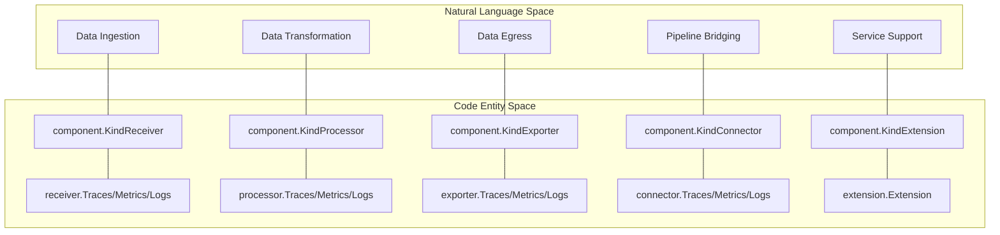
**Sources:** [component/component.go:91-96](), [receiver/receiver.go:15-40](), [processor/processor.go:15-31](), [exporter/exporter.go:15-31](), [connector/connector.go:28-62](), [extension/extension.go:16-18]()

### Receivers
Receivers accept telemetry data from external sources and convert it into the internal `pdata` format [receiver/receiver.go:15-40](). Each receiver translates vendor-specific formats into the OpenTelemetry Protocol Data Model.
*   **Implementations**: OTLP (gRPC/HTTP), nop, and scraper-based receivers.
*   **For details, see [Receivers](#4.2).**

### Processors
Processors transform, filter, or enrich telemetry data as it flows through the pipeline [processor/processor.go:15-31](). They operate on data in the internal `pdata` format and can modify, drop, or pass through data.
*   **Implementations**: batch, memory_limiter.
*   **For details, see [Processors](#4.3).**

### Exporters
Exporters convert telemetry data from the internal `pdata` format and transmit it to external destinations such as observability backends or storage systems [exporter/exporter.go:15-31]().
*   **Implementations**: OTLP, debug, nop.
*   **For details, see [Exporters](#4.4).**

### Connectors
Connectors act as both an exporter and a receiver, bridging multiple pipelines [connector/connector.go:16-18](). They allow routing data between pipelines of different or same signal types, such as creating metrics from spans [connector/connector.go:24-27]().
*   **For details, see [Connectors and Extensions](#4.5).**

### Extensions
Extensions provide functionality that does not participate directly in data pipelines but provides service-level capabilities like health checks, authentication, or performance profiling [extension/extension.go:13-15]().
*   **For details, see [Connectors and Extensions](#4.5).**

## Component Factory Pattern

The Collector uses a factory pattern to instantiate components from configuration. Each component kind has a specialized `Factory` interface that handles the creation of signal-specific instances.

### Factory Hierarchy

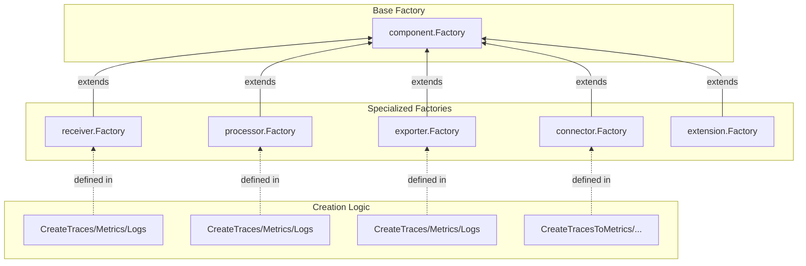
**Sources:** [component/component.go:182-194](), [receiver/receiver.go:60-91](), [processor/processor.go:51-82](), [exporter/exporter.go:51-79](), [connector/connector.go:81-118](), [extension/extension.go:37-47]()

### Settings and Configuration
Each factory requires two primary inputs for creation:
1.  **Config**: The user-defined configuration struct implementing `component.Config` [component/component.go:193]().
2.  **Settings**: Developer-set runtime information including the `component.ID`, `component.TelemetrySettings`, and `component.BuildInfo`.

| Component Type | Settings Structure | Definition |
| :--- | :--- | :--- |
| Receiver | `receiver.Settings` | [receiver/receiver.go:43-54]() |
| Processor | `processor.Settings` | [processor/processor.go:34-45]() |
| Exporter | `exporter.Settings` | [exporter/exporter.go:34-45]() |
| Connector | `connector.Settings` | [connector/connector.go:65-75]() |
| Extension | `extension.Settings` | [extension/extension.go:21-32]() |

**For details, see [Component Lifecycle and Factories](#4.1).**

## Component Lifecycle

Every component must implement the `component.Component` interface, which defines the basic lifecycle methods [component/component.go:25-62]().

1.  **Creation**: The component is created via its factory's `Create*` call using `component.Factory` [component/component.go:18-19]().
2.  **Start**: The `Start(ctx, host)` method is called. Components should return quickly; long-running tasks should run in the background [component/component.go:32-43]().
3.  **Running**: The component processes data or provides services.
4.  **Shutdown**: The `Shutdown(ctx)` method is called to stop all background operations and flush buffers [component/component.go:52-61]().

**For details, see [Component Lifecycle and Factories](#4.1).**

## Stability Levels

Components and their individual signal implementations are assigned a `component.StabilityLevel` [component/component.go:103-117](). This level informs users whether a component is suitable for production use.

| Level | Description |
| :--- | :--- |
| `Development` | Not all pieces in place, may change frequently [component/component.go:169](). |
| `Alpha` | Ready for limited non-critical workloads [component/component.go:111](). |
| `Beta` | Configuration is stable; suitable for broader usage [component/component.go:113](). |
| `Stable` | Ready for general availability and production [component/component.go:115](). |
| `Deprecated` | Will be removed in future releases [component/component.go:167](). |
| `Unmaintained` | Actively looking for contributors [component/component.go:165](). |

**Sources:** [component/component.go:109-117](), [component/component.go:163-179](), [docs/component-stability.md:25-105]()

## Naming and Coding Guidelines

Components must adhere to specific naming conventions to ensure consistency across the project:
*   **Component Identifiers**: Must use `lower_snake_case` (e.g., `memory_limiter`, `otlp_http`) [docs/coding-guidelines.md:14-23]().
*   **Go Packages**: Follow standard Go naming (lowercase, no underscores) [docs/coding-guidelines.md:16-17]().
*   **Struct Suffixes**: Use `Config` for user-facing YAML structures and `Settings` for developer-set runtime structures [docs/coding-guidelines.md:66-72]().

**Sources:** [docs/coding-guidelines.md:10-72]()

# Component Lifecycle and Factories


## Purpose and Scope

This page explains how components in the OpenTelemetry Collector are created and managed throughout their lifecycle. It covers the factory pattern used to instantiate components, the `Settings` structures that provide runtime context, and the lifecycle methods (`Start`, `Shutdown`) that control their runtime behavior.

For information about specific component implementations, see [Receivers](#4.2), [Processors](#4.3), [Exporters](#4.4), and [Connectors and Extensions](#4.5). For details on how components are organized into pipelines, see [Pipeline and Data Flow](#2.3).

---

## Factory Pattern Overview

The OpenTelemetry Collector uses the **factory pattern** to create component instances. Each component type (receiver, processor, exporter, connector, extension) has a corresponding factory interface that defines how to create instances of that component type.

### Factory Responsibilities

Factories serve three primary purposes:

1. **Type Registration**: Identify the component type (e.g., `otlp`, `batch`, `debug`) using `component.Type` [component/component.go:183-184]().
2. **Default Configuration**: Provide default configuration values via `CreateDefaultConfig()` [component/component.go:186-194]().
3. **Component Creation**: Instantiate components with specific configurations for different signals (Traces, Metrics, Logs, Profiles).

### Factory Implementation Examples

Component factories are typically defined using helper packages like `xreceiver`, `xprocessor`, and `xexporter`. These helpers allow registering creation functions for specific telemetry signals.

| Component Kind | Example Factory Creation | Source |
|----------------|--------------------------|--------|
| Receiver | `receiver.Factory` | [receiver/receivertest/nop_receiver.go:31-39]() |
| Processor | `processor.Factory` | [processor/processortest/nop_processor.go:30-38]() |
| Exporter | `exporter.Factory` | [exporter/exportertest/nop_exporter.go:30-39]() |

**Sources:** [component/component.go:181-194](), [exporter/exportertest/nop_exporter.go:29-39](), [processor/processortest/nop_processor.go:30-39](), [receiver/receivertest/nop_receiver.go:31-40]()

---

## Component Settings Structure

When components are instantiated, they receive a `Settings` structure that provides access to telemetry, build information, and the component identifier.

### Common Settings Elements

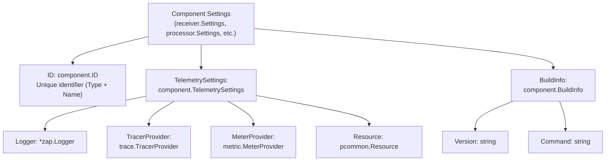

### Settings Naming Conventions

The codebase distinguishes between user-provided configuration and developer-provided settings:
- **Config**: Suffix for structs containing end-user YAML configuration (e.g., `nopConfig` in `nop_exporter.go`) [docs/coding-guidelines.md:69-70]().
- **Settings**: Suffix for structs set by developers in code (e.g., `component.TelemetrySettings`) [docs/coding-guidelines.md:71-72]().

**Sources:** [docs/coding-guidelines.md:64-72](), [component/telemetry.go:15-34](), [exporter/exportertest/nop_exporter.go:21-27](), [processor/processortest/nop_processor.go:21-27](), [receiver/receivertest/nop_receiver.go:23-28]()

---

## Component Lifecycle

Components in the OpenTelemetry Collector follow a strict lifecycle with four primary phases: **Creation**, **Start**, **Running**, and **Shutdown** [component/component.go:16-21]().

### Lifecycle Methods

All components must fulfill the `Component` interface:

```go
type Component interface {
    // Start tells the component to start.
    Start(ctx context.Context, host Host) error

    // Shutdown is invoked during service shutdown.
    Shutdown(ctx context.Context) error
}
```
[component/component.go:25-62]()

### Lifecycle State Machine

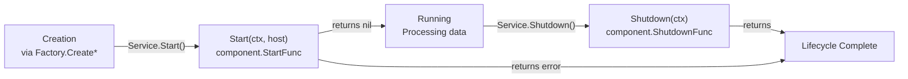

### Start Phase

The `Start` method is called to initialize the component.
- **Host**: The `component.Host` parameter allows components to communicate with the collector after `Start` returns [component/component.go:26-28](). It provides access to extensions via `GetExtensions()` [component/host.go:12-23]().
- **Blocking**: Long-running operations should be performed in the background; `Start` should return quickly [component/component.go:32-34]().
- **Context**: The context passed to `Start` is intended for the startup operation itself. Background tasks should create their own cancelable context [component/component.go:34-38]().

### Shutdown Phase

The `Shutdown` method gracefully terminates the component.
- **Data Acceptance**: After `Shutdown` is called, the component should stop accepting data [component/component.go:45-46]().
- **Safety**: Must be safe to call even if `Start` was never called or if the component is already shut down [component/component.go:48-50]().
- **Cleanup**: All background operations must be aborted before `Shutdown` returns [component/component.go:52-54]().

**Sources:** [component/component.go:14-62](), [component/component.go:64-84](), [component/host.go:12-23]()

---

## Component Creation and Stability

Factories define the stability level of the components they create. This level determines if a component is suitable for production use.

### Stability Levels

The `component.StabilityLevel` indicates the maturity of a component or a specific signal within a component [component/component.go:103-117]().

| Level | Description |
|-------|-------------|
| `Development` | Not all pieces are in place; may change often. Do not use in production [docs/component-stability.md:35-38](). |
| `Alpha` | Ready for limited non-critical workloads. Configuration may change with minimal notice [docs/component-stability.md:39-43](). |
| `Beta` | Configuration options are stable; suitable for broader usage [docs/component-stability.md:62-65](). |
| `Stable` | Ready for general availability. Comprehensive tests and benchmarks required [docs/component-stability.md:102-105](). |
| `Deprecated` | Will be removed in future releases [component/component.go:166-167](). |

### Signal-Specific Stability

A single factory can support multiple signals at different stability levels. For example, the `nop` exporter factory supports Traces/Metrics/Logs as `Stable` but Profiles as `Alpha`:

```go
func NewNopFactory() exporter.Factory {
	return xexporter.NewFactory(
		NopType,
		func() component.Config { return &nopConfig{} },
		xexporter.WithTraces(createTraces, component.StabilityLevelStable),
		xexporter.WithMetrics(createMetrics, component.StabilityLevelStable),
		xexporter.WithLogs(createLogs, component.StabilityLevelStable),
		xexporter.WithProfiles(createProfiles, component.StabilityLevelAlpha),
	)
}
```
[exporter/exportertest/nop_exporter.go:29-39]()

**Sources:** [component/component.go:103-180](), [docs/component-stability.md:25-111](), [exporter/exportertest/nop_exporter.go:29-39]()

---

## Component Naming and Identification

The Collector enforces strict naming conventions for components to ensure consistency in configuration files.

### Naming Conventions
- **Identifiers**: Components MUST use `lower_snake_case` in configuration (e.g., `memory_limiter`, `otlp_http`) [docs/coding-guidelines.md:14-17]().
- **Go Packages**: Package names follow standard Go conventions (lowercase, no underscores, e.g., `memorylimiterprocessor`) [docs/coding-guidelines.md:16-23]().

### Component ID Space
Components are identified by a `component.ID`, which consists of a `Type` and an optional `Name` [exporter/exportertest/nop_exporter.go:23]().

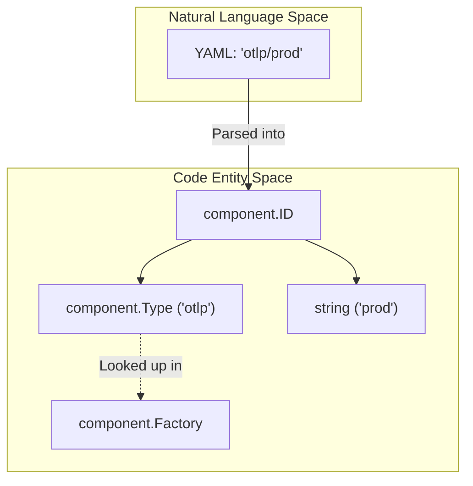

**Sources:** [docs/coding-guidelines.md:12-23](), [component/component.go:181-194](), [exporter/exportertest/nop_exporter.go:18-27]()

---

## Component Implementation Patterns

Most components do not implement the `Component` interface directly but use functional wrappers or helper structs.

### Functional Wrappers
The `component` package provides `StartFunc` and `ShutdownFunc` types that implement the `Component` interface, allowing developers to use simple functions for lifecycle management [component/component.go:64-84]().

```go
type nop struct {
	component.StartFunc
	component.ShutdownFunc
	consumertest.Consumer
}
```
[exporter/exportertest/nop_exporter.go:64-68]()

### Instantiation from Configuration
Components are instantiated by the service using their registered factories. The process involves creating a default config, unmarshaling the user configuration into it, and then calling the signal-specific `Create*` method on the factory.

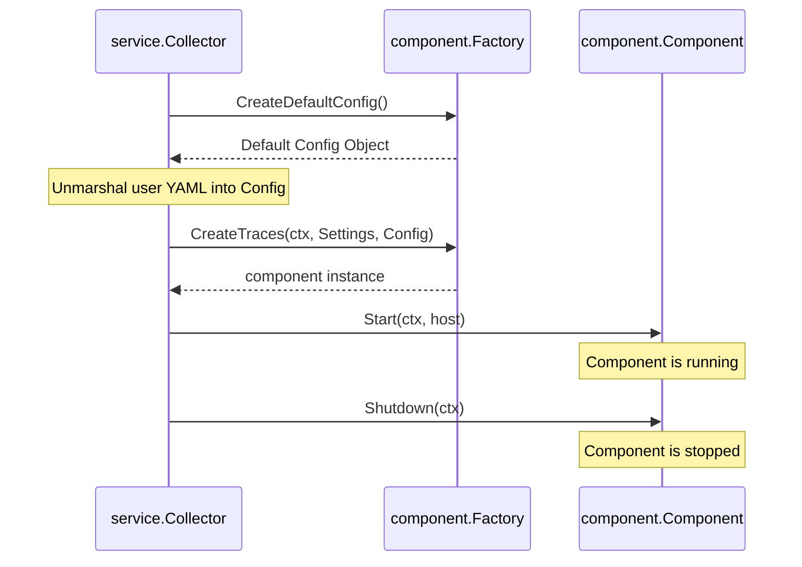

**Sources:** [component/component.go:64-84](), [exporter/exportertest/nop_exporter.go:41-68](), [component/component.go:181-194](), [exporter/exportertest/nop_exporter_test.go:22-52]()