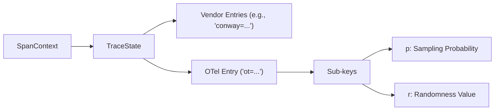
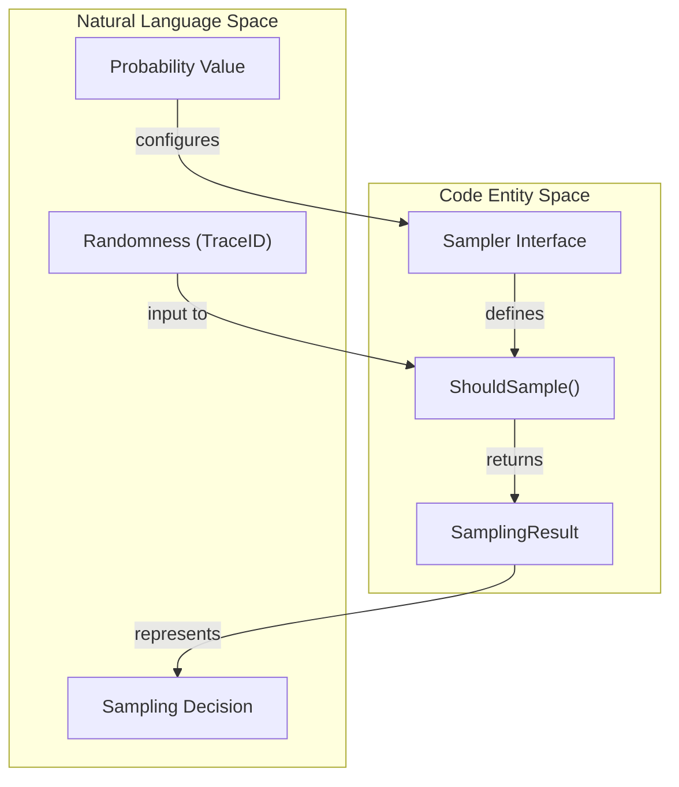
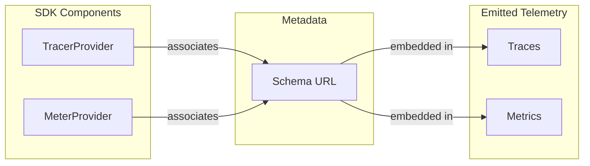
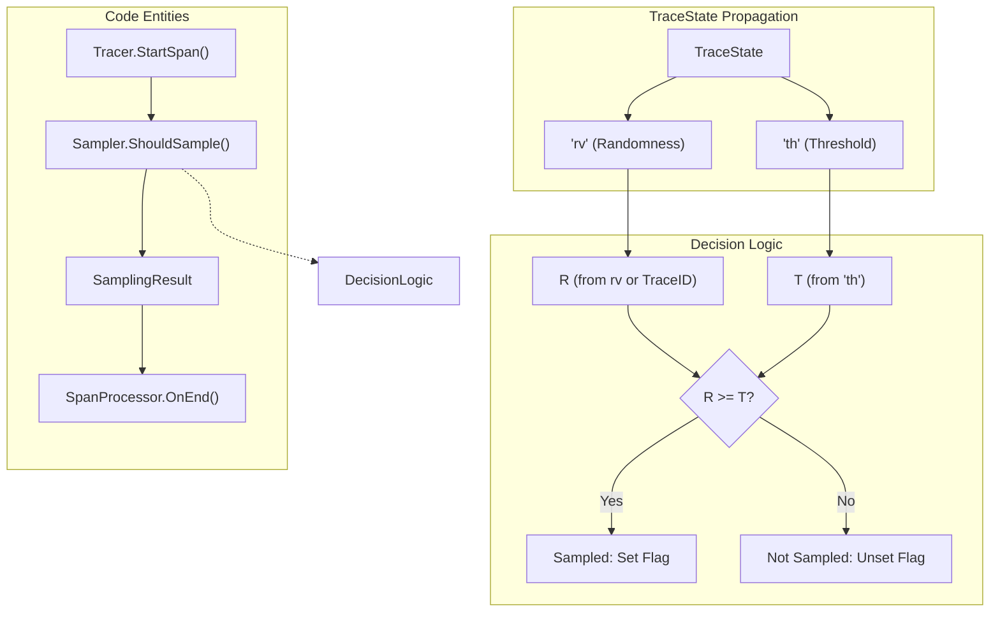
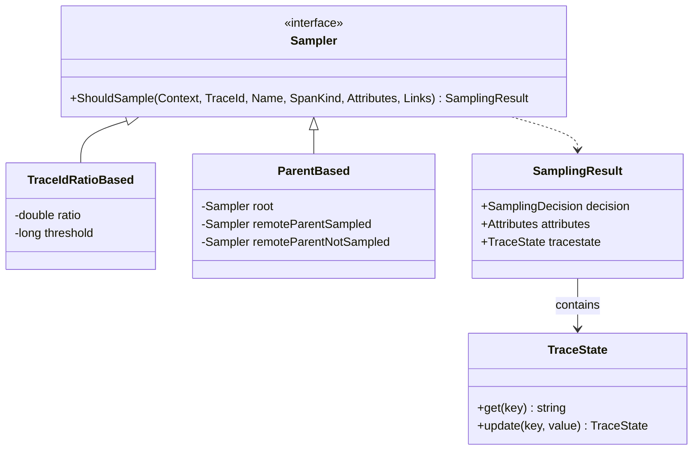
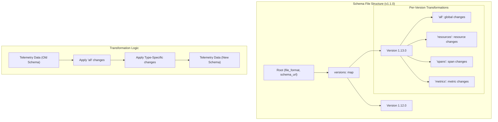
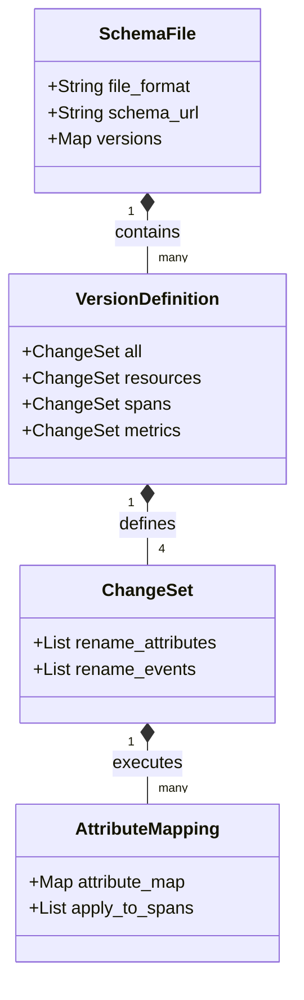
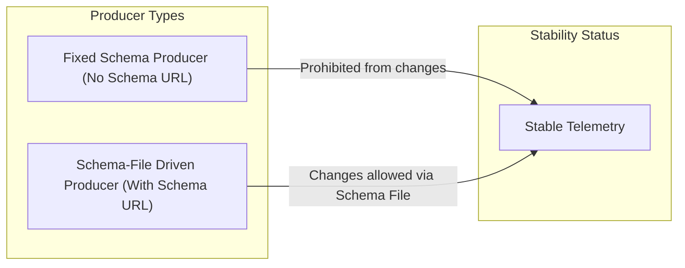

This page covers advanced concepts and techniques in the OpenTelemetry specification that extend beyond basic functionality. It includes high-level summaries of TraceState handling, probability sampling, and specialized architectural features.

For detailed implementation strategies and requirements, refer to the following child pages:
- **[Sampling](#10.1)**: Detailed explanation of sampling strategies, including `ParentBased`, `TraceIdRatioBased`, and consistent probability sampling.
- **[Schema Evolution](#10.2)**: Documentation of how OpenTelemetry handles telemetry schema versioning and attribute transformations.
- **[Metrics Data Model](#10.3)**: Deep dive into the OTLP metrics data model layers, aggregation temporality, and data point types.

## TraceState Handling

`TraceState` enables cross-service propagation of vendor-specific trace information and is a core component of the `SpanContext` [specification/trace/api.md:26-30](). It is primarily used to store and transmit sampling-related metadata that must persist across process boundaries.

### Key-Value Structure

`TraceState` consists of key-value pairs. OpenTelemetry-specific information is stored under the `ot` key with semicolon-separated values. When modifying `TraceState`, SDKs must preserve existing values from other vendors to ensure interoperability.

### Pre-defined OpenTelemetry Sub-keys

OpenTelemetry defines sub-keys for consistent sampling:
1.  **Sampling threshold value (`p`)**: Conveys the effective sampling probability.
2.  **Explicit randomness value (`r`)**: Provides an alternative source of randomness for sampling decisions when TraceIDs are not sufficiently random.

Sources:
- [specification/trace/api.md:26-30]()
- [specification/trace/sdk.md:25-31]()

## Probability Sampling

Probability sampling enables consistent sampling decisions across distributed traces. This ensures that if a root span is sampled at a specific rate, downstream child spans can make consistent decisions to preserve the complete trace.

### Consistent Probability Sampling Approach

The SDK provides built-in samplers like `TraceIdRatioBased` and `ProbabilitySampler` [specification/trace/sdk.md:35-41](). These samplers compare a source of randomness (typically the `TraceId`) against a calculated threshold.

For details, see [Sampling](#10.1).

Sources:
- [specification/trace/sdk.md:29-41]()

## Telemetry Schemas and Evolution

As OpenTelemetry semantic conventions evolve, the shape of telemetry data (attribute names, metric names) may change. Telemetry Schemas allow consumers to understand which version of the conventions a piece of telemetry follows.

### Schema URL

The `Schema URL` is an optional parameter in `TracerProvider.GetTracer` [specification/trace/api.md:137-138]() and `MeterProvider.GetMeter` [specification/metrics/api.md:141-146](). It identifies the specific schema version (e.g., `https://opentelemetry.io/schemas/1.10.0`) used by the instrumentation.

For details, see [Schema Evolution](#10.2).

Sources:
- [specification/trace/api.md:137-138]()
- [specification/metrics/api.md:141-146]()
- [specification/schemas/README.md:9-28]()

## SDK Advanced Configuration

The SDK is designed to be highly configurable and extensible through plugin interfaces.

### Tracer and Meter Providers

`TracerProvider` and `MeterProvider` are the stateful entry points for the API [specification/trace/api.md:88-98](), [specification/metrics/api.md:107-113](). They manage the lifecycle of signals, including `Shutdown` and `ForceFlush` operations [specification/trace/sdk.md:158-170]().

### Plugin Interfaces

The SDK allows for customization via:
-   **SpanProcessors**: Handle span start and end events (e.g., `Batching processor`) [specification/trace/sdk.md:66-75]().
-   **Exporters**: Send telemetry to backends (e.g., `OTLP Exporter`) [specification/trace/sdk.md:76-80]().
-   **IdGenerators**: Define how `TraceId` and `SpanId` are generated [specification/trace/sdk.md:64-65]().

Sources:
- [specification/trace/sdk.md:110-126]()
- [specification/trace/api.md:88-106]()
- [specification/metrics/api.md:107-120]()

## Metrics Data Model Refinements

The metrics system supports various instrument types including `Counter`, `Histogram`, and `Gauge` [specification/metrics/api.md:35-52](). Advanced usage involves understanding aggregation temporality (Delta vs. Cumulative) and how the SDK handles high-cardinality data.

For details, see [Metrics Data Model](#10.3).

Sources:
- [specification/metrics/api.md:166-175]()
- [specification/metrics/sdk.md:10-20]()

# Sampling

Sampling is a mechanism in OpenTelemetry that allows for the collection and analysis of a representative subset of telemetry data. This is essential for reducing the costs associated with processing and storing telemetry while maintaining statistically significant insights.

## Overview and Core Concepts

Sampling in OpenTelemetry can be performed independently for each span in a trace and at multiple points in the telemetry pipeline (e.g., at span creation in an SDK or downstream in a Collector) [specification/trace/tracestate-probability-sampling.md:46-55](). To prevent "broken" traces where some spans are missing, OpenTelemetry uses **Consistent Probability Sampling**.

### Key Definitions

*   **Sampling Probability**: The likelihood that a span will be kept, valid in the range $2^{-56}$ through 1 [specification/trace/tracestate-probability-sampling.md:79-87]().
*   **Consistent Sampling Decision**: A decision where a positive result at probability $p1$ implies a positive result for any span in the same trace at probability $p2 \geq p1$ [specification/trace/tracestate-probability-sampling.md:88-91]().
*   **Rejection Threshold (T)**: A 56-bit value derived from probability. $T = (1 - \text{Sampling Probability}) \times 2^{56}$ [specification/trace/tracestate-probability-sampling.md:92-101]().
*   **Randomness Value (R)**: A 56-bit source of randomness shared by all participants in a trace, either from the `rv` TraceState key or the TraceID [specification/trace/tracestate-probability-sampling.md:113-122]().
*   **Adjusted Count**: The reciprocal of the sampling probability ($1/p$). It represents how many spans in the population a single sampled span represents [oteps/trace/0170-sampling-probability.md:46-53]().

### Sampling Data Flow

Sources: [specification/trace/tracestate-probability-sampling.md:59-64](), [specification/trace/tracestate-probability-sampling.md:107-112](), [oteps/trace/0235-sampling-threshold-in-trace-state.md:45-48]()

---

## Built-in Samplers

OpenTelemetry SDKs must provide several standard samplers to support common use cases.

### Static Samplers
*   **AlwaysOn**: Returns `RECORD_AND_SAMPLE` for every span. Effective $T=0$ [oteps/trace/0235-sampling-threshold-in-trace-state.md:53-54]().
*   **AlwaysOff**: Returns `DROP` for every span. This is not considered a form of probability sampling [specification/trace/tracestate-probability-sampling.md:86-87]().

### TraceIdRatioBased Sampler
This sampler uses the TraceID as the source of randomness. It compares the least-significant 56 bits of the TraceID against a threshold calculated from the desired ratio [specification/trace/tracestate-probability-sampling.md:121-122]().

### ParentBased Sampler
A decorator that applies different sampling logic depending on whether a span has a parent and what the parent's sampling decision was. It typically respects the `sampled` flag of the parent context to ensure trace completeness [oteps/trace/0168-sampling-propagation.md:7-13]().

---

## Consistent Probability Sampling Implementation

Consistent sampling relies on two values in the `TraceState`: `rv` (Randomness Value) and `th` (Threshold).

### Threshold Encoding (`th`)
The `th` key represents the maximum threshold applied in previous stages. It is expressed as up to 14 hexadecimal digits. Trailing zeros may be omitted for efficiency (e.g., `th=c` is equivalent to `th=c0000000000000`) [oteps/trace/0235-sampling-threshold-in-trace-state.md:66-74]().

### Randomness Encoding (`rv`)
If the TraceID is known to be random, `R` is derived from the lowest 56 bits of the TraceID. If the TraceID is not random or a group of traces must be sampled together, an explicit `rv` key is added to the `TraceState` [oteps/trace/0235-sampling-threshold-in-trace-state.md:56-62]().

### Decision Algorithm
The sampler performs the following logic:
1.  **Retrieve R**: From `rv` key or TraceID [oteps/trace/0235-sampling-threshold-in-trace-state.md:56-59]().
2.  **Retrieve T**: From `th` key. If `th` is missing, the sampling is non-probabilistic [oteps/trace/0235-sampling-threshold-in-trace-state.md:51-52]().
3.  **Evaluate**: If $R \geq T$, the span is sampled [oteps/trace/0235-sampling-threshold-in-trace-state.md:47]().
4.  **Update**: If a new sampling rate is applied that is stricter (higher $T$), the `th` value in `TraceState` MUST be updated to the new $T$ [oteps/trace/0235-sampling-threshold-in-trace-state.md:22-23]().

### Threshold Examples

| Sampling Rate | Rejection Threshold (Hex) | `th` Value |
| :--- | :--- | :--- |
| 100% | `00000000000000` | `0` |
| 75% | `40000000000000` | `4` |
| 25% | `c0000000000000` | `c` |
| 1% | `fd70a400000000` | `fd70a4` |

Sources: [specification/trace/tracestate-probability-sampling.md:103-109](), [oteps/trace/0235-sampling-threshold-in-trace-state.md:71-74]()

---

## Advanced Components

### Composite Samplers
Composite samplers allow for combining multiple sampling strategies. When multiple probability samplers are used, the effective decision is typically the logical OR (if any sampler says to keep, the span is kept), and the resulting `th` value is the minimum of all applied thresholds (the highest probability) [oteps/trace/0170-sampling-probability-sampling.md:31-33]().

### AlwaysRecord Decorator
In some scenarios, it is useful to record spans (for local debugging or z-pages) even if they are not sampled for export. An `AlwaysRecord` decorator can modify a `SamplingResult` to set the decision to `RECORD_ONLY` if the underlying sampler returned `DROP` [oteps/trace/4673-experimental-probability-sampling.md:113-118]().

### TraceState Threshold Handling
When a downstream sampler (like a Collector) decides to drop a span that was previously marked for sampling, it must increase the `th` value to reflect the new, lower probability. This ensures that the "Adjusted Count" calculated by the backend remains accurate [oteps/trace/0235-sampling-threshold-in-trace-state.md:88-91]().

## System Entity Mapping

Sources: [specification/trace/tracestate-probability-sampling.md:167-179](), [oteps/trace/0235-sampling-threshold-in-trace-state.md:87-92]()

---
Sources:
*   [specification/trace/tracestate-probability-sampling.md:46-122]()
*   [oteps/trace/0235-sampling-threshold-in-trace-state.md:1-94]()
*   [oteps/trace/0170-sampling-probability.md:44-53]()
*   [oteps/trace/0168-sampling-propagation.md:1-13]()
*   [oteps/trace/4673-experimental-probability-sampling.md:107-118]()

# Schema Evolution

## Purpose and Scope

Schema Evolution in OpenTelemetry provides a mechanism to decouple the evolution of three independent parties: telemetry sources (instrumentation), telemetry consumers (backends), and OpenTelemetry semantic conventions [specification/schemas/README.md:55-59](). It addresses the challenge where changing an attribute name in a new version of the specification might break dashboards or analysis tools that expect the old name [specification/schemas/README.md:42-45]().

## Core Concepts

### Schema URL
A Schema URL is a unique identifier for a specific version of a telemetry schema [specification/schemas/README.md:105-106](). It is typically in the format `https://opentelemetry.io/schemas/<version>`, where `<version>` matches the specification version [specification/schemas/README.md:119-122]().

### Telemetry Schema File
A Schema File is a YAML document that defines the transformations necessary to convert telemetry data between different versions within a schema family [specification/schemas/file_format_v1.1.0.md:9-12]().

### Stability Moratorium
Currently, there is a moratorium on relying on schema transformations for telemetry stability [specification/telemetry-stability.md:52-53](). Until this is lifted, "Stable" instrumentations are treated as "Fixed Schema Producers" and are prohibited from changing produced telemetry [specification/telemetry-stability.md:85-88]().

## Schema File Format (v1.0.0 and v1.1.0)

OpenTelemetry defines a specific file format for these definitions. Version 1.1.0 is the current development standard [specification/schemas/file_format_v1.1.0.md:7]().

### Structure and Data Flow

The schema file is organized by version numbers, each containing sub-sections for specific telemetry types: `all`, `resources`, `spans`, `span_events`, `metrics`, and `logs` [specification/schemas/file_format_v1.1.0.md:45-69]().

Sources: [specification/schemas/file_format_v1.1.0.md:14-107]()

### Transformation Types

| Transformation | Applicable Sections | Description |
| :--- | :--- | :--- |
| `rename_attributes` | All | Maps old attribute keys to new keys [specification/schemas/file_format_v1.1.0.md:85-90](). |
| `rename_events` | `span_events` | Changes the name of events [specification/schemas/file_format_v1.1.0.md:180-182](). |
| `rename_metrics` | `metrics` | Changes the name of metrics [oteps/0152-telemetry-schemas.md:20](). |

## Natural Language to Code Entity Mapping

The following diagram bridges the conceptual "Schema Evolution" to the actual entities defined in the specification and YAML files.

Sources: [specification/schemas/file_format_v1.1.0.md:18-69](), [schemas/1.13.0:1-11]()

## Implementation and Version History

The `schemas/` directory contains the history of these transformations. For example, version 1.13.0 introduced renames for network attributes to align with socket address conventions [schemas/1.13.0:8-11]().

### Attribute Rename Example (v1.13.0)
In [schemas/1.13.0:8-11](), the following mapping is defined for spans:
- `net.peer.ip` → `net.sock.peer.addr`
- `net.host.ip` → `net.sock.host.addr`

### Attribute Rename Example (v1.8.0)
In [schemas/1.12.0:11-14](), database-specific keys were unified:
- `db.cassandra.keyspace` → `db.name`
- `db.hbase.namespace` → `db.name`

## Stability Guarantees

The signal lifecycle (Development, Stable, Deprecated, Removed) interacts with schema evolution [specification/versioning-and-stability.md:68-70]().

1.  **Backward Compatibility**: Code written against older API versions MUST work with newer versions [specification/versioning-and-stability.md:58-59]().
2.  **Telemetry Stability**: Stable instrumentations that include a Schema URL are called "Schema-File Driven Telemetry Producers" [specification/telemetry-stability.md:82-84]().
3.  **Breaking Changes**: If a transformation is not reversible (e.g., mapping two different old attributes to one new attribute), it is considered an incompatible change, requiring a MAJOR version bump [specification/schemas/file_format_v1.1.0.md:111-116]().

Sources: [specification/telemetry-stability.md:68-98]()

## Key Files and Directories
- `specification/schemas/`: Contains the schema file format definitions and overview [specification/schemas/README.md:1-10]().
- `schemas/`: Root directory for published OpenTelemetry schema files (e.g., `1.13.0`, `1.12.0`) [schemas/1.13.0:1-2]().
- `specification/telemetry-stability.md`: Defines the rules for when instrumentations can adopt schema changes [specification/telemetry-stability.md:1-4]().

Sources: [specification/schemas/README.md](), [specification/telemetry-stability.md](), [schemas/1.13.0]()