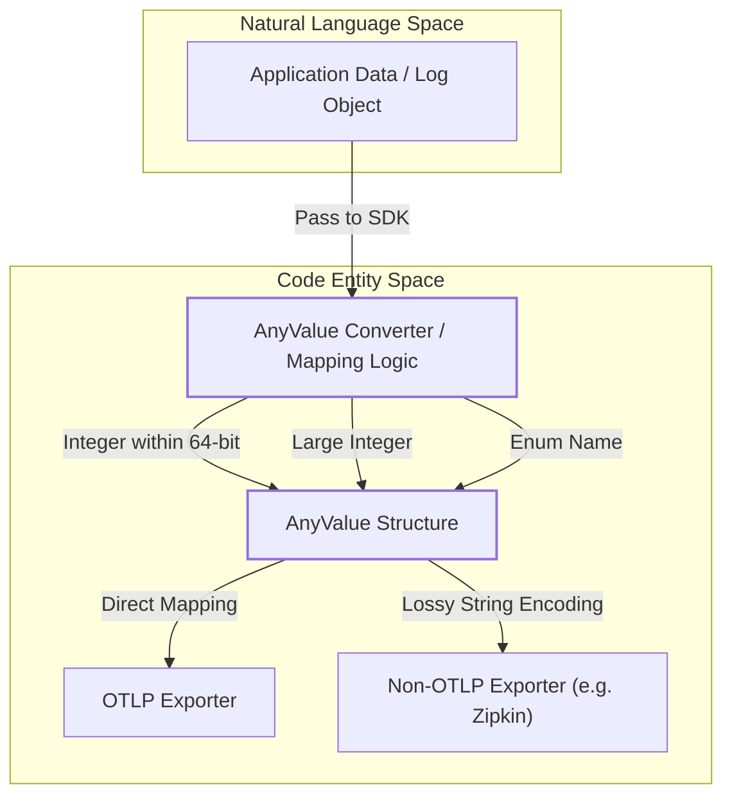
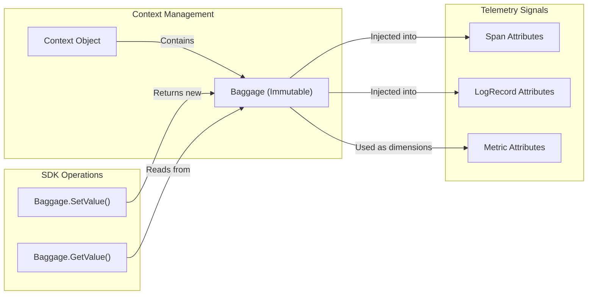

The OpenTelemetry Common Data Model provides a unified type system and structural foundation for all telemetry signals (traces, metrics, and logs). By standardizing how data is represented and named, OpenTelemetry ensures interoperability across different programming languages and backend systems.

## AnyValue Type System

`AnyValue` is the core data structure used to represent arbitrary values in OpenTelemetry. It is designed to be flexible enough to represent primitive types, complex nested structures, and even JSON-like objects.

### Supported Types
`AnyValue` can represent the following:
*   **Primitives**: String, Boolean, Double precision floating point (IEEE 754), and Signed 64-bit integer [specification/common/README.md:43-46]().
*   **Byte Arrays**: Raw byte sequences [specification/common/README.md:49]().
*   **Arrays**: Either a homogeneous array of primitive types or a generic array of `AnyValue` [specification/common/README.md:47-50]().
*   **Maps**: A `map<string, AnyValue>` which allows for arbitrary deep nesting [specification/common/README.md:51-56]().
*   **Empty Values**: Language-specific null representations (e.g., `null`, `None`, `nil`) [specification/common/README.md:52-53]().

### Map Semantics
Maps within the `AnyValue` system must preserve key case sensitivity [specification/common/README.md:82-83](). Implementations are required to enforce unique keys by default when exporting, typically by removing duplicates [specification/common/README.md:87-90]().

### Non-OTLP Representation
For protocols that do not natively support the `AnyValue` type system, values are converted to strings using specific encoding rules to minimize data loss:

| Type | Encoding Rule | Example |
| :--- | :--- | :--- |
| **Boolean** | JSON boolean | `true` |
| **Integer** | JSON number | `42` |
| **Float** | JSON number; NaN/Inf as strings | `3.14`, `NaN` |
| **Byte Array** | Base64 | `aGVsbG8=` |
| **Empty** | Empty string | `""` |
| **Array** | JSON array | `[1, "two"]` |

**Sources:** [specification/common/README.md:41-102](), [specification/common/README.md:103-175](), [specification/common/attribute-type-mapping.md:48-150]()

---

## Attributes

Attributes are key-value pairs used to annotate telemetry with metadata. An attribute key MUST be a non-empty string, and the value MUST be a non-null `AnyValue` (primitive, array of primitives, or nested structure) [specification/common/README.md:29]().

### Attribute Limits
To prevent unbounded memory consumption and "cardinality explosions," the OpenTelemetry SDK provides configurable limits for attributes:

*   **Attribute Count**: The maximum number of attributes allowed per entity (Span, LogRecord, etc.) [specification/common/README.md:33-34]().
*   **Attribute Value Length**: The maximum length of string values.
*   **Handling Overflows**: When limits are reached, additional attributes MUST be dropped. SDKs SHOULD record the count of dropped attributes in a field named `otel.dropped_attributes_count` [specification/common/mapping-to-non-otlp.md:73-80]().

### Requirement Levels
Attributes in Semantic Conventions are assigned requirement levels to guide instrumentation authors:
*   **Required**: Must always be present.
*   **Recommended**: Should be present if the information is available.
*   **Opt-In**: Only present if explicitly configured.

**Sources:** [specification/common/README.md:29-35](), [specification/common/mapping-to-non-otlp.md:73-80](), [specification/common/attribute-requirement-level.md:1-10]()

---

## Data Flow and Conversion

The following diagram illustrates how arbitrary data from an application or logging library is transformed into the OpenTelemetry `AnyValue` model and eventually exported.

### Logic Flow: Data to AnyValue Mapping

**Sources:** [specification/common/attribute-type-mapping.md:33-45](), [specification/common/README.md:103-112]()

---

## Attribute Collection and Context Interaction

Attributes are often collected from the execution context, such as `Baggage`. While `Baggage` and `Attributes` both use key-value pairs, `Baggage` is intended for propagation across process boundaries, whereas `Attributes` are intended for static annotation of a specific signal.

### Component Relationship: Attributes, Baggage, and Context

**Sources:** [specification/baggage/api.md:30-58](), [specification/context/README.md:32-40](), [specification/metrics/README.md:35-40]()

---

## Naming Conventions

OpenTelemetry follows a strict namespace-based naming convention for attributes to avoid collisions between different instrumentation libraries.

*   **Namespacing**: Attributes should be prefixed with the library or service name (e.g., `http.method`, `db.system`).
*   **Case Sensitivity**: All attribute keys are case-sensitive [specification/common/README.md:82-83]().
*   **Character Set**: Keys should use alphanumeric characters and dots (`.`) as separators.

### Instrumentation Scope Mapping
When exporting to formats that do not support the OTLP `InstrumentationScope` natively, the scope name and version are mapped to standard attributes:

| OTLP Field | Attribute Key |
| :--- | :--- |
| `InstrumentationScope.Name` | `otel.scope.name` |
| `InstrumentationScope.Version` | `otel.scope.version` |

**Sources:** [specification/common/attribute-naming.md:1-9](), [specification/common/mapping-to-non-otlp.md:29-39](), [specification/common/README.md:82-83]()