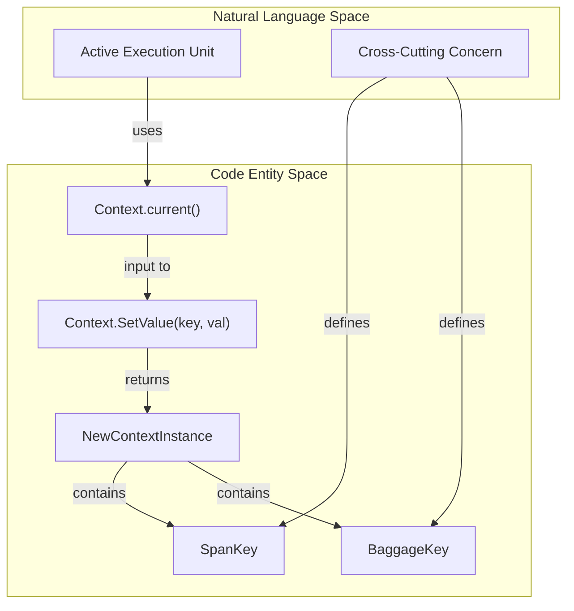
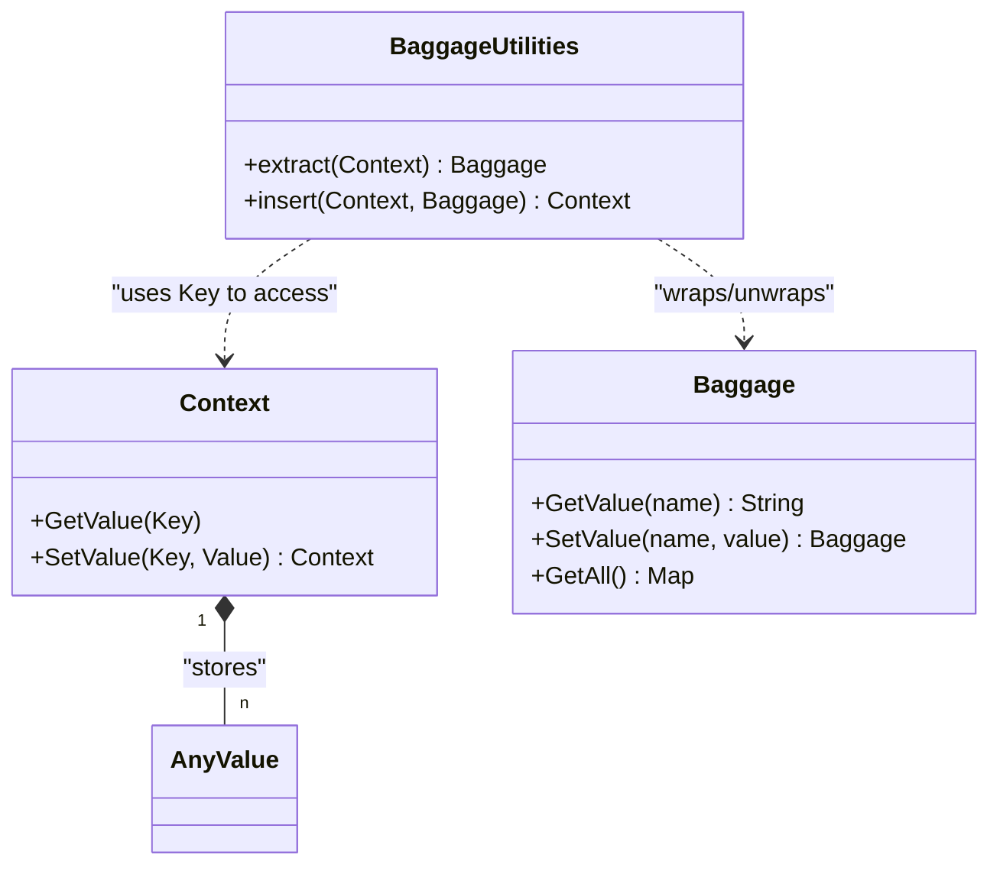

The Context API and Baggage form the foundation for distributed propagation in OpenTelemetry. While the **Context API** provides an internal mechanism for carrying execution-scoped values across API boundaries, **Baggage** leverages this mechanism to propagate application-defined properties across process boundaries.

## 1. Context API

A `Context` is a propagation mechanism that carries execution-scoped values between logically associated [execution units](specification/glossary.md) [specification/context/README.md:32-33](). It acts as a shared container for cross-cutting concerns (like tracing and baggage) to access data in-process [specification/context/README.md:34-35]().

### Immutability and Safety
To ensure thread safety and predictable behavior, a `Context` MUST be immutable [specification/context/README.md:37](). Any "write" operation does not modify the existing object but instead results in a new `Context` containing the updated values [specification/context/README.md:37-39]().

### Key Operations
The API defines three primary operations for interacting with the data container:

| Operation | Description | Parameters |
| :--- | :--- | :--- |
| `CreateKey` | Generates a unique, opaque identifier to prevent key collisions between different libraries [specification/context/README.md:56-61](). | `Name` (for debugging) [specification/context/README.md:63-65]() |
| `GetValue` | Retrieves a value associated with a specific key from a given `Context` [specification/context/README.md:69-79](). | `Context`, `Key` [specification/context/README.md:74-75]() |
| `SetValue` | Creates a new `Context` containing the provided key-value pair [specification/context/README.md:81-92](). | `Context`, `Key`, `Value` [specification/context/README.md:88-90]() |

### Global Context Management
In languages that support implicit context (e.g., Java ThreadLocal or Go Context), the API provides global operations to manage the "Active" context:
*   **Attach**: Associates a `Context` with the current execution unit and returns a `Token` [specification/context/README.md:105-114]().
*   **Detach**: Restores the previous `Context` using the `Token` [specification/context/README.md:119-134]().

**Diagram: Context Data Flow**
This diagram illustrates how the `Context` remains immutable while allowing different concerns (Tracing/Baggage) to store state.

Sources: [specification/context/README.md:32-134](), [oteps/0066-separate-context-propagation.md:52-72]()

---

## 2. Baggage API

`Baggage` is a set of application-defined properties (name/value pairs) contextually associated with a distributed request [specification/baggage/api.md:32-38](). It is used to annotate telemetry by adding contextual information to metrics, traces, and logs [specification/baggage/api.md:34-35]().

### Baggage Structure
*   **Names**: Case-sensitive, non-empty UTF-8 strings [specification/baggage/api.md:43-57]().
*   **Values**: Case-sensitive UTF-8 strings [specification/baggage/api.md:53-57]().
*   **Metadata**: Optional opaque string wrapper associated with a pair [specification/baggage/api.md:122-124]().
*   **Uniqueness**: Unlike the W3C Baggage spec, OpenTelemetry Baggage MUST associate each name with exactly one value [specification/baggage/api.md:38-41]().

### Operations
The Baggage API MUST be functional even if no SDK is installed to ensure transparent propagation [specification/baggage/api.md:79-82]().

*   **GetValue(Name)**: Returns the value for a specific name [specification/baggage/api.md:89-98]().
*   **GetAllValues()**: Returns all pairs as an immutable collection or iterator [specification/baggage/api.md:99-104]().
*   **SetValue(Name, Value, Metadata)**: Returns a **new** immutable Baggage container with the added/updated entry [specification/baggage/api.md:106-124]().
*   **RemoveValue(Name)**: Returns a **new** immutable Baggage container without the specified entry [specification/baggage/api.md:126-133]().

### Context Interaction
Baggage interacts with the `Context` API using internal keys. API users are provided with helper functions to avoid direct key manipulation [specification/baggage/api.md:149-151]():
*   **Extract Baggage**: Retrieves the `Baggage` from a `Context` [specification/baggage/api.md:146]().
*   **Insert Baggage**: Places a `Baggage` instance into a `Context` [specification/baggage/api.md:147]().

**Diagram: Baggage and Context Relationship**
Showing how `Baggage` entities map to `Context` storage.

Sources: [specification/baggage/api.md:69-168](), [specification/context/README.md:70-92]()

---

## 3. Propagation and Distributed Tracing

### W3C Baggage Propagation
OpenTelemetry includes a `TextMapPropagator` that implements the [W3C Baggage Specification](https://www.w3.org/TR/baggage/) [specification/baggage/api.md:184-186](). This allows baggage to travel across process boundaries via HTTP headers or other carriers.

### Relationship with Tracing and Metrics
Baggage serves as a bridge between different telemetry signals:
*   **Tracing**: Attributes from Baggage can be added to Spans to provide business context (e.g., `customer_id`) [specification/baggage/api.md:34-35]().
*   **Metrics**: Metrics can be enriched via Baggage and Context, allowing correlation via exemplars [specification/metrics/README.md:35-37]().
*   **Conflict Resolution**: If a new baggage item is received with a duplicate name, the new value MUST replace the old value [specification/baggage/api.md:191-193]().

### Security and Trust
To prevent leaking sensitive data to untrusted downstream services, the API MUST provide a way to **Clear Baggage** from a context, typically by returning a new `Context` associated with an empty `Baggage` object [specification/baggage/api.md:169-177]().

Sources: [specification/baggage/api.md:178-193](), [specification/metrics/README.md:32-40](), [oteps/0066-separate-context-propagation.md:102-119]()