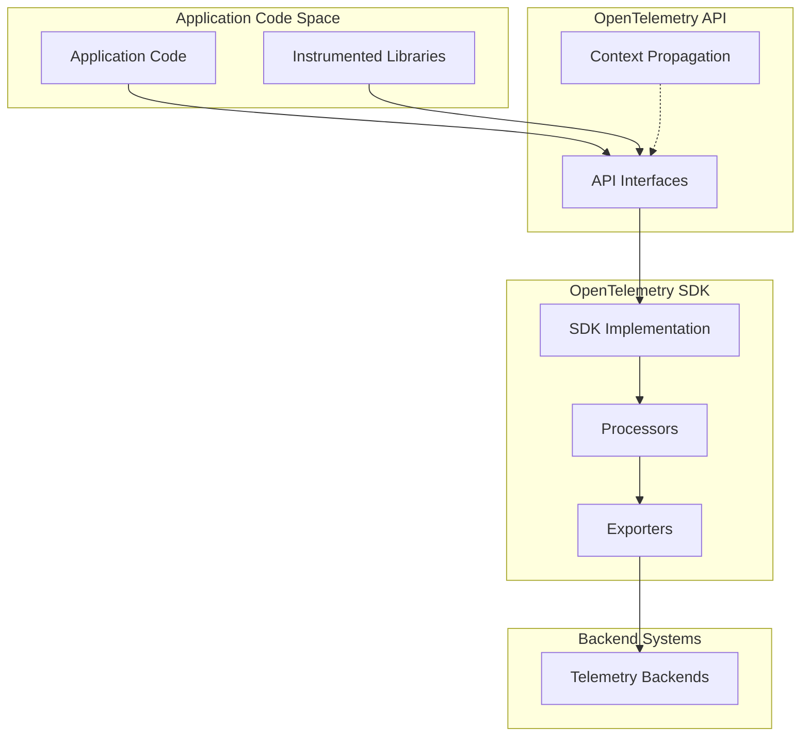
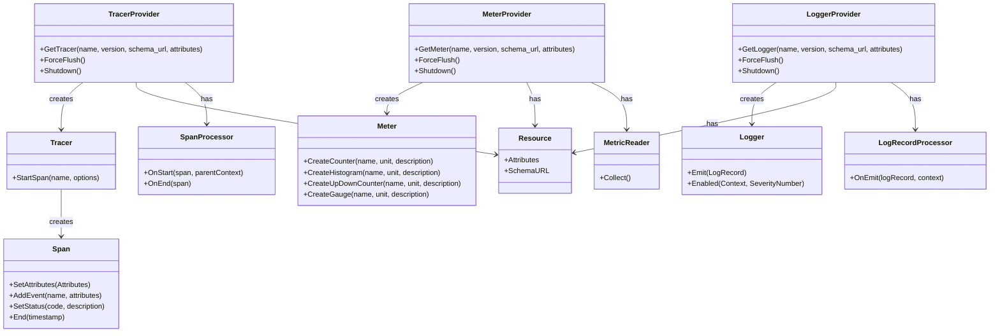
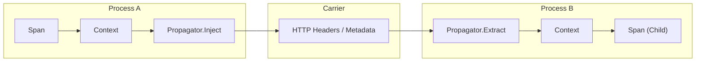
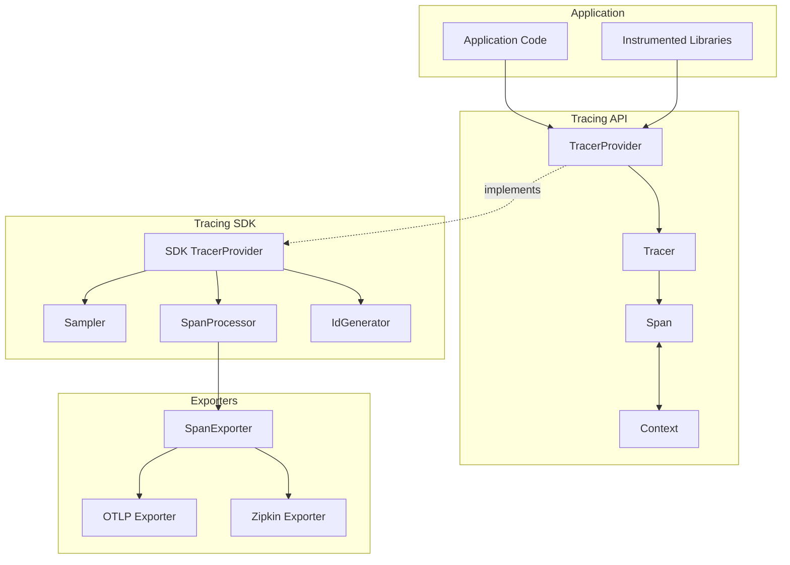
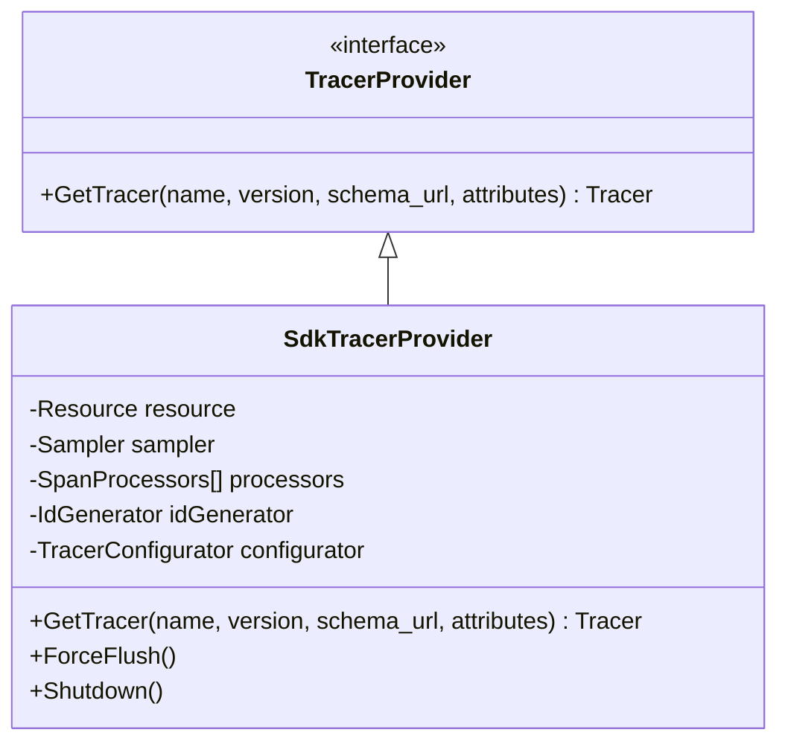
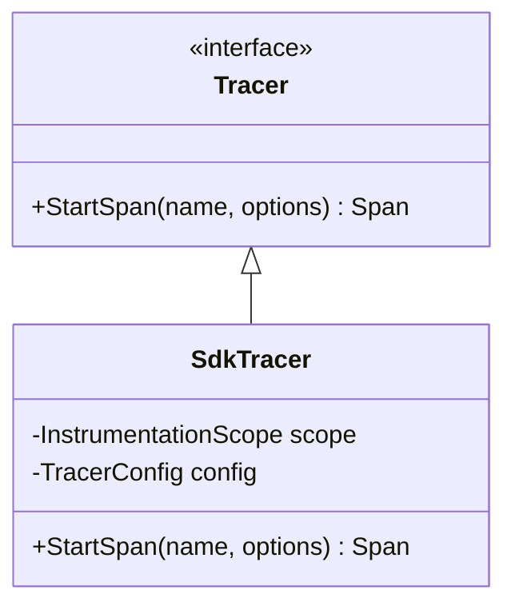
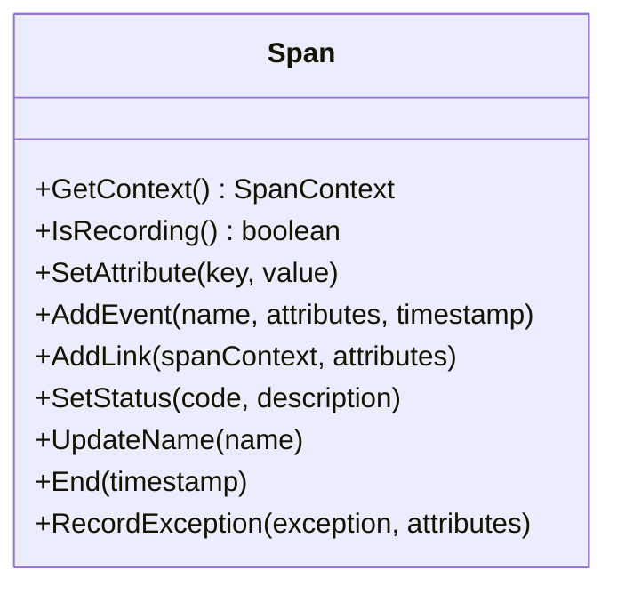
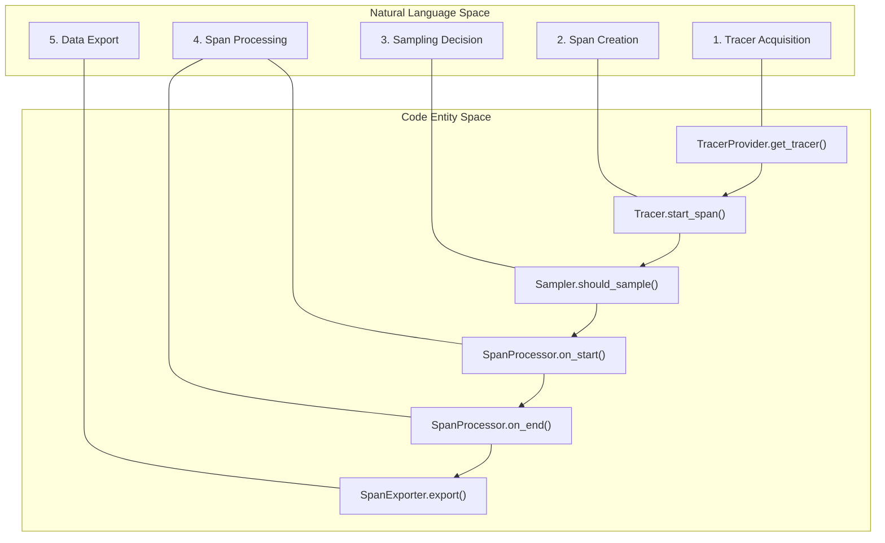

This document provides an overview of the main components that comprise the OpenTelemetry framework. It explains the key building blocks across all telemetry signals (traces, metrics, logs, and profiles) and how they interact within the OpenTelemetry architecture.

## Architecture Overview

OpenTelemetry is structured around a layered architecture that separates API definitions from their implementations (SDK). This separation allows instrumentation to depend only on the API, while applications can configure how telemetry is processed and exported.

Sources: [specification/overview.md:46-69](), [specification/trace/api.md:51-51](), [specification/metrics/sdk.md:100-106]()

## Core Component Relationships

The following diagram bridges the natural language concepts of OpenTelemetry to the specific code entities defined in the specification.

Sources: [specification/trace/api.md:109-158](), [specification/metrics/api.md:121-153](), [specification/logs/api.md:66-96](), [specification/trace/sdk.md:66-80](), [specification/metrics/sdk.md:69-82](), [specification/logs/sdk.md:30-40]()

## Provider Components

Providers are the entry points to the OpenTelemetry API and serve as factories for signal-specific components.

### TracerProvider
The `TracerProvider` is the entry point for the tracing API [specification/trace/api.md:59-60](). It provides access to `Tracer` instances and holds configuration like `SpanProcessor`s and `Sampler`s [specification/trace/sdk.md:111-116](). For details, see [Tracing System](#3.1).

### MeterProvider
The `MeterProvider` is the entry point for the metrics API [specification/metrics/api.md:74-75](). It manages `Meter` instances and owns configuration for `MetricExporters`, `MetricReaders`, and `Views` [specification/metrics/sdk.md:143-149](). For details, see [Metrics System](#3.2).

### LoggerProvider
The `LoggerProvider` is the entry point for the logging API [specification/logs/api.md:42-42](). It manages the lifecycle of `Logger` instances and `LogRecordProcessor`s [specification/logs/sdk.md:92-96](). For details, see [Logging System](#3.3).

## Signal Components

### Tracing
The tracing signal captures the path of a request through a distributed system.
- **Tracer**: Creates `Span` instances [specification/trace/api.md:61-61]().
- **Span**: Represents a single operation, containing attributes, events, and status [specification/trace/api.md:62-62]().
- **SpanContext**: Contains the data required to propagate traces across process boundaries, such as `TraceId` and `SpanId` [specification/trace/api.md:26-30]().

### Metrics
The metrics signal captures raw measurements that are aggregated into time series.
- **Meter**: Creates metric instruments [specification/metrics/api.md:76-76]().
- **Instrument**: Used to report measurements (e.g., `Counter`, `Histogram`, `Gauge`) [specification/metrics/api.md:77-78]().
- **Aggregation**: Defines how measurements are combined (e.g., Sum, Explicit Bucket Histogram) [specification/metrics/sdk.md:27-38]().

### Logging
The logging signal handles discrete events, often used for legacy log integration.
- **Logger**: Emits `LogRecord`s [specification/logs/api.md:43-44]().
- **LogRecord**: A data model representing a log entry, including `Body`, `SeverityNumber`, and `Timestamp` [specification/logs/data-model.md:161-166]().
- **Log Appender/Bridge**: Bridges existing logging frameworks (like Log4j or Zap) to the OpenTelemetry Logs API [specification/logs/supplementary-guidelines.md:31-38]().

### Profiling (Alpha)
The profiling signal provides continuous profiling data based on the `pprof` format [CHANGELOG.md:69-72](). It correlates with other signals via span context references. For details, see [Profiling Signal](#3.4).

## Cross-Cutting Components

### Resource
A `Resource` represents the entity producing telemetry, such as a container or a cloud instance [specification/glossary.md:133-133](). Attributes on the `Resource` are associated with all telemetry produced by a provider [specification/metrics/sdk.md:111-115]().

### Context and Propagators
Context propagation allows signals to be correlated.
- **Context**: A cross-cutting concern that carries execution-scoped values [specification/context/api-propagators.md:54-56]().
- **Propagator**: Injects and extracts context data (like `SpanContext` or `Baggage`) to and from network carriers [specification/context/api-propagators.md:48-52]().

Sources: [specification/context/api-propagators.md:87-113](), [specification/trace/api.md:161-171]()

## Data Flow Summary

Telemetry is created via the **API**, processed by the **SDK** (via `Processors` or `Readers`), and finally sent to backends via **Exporters**.

| Signal | Creator | Data Entity | Processor/Reader | Exporter |
| :--- | :--- | :--- | :--- | :--- |
| **Traces** | `Tracer` | `Span` | `SpanProcessor` | `SpanExporter` |
| **Metrics** | `Meter` | `Measurement` | `MetricReader` | `MetricExporter` |
| **Logs** | `Logger` | `LogRecord` | `LogRecordProcessor` | `LogRecordExporter` |

Sources: [specification/trace/sdk.md:66-76](), [specification/metrics/sdk.md:69-75](), [specification/logs/sdk.md:30-44]()

# Tracing System

This document provides a detailed overview of the OpenTelemetry Tracing System, covering both the API and SDK components. It explains the core concepts, architecture, and data flow of the distributed tracing functionality in OpenTelemetry. For information about metrics collection, see [Metrics System](3.2).

## Overview

The OpenTelemetry Tracing System enables applications to record and propagate execution context through a distributed system. It allows developers to understand the flow of requests across service boundaries, identify performance bottlenecks, and diagnose errors across complex distributed applications.

Sources: [specification/trace/api.md:57-62](), [specification/trace/sdk.md:92-125]()

## Core Components

The Tracing System consists of these main components:

### TracerProvider

The `TracerProvider` is the entry point to the OpenTelemetry Tracing API. It is responsible for:

- Creating and managing `Tracer` instances via the `Get a Tracer` API [specification/trace/api.md:113-141]().
- Maintaining configuration such as `SpanProcessors`, `Sampler`, and `IdGenerator` [specification/trace/sdk.md:110-125]().
- Providing access to global functionality and managing lifecycle operations like `Shutdown` and `ForceFlush` [specification/trace/sdk.md:158-200]().

Applications typically access `TracerProvider` from a central place, and the API provides a way to set/register and access a global default `TracerProvider` [specification/trace/api.md:92-98]().

Sources: [specification/trace/api.md:88-113](), [specification/trace/sdk.md:92-125]()

### Tracer

The `Tracer` is responsible for creating `Span` instances [specification/trace/api.md:61-61](). Each `Tracer` instance is associated with an `InstrumentationScope` (containing name, version, and attributes) which allows telemetry to be associated with the code that generated it [specification/trace/sdk.md:101-104]().

Sources: [specification/trace/api.md:183-217](), [specification/trace/sdk.md:173-195]()

### Span

A `Span` represents a single operation within a trace. Spans are the fundamental units of tracing and encapsulate:

- The span name and `SpanKind` [specification/trace/api.md:303-315]().
- A `SpanContext` that uniquely identifies the span [specification/trace/api.md:355-356]().
- A start and end time with nanosecond precision [specification/trace/api.md:71-87]().
- Attributes, events, and links [specification/trace/api.md:360-370]().
- Status information (Unset, Ok, Error) [specification/trace/api.md:559-601]().

Sources: [specification/trace/api.md:303-456](), [specification/trace/sdk.md:202-245]()

### SpanContext

The `SpanContext` represents the portion of a `Span` which must be serialized and propagated alongside a distributed context. It is immutable [specification/trace/api.md:221-224]().

- `TraceId`: 16-byte identifier [specification/trace/api.md:231-236]().
- `SpanId`: 8-byte identifier [specification/trace/api.md:238-243]().
- `TraceFlags`: 8-bit field, including the `Sampled` flag [specification/trace/api.md:245-256]().
- `TraceState`: Carries vendor-specific trace identification data as key-value pairs [specification/trace/api.md:267-301]().
- `IsRemote`: Boolean indicating if the context was extracted from a carrier [specification/trace/api.md:263-265]().

Sources: [specification/trace/api.md:221-301](), [specification/trace/tracestate-handling.md:29-46]()

## Data Flow in the Tracing System

The following diagram bridges the natural language concepts to the SDK code entities:

Sources: [specification/trace/sdk.md:16-85](), [specification/trace/api.md:57-62]()

## Sampling

Sampling controls the overhead by reducing the number of traces collected. The SDK provides a `Sampler` interface with a `ShouldSample` method [specification/trace/sdk.md:313-356]().

| Sampler | Description |
|---------|-------------|
| `AlwaysOn` | Returns `RECORD_AND_SAMPLE` for all spans [specification/trace/sdk.md:374-379](). |
| `AlwaysOff` | Returns `DROP` for all spans [specification/trace/sdk.md:381-386](). |
| `TraceIdRatioBased` | Samples based on a ratio using the TraceID as a source of entropy [specification/trace/sdk.md:388-403](). |
| `ParentBased` | Respects the sampling decision of the parent span [specification/trace/sdk.md:448-467](). |

Sources: [specification/trace/sdk.md:313-467]()

## Span Processor

A `SpanProcessor` provides hooks for the span lifecycle. Processors are only called for spans where `IsRecording` is true [specification/trace/sdk.md:677-681]().

- `OnStart`: Called when a span is started [specification/trace/sdk.md:714-722]().
- `OnEnd`: Called when a span is ended [specification/trace/sdk.md:738-745]().
- `Shutdown`: Closes the processor and releases resources [specification/trace/sdk.md:747-758]().

Built-in processors include the `SimpleSpanProcessor` (synchronous export) and `BatchingSpanProcessor` (asynchronous, high-performance export) [specification/trace/sdk.md:770-863]().

Sources: [specification/trace/sdk.md:677-863]()

## Span Exporter

The `SpanExporter` defines the interface for sending batches of spans to a telemetry backend [specification/trace/sdk.md:864-873]().

- `Export(batch)`: Sends a list of sampled spans [specification/trace/sdk.md:884-904]().
- `Shutdown()`: Stops the exporter [specification/trace/sdk.md:910-918]().

Common implementations include OTLP (OpenTelemetry Protocol), Zipkin, and standard output for debugging [specification/trace/sdk.md:925-990]().

Sources: [specification/trace/sdk.md:864-918]()

## Span Types and Context

### SpanKind

`SpanKind` describes the relationship between the span, its parents, and its children in a distributed system [specification/trace/api.md:740-746]().

- `INTERNAL`: Default, for operations within an application [specification/trace/api.md:752-753]().
- `SERVER`: For incoming synchronous requests [specification/trace/api.md:755-763]().
- `CLIENT`: For outgoing synchronous requests [specification/trace/api.md:765-773]().
- `PRODUCER`: For outgoing asynchronous messages [specification/trace/api.md:775-786]().
- `CONSUMER`: For incoming asynchronous messages [specification/trace/api.md:788-801]().

Sources: [specification/trace/api.md:740-801]()

### Exception Recording

Exceptions are recorded as specific `Events` on a span. The `RecordException` API automatically populates attributes like `exception.type`, `exception.message`, and `exception.stacktrace` [specification/trace/exceptions.md:42-55]().

Sources: [specification/trace/exceptions.md:9-40](), [specification/trace/api.md:434-456]()

## Trace Context Propagation

OpenTelemetry uses `Propagators` to move `SpanContext` across process boundaries [specification/context/api-propagators.md:48-55]().

- `Inject`: Injects the `SpanContext` into a carrier (e.g., HTTP headers) [specification/context/api-propagators.md:87-96]().
- `Extract`: Extracts the `SpanContext` from an incoming carrier [specification/context/api-propagators.md:98-113]().

The SDK includes support for W3C TraceContext and B3 propagation formats [specification/context/api-propagators.md:350-354]().

Sources: [specification/context/api-propagators.md:46-113](), [specification/trace/api.md:159-180]()