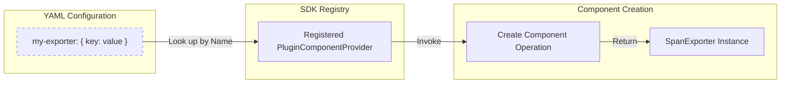

Declarative configuration provides a language-agnostic mechanism for configuring OpenTelemetry SDK components and instrumentation using a standardized file-based representation [specification/configuration/README.md:34-43](). It is more expressive than environment variables and allows for complex component trees to be defined in a structured format, typically YAML [specification/configuration/data-model.md:25-30]().

## Configuration Data Model

The data model defines the schema for specifying the intended state of OpenTelemetry SDKs. It is defined using JSON Schema in the `opentelemetry-configuration` repository [specification/configuration/data-model.md:28-30]().

### File-Based Representation
Configuration files are serialized versions of the data model.
*   **Format**: Files MUST use `.yaml` or `.yml` extensions and SHOULD follow the YAML 1.2 core schema [specification/configuration/data-model.md:52-58]().
*   **Environment Variable Substitution**: Values in the configuration file can reference environment variables using the `${VARIABLE_NAME}` or `${VARIABLE_NAME:-DEFAULT_VALUE}` syntax [specification/configuration/data-model.md:61-79]().
*   **Substitution Logic**: Substitution applies only to scalar values. Escape sequences like `$$` are used to represent a literal `$` [specification/configuration/data-model.md:120-136]().

### Data Flow: From File to SDK
The following diagram illustrates how a YAML configuration file is processed by the SDK components to initialize the telemetry system.

**Configuration Processing Pipeline**
```mermaid
graph TD
    subgraph "Natural Language Space (User Input)"
        YAML["config.yaml File"]
        ENV["Environment Variables"]
    end

    subgraph "Code Entity Space (SDK Implementation)"
        Parse["SDK parse() Operation"]
        Model["In-Memory Configuration Model"]
        Create["SDK create() Operation"]
        Provider["TracerProvider / MeterProvider / LoggerProvider"]
    end

    YAML -->|Input| Parse
    ENV -->|Substitution| Parse
    [specification/configuration/sdk.md:21-21]()

    Parse -->|Produces| Model
    [specification/configuration/sdk.md:53-57]()

    Model -->|Input| Create
    [specification/configuration/sdk.md:22-22]()

    Create -->|Instantiates| Provider
    [specification/configuration/sdk.md:157-160]()
```
**Sources:** [specification/configuration/sdk.md:21-22](), [specification/configuration/data-model.md:43-49](), [specification/configuration/sdk.md:53-57]()

---

## Configuration SDK

The Configuration SDK implements the logic required to transform the data model into live SDK components.

### Key Operations
1.  **`parse`**: Reads a configuration file, performs environment variable substitution, and returns an in-memory representation of the model [specification/configuration/sdk.md:149-155]().
2.  **`create`**: Interprets the in-memory model to instantiate SDK components like `TracerProvider`, `MeterProvider`, and `LoggerProvider` [specification/configuration/sdk.md:157-164]().

### SDK Extension Components (Plugins)
The SDK supports "plugin components" (extension plugin interfaces) which allow users to provide custom implementations for exporters, processors, and samplers [specification/configuration/sdk.md:74-77]().

*   **PluginComponentProvider**: An interface responsible for interpreting a `ConfigProperties` object and returning a specific SDK component implementation [specification/configuration/sdk.md:118-120]().
*   **Registration**: Providers must be registered with the SDK (e.g., via Java SPI or manual registration) to be available during the `create` operation [specification/configuration/sdk.md:121-127]().

**Plugin Component Resolution**

**Sources:** [specification/configuration/sdk.md:90-109](), [specification/configuration/sdk.md:118-120]()

---

## Instrumentation Configuration API

This API allows instrumentation libraries to consume specific configuration settings (e.g., which HTTP headers to capture) defined under the `.instrumentation` node of the configuration file [specification/configuration/api.md:25-29]().

### Core Components
*   **`ConfigProvider`**: The entry point for libraries to access their configuration. It provides a `get_instrumentation_config` function [specification/configuration/api.md:36-42]().
*   **`ConfigProperties`**: A programmatic, type-safe representation of a configuration mapping node. It supports accessors for scalars, sequences, and nested mappings [specification/configuration/api.md:68-81]().

| Component | Role | File Reference |
| :--- | :--- | :--- |
| `ConfigProvider` | Global entry point for configuration access | [specification/configuration/api.md:36-48]() |
| `ConfigProperties` | Schemaless accessor for YAML-like structures | [specification/configuration/api.md:68-75]() |
| `PluginComponentProvider` | Factory for custom SDK extensions | [specification/configuration/sdk.md:118-120]() |

**Sources:** [specification/configuration/api.md:32-48](), [specification/configuration/api.md:68-81](), [specification/configuration/sdk.md:118-120]()

---

## Implementation Guidelines

### Precedence and Merging
*   **Environment Variables**: If `OTEL_EXPERIMENTAL_CONFIG_FILE` is set, the standard environment variable configuration scheme (e.g., `OTEL_TRACES_EXPORTER`) is generally ignored in favor of the file content [specification/configuration/supplementary-guidelines.md:41-43]().
*   **Programmatic Precedence**: Programmatic updates to SDK components made after `create` has initialized them take precedence over the declarative file settings [specification/configuration/supplementary-guidelines.md:45-53]().

### Type Handling
*   **Boolean**: Must be "true" (case-insensitive) to be true; all other values are false [specification/configuration/sdk-environment-variables.md:66-74]().
*   **Numeric**: Values outside valid ranges (e.g., negative buffer sizes) SHOULD be ignored with a warning, falling back to defaults [specification/configuration/common.md:54-60]().
*   **Duration/Timeout**: Represented as integers in milliseconds [specification/configuration/common.md:79-82]().

**Sources:** [specification/configuration/supplementary-guidelines.md:20-53](), [specification/configuration/sdk-environment-variables.md:64-74](), [specification/configuration/common.md:39-60]()