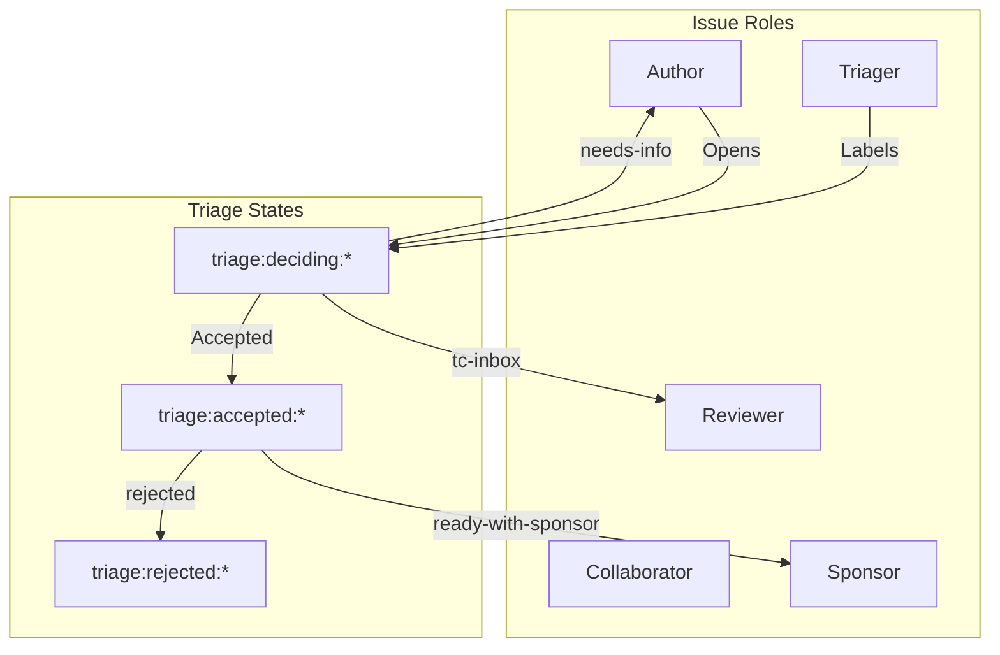
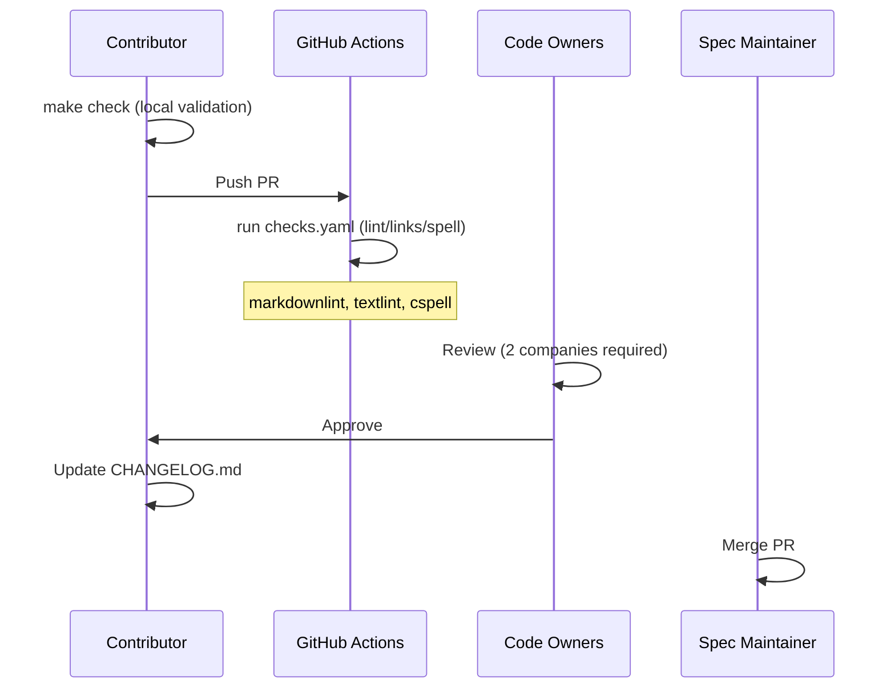
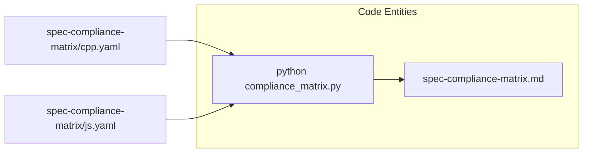
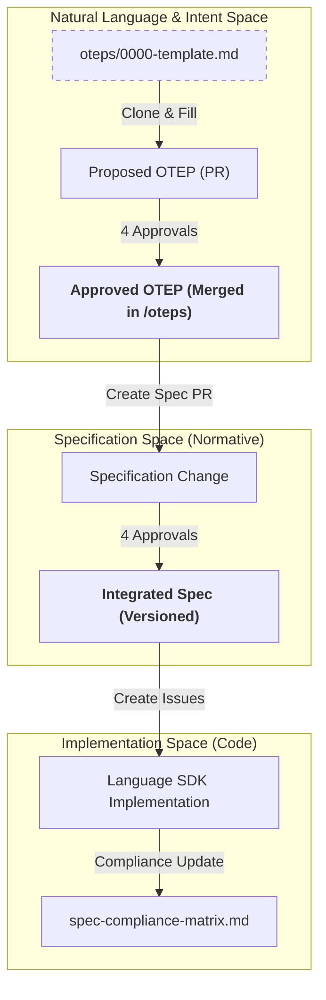
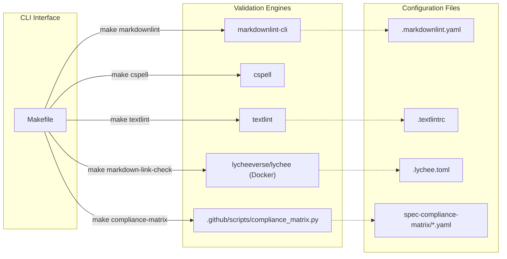
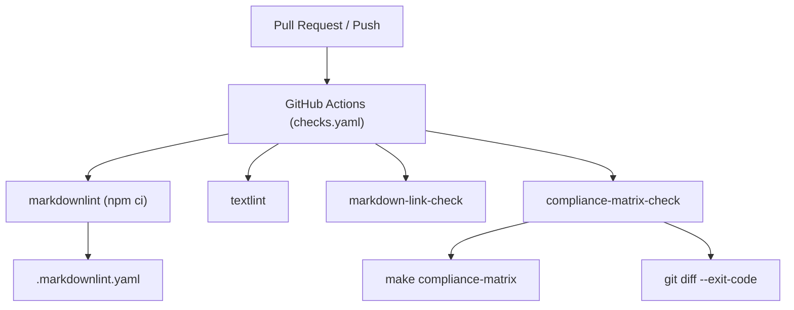
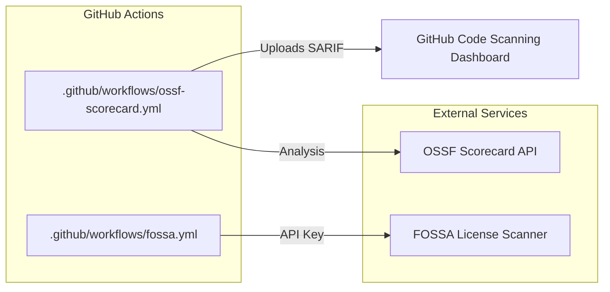
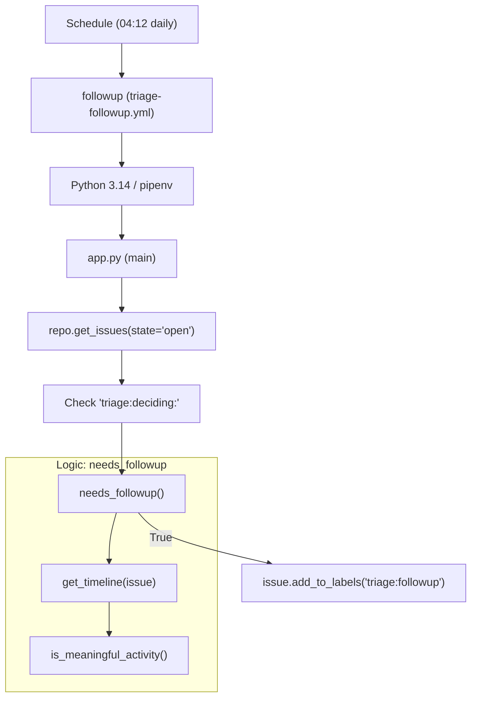

This page provides a high-level overview of the development lifecycle for the OpenTelemetry specification. It covers the governing principles, the contribution workflow from proposal to implementation, automated validation systems, and how cross-language compliance is tracked.

## Specification Principles

The OpenTelemetry specification is guided by core principles to ensure vendor neutrality and technical consistency:

| Principle | Description |
|-----------|-------------|
| **Two-Company Approval** | PRs must be approved by at least two different companies to ensure neutrality [[CONTRIBUTING.md:150-153]](). |
| **Stability Guarantees** | Avoid breaking changes to maintain trust and support built-in telemetry [[CONTRIBUTING.md:27-28]](). |
| **Prototype Requirement** | New features require working prototypes in spec-bound implementations before merging [[CONTRIBUTING.md:40-47]](). |

Sources: [CONTRIBUTING.md:1-53](), [specification/specification-principles.md:1-108]()

## Contribution Workflow

The process for contributing depends on the impact of the change. Significant architectural changes require an **OpenTelemetry Enhancement Proposal (OTEP)**, while smaller changes follow the standard issue-to-PR pipeline.

For detailed information, see **[Contributing and OTEP Process](#9.1)**.

### Issue Triage and Roles

Issues are managed by specific roles (Author, Collaborator, Reviewer, Sponsor, Triager) and categorized using a tiered labeling system.

Sources: [issue-management.md:1-64](), [CONTRIBUTING.md:14-62]()

### Pull Request Lifecycle

A PR is ready to merge once it satisfies the "Two-Company" rule and has remained open for at least two working days for non-trivial changes [[CONTRIBUTING.md:150-159]]().

Sources: [CONTRIBUTING.md:148-176](), [.github/workflows/checks.yaml:1-103]()

## CI/CD and Automation

The repository employs extensive automation via GitHub Actions to maintain document quality and security. This includes style enforcement (`markdownlint`), link validation (`markdown-link-check`), and security analysis (`ossf-scorecard`).

For detailed information, see **[CI/CD and Automation](#9.2)**.

| Tool | Purpose | Configuration |
|------|---------|---------------|
| `markdownlint` | Enforces Markdown style and formatting | [.markdownlint.yaml]() |
| `cspell` | Checks for spelling errors | [.cspell.yaml]() |
| `textlint` | Analyzes prose and language usage | [Makefile:36-44]() |
| `lychee` | Validates internal and external links | [Makefile:51-73]() |
| `OSSF Scorecard` | Analyzes repository security posture | [.github/workflows/ossf-scorecard.yml]() |

Sources: [Makefile:1-124](), [.github/workflows/checks.yaml:1-103](), [.github/workflows/ossf-scorecard.yml:1-48]()

## Spec Compliance Matrix

The compliance matrix tracks the implementation status of specification features across all supported language SDKs (e.g., Go, Java, Python, C++, JS). This system uses YAML source files to generate a comprehensive Markdown table.

For detailed information, see **[Spec Compliance Matrix](#9.3)**.

### Compliance Management

Updates to implementation status are performed by editing YAML files in the `spec-compliance-matrix/` directory and running the generator script.

Sources: [spec-compliance-matrix.md:1-27](), [spec-compliance-matrix/cpp.yaml:1-184](), [spec-compliance-matrix/js.yaml:1-183](), [Makefile:114-118]()

# Contributing and OTEP Process

This page outlines the formal procedures for evolving the OpenTelemetry specification. It covers the lifecycle of proposals, from trivial documentation fixes to significant architectural changes via the OpenTelemetry Enhancement Proposal (OTEP) process, the governance rules for approvals, and the automated validation required for all contributions.

## Proposing a Change

The process for contributing depends on the impact and scope of the proposed change.

### Change Categories

| Category | Description | Requirement |
| :--- | :--- | :--- |
| **Trivial** | Typos, rewording for clarity, or fixing broken links. | Direct Pull Request (no issue needed) [CONTRIBUTING.md:16-22](). |
| **Small** | New terms, optional API parameters, stabilizing features, or tightening requirement levels (e.g., SHOULD to MUST). | Create an issue first; wait for acceptance before PR [CONTRIBUTING.md:24-30](). |
| **Significant** | New metric types, new signals, or cross-cutting systems (e.g., declarative configuration). | OpenTelemetry Enhancement Proposal (OTEP) [CONTRIBUTING.md:53-61](). |

### Prototype Requirements
For non-trivial changes, prototypes are mandatory to demonstrate feasibility:
* **Development Maturity:** Requires a working demonstration in at least one spec-bound implementation with SIG maintainer support [CONTRIBUTING.md:40-43]().
* **Stable Maturity:** Typically requires prototypes in at least three different languages before the feature can be stabilized [CONTRIBUTING.md:44-46]().

## The OTEP Lifecycle

Significant changes that are **cross-cutting** (applicable across multiple languages and implementations) must follow the OTEP process [oteps/README.md:26-29]().

### Process Flow
The OTEP lifecycle transitions through four primary states:

1.  **Proposed:** The author forks the repository, creates a document based on `oteps/0000-template.md`, and submits it as a PR to the `oteps/` directory [oteps/README.md:58-65]().
2.  **Approved:** An OTEP is approved when it receives four approvals from reviewers. Once approved, the PR is merged into the `oteps/` directory [oteps/README.md:66-66]().
3.  **Integrated:** Approval of an OTEP does not make it normative. It must be integrated into the actual Specification via a separate PR. This PR requires four approvals and focus is strictly on clarity and faithful representation of the approved OTEP [oteps/README.md:70-74]().
4.  **Implemented:** Once integrated, issues are created in the backlogs of relevant language SDKs to implement the changes [oteps/README.md:76-79]().

### OTEP State Transitions
The following diagram illustrates the transition of a proposal from a conceptual enhancement to a requirement.

**Proposal to Requirement Data Flow**

Sources: [oteps/README.md:8-9](), [oteps/README.md:58-80](), [CONTRIBUTING.md:135-143]().

## Governance and Approval Rules

OpenTelemetry enforces a strict governance model to ensure vendor neutrality and broad consensus.

### The Two-Company Rule
A Pull Request in the specification repository is **ready to merge** only when:
1.  It has received **two or more approvals** from maintainers listed in `.github/CODEOWNERS` [CONTRIBUTING.md:150-153]().
2.  The approvals must come from **at least two different companies** [CONTRIBUTING.md:153-153]().
3.  There are no outstanding "Request Changes" from any code owner [CONTRIBUTING.md:154-154]().
4.  A minimum of **two working days** has passed since the last modification (excluding trivial fixes) [CONTRIBUTING.md:155-156]().

### Issue Management Roles
The project defines specific roles to manage the flow of work:
*   **Author:** Opens the issue/PR [issue-management.md:5-6]().
*   **Collaborator:** Performs the work and keeps status labels up to date [issue-management.md:7-10]().
*   **Sponsor:** A specification sponsor (assignee) responsible for the completion of the issue [issue-management.md:13-14]().
*   **Triager:** Applies labels (e.g., `triage:accepted:ready`) and ensures issues are in scope [issue-management.md:15-20]().

Sources: [CONTRIBUTING.md:150-157](), [issue-management.md:3-20]().

## Technical Validation and Tooling

The repository uses a `Makefile` to orchestrate various linting and validation tools to ensure document quality and consistency.

### Validation Checklist
Every PR is subject to the following automated checks:
*   **Markdown Linting:** Enforced via `markdownlint` with a custom configuration [CONTRIBUTING.md:117-117](), [.markdownlint.yaml]().
*   **Spell Checking:** Handled by `cspell` [CONTRIBUTING.md:116-116]().
*   **Link Validation:** Uses `lychee` (via Docker) to check for broken internal and external links [Makefile:51-60]().
*   **Prose Linting:** Uses `textlint` for grammatical and style consistency [Makefile:36-44]().
*   **Line Wrapping:** All documents should wrap at 80 characters [CONTRIBUTING.md:65-67]().

### Common Commands
| Command | Action |
| :--- | :--- |
| `make check` | Runs all validation (spell, lint, style, links) [Makefile:104-105](). |
| `make fix` | Automatically fixes `textlint` violations [Makefile:109-110](). |
| `make markdown-toc` | Regenerates tables of contents in Markdown files [Makefile:75-78](). |
| `make compliance-matrix` | Regenerates the `spec-compliance-matrix.md` from YAML sources [Makefile:114-118](). |

### Tooling to Code Entity Mapping
The following diagram maps the high-level validation tasks to the specific tools and scripts defined in the codebase.

**Validation System Architecture**

Sources: [Makefile:24-124](), [CONTRIBUTING.md:101-143](), [.github/scripts/compliance_matrix.py:1-10]().

## PR Submission Checklist
When opening a PR, contributors must complete the `PULL_REQUEST_TEMPLATE.md` checklist:
*   [ ] Link to related issues and OTEPs [.github/PULL_REQUEST_TEMPLATE.md:9-10]().
*   [ ] Provide links to prototypes for new features [.github/PULL_REQUEST_TEMPLATE.md:11-11]().
*   [ ] Update `CHANGELOG.md` in the `Unreleased` section [.github/PULL_REQUEST_TEMPLATE.md:12-12]().
*   [ ] Update the Spec compliance matrix if parity is affected [.github/PULL_REQUEST_TEMPLATE.md:14-14]().
*   [ ] Update the declarative configuration data model if the SDK config surface changed [.github/PULL_REQUEST_TEMPLATE.md:15-15]().

Sources: [.github/PULL_REQUEST_TEMPLATE.md:1-16](), [CONTRIBUTING.md:157-159]().

# CI/CD and Automation

The OpenTelemetry Specification repository utilizes a comprehensive suite of GitHub Actions workflows to automate document validation, security analysis, license compliance, and issue management. These automations ensure that the specification remains consistent, secure, and manageable as a large-scale open-source project.

## Document Validation and Linting

The repository implements a series of checks to maintain high standards for documentation quality. These are primarily orchestrated through the `Checks` workflow.

### Markdown and Text Quality
The system employs multiple linters to enforce formatting and stylistic consistency:
*   **markdownlint**: Enforces rules defined in `.markdownlint.yaml` [.markdownlint.yaml:1-19](). It is executed via `make markdownlint` [.github/workflows/checks.yaml:24]().
*   **textlint**: Validates the prose and technical language of the specification using `make textlint` [.github/workflows/checks.yaml:102]().
*   **cspell**: Performs spell checking across all files using the configuration in `.cspell.yaml` [.github/workflows/checks.yaml:85-88]().
*   **yamllint**: Validates YAML file structure according to rules in `.yamllint` [.yamllint:1-18](), including specific allowances for GitHub Action triggers like `on` [.yamllint:7]().

### Link and Structure Integrity
To prevent broken documentation, the CI system verifies internal and external references:
*   **markdown-link-check**: Scans for broken hyperlinks using the `lychee` tool or similar, authenticated via `GITHUB_TOKEN` to avoid rate limits [.github/workflows/checks.yaml:50-53]().
*   **markdown-toc-check**: Ensures that the Table of Contents in documents is up-to-date by running `make markdown-toc-check` [.github/workflows/checks.yaml:65]().

### Specification Compliance Matrix
A specialized check, `compliance-matrix-check`, ensures that the `spec-compliance-matrix.md` (which tracks implementation status across languages) is synchronized with the underlying data. It fails if the generated matrix is out of date compared to the committed version [.github/workflows/checks.yaml:73-77]().

**Document Validation Data Flow**

Title: Document Validation Workflow

Sources: [.github/workflows/checks.yaml:13-103](), [.markdownlint.yaml:1-19]()

---

## Security and License Compliance

Security analysis and license auditing are automated to maintain the project's integrity and meet OSSF (Open Source Security Foundation) standards.

### OSSF Scorecard
The `OSSF Scorecard` workflow performs a weekly security analysis of the repository [.github/workflows/ossf-scorecard.yml:8](). It evaluates various security heuristics and publishes the results to GitHub's code scanning dashboard [.github/workflows/ossf-scorecard.yml:26-48]().
*   **Permissions**: The workflow requires `security-events: write` to upload SARIF results and `id-token: write` for OIDC authentication [.github/workflows/ossf-scorecard.yml:16-20]().

### FOSSA License Scanning
The `FOSSA scanning` workflow runs on every push to the `main` branch [.github/workflows/fossa.yml:3-6](). It uses the `fossas/fossa-action` to identify dependencies and ensure they comply with OpenTelemetry's licensing policies [.github/workflows/fossa.yml:17-21]().

**Security and License Entities**

Title: Security and Compliance Automation

Sources: [.github/workflows/ossf-scorecard.yml:1-48](), [.github/workflows/fossa.yml:1-21]()

---

## Triage and Issue Automation

The repository uses custom Python scripts and standard GitHub actions to manage the lifecycle of issues and pull requests.

### Issue Follow-up Automation
The `triage-followup.yml` workflow runs a Python-based triage helper to identify issues that require maintainer attention [.github/workflows/triage-followup.yml:1-35]().

The core logic resides in `.github/scripts/triage-helper/app.py`:
*   **Meaningful Activity**: Defined as commits, comments, merges, or specific label changes (`triage:deciding` or `triage:followup`) [.github/scripts/triage-helper/app.py:8-22]().
*   **Needs Follow-up**: The `needs_followup` function checks if an issue has a `triage:deciding` label older than two weeks without subsequent meaningful activity [.github/scripts/triage-helper/app.py:45-101]().
*   **Action**: If criteria are met, the script adds the `triage:followup` label to the issue [.github/scripts/triage-helper/app.py:103-120]().

### Pull Request Management
*   **Stale PRs**: The `stale-pr.yaml` workflow automatically marks pull requests as stale after 14 days of inactivity and closes them 14 days later [.github/workflows/stale-pr.yaml:15-27](). PRs with the `release:after-ga` label are exempt [.github/workflows/stale-pr.yaml:20]().
*   **Changelog Verification**: The `Verify CHANGELOG` workflow ensures that every PR (unless marked as a `[chore]` or `dependencies`) modifies a `CHANGELOG` file [.github/workflows/verify-changelog.yaml:24-46]().

**Triage Helper Implementation Details**

Title: Triage Helper System

Sources: [.github/workflows/triage-followup.yml:1-35](), [.github/scripts/triage-helper/app.py:1-157]()

---

## Workflow Configuration Summary

| Workflow | Trigger | Primary Tool | Purpose |
| :--- | :--- | :--- | :--- |
| `Checks` | Push/PR | `npm`, `make`, `cspell` | Linting, link checking, matrix validation |
| `OSSF Scorecard` | Schedule/Push | `scorecard-action` | Security health analysis |
| `FOSSA scanning` | Push (main) | `fossa-action` | License compliance auditing |
| `Verify CHANGELOG` | PR | `git diff` | Enforce change documentation |
| `Mark issues for followup` | Schedule | `PyGithub` | Automate triage of stagnant issues |
| `Close stale PRs` | Schedule | `actions/stale` | Manage PR backlog |

Sources: [.github/workflows/checks.yaml:1-9](), [.github/workflows/ossf-scorecard.yml:3-9](), [.github/workflows/fossa.yml:3-6](), [.github/workflows/verify-changelog.yaml:8-13](), [.github/workflows/triage-followup.yml:2-5](), [.github/workflows/stale-pr.yaml:2-4]()