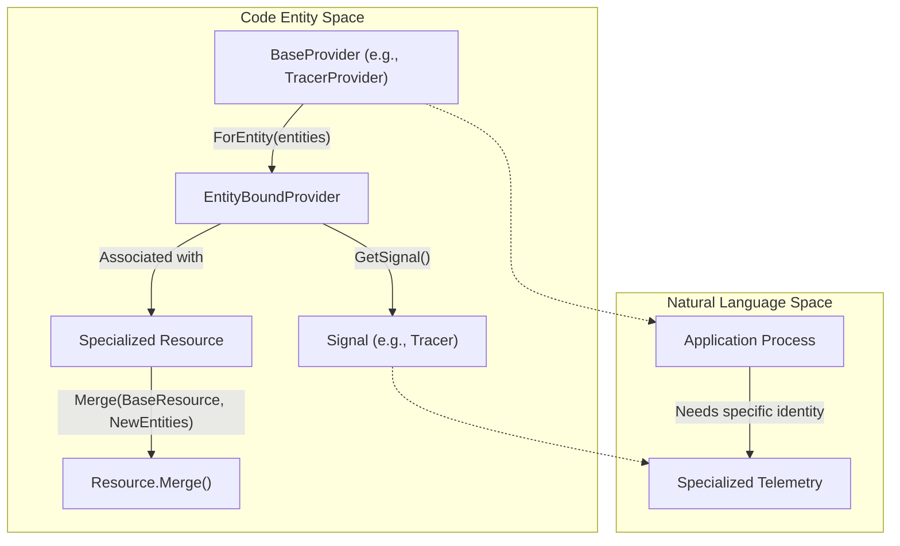
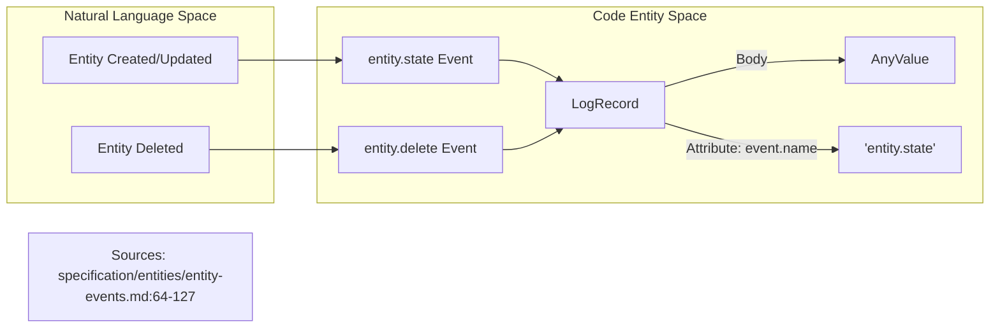

Entities represent objects of interest associated with produced telemetry, such as traces, metrics, profiles, or logs [specification/entities/data-model.md:28-29](). While a **Resource** represents the observed entity for which telemetry is produced, it is logically composed of zero or more **Entities** and zero or more attributes not associated with any specific entity [specification/resource/data-model.md:34-35]().

## Entity Data Model

An Entity is defined by three primary fields that establish its identity and metadata.

| Field | Type | Description |
| :--- | :--- | :--- |
| **Type** | `string` | Defines the class of the entity (e.g., "service", "host"). MUST NOT change during the entity's lifetime [specification/entities/data-model.md:52](). |
| **ID** | `map<string, attribute>` | Attributes that uniquely identify the entity. MUST NOT change and MUST contain at least one attribute [specification/entities/data-model.md:53](). |
| **Description** | `map<string, attribute>` | Non-identifying attributes. MAY change over time and MAY be empty [specification/entities/data-model.md:54](). |

### Identity Principles
1.  **Minimally Sufficient Identity**: The ID should include only the minimal set of attributes necessary for unique identification. For example, a process is identified by `process.pid` and `process.start_time`; adding the executable name violates this rule [specification/entities/data-model.md:56-63]().
2.  **Repeatable Identity**: Identifying attributes should be values that can be repeatably obtained by different observers (e.g., the process itself or an external collector) to ensure they are recognized as the same entity [specification/entities/data-model.md:65-72]().

### Attribute Referencing and Flattening
Entities are typically defined within the `resource` section of a telemetry signal. In OTLP, entities do not carry key-value pairs directly; instead, they reference keys in `resource.attributes` [specification/entities/data-model.md:119-123]().

If multiple entities share the same descriptive attribute key with conflicting values, the attribute MUST logically belong to the **most specific** entity (the one closest in the topology graph to the telemetry signal) [specification/entities/data-model.md:139-143]().

**Sources:** [specification/entities/data-model.md:28-54](), [specification/entities/data-model.md:56-72](), [specification/entities/data-model.md:119-143](), [specification/resource/data-model.md:34-35]()

## Entity Instantiation Models

Entities can be instantiated via two complementary approaches: **Pull-based** and **Push-based**.

### Pull-based Model
Entities discover themselves by examining the runtime environment, such as system properties, metadata services, or the local environment [specification/entities/README.md:28]().

### Push-based Model (Entity Propagation)
Entity information is explicitly provided from external sources, allowing identity to be shared across process boundaries (e.g., a container orchestrator passing metadata to a child process) [specification/entities/README.md:30](), [specification/entities/entity-propagation.md:29-36]().

The primary mechanism for propagation is the `OTEL_ENTITIES` environment variable [specification/entities/entity-propagation.md:52-53]().

#### OTEL_ENTITIES Format
The variable follows a compact grammar: `type{id_keys}[desc_keys]@schema_url` [specification/entities/entity-propagation.md:67-68]().

| Component | Description | Requirement |
| :--- | :--- | :--- |
| `type` | Entity class (e.g., `host`) | Required |
| `{...}` | Identifying attributes (comma-separated `k=v`) | Required |
| `[...]` | Descriptive attributes (comma-separated `k=v`) | Optional |
| `@...` | Schema URL | Optional |

**Sources:** [specification/entities/README.md:21-30](), [specification/entities/entity-propagation.md:29-68]()

## Entity SDK and Merging

The SDK allows specializing a default `Resource` by providing new entities through a `{Signal}Provider` [oteps/entities/4665-multiple-resource-in-sdk.md:47-49]().

### The "For Entity" Operation
The `For Entity` operation constructs a new `Entity Bound Provider` associated with a specialized resource [oteps/entities/4665-multiple-resource-in-sdk.md:63-66]().

### Entity Merging Algorithm
When merging entities into a resource:
1.  If an entity of the same `type` exists, perform a data model merge [specification/resource/data-model.md:77-78]().
2.  If the identities differ for the same type, the merge may be rejected or the lower priority entity dropped [specification/resource/data-model.md:179-181]().
3.  Attributes existing in the entity's ID or description are removed from the resource's "loose" attributes [specification/resource/data-model.md:85-86]().

### Data Flow: SDK Entity Specialization
This diagram illustrates how an instrumentation call creates a specialized provider and resource.

**Sources:** [oteps/entities/4665-multiple-resource-in-sdk.md:63-107](), [specification/resource/data-model.md:71-96]()

## Entity Events

Entity events provide a way to communicate entity information as structured log events using the OpenTelemetry Logs Data Model [specification/entities/entity-events.md:35-39]().

### Event Types
1.  **Entity State Event (`entity.state`)**: Emitted when an entity is created, updated, or periodically to signal existence [specification/entities/entity-events.md:66-67]().
2.  **Entity Delete Event (`entity.delete`)**: Emitted when an entity is removed [specification/entities/entity-events.md:69]().

### Entity Relationships
Unlike Resources, Entity Events can describe relationships between entities (e.g., a `process` "runs_on" a `host`) [specification/entities/entity-events.md:53-54]().

### Data Flow: Entity Lifecycle to LogRecord
This diagram bridges the conceptual lifecycle of an entity to the concrete code entities in the Logs SDK.

**Sources:** [specification/entities/entity-events.md:33-70](), [specification/entities/entity-events.md:71-127]()