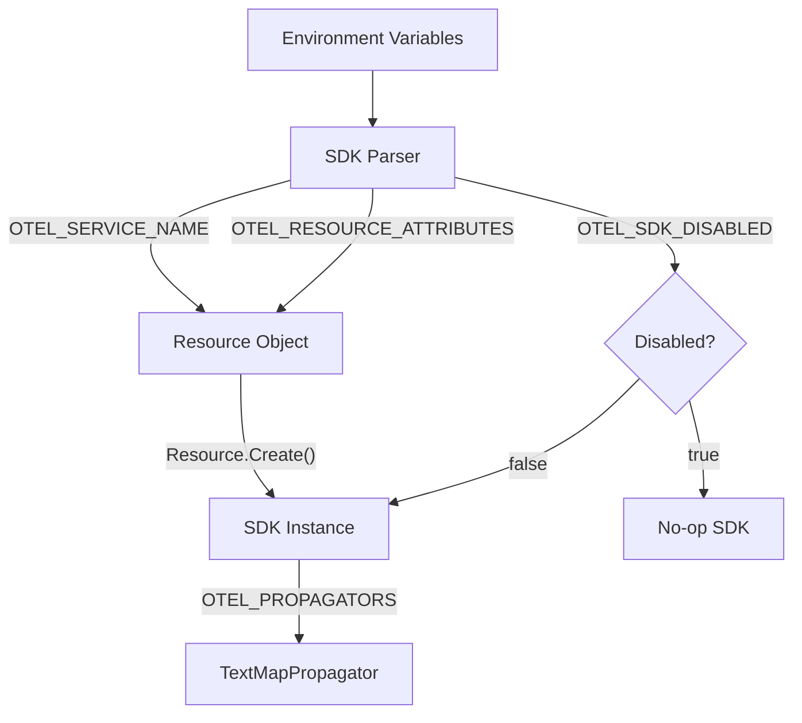
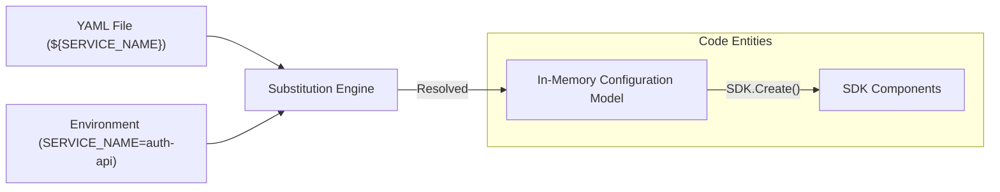

OpenTelemetry provides a standardized set of environment variables to configure SDK behavior across different programming languages and implementations. This mechanism ensures consistent configuration for common tasks such as service identification, resource attribution, and exporter selection.

## Purpose and Scope

The environment variable configuration system is designed to unify variable names and value parsing across all OpenTelemetry implementations [specification/configuration/sdk-environment-variables.md:46-49](). While implementations are not required to support every variable, those that do MUST follow the naming and parsing rules defined in this specification [specification/configuration/sdk-environment-variables.md:48-50]().

Every environment-based configuration MUST have a direct code configuration equivalent in the SDK [specification/configuration/sdk-environment-variables.md:56-57]().

## General Parsing Rules

The SDK applies specific logic when interpreting environment variable values to ensure cross-language compatibility.

### Empty and Unset Values
The SDK MUST interpret an empty value (e.g., `OTEL_SERVICE_NAME=""`) the same way as if the variable were completely unset [specification/configuration/sdk-environment-variables.md:60-61]().

### Data Types

| Type | Parsing Logic |
| :--- | :--- |
| **Boolean** | Case-insensitive `"true"` is the only value interpreted as `true`. All other values, including empty or unset, are `false`. Implementations SHOULD log a warning for unrecognized non-boolean strings [specification/configuration/sdk-environment-variables.md:66-74](). |
| **Numeric** | If a value cannot be parsed as the expected numeric type, the implementation SHOULD log a warning and treat the variable as unset [specification/configuration/sdk-environment-variables.md:88-90](). |
| **Enum** | Values SHOULD be interpreted in a case-insensitive manner. Unrecognized enum values MUST result in a warning and be ignored [specification/configuration/sdk-environment-variables.md:103-107](). |

**Sources:** [specification/configuration/sdk-environment-variables.md:59-108]()

## Core SDK Configuration

These variables control the global behavior of the OpenTelemetry SDK and the identity of the instrumented service.

| Variable | Description | Default |
| :--- | :--- | :--- |
| `OTEL_SDK_DISABLED` | Disables the SDK for all signals if set to `true`. | `false` |
| `OTEL_SERVICE_NAME` | Logical name of the service. | `unknown_service` |
| `OTEL_RESOURCE_ATTRIBUTES` | Key-value pairs for resource attributes (e.g., `key1=val1,key2=val2`). | N/A |
| `OTEL_PROPAGATORS` | Propagators to be used as a comma-separated list (e.g., `tracecontext,baggage`). | `tracecontext,baggage` |
| `OTEL_TRACES_SAMPLER` | Sampler to be used for traces (e.g., `parentbased_always_on`). | `parentbased_always_on` |

### Configuration Data Flow
The following diagram illustrates how environment variables are ingested by the SDK and translated into internal components.

**SDK Configuration Initialization**

**Sources:** [specification/configuration/sdk-environment-variables.md:111-130](), [specification/configuration/sdk.md:139-142]()

## Signal Exporter Configuration

OpenTelemetry allows selecting exporters for Traces, Metrics, and Logs via environment variables.

### Exporter Selection
The variables `OTEL_TRACES_EXPORTER`, `OTEL_METRICS_EXPORTER`, and `OTEL_LOGS_EXPORTER` accept a comma-separated list of exporter names [specification/configuration/sdk-environment-variables.md:34]().

Common values include:
* `otlp`: Use the OTLP exporter.
* `none`: Disable exporting for that signal.
* `console`: Export to the standard output.

### OTLP Exporter Settings
The OTLP exporter is the primary protocol for OpenTelemetry. It can be configured globally or per-signal.

| Variable | Description | Default |
| :--- | :--- | :--- |
| `OTEL_EXPORTER_OTLP_ENDPOINT` | The target URL for the OTLP exporter. | `http://localhost:4317` (gRPC) or `http://localhost:4318` (HTTP) |
| `OTEL_EXPORTER_OTLP_PROTOCOL` | Transport protocol (`grpc`, `http/protobuf`, `http/json`). | `grpc` |
| `OTEL_EXPORTER_OTLP_HEADERS` | Custom headers (e.g., `api-key=1234,auth=token`). | N/A |
| `OTEL_EXPORTER_OTLP_TIMEOUT` | Maximum time the OTLP exporter will wait for a batch. | `10000` (ms) |

**Sources:** [specification/configuration/sdk-environment-variables.md:31-35](), [specification/configuration/sdk.md:140-144]()

## Limits and Performance Tuning

The SDK provides variables to prevent unbounded memory usage by limiting the number of attributes, events, and links.

### Attribute Limits
* `OTEL_ATTRIBUTE_VALUE_LENGTH_LIMIT`: Maximum allowed length for string attribute values.
* `OTEL_ATTRIBUTE_COUNT_LIMIT`: Maximum number of attributes per resource, span, or log record.

### Span Limits
* `OTEL_SPAN_ATTRIBUTE_COUNT_LIMIT`: Max attributes per span.
* `OTEL_SPAN_EVENT_COUNT_LIMIT`: Max events per span.
* `OTEL_SPAN_LINK_COUNT_LIMIT`: Max links per span.

### Batch Processor Settings
For performance, spans and logs are often processed in batches.
* `OTEL_BSP_MAX_QUEUE_SIZE`: Maximum queue size for the Batch Span Processor.
* `OTEL_BSP_SCHEDULE_DELAY`: Delay between two consecutive exports.
* `OTEL_BSP_MAX_EXPORT_BATCH_SIZE`: Maximum batch size.

**Sources:** [specification/configuration/sdk-environment-variables.md:26-30]()

## Declarative Configuration Integration

Environment variables also play a role in the [Declarative Configuration](./6.2) system. The variable `OTEL_CONFIG_FILE` is used to point the SDK to a YAML configuration file [specification/configuration/sdk.md:26]().

### Variable Substitution in YAML
When using a configuration file, environment variables can be substituted into the YAML content using the `${ENV_VAR}` syntax [specification/configuration/data-model.md:61-66]().

**Variable Substitution Logic**

The substitution engine follows these rules:
1. **Default Values**: `${ENV_VAR:-default_val}` uses `default_val` if `ENV_VAR` is unset [specification/configuration/data-model.md:69-70]().
2. **Escaping**: `$$` is translated to a single `$` and prevents substitution [specification/configuration/data-model.md:128-131]().
3. **Strictness**: Substitution only applies to scalar values, not mapping keys [specification/configuration/data-model.md:120-121]().

**Sources:** [specification/configuration/data-model.md:59-150](), [specification/configuration/sdk.md:21-26]()