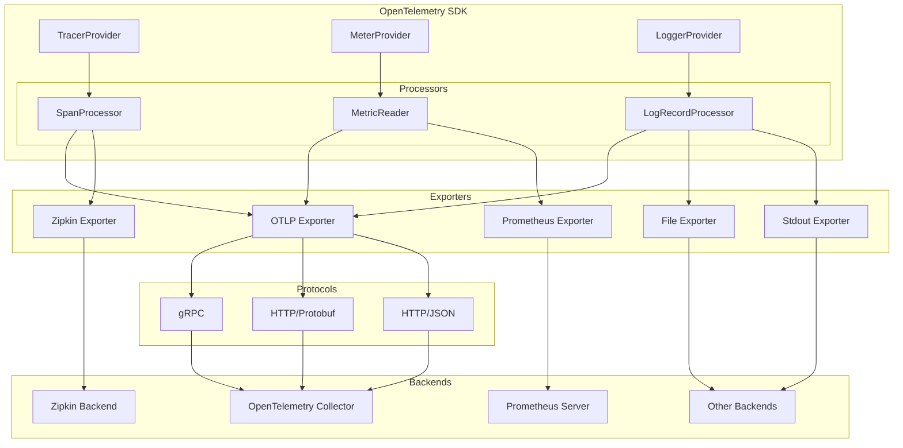
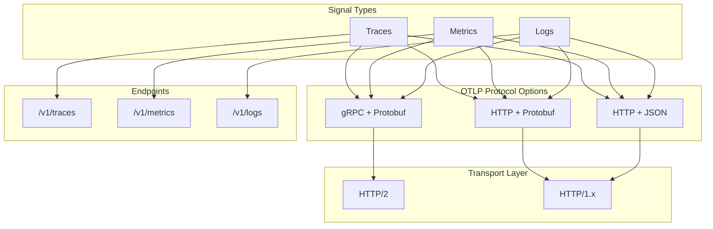
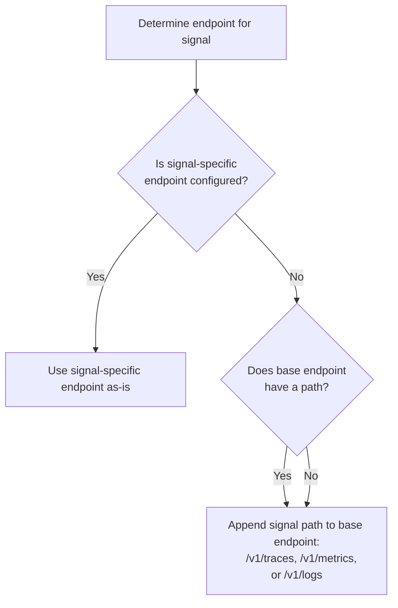
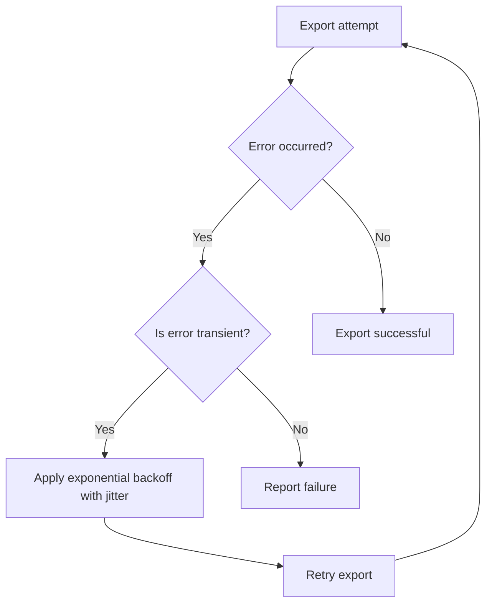

This document provides an overview of the OpenTelemetry Protocol (OTLP) and the exporter components that send telemetry data from OpenTelemetry SDK implementations to various backends. It covers the OTLP exporter configuration, protocol options, and retry behavior.

## Exporters in the OpenTelemetry Architecture

Exporters are components that send telemetry data (traces, metrics, and logs) to backends such as monitoring systems, observability platforms, or storage systems. They serve as the bridge between the OpenTelemetry SDK and telemetry backends.

**Diagram: Exporters in the OpenTelemetry Architecture**

Sources: [specification/protocol/exporter.md:5-10](), [specification/protocol/README.md:8-19](), [specification/metrics/sdk_exporters/otlp.md:11-13]()

## OpenTelemetry Protocol (OTLP)

The OpenTelemetry Protocol (OTLP) is the standard protocol for transmitting telemetry data in OpenTelemetry. It defines how telemetry data is encoded, transported, and delivered between OpenTelemetry components and backend systems.

### Protocol Options

OTLP supports multiple transport protocols and encoding formats [specification/protocol/exporter.md:71-75]():

- **gRPC**: Protobuf-encoded data over gRPC.
- **http/protobuf**: Protobuf-encoded data over HTTP.
- **http/json**: JSON-encoded data over HTTP.

**Diagram: OTLP Protocol Options and Signal Paths**

Sources: [specification/protocol/exporter.md:71-75](), [specification/protocol/exporter.md:108-110]()

## OTLP Exporter Configuration

The OTLP exporter can be configured through environment variables or programmatically. Configuration includes endpoint URLs, protocol selection, headers, security settings, and timeout [specification/protocol/exporter.md:11-75]().

### Configuration Options

| Option | Description | Default | Environment Variables |
|--------|-------------|---------|----------------------|
| Endpoint | Target URL for sending telemetry data | `http://localhost:4318` (HTTP) `http://localhost:4317` (gRPC) | `OTEL_EXPORTER_OTLP_ENDPOINT` `OTEL_EXPORTER_OTLP_TRACES_ENDPOINT` |
| Protocol | Transport protocol to use | `http/protobuf` | `OTEL_EXPORTER_OTLP_PROTOCOL` |
| Insecure | Whether to enable client transport security | `false` | `OTEL_EXPORTER_OTLP_INSECURE` |
| Certificate File | Trusted certificate for TLS | n/a | `OTEL_EXPORTER_OTLP_CERTIFICATE` |
| Headers | Key-value pairs for request headers | n/a | `OTEL_EXPORTER_OTLP_HEADERS` |
| Compression | Compression type (e.g., `gzip`) | No value | `OTEL_EXPORTER_OTLP_COMPRESSION` |
| Timeout | Max wait time for batch export | 10s | `OTEL_EXPORTER_OTLP_TIMEOUT` |

Sources: [specification/protocol/exporter.md:16-75]()

### Metric Specific Configuration
OTLP Metrics exporters include additional settings for aggregation and temporality [specification/metrics/sdk_exporters/otlp.md:45-49]():
- `OTEL_EXPORTER_OTLP_METRICS_TEMPORALITY_PREFERENCE`: Controls whether to use `Cumulative`, `Delta`, or `LowMemory` [specification/metrics/sdk_exporters/otlp.md:50-55]().
- `OTEL_EXPORTER_OTLP_METRICS_DEFAULT_HISTOGRAM_AGGREGATION`: Sets histogram type to `explicit_bucket_histogram` or `base2_exponential_bucket_histogram` [specification/metrics/sdk_exporters/otlp.md:64-69]().

For details, see [OTLP Exporters](#5.1).

## Endpoint Configuration

For OTLP/HTTP, the exporter constructs URLs for each signal type according to specific rules [specification/protocol/exporter.md:98-110]():

1. Signal-specific endpoint variables (`OTEL_EXPORTER_OTLP_<signal>_ENDPOINT`) are used as-is.
2. If no signal-specific endpoint is configured, the base endpoint (`OTEL_EXPORTER_OTLP_ENDPOINT`) is used with signal-specific paths (`v1/traces`, `v1/metrics`, `v1/logs`) appended.

**Diagram: Endpoint URL Resolution Process**

Sources: [specification/protocol/exporter.md:98-110]()

## Other Exporters

OpenTelemetry supports a variety of other exporters for debugging and specialized environments.

### File and Stdout Exporters
- **File Exporter**: Serializes data to JSON lines (`.jsonl`) for FaaS or Kubernetes log scraping [specification/protocol/file-exporter.md:30-36]().
- **Stdout Exporter**: Outputs telemetry to the console for debugging and learning purposes [specification/metrics/sdk_exporters/stdout.md:17-19]().

### Third-Party Exporters
- **Prometheus**: A `Pull Metric Exporter` that responds to HTTP requests in Prometheus format [specification/metrics/sdk_exporters/prometheus.md:43-45]().
- **In-memory**: Accumulates data in local memory for unit testing [specification/metrics/sdk_exporters/in-memory.md:9-11]().

For details, see [Third-Party Exporters](#5.2).

## Retry Behavior

The OTLP exporter must implement a retry strategy for transient errors, using exponential back-off with jitter [specification/protocol/exporter.md:9]().

**Diagram: Retry Strategy for OTLP Exporters**

Sources: [specification/protocol/exporter.md:9]()