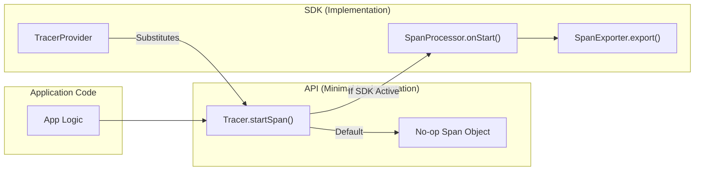

The OpenTelemetry Specification defines the cross-language requirements and expectations for all OpenTelemetry implementations [README.md:10-11](). This page provides a technical guide to the repository's organization, the lifecycle of specification documents, and the architectural conventions for language-specific library layouts.

## Repository Layout

The repository is organized into several functional areas to separate the core specification from the processes that govern its evolution.

| Directory / File | Description |
| :--- | :--- |
| `specification/` | The core markdown sources for the OpenTelemetry specification [README.md:15](). |
| `oteps/` | OpenTelemetry Enhancement Proposals (OTEPs) for significant changes [CONTRIBUTING.md:59-61](). |
| `spec-compliance-matrix/` | YAML files defining feature parity across language SDKs [CONTRIBUTING.md:137-138](). |
| `internal/img/` | Diagrams and assets used within the specification documents [library-guidelines.md:41](). |
| `CONTRIBUTING.md` | Guidelines for proposing changes and signing the CLA [CONTRIBUTING.md:1-13](). |
| `CHANGELOG.md` | Record of versioned changes to the specification [README.md:51](). |

### Specification Directory Structure
The `specification/` directory follows a modular structure based on the primary signals and cross-cutting concerns:
*   `api/`: Defines the surface area for instrumentation [library-layout.md:7-24]().
*   `sdk/`: Defines the implementation requirements for processing and exporting data [library-layout.md:60-75]().
*   `trace/`, `metrics/`, `logs/`: Signal-specific documentation [specification/README.md:34-41]().
*   `context/`, `baggage/`, `resource/`: Shared infrastructure [specification/README.md:30-33, 42]().

**Sources:** [README.md:10-15](), [CONTRIBUTING.md:59-61](), [library-layout.md:7-75](), [specification/README.md:30-43]().

---

## Document Status System

Documents in the OpenTelemetry specification follow a strict maturity lifecycle to ensure stability for implementers and end-users.

### Maturity Levels
1.  **Development** (formerly "Experimental"): Signals in this state may experience breaking changes, performance issues, or be discarded entirely [versioning-and-stability.md:78-82]().
2.  **Stable**: Rigorously tested signals where backward-incompatible changes are prohibited without a major version bump [versioning-and-stability.md:97-107]().
3.  **Deprecated**: Signals intended for eventual removal [versioning-and-stability.md:70]().
4.  **Removed**: Signals no longer part of the specification [versioning-and-stability.md:70]().

### Stability Guarantees
*   **API Stability**: Existing API calls MUST continue to compile and function against all future minor versions [versioning-and-stability.md:106-107]().
*   **SDK Stability**: Public portions of SDK packages, specifically **plugin interfaces** (e.g., `SpanProcessor`, `Exporter`) and **constructors**, MUST remain backward compatible [versioning-and-stability.md:111-117]().

**Sources:** [versioning-and-stability.md:70-117]().

---

## Library Layout and Package Structure

The specification dictates a generic package layout to ensure a consistent "look and feel" across different programming languages while allowing for language-specific idiomatic expressions [library-layout.md:3-5]().

### API vs. SDK Separation
A core principle is the strict decoupling of the API from the SDK implementation. This allows libraries to depend solely on the API, avoiding unnecessary dependencies and ensuring no-op behavior when no SDK is present [library-guidelines.md:15-17]().

### Package Layout Convention
The following diagram illustrates the relationship between the generic package structure defined in the spec and the actual code entities.

**Diagram: Library Package Architecture**
```mermaid
graph TD
    subgraph "Natural Language Space (Spec)"
        SpecAPI["API Package"]
        SpecSDK["SDK Package"]
        SpecSemConv["Semantic Conventions"]
    end

    subgraph "Code Entity Space (Implementation)"
        subgraph "/api/ (Artifact A)"
            Context["/context/"]
            Tracer["/trace/Tracer"]
            Meter["/metrics/Meter"]
            Baggage["/baggage/"]
            NoOp["Minimal Implementation (No-op)"]
        end

        subgraph "/sdk/ (Artifact B)"
            Processor["/trace/SpanProcessor"]
            Exporter["/trace/SpanExporter"]
            Resource["/resource/Resource"]
            SDKContext["/context/ (Implementation)"]
        end
    end

    SpecAPI -.-> "/api/"
    SpecSDK -.-> "/sdk/"
    Tracer -- "returns" --> NoOp
    "/api/" -- "decoupled from" --> "/sdk/"
```
**Sources:** [library-layout.md:7-75](), [library-guidelines.md:15-17, 45-46, 56-62]().

---

## Contributing to the Specification

Changes to the specification are categorized by their impact and require different levels of review.

### Change Triage
*   **Trivial Changes**: Typos, broken links, or wording fixes can be submitted directly via PR [CONTRIBUTING.md:16-22]().
*   **Smaller Changes**: New optional parameters or stabilizing features require an issue and acceptance before a PR is opened [CONTRIBUTING.md:24-31]().
*   **Significant Changes**: New metric types, signals, or cross-cutting systems MUST go through the **OTEP (OpenTelemetry Enhancement Proposal)** process [CONTRIBUTING.md:53-61]().

### PR Readiness Requirements
A PR is considered ready to merge when:
1.  It has two or more approvals from `CODEOWNERS` representing at least two different companies [CONTRIBUTING.md:150-153]().
2.  The `Unreleased` section of `CHANGELOG.md` is updated [CONTRIBUTING.md:157-159]().
3.  For new features at the **Development** level, a working prototype in at least one language is required [CONTRIBUTING.md:40-43]().
4.  For **Stabilization**, prototypes in multiple languages (typically three) are required [CONTRIBUTING.md:44-46]().

### Tooling and Validation
The repository uses a `Makefile` to orchestrate validation tools:
*   `make check`: Runs all checks including spell-check (`cspell`), linting (`textlint`), and markdown style (`markdownlint`) [CONTRIBUTING.md:105-107]().
*   `make markdown-link-check`: Validates all internal and external links (requires Docker) [CONTRIBUTING.md:118]().
*   `make compliance-matrix`: Regenerates the [Spec Compliance Matrix](./spec-compliance-matrix.md) from YAML sources in `spec-compliance-matrix/` [CONTRIBUTING.md:135-143]().

**Sources:** [CONTRIBUTING.md:16-159](), [Makefile:25-124](), [issue-management.md:11-14]().

---

## Data Flow: From API Call to Export

The following diagram bridges the conceptual "Library Guidelines" with the specific code structures required for an implementation.

**Diagram: Telemetry Data Flow**

**Sources:** [library-guidelines.md:39-42, 56-62, 68-76](), [library-layout.md:44-49, 99-101]().