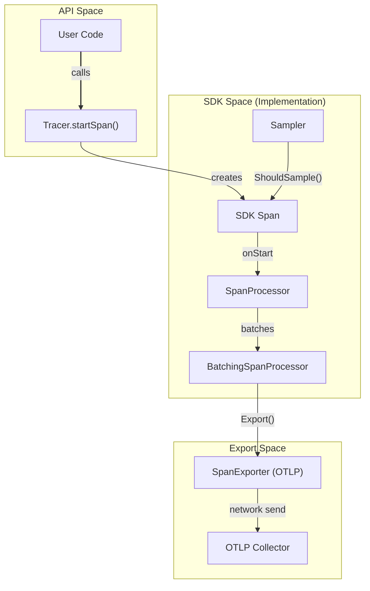
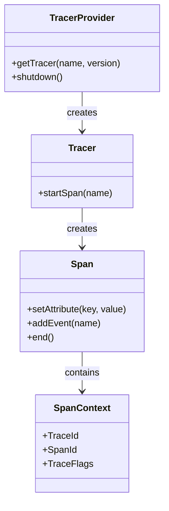
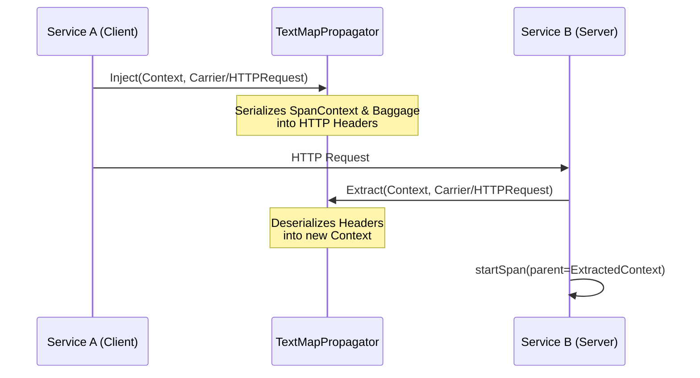

This page defines codebase-specific terms, jargon, and domain concepts used throughout the OpenTelemetry specification. It serves as a technical reference for onboarding engineers to understand the relationship between conceptual definitions and their implementations.

## Core Architectural Concepts

The OpenTelemetry project is organized into **signals**, which provide specialized forms of observability (e.g., Traces, Metrics, Logs) [specification/overview.md:50-51](). The architecture enforces a strict separation between the **API** (cross-cutting interfaces) and the **SDK** (the executable implementation) [specification/overview.md:60-68]().

### Signal Components
| Term | Definition | Code Pointer |
| :--- | :--- | :--- |
| **API** | The public interfaces used for instrumentation. Must not contain implementation logic. | [specification/overview.md:60-63]() |
| **SDK** | The implementation of the API. Managed by the application owner. | [specification/overview.md:65-68]() |
| **Instrumentation Scope** | A logical unit of instrumentation (e.g., a library or package). | [specification/common/instrumentation-scope.md]() |
| **Resource** | Captures information about the entity producing telemetry (e.g., host, service name). | [specification/overview.md:131-132]() |

### Data Flow: API to Exporter
The following diagram illustrates how a telemetry signal (e.g., a Span) moves from the user-facing API through the SDK components to an external backend.

**Telemetry Data Flow**

Sources: [specification/trace/api.md:61-62](), [specification/trace/sdk.md:66-75](), [specification/trace/sdk.md:113-116](), [specification/protocol/exporter.md:5-9]()

---

## Tracing Terms

Distributed tracing tracks the progression of a single request as it handled by various services.

*   **Span**: The building block of a trace. It represents a unit of work [specification/trace/api.md:62]().
*   **TracerProvider**: The entry point for the Tracing API; it holds configuration and provides access to `Tracer` instances [specification/trace/api.md:88-91]().
*   **SpanContext**: The part of a span that is propagated across process boundaries, containing `TraceId`, `SpanId`, and `TraceFlags` [specification/trace/api.md:26-30]().
*   **Sampler**: A component that decides whether a span should be recorded and exported based on specific criteria [specification/trace/sdk.md:25-29]().

**Tracing Entity Association**

Sources: [specification/trace/api.md:57-63](), [specification/trace/api.md:109-115](), [specification/trace/sdk.md:92-99]()

---

## Metrics Terms

Metrics represent the aggregation of measurements over time.

*   **MeterProvider**: The entry point for the Metrics API [specification/metrics/api.md:74-75]().
*   **Instrument**: Used to report measurements. Types include `Counter`, `Histogram`, and `Gauge` [specification/metrics/api.md:77-78]().
*   **Aggregation**: The process of combining multiple measurements into a single data point (e.g., Sum, ExplicitBucketHistogram) [specification/metrics/sdk.md:27-34]().
*   **MetricReader**: An SDK component that collects metrics from the SDK on demand or on a schedule [specification/metrics/sdk.md:69-71]().

Sources: [specification/metrics/api.md:167-175](), [specification/metrics/sdk.md:107-115]()

---

## Logs and Events

OpenTelemetry handles both legacy logs and structured events through a unified data model.

*   **LoggerProvider**: Entry point for the Logs API [specification/logs/sdk.md:59-63]().
*   **LogRecord**: A single entry in a log, containing a body, severity, and attributes [specification/logs/data-model.md:161-166]().
*   **SeverityNumber**: A numerical representation of log importance (1-24) [specification/logs/data-model.md:28-29]().
*   **Event**: A specialized `LogRecord` that follows specific semantic conventions [specification/logs/data-model.md:104-107]().

Sources: [specification/logs/sdk.md:71-78](), [specification/logs/data-model.md:19-39]()

---

## Context and Propagation

These mechanisms allow signals to be correlated across distributed systems.

*   **Context**: A cross-cutting concern that carries execution-scoped values across API boundaries [specification/context/README.md]().
*   **Propagator**: An object used to read and write context data to and from messages (e.g., HTTP headers) [specification/context/api-propagators.md:48-52]().
*   **Carrier**: The medium (e.g., an HTTP request object) used by Propagators [specification/context/api-propagators.md:75-77]().
*   **Baggage**: A set of name/value pairs that are passed between services in the `Context` [specification/overview.md:31]().

**Context Propagation Mechanics**

Sources: [specification/context/api-propagators.md:87-113](), [specification/context/api-propagators.md:114-124]()

---

## Protocol and Exporting

*   **OTLP (OpenTelemetry Protocol)**: The general-purpose telemetry propagation protocol [specification/protocol/exporter.md:9]().
*   **Exporter**: A component responsible for sending telemetry data to a remote backend [specification/protocol/exporter.md:5-7]().
*   **ForceFlush**: An SDK operation that ensures all buffered telemetry is immediately exported [specification/trace/sdk.md:175-178](), [specification/metrics/sdk.md:21]().
*   **Shutdown**: An operation that stops the SDK and cleans up resources [specification/trace/sdk.md:158-164]().

Sources: [specification/protocol/exporter.md:11-29](), [specification/trace/sdk.md:66-72]()