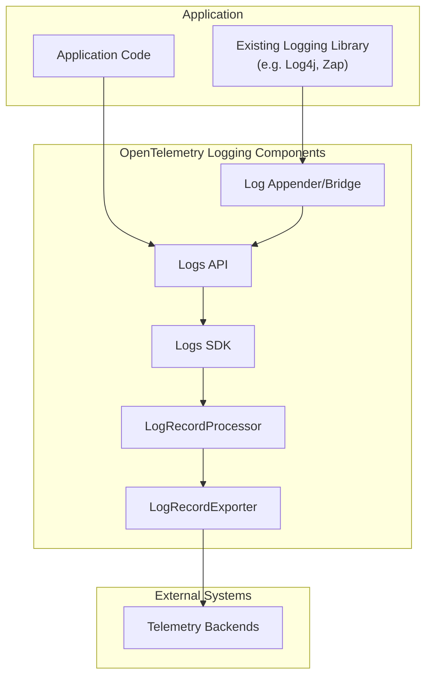
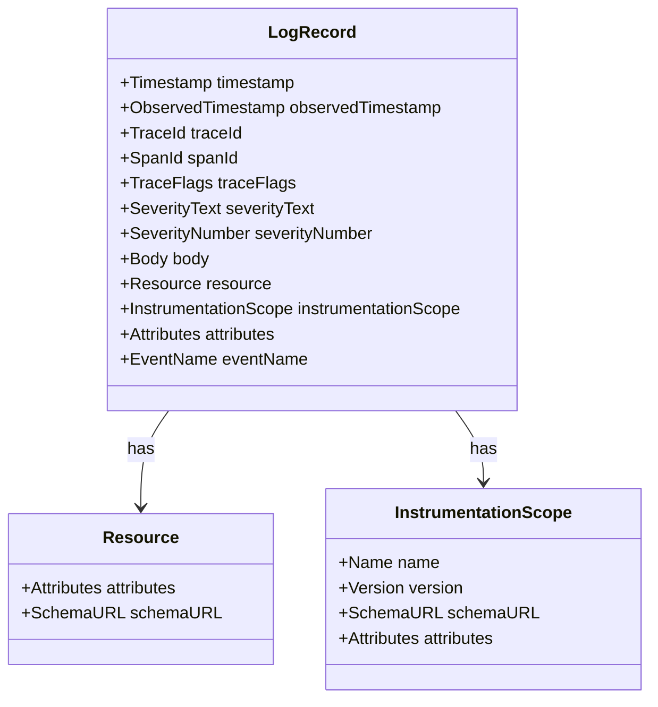
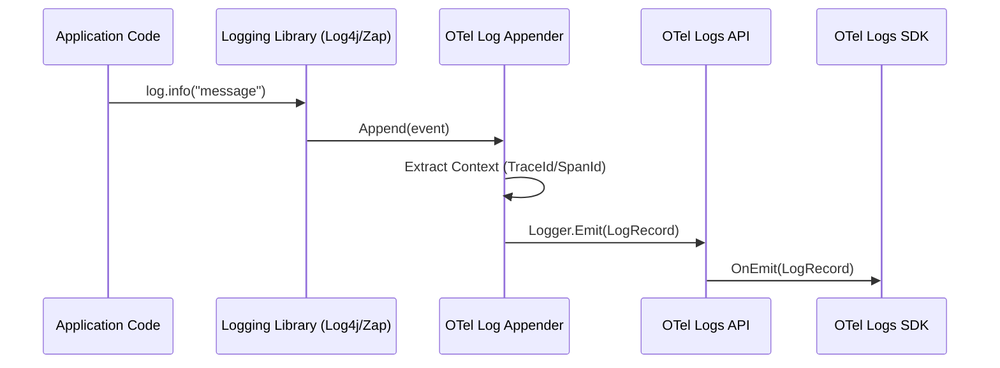
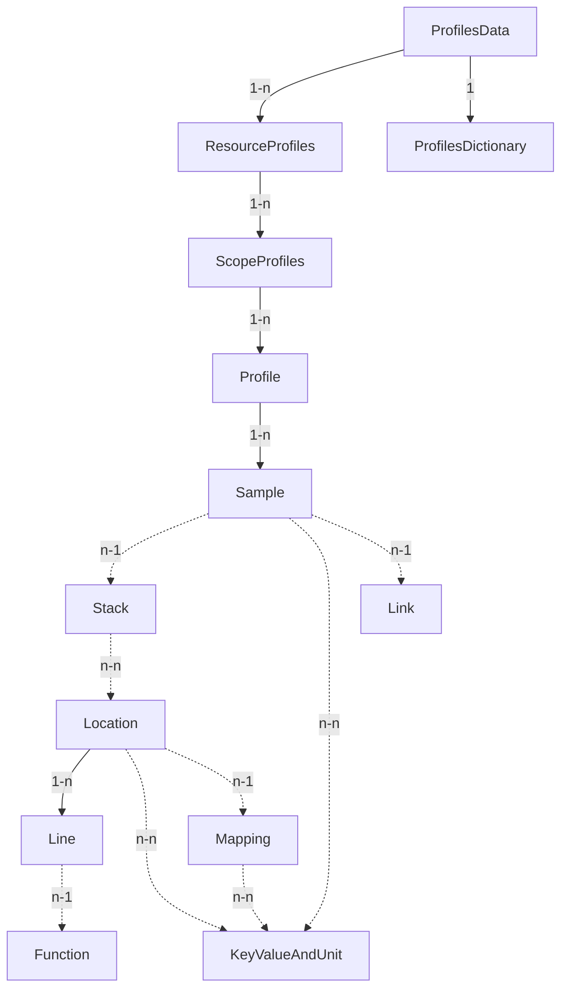
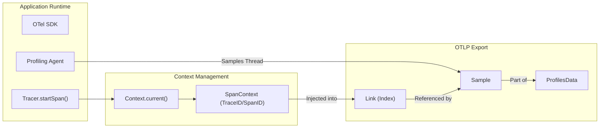
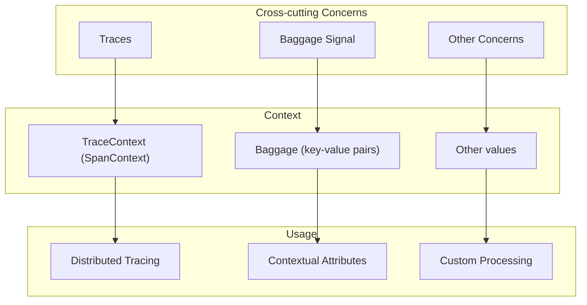
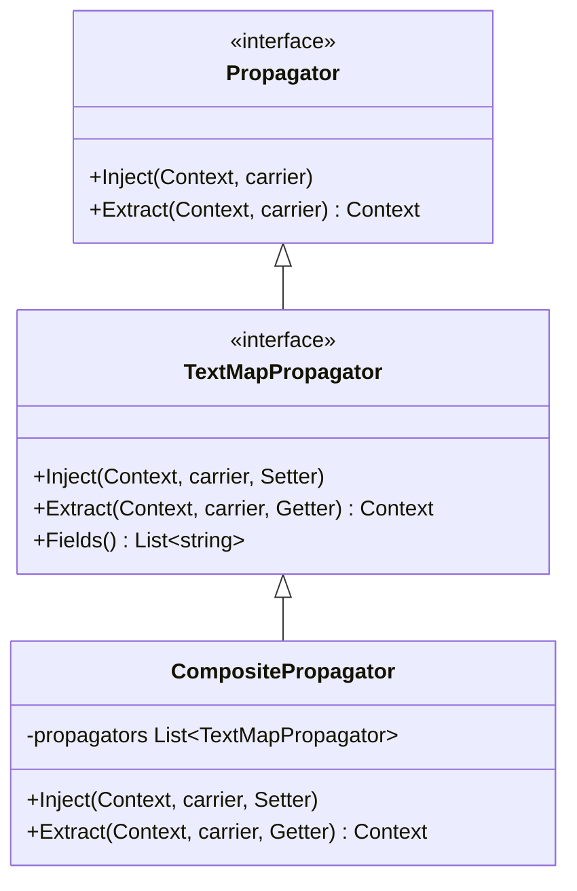
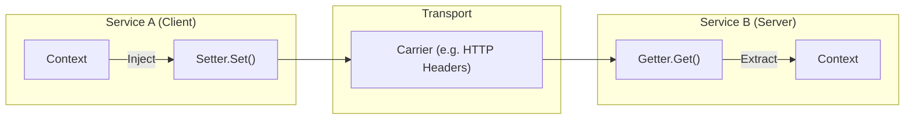

This page describes the OpenTelemetry Logging System, which provides a standardized approach for collecting, processing, and exporting logs. The logging system is designed to work with existing logging libraries while offering improvements and better integration with other observability signals (traces and metrics).

## Architecture Overview

The OpenTelemetry Logging System consists of several key components that work together to collect and process logs. Unlike tracing and metrics, which take a clean-sheet design approach, the logging system embraces existing logging solutions and ensures OpenTelemetry works with them.

### Data Flow and Component Relationship

Sources: [specification/logs/README.md:40-159](), [specification/logs/api.md:30-39]()

The diagram illustrates how log data flows through the system:
1. Logs can originate from existing logging libraries (via appenders/bridges) or directly from application code.
2. The Logs API provides a common interface for emitting log records.
3. The Logs SDK implements the API and processes log records.
4. `LogRecordProcessor` handles log record processing (batching, filtering, etc.) [specification/logs/sdk.md:30-39]().
5. `LogRecordExporter` sends log data to telemetry backends [specification/logs/sdk.md:40-44]().

## Log Data Model

The Log Data Model defines a common structure for log records, allowing for unambiguous mapping of existing log formats (like Syslog or Windows Event Log) and enabling correlation with other telemetry signals.

### LogRecord Structure

Sources: [specification/logs/data-model.md:48-53](), [specification/logs/data-model.md:161-166]()

| Field | Description |
|-------|-------------|
| `Timestamp` | Time when the event occurred, measured by the origin clock [specification/logs/data-model.md:20-20](). |
| `ObservedTimestamp` | Time when the event was observed by the collection system [specification/logs/data-model.md:21-21](). |
| `TraceId`, `SpanId`, `TraceFlags` | Trace context information for log correlation [specification/logs/data-model.md:22-25](). |
| `SeverityText`, `SeverityNumber` | Indicates the importance level [specification/logs/data-model.md:26-28](). |
| `Body` | The actual content of the log record (text or structured) [specification/logs/data-model.md:34-34](). |
| `Resource` | Describes the source of the log (e.g., service information) [specification/logs/data-model.md:35-35](). |
| `InstrumentationScope` | Describes the library/component that created the log [specification/logs/data-model.md:36-36](). |
| `Attributes` | Additional key-value pairs (AnyValue) [specification/logs/data-model.md:37-37](). |
| `EventName` | Standardized format for specific classes of events [specification/logs/data-model.md:39-39](). |

### Severity Levels

The `SeverityNumber` field normalizes severity across different logging systems into a range of 1-24 [specification/logs/data-model.md:286-300]().

| SeverityNumber range | Range name | Meaning |
|----------------------|------------|---------|
| 1-4 | TRACE | Fine-grained debugging event |
| 5-8 | DEBUG | Debugging event |
| 9-12 | INFO | Informational event |
| 13-16 | WARN | Warning event |
| 17-20 | ERROR | Error event |
| 21-24 | FATAL | Fatal error |

## Logs API

The Logs API provides interfaces for emitting log records and is primarily intended for library authors to build log appenders.

### LoggerProvider
The `LoggerProvider` is the entry point. It provides access to `Logger` instances [specification/logs/api.md:42-42]().
* **Get a Logger**: Accepts `name`, `version`, `schema_url`, and `attributes` to define the `InstrumentationScope` [specification/logs/api.md:66-91]().

### Logger
The `Logger` is responsible for emitting `LogRecord`s [specification/logs/api.md:97-97]().
* **Emit a LogRecord**: The primary function to send a log into the processing pipeline [specification/logs/api.md:109-126]().
* **Enabled**: A performance optimization to check if a log will be processed before performing expensive string formatting or attribute computation [specification/logs/api.md:131-156]().

Sources: [specification/logs/api.md:40-156]()

## Logs SDK

The SDK provides the concrete implementation of the API, managing the lifecycle and data flow.

### LoggerConfigurator (Experimental)
A `LoggerConfigurator` is a function that computes the `LoggerConfig` for a `Logger` based on its `InstrumentationScope`. This allows for fine-grained control such as disabling specific loggers or setting minimum severity levels [specification/logs/sdk.md:105-135]().

### LogRecordProcessor
`LogRecordProcessor` defines the hooks for log record processing [specification/logs/sdk.md:286-304]():
* `OnEmit`: Called when a log is emitted [specification/logs/sdk.md:322-322]().
* `ForceFlush` & `Shutdown`: Manage the lifecycle of the processor [specification/logs/sdk.md:334-335]().

Built-in processors include:
* **SimpleLogRecordProcessor**: Passes records immediately to the exporter [specification/logs/sdk.md:337-337]().
* **BatchingLogRecordProcessor**: Buffers records and sends them in batches for efficiency [specification/logs/sdk.md:338-338]().

### LogRecordExporter
Exporters (like OTLP) are responsible for sending data to the network or storage [specification/logs/sdk.md:483-489]().

Sources: [specification/logs/sdk.md:52-577]()

## Log Appender / Bridge Pattern

Because most languages have existing logging ecosystems, OpenTelemetry uses a "Bridge" pattern. Instead of developers calling the OTel API directly, they continue using their preferred library (e.g., Log4j, SLF4J, Zap).

### Bridge Logic Flow

Sources: [specification/logs/supplementary-guidelines.md:33-49](), [specification/logs/README.md:146-159]()

### Log Correlation
Correlation is achieved by injecting `TraceContext` into the `LogRecord`. In languages with implicit context (like Java), the appender can fetch the current span automatically [specification/logs/supplementary-guidelines.md:84-88](). In languages like Go, the context must be passed explicitly to the bridge [specification/logs/supplementary-guidelines.md:101-108]().

## Advanced Processing

SDK Processors allow for complex logic such as:
* **Altering**: Redacting sensitive tokens from attributes [specification/logs/supplementary-guidelines.md:144-174]().
* **Filtering**: Dropping logs below a certain severity level [specification/logs/supplementary-guidelines.md:176-200]().
* **Routing**: Sending logs from specific namespaces to different exporters [specification/logs/supplementary-guidelines.md:244-292]().

Sources: [specification/logs/supplementary-guidelines.md:126-292]()

# Profiling Signal

A **profile** is a collection of stack traces with associated values representing resource consumption (e.g., CPU time, memory allocation) and code execution, collected from a running program [specification/profiles/README.md:29-32](). The OpenTelemetry Profiles signal (Alpha) provides a standardized data format and protocol for encoding and delivering these aggregated stack traces and associated metadata [specification/profiles/data-format.md:43-47]().

## Design Goals

The profiles signal is built to satisfy several high-level requirements for production observability:

*   **Low Overhead**: Profiling agents must operate continuously without materially impacting application performance [specification/profiles/README.md:41-42]().
*   **Efficient Representation**: Uses dictionary tables to deduplicate repeated information across samples, reducing storage and transmission volume [specification/profiles/README.md:43-44]().
*   **Compatibility**: Designed as a superset of the [pprof](https://github.com/google/pprof) format to support lossless conversions [specification/profiles/README.md:45-47]().
*   **Correlation**: Profiles are linkable to logs, metrics, and traces via shared resource context and direct span references [specification/profiles/README.md:51-53]().

## Data Format and Structure

The data format builds on the `pprof` protobuf format but extends it to align with the OpenTelemetry ecosystem. It introduces `Resource` and `InstrumentationScope` context, generalized attributes, and explicit span context references [specification/profiles/README.md:58-70]().

### Message Hierarchy

The following diagram illustrates the structural relationship between profiling entities. Unlike other signals that rely heavily on direct embedding, profiles use a hybrid of **Direct Embedding** (for hierarchy) and **Index-based Referencing** (for repetitive data) [specification/profiles/data-format.md:96-103]().

**Entity Relationship Diagram**

Sources: [specification/profiles/data-format.md:59-80]()

### The Dictionary Mechanism

To minimize payload size, `ProfilesData` includes a top-level `ProfilesDictionary` [specification/profiles/data-format.md:107-109](). This dictionary deduplicates data such as strings and attributes shared across the entire message.

*   **String Table**: Standard `KeyValue` and `AnyValue` messages are extended with string reference fields pointing into `ProfilesDictionary.string_table` [specification/profiles/data-format.md:144-147]().
*   **Attribute Table**: Uses a specialized `KeyValueAndUnit` message [specification/profiles/data-format.md:133-134](). These carry an optional unit field (e.g., `By` for bytes) in UCUM format [specification/profiles/data-format.md:137-140]().

## Mappings and Build IDs

A `Mapping` message represents a binary (executable or library) mapped into the process address space. To ensure profiles can be symbolized, Mappings MUST include at least one process build ID attribute [specification/profiles/mappings.md:14-17]().

### Build ID Attributes
| Attribute | Description |
| :--- | :--- |
| `process.executable.build_id.gnu` | GNU build ID [specification/profiles/mappings.md:19]() |
| `process.executable.build_id.go` | Go-specific build ID [specification/profiles/mappings.md:20]() |
| `process.executable.build_id.htlhash` | Deterministic hash for environments where IDs are stripped [specification/profiles/mappings.md:21]() |

### HTLHASH Algorithm
In environments like Alpine Linux where build IDs may be missing, OpenTelemetry defines the `htlhash` (Header-Tail-Length Hash) algorithm [specification/profiles/mappings.md:27-29]():
1.  **Input**: Concatenate the first 4096 bytes, last 4096 bytes, and the 8-byte big-endian file length [specification/profiles/mappings.md:31-36]().
2.  **Digest**: SHA256 of the Input [specification/profiles/mappings.md:32]().
3.  **BuildID**: First 16 bytes of the digest in hex string form [specification/profiles/mappings.md:33-36]().

Sources: [specification/profiles/mappings.md:14-37]()

## Pprof Compatibility

OpenTelemetry Profiles are convertible with the original `pprof` format [specification/profiles/pprof.md:11-16]().
*   **Convertibility**: Data can be transformed into OTel Profiles and back to pprof without loss [specification/profiles/pprof.md:13-16]().
*   **Guidelines**: Specific semantic convention guidelines are provided to handle explicit conversion [specification/profiles/pprof.md:18-19]().
*   **Original Payload**: If a lossless conversion to OTel format is not possible (e.g., custom vendor extensions), the `original_payload_format` field (values: `pprof`, `jfr`, `linux_perf`) can be used to store the raw data [specification/profiles/README.md:47-50](), [specification/profiles/README.md:88-90]().

## Signal Correlation

Correlation is achieved through two primary mechanisms:

1.  **Shared Resource Context**: Like traces and metrics, profiles are associated with a `Resource`, allowing them to be grouped by service, host, or container [specification/profiles/README.md:61-63]().
2.  **Span Context References**: Samples may include a `Link` containing a `span_id` and `trace_id` [specification/profiles/README.md:68-70](). This enables "exemplar-like" navigation from a specific span to the profile samples captured during its execution [specification/profiles/data-format.md:23]().

**Data Flow: From Code to Correlated Profile**

Sources: [specification/profiles/README.md:51-53](), [specification/profiles/data-format.md:68-70](), [oteps/profiles/4947-thread-ctx.md:27-28]()

## Implementation Details: Thread Context (Experimental)

For external readers (like eBPF profilers), OpenTelemetry defines a mechanism to publish thread-level attributes via Linux ELF Thread-Local Storage (TLS) [oteps/profiles/4947-thread-ctx.md:21-25]().

*   **Thread-Local Context Record**: Contains `trace_id`, `span_id`, and `trace_flags` [oteps/profiles/4947-thread-ctx.md:27-28]().
*   **Process Context Reference**: To save space in TLS, static data like attribute keys are stored in a process-wide `ProcessContext.attributes` map, referenced by uint8 indexes in the thread-local storage [oteps/profiles/4947-thread-ctx.md:48-54]().

Sources: [oteps/profiles/4947-thread-ctx.md:1-77]()

# Context and Propagation

This document explains the context propagation system in OpenTelemetry, which enables the transmission of telemetry context (trace information, baggage, etc.) within and between services. Context propagation is a fundamental mechanism that allows distributed traces to be connected across process and service boundaries. For information about specific signal implementations (Tracing, Metrics, Logs), see their respective documentation in [Core Components](#3).

## Introduction

Context propagation is essential for correlating telemetry across distributed systems. It allows applications to maintain and transfer execution context as requests flow through services, enabling proper association of telemetry data generated at different points in a distributed transaction.

OpenTelemetry's context propagation system consists of two main components:

1.  **Context** - A carrier for immutable values that provides storage for cross-cutting concerns. [specification/context/README.md:32-35]()
2.  **Propagators** - Components that serialize and deserialize values from the Context for transmission across process boundaries. [specification/context/api-propagators.md:48-52]()

Sources: [specification/overview.md:331-342](), [specification/context/README.md:32-35](), [specification/context/api-propagators.md:48-52]()

## Context

A `Context` is a propagation mechanism which carries execution-scoped values across API boundaries and between logically associated [execution units](glossary.md#execution-unit). [specification/context/README.md:32-33]()

The Context provides:

1.  **Immutability** - A `Context` MUST be immutable; write operations result in a new `Context`. [specification/context/README.md:37-39]()
2.  **Key-Based Access** - Keys are unique opaque objects used to control access to local state. [specification/context/README.md:58-67]()
3.  **State Propagation** - Context follows code execution through the application, either explicitly or implicitly. [specification/context/README.md:44-46]()

For details, see [Context API and Baggage](#4.1).

Sources: [specification/overview.md:336-342](), [specification/context/README.md:32-39](), [specification/context/README.md:58-67]()

## Propagation

Propagation is the mechanism that transfers context between services and processes. `Propagator`s are defined as objects used to read and write context data to and from messages exchanged by applications. [specification/context/api-propagators.md:48-50]()

### Propagator Architecture

The Propagators API defines how cross-cutting concerns send their state to the next process.

Sources: [specification/context/api-propagators.md:48-52](), [specification/context/api-propagators.md:114-118](), [specification/context/api-propagators.md:214-218]()

### Propagator Types

OpenTelemetry defines specific propagator types to handle different transport restrictions:

*   **TextMapPropagator**: Injects and extracts values as string key-value pairs. [specification/context/api-propagators.md:70-71]() This is the primary type used for HTTP headers and gRPC metadata. [specification/context/api-propagators.md:119-121]()

For details, see [Propagators and Carriers](#4.2).

Sources: [specification/context/api-propagators.md:70-71](), [specification/context/api-propagators.md:119-121]()

### Propagation Flow

Propagation is usually implemented via library-specific request interceptors that detect incoming and outgoing requests. [specification/context/api-propagators.md:57-59]()

Sources: [specification/context/api-propagators.md:57-59](), [specification/context/api-propagators.md:83-112]()

## Baggage Signal

`Baggage` is a set of application-defined properties contextually associated with a distributed request. [specification/baggage/api.md:32-33]() It is represented as a set of name/value pairs where each name is associated with exactly one value. [specification/baggage/api.md:37-39]()

### Baggage Characteristics
*   **Immutability**: The `Baggage` container MUST be immutable. [specification/baggage/api.md:84]()
*   **Case Sensitivity**: Both names and values are treated as case sensitive. [specification/baggage/api.md:57]()
*   **No SDK Requirement**: The Baggage API MUST be fully functional in the absence of an installed SDK to enable transparent propagation. [specification/baggage/api.md:79-82]()

For details, see [Context API and Baggage](#4.1).

Sources: [specification/baggage/api.md:32-39](), [specification/baggage/api.md:79-84]()

## Composite Propagator

A `CompositePropagator` provides a mechanism to combine multiple propagators into a single unit. [specification/context/api-propagators.md:214-218]()

*   **Composite Inject**: Calls `Inject` on each of its constituent propagators in the order they were specified. [specification/context/api-propagators.md:231-233]()
*   **Composite Extract**: Calls `Extract` on each propagator in sequence, passing the `Context` returned by the previous propagator to the next. [specification/context/api-propagators.md:225-229]()

This allows a single service to support multiple wire formats (e.g., W3C TraceContext and B3) simultaneously.

Sources: [specification/context/api-propagators.md:214-233]()

## Global Propagators

The API SHOULD provide a way to set and access a global default `TextMapPropagator`. [specification/context/api-propagators.md:244-245]() This allows instrumentation libraries to use propagation without requiring explicit configuration from the user at every call site.

Sources: [specification/context/api-propagators.md:244-258]()

## Standard Formats

OpenTelemetry includes several built-in propagators to support industry standards:

| Propagator | Specification | Header Fields |
| :--- | :--- | :--- |
| **W3C Trace Context** | [W3C Trace Context](https://www.w3.org/TR/trace-context/) | `traceparent`, `tracestate` |
| **W3C Baggage** | [W3C Baggage](https://www.w3.org/TR/baggage/) | `baggage` |
| **B3** | [B3 Propagation](https://github.com/openzipkin/b3-propagation) | `b3` or `X-B3-*` |

Sources: [specification/context/api-propagators.md:261-309](), [specification/baggage/api.md:173-177]()