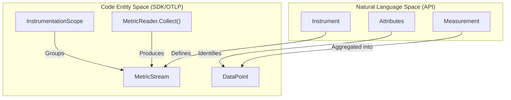
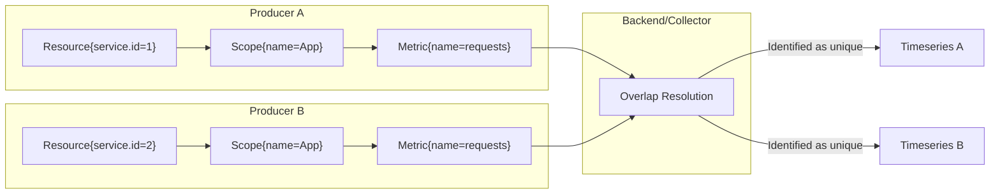

The OpenTelemetry metrics data model is a multi-layered framework designed to transport pre-aggregated metric timeseries data. It supports importing data from legacy systems (e.g., Prometheus, StatsD) and exporting to modern backends while enabling complex stream manipulations like re-aggregation and temporality conversion [specification/metrics/data-model.md:67-80]().

## Model Layers

The data model is structured into three distinct layers of abstraction to bridge the gap between API-level events and backend timeseries storage [specification/metrics/data-model.md:99-107]().

### 1. Event Model
The **Event Model** represents the raw interactions with the Metrics API. It consists of discrete measurements (e.g., "add 1 to counter") associated with a specific `Instrument` and `Context`.

### 2. Metric Stream Model
The **Metric Stream Model** (or OTLP Model) is the wire format. It groups individual events into a stream of `DataPoints`. Each stream is defined by:
*   **Instrument Definition**: Name, Kind, Unit, Description.
*   **Attributes**: Key-value pairs defining the identity of the stream.
*   **Temporality**: Whether the data represents a Delta (change since last report) or Cumulative (total since start) value.

### 3. Timeseries Model
The **Timeseries Model** is the final output format used by backends. It consists of a sequence of (Timestamp, Value) pairs for a unique set of attributes.

### Model Layer Mapping
The following diagram illustrates the flow from API entities to the OTLP protocol entities.

**Title: API to OTLP Entity Mapping**

Sources: [specification/metrics/data-model.md:95-107](), [specification/metrics/sdk.md:128-131](), [specification/metrics/sdk.md:71-72]()

---

## Metric Data Point Types

The data model defines several data point kinds, each supporting specific aggregation functions [specification/metrics/data-model.md:27-43]().

| Data Point Type | Description | Aggregation Function |
| :--- | :--- | :--- |
| **Sum** | Represents the sum of all measurements. Can be monotonic (Counter) or non-monotonic (UpDownCounter). | `Sum` |
| **Gauge** | Represents a sampled value at a specific point in time. | `LastValue` |
| **Histogram** | Represents a distribution of values using explicit boundaries. | `ExplicitBucketHistogram` |
| **ExponentialHistogram** | A high-resolution distribution using a base-2 exponential scale. | `Base2ExponentialBucketHistogram` |
| **Summary** | Legacy type for pre-calculated quantiles (primarily for Prometheus compatibility). | N/A |

### ExponentialHistogram Detail
The `ExponentialHistogram` uses a `scale` factor to determine bucket resolution. The bucket index $i$ for a value $x$ is calculated as $i = \lfloor \log_{base}(x) \rfloor$ where $base = 2^{(2^{-scale})}$ [specification/metrics/data-model.md:32-39]().

Sources: [specification/metrics/data-model.md:27-43](), [specification/metrics/sdk.md:30-34]()

---

## Aggregation Temporality

Temporality defines the relationship between consecutive data points in a stream [specification/metrics/data-model.md:48-49]().

*   **Delta Temporality**: Each data point represents the change since the previous `TimeUnixNano`. The `StartTimeUnixNano` of a point SHOULD align with the `TimeUnixNano` of the preceding point.
*   **Cumulative Temporality**: Each data point represents the total value since a fixed start time. The `StartTimeUnixNano` remains constant across points in a stream.

### Delta-to-Cumulative Conversion
The SDK or Collector can convert Delta streams to Cumulative by maintaining state. For a `Sum` instrument, the conversion follows:
$CumulativeValue_n = \sum_{i=0}^{n} DeltaValue_i$

Sources: [specification/metrics/data-model.md:48-57](), [specification/metrics/sdk.md:40-40]()

---

## Single-Writer Principle

To ensure data integrity, the OTLP metrics model follows the **Single-Writer Principle**. Only one "Writer" (a unique combination of `Resource` and `InstrumentationScope`) is allowed to produce a specific `MetricStream` (identified by Name and Attributes) [specification/metrics/data-model.md:47]().

**Title: Single-Writer Data Flow**

Sources: [specification/metrics/data-model.md:47-55](), [specification/metrics/sdk.md:111-115]()

---

## Prometheus Compatibility

OpenTelemetry provides bidirectional mapping between OTLP and Prometheus formats [specification/compatibility/prometheus_and_openmetrics.md:8-9]().

*   **Counters**: A Prometheus Counter maps to an OTLP `Sum` with `is_monotonic: true` [specification/compatibility/prometheus_and_openmetrics.md:147-148]().
*   **Gauges**: Maps directly to OTLP `Gauge` [specification/compatibility/prometheus_and_openmetrics.md:157-158]().
*   **Units**: Prometheus units (e.g., `seconds`) are converted to UCUM abbreviations (e.g., `s`) [specification/compatibility/prometheus_and_openmetrics.md:92-124]().

Sources: [specification/compatibility/prometheus_and_openmetrics.md:81-158]()