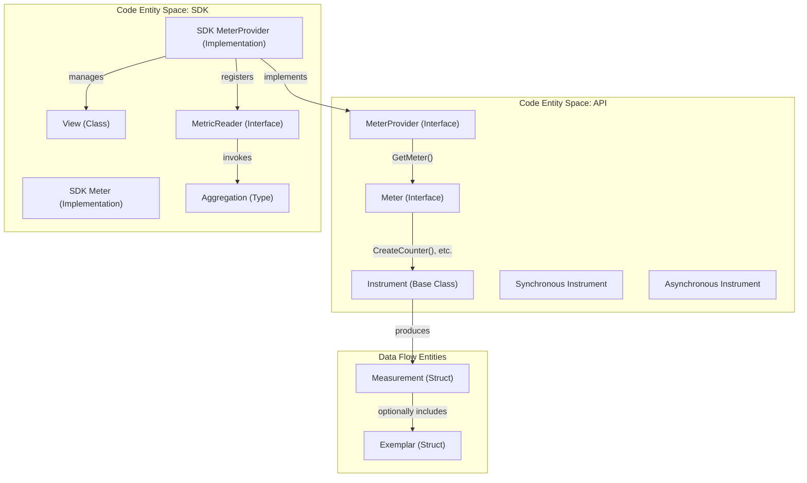
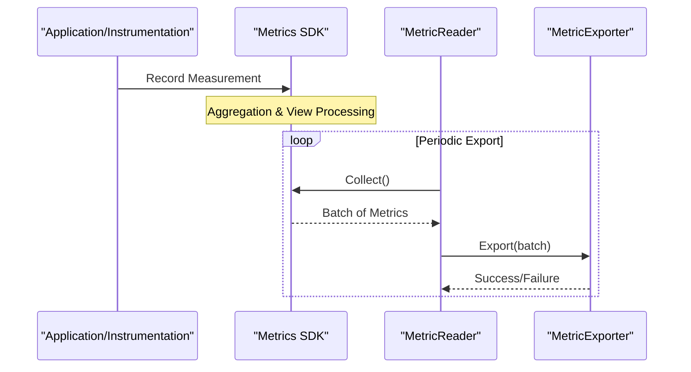

This page describes the OpenTelemetry Metrics System, which provides a standardized way to collect, process, and export metrics data. The Metrics System consists of an API for instrumenting applications, an SDK for implementing and configuring the metrics pipeline, and a Data Model for representing and transmitting metrics data.

## Architecture Overview

The OpenTelemetry Metrics System follows a layered architecture that separates the instrumentation surface (API) from the processing logic (SDK).

### Natural Language to Code Entity Mapping: API & SDK
This diagram maps conceptual components to their specific code entities and relationships as defined in the specification.

Sources: [specification/metrics/api.md:70-79](), [specification/metrics/sdk.md:107-116](), [specification/metrics/sdk.md:22-26]()

## API Components

### MeterProvider
The `MeterProvider` is the primary entry point for the Metrics API. It is a stateful object that holds configuration and provides access to `Meter` instances [specification/metrics/api.md:107-113]().

*   **Get a Meter**: This operation accepts a `name` (identifying the instrumentation scope), `version`, `schema_url`, and `attributes` [specification/metrics/api.md:121-152]().
*   **Global Provider**: The API provides a way to register and access a global default `MeterProvider` [specification/metrics/api.md:111-113]().

### Meter
The `Meter` is responsible for creating metric instruments [specification/metrics/api.md:159-163](). It is associated with an `InstrumentationScope` created from the inputs provided to the `MeterProvider` [specification/metrics/sdk.md:128-131]().

### Instruments
Instruments are used to report `Measurements`. They are categorized by their interaction model (Synchronous vs. Asynchronous) and their data properties (Monotonicity and Additivity) [specification/metrics/api.md:181-185]().

| Instrument | Type | Additive | Monotonic | Operation |
| :--- | :--- | :--- | :--- | :--- |
| **Counter** | Sync | Yes | Yes | `Add(value, attributes)` |
| **UpDownCounter** | Sync | Yes | No | `Add(value, attributes)` |
| **Histogram** | Sync | Mixed | No | `Record(value, attributes)` |
| **Gauge** | Sync | No | No | `Record(value, attributes)` |
| **Asynchronous Counter** | Async | Yes | Yes | `Observe(value, attributes)` |
| **Asynchronous UpDownCounter** | Async | Yes | No | `Observe(value, attributes)` |
| **Asynchronous Gauge** | Async | No | No | `Observe(value, attributes)` |

Sources: [specification/metrics/api.md:21-59](), [specification/metrics/supplementary-guidelines.md:117-124]()

## SDK Components

### SDK MeterProvider
The SDK implementation of the `MeterProvider` manages the lifecycle of metrics collection. It owns `MetricExporters`, `MetricReaders`, and `Views` [specification/metrics/sdk.md:144-149]().

### Views
A `View` provides the SDK with the ability to customize how metrics are processed and exported [specification/metrics/sdk.md:22]().
*   **Instrument Selection**: Criteria include instrument name, type, unit, and Meter properties [specification/metrics/sdk.md:231-255]().
*   **Stream Configuration**: Allows renaming the metric, changing the description, filtering attributes, and overriding the `Aggregation` [specification/metrics/sdk.md:257-279]().

### Aggregations
Aggregations define how measurements are combined into data points [specification/metrics/sdk.md:27]().
*   **Sum**: Computes the sum of values.
*   **Last Value**: Records only the most recent value (used for Gauges).
*   **Explicit Bucket Histogram**: Groups values into predefined buckets [specification/metrics/sdk.md:543-546]().
*   **Base2 Exponential Bucket Histogram**: Uses an exponential scale for buckets, providing high dynamic range [specification/metrics/sdk.md:548-552]().

### Exemplars
An `Exemplar` is a sample data point that provides context about a measurement, such as the `SpanContext` (TraceID and SpanID) [specification/metrics/README.md:35-37]().
*   **ExemplarFilter**: Determines which measurements are eligible to become exemplars (e.g., `AlwaysOn`, `AlwaysOff`, `TraceBased`) [specification/metrics/sdk.md:60-63]().
*   **ExemplarReservoir**: Stores the sampled exemplars for a given metric stream [specification/metrics/sdk.md:64]().

## Metrics Data Collection and Export

### MetricReader and MetricExporter
The collection process is decoupled from the export process via the `MetricReader`.

*   **MetricReader**: Defines the interface for collecting metrics from the SDK. The `PeriodicExportingMetricReader` is a standard implementation that triggers collection at intervals [specification/metrics/sdk.md:69-74]().
*   **MetricExporter**: The interface for sending metric data to a backend. It supports `Export(batch)`, `ForceFlush()`, and `Shutdown()` [specification/metrics/sdk.md:75-80]().

Sources: [specification/metrics/sdk.md:69-85](), [specification/metrics/sdk.md:1001-1015]()

## Resource and Context Association
Metrics are enriched with metadata from two primary sources:
1.  **Resource**: Describes the entity producing the telemetry (e.g., service name, host ID). A `MeterProvider` associates a `Resource` with all metrics it produces [specification/metrics/sdk.md:111-115]().
2.  **Context and Baggage**: Metrics can be correlated with traces via `Exemplars` and enriched with `Baggage` attributes stored in the `Context` [specification/metrics/README.md:35-40]().

## Cardinality and Limits
The SDK provides mechanisms to manage the memory and performance impact of high-cardinality data.
*   **Cardinality Limits**: SDKs MUST provide a way to limit the number of distinct attribute combinations (streams) per instrument [specification/metrics/sdk.md:41-45]().
*   **Overflow Attribute**: When limits are reached, measurements may be aggregated into a special `otel.metric.overflow` attribute [specification/metrics/sdk.md:43]().
*   **Attribute Limits**: The SDK MUST enforce limits on the number of attributes per measurement and the length of attribute values [specification/metrics/sdk.md:58]().

Sources: [specification/metrics/sdk.md:836-842](), [specification/metrics/sdk.md:1165-1168]()