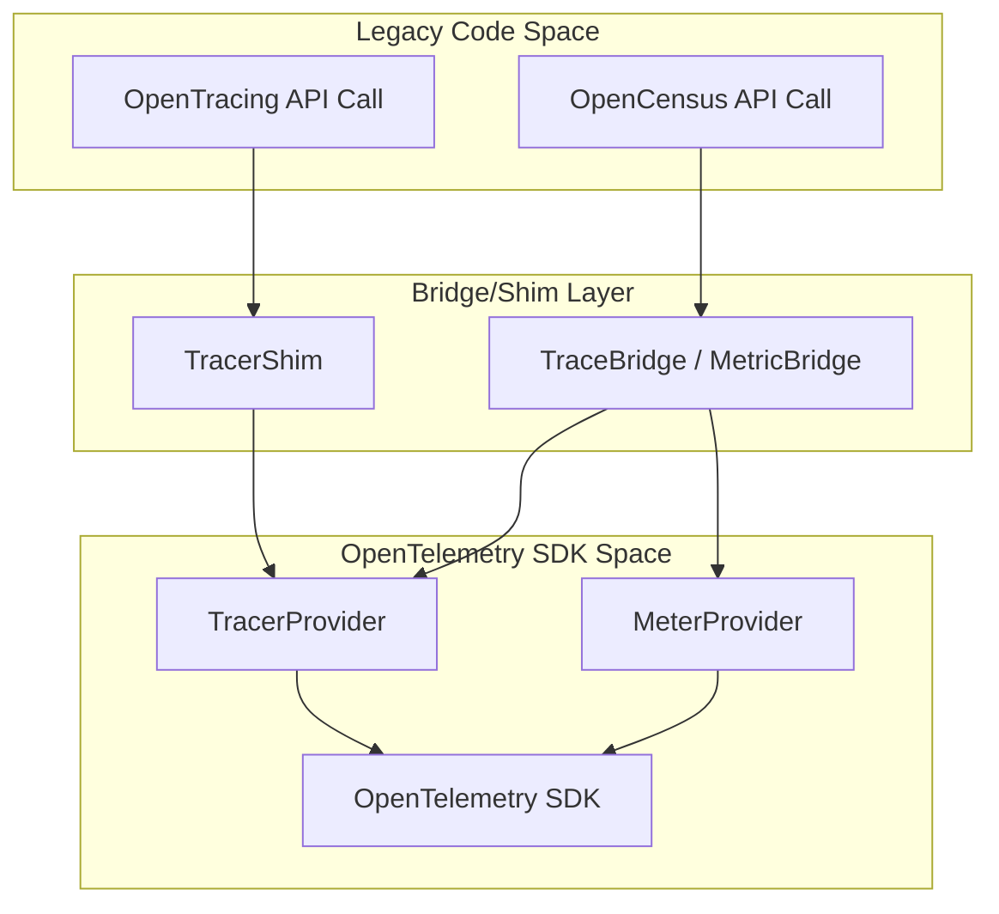
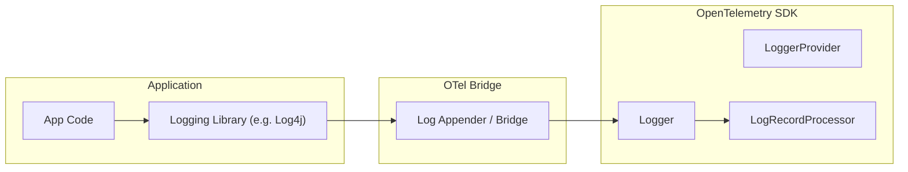

This document explains how to migrate to OpenTelemetry from other telemetry systems and maintain compatibility between systems during migration. OpenTelemetry provides shims, bridges, and translation layers to ensure that existing instrumentation in OpenTracing, OpenCensus, or Prometheus can coexist with or be migrated to OpenTelemetry.

For details on the OpenTelemetry Protocol (OTLP) compatibility, see [Exporters and Protocol](#5).

## OpenTracing and OpenCensus Compatibility

OpenTelemetry provides backward compatibility for legacy OpenTracing and OpenCensus instrumentation. These solutions allow users to use the OpenTelemetry SDK while keeping existing instrumentation intact.

### OpenTracing Compatibility
The OpenTracing shim implements the OpenTracing API using the OpenTelemetry API. It is designed to record OpenTracing instrumentation using the OpenTelemetry SDK without exposing the underlying OpenTelemetry API to the legacy code [specification/compatibility/opentracing.md:49-63]().

**Status**: Deprecated as of March 2026; removal scheduled no earlier than March 2027 [specification/compatibility/opentracing.md:7-17]().

For details, see [OpenTracing and OpenCensus Compatibility](#8.1).

### OpenCensus Compatibility
OpenTelemetry provides a bridge layer for both traces and metrics to ease migration from OpenCensus.
*   **Trace Bridge**: A shim implementing the OpenCensus Trace API using the OpenTelemetry Trace API [specification/compatibility/opencensus.md:95-100]().
*   **Metric Bridge**: Allows OpenCensus metrics to be exported via the OpenTelemetry SDK.

**Status**: Deprecated as of June 2026; removal scheduled no earlier than June 2027 [specification/compatibility/opencensus.md:7-17]().

For details, see [OpenTracing and OpenCensus Compatibility](#8.1).

### Compatibility Architecture (Code Entity Space)

The following diagram shows how legacy API calls are bridged to the OpenTelemetry `TracerProvider` and `MeterProvider`.

Sources: [specification/compatibility/opentracing.md:97-112](), [specification/compatibility/opencensus.md:95-104]()

## Prometheus and OpenMetrics Compatibility

OpenTelemetry supports bidirectional translation between OTLP and Prometheus formats (Text, Protobuf, and OpenMetrics). This allows OpenTelemetry to scrape Prometheus endpoints or act as a Prometheus-compatible exporter.

### Key Translation Concepts
*   **Metric Metadata**: Prometheus metric names are mapped to OTLP `Name`, and HELP text maps to `Description` [specification/compatibility/prometheus_and_openmetrics.md:89-126]().
*   **Unit Mapping**: Prometheus units are converted to UCUM abbreviations (e.g., `milliseconds` to `ms`, `bytes` to `By`) [specification/compatibility/prometheus_and_openmetrics.md:92-124]().
*   **Type Mapping**: Prometheus `Counter` becomes an OTLP `Sum` with `is_monotonic: true` [specification/compatibility/prometheus_and_openmetrics.md:147-148]().
*   **Exemplars**: Prometheus exemplars are converted to OpenTelemetry `Exemplars` [specification/compatibility/prometheus_and_openmetrics.md:149-151]().

For details, see [Prometheus and OpenMetrics Compatibility](#8.2).

## Log Migration and Bridging

OpenTelemetry's approach to logs focuses on supporting existing legacy logging libraries (e.g., Log4j, Logback, Zap) through a "Bridge" pattern rather than replacing them entirely.

### Log Appender / Bridge Pattern
Instead of application developers calling the OpenTelemetry Logs API directly, library authors create "Log Appenders." These appenders bridge existing logging frameworks to the OpenTelemetry `LoggerProvider` [specification/logs/README.md:146-150]().

Sources: [specification/logs/README.md:142-155](), [specification/logs/data-model-appendix.md:15-16]()

### Data Model Mapping
OpenTelemetry provides mapping examples for common log formats to the OpenTelemetry Log Data Model:
*   **Syslog (RFC5424)**: Maps `APP-NAME` to `Resource["service.name"]` and `MSG` to `Body` [specification/logs/data-model-appendix.md:32-104]().
*   **Windows Event Log**: Maps `TimeCreated` to `Timestamp` and `Level` to `Severity` [specification/logs/data-model-appendix.md:106-151]().

## Metric Data Model Compatibility

The OTLP Metrics protocol is designed specifically to import data from existing systems (like Prometheus or StatsD) without loss of semantics or fidelity [specification/metrics/data-model.md:71-81]().

The model supports three primary transformations to facilitate migration and system integration:
1.  **Temporal Reaggregation**: Combining high-frequency metrics into longer intervals [specification/metrics/data-model.md:120-122]().
2.  **Spatial Reaggregation**: Removing unwanted attributes by merging data points [specification/metrics/data-model.md:123-124]().
3.  **Delta-to-Cumulative Conversion**: Allowing clients to send Delta increments while the collector or backend converts them to Cumulative totals [specification/metrics/data-model.md:125-128]().

Sources: [specification/metrics/data-model.md:113-138]()