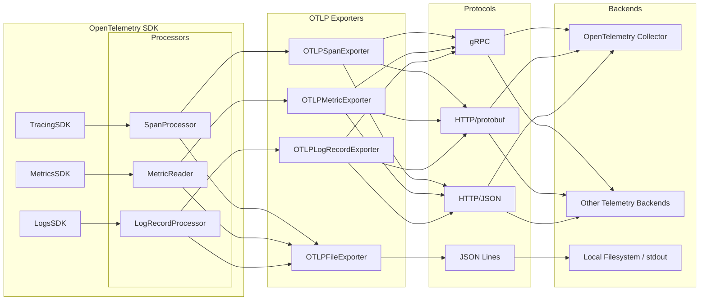
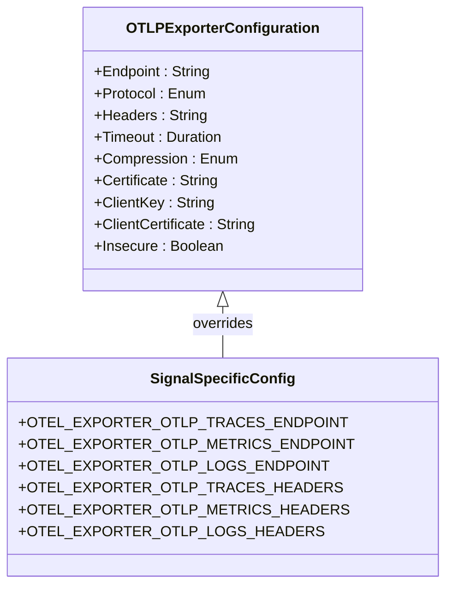
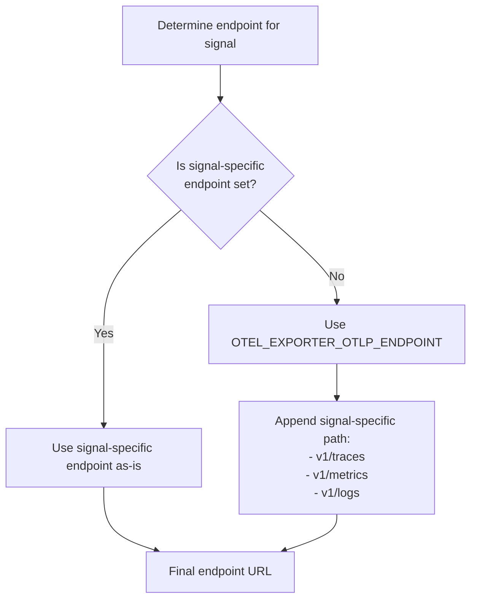
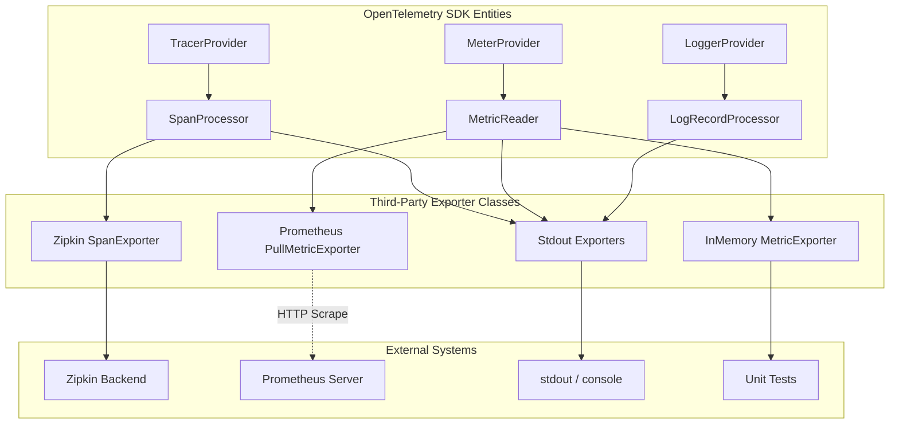
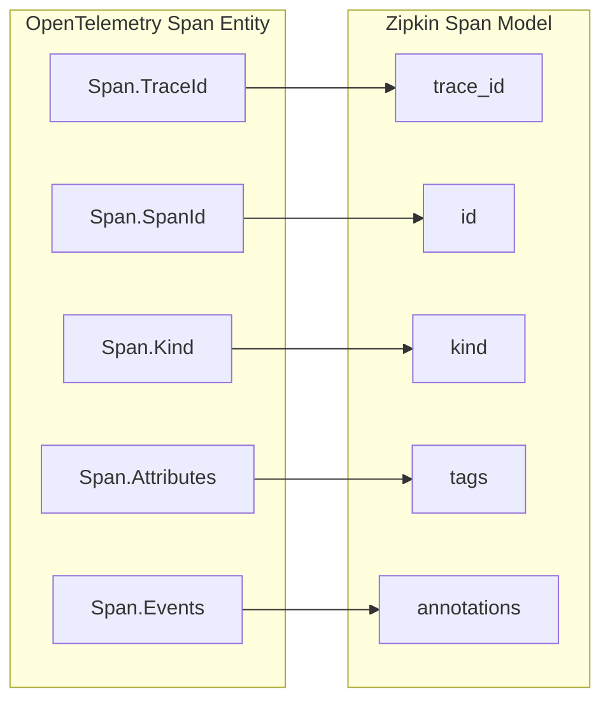
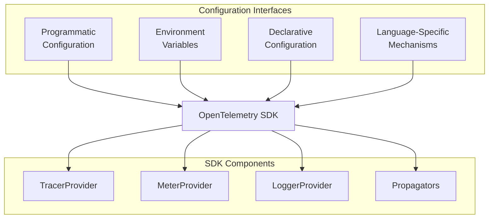
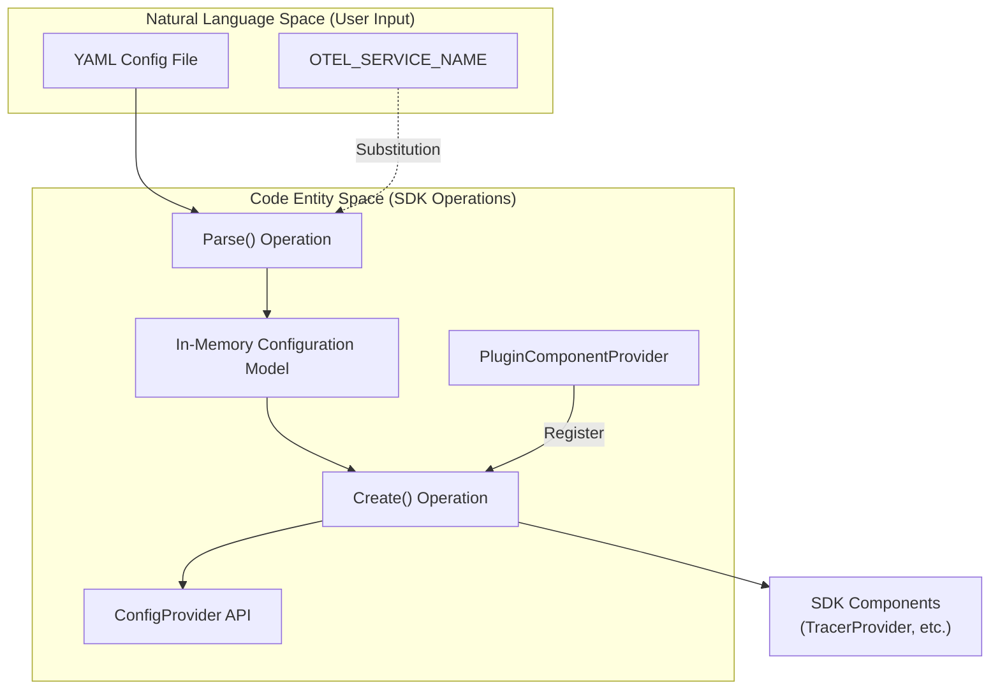
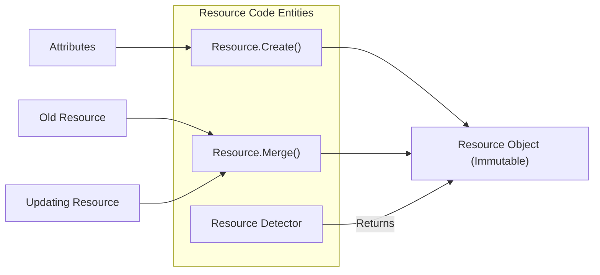

## Purpose and Scope

This document provides detailed technical documentation for the OpenTelemetry Protocol (OTLP) Exporters, which are responsible for transmitting telemetry data (traces, metrics, and logs) from OpenTelemetry SDK implementations to telemetry backends. It covers configuration options, protocol specifications, retry behavior, and specialized implementations like the File Exporter.

Sources: [specification/protocol/exporter.md:5-9]()

## OTLP Exporter Architecture

OTLP Exporters serve as the bridge between the OpenTelemetry SDK and telemetry backend systems. They receive processed telemetry data from the SDK components and transmit it via the OpenTelemetry Protocol to collectors or other backend systems.

Title: OTLP Exporter Architecture and Data Flow

Sources: [specification/protocol/exporter.md:9-9](), [specification/protocol/exporter.md:159-166](), [specification/protocol/file-exporter.md:37-48]()

### Supported Transport Protocols

OTLP Exporters support multiple transport protocols for sending telemetry data:

| Protocol | Description | Default Port |
|----------|-------------|--------------|
| `grpc` | Protobuf-encoded data using gRPC wire format over HTTP/2 connection | 4317 |
| `http/protobuf` | Protobuf-encoded data over HTTP connection | 4318 |
| `http/json` | JSON-encoded data over HTTP connection | 4318 |

OpenTelemetry SDKs are required to support at least one of these protocols, with a preference for supporting both `grpc` and `http/protobuf`. The default transport should be `http/protobuf` unless there are good reasons to choose `grpc` (such as backward compatibility).

Sources: [specification/protocol/exporter.md:71-75](), [specification/protocol/exporter.md:159-175]()

## Configuration Options

OTLP Exporters provide a comprehensive set of configuration options that can be set through environment variables or programmatically. Each configuration option can be specified globally for all signals or overridden for specific signals (traces, metrics, logs).

Title: OTLP Exporter Configuration and Environment Mapping

Sources: [specification/protocol/exporter.md:11-76]()

### Common Configuration Options

| Configuration Option | Description | Default | Environment Variables |
|----------------------|-------------|---------|------------------------|
| **Endpoint (HTTP)** | Target URL to send telemetry data | `http://localhost:4318` | `OTEL_EXPORTER_OTLP_ENDPOINT` `OTEL_EXPORTER_OTLP_TRACES_ENDPOINT` ... |
| **Endpoint (gRPC)** | Target to send telemetry data | `http://localhost:4317` | `OTEL_EXPORTER_OTLP_ENDPOINT` `OTEL_EXPORTER_OTLP_TRACES_ENDPOINT` ... |
| **Insecure** | Whether to enable client transport security for gRPC | `false` | `OTEL_EXPORTER_OTLP_INSECURE` `OTEL_EXPORTER_OTLP_TRACES_INSECURE` ... |
| **Certificate File** | Trusted certificate for TLS verification | n/a | `OTEL_EXPORTER_OTLP_CERTIFICATE` `OTEL_EXPORTER_OTLP_TRACES_CERTIFICATE` ... |
| **Client key file** | Client's private key for mTLS (PEM format) | n/a | `OTEL_EXPORTER_OTLP_CLIENT_KEY` `OTEL_EXPORTER_OTLP_TRACES_CLIENT_KEY` ... |
| **Client certificate file** | Client certificate for mTLS (PEM format) | n/a | `OTEL_EXPORTER_OTLP_CLIENT_CERTIFICATE` `OTEL_EXPORTER_OTLP_TRACES_CLIENT_CERTIFICATE` ... |
| **Headers** | Key-value pairs for HTTP/gRPC headers | n/a | `OTEL_EXPORTER_OTLP_HEADERS` `OTEL_EXPORTER_OTLP_TRACES_HEADERS` ... |
| **Compression** | Compression type (`gzip`, `none`) | No value [3] | `OTEL_EXPORTER_OTLP_COMPRESSION` `OTEL_EXPORTER_OTLP_TRACES_COMPRESSION` ... |
| **Timeout** | Maximum time to wait for each batch export | 10s | `OTEL_EXPORTER_OTLP_TIMEOUT` `OTEL_EXPORTER_OTLP_TRACES_TIMEOUT` ... |
| **Protocol** | Transport protocol (`grpc`, `http/protobuf`, `http/json`) | `http/protobuf` | `OTEL_EXPORTER_OTLP_PROTOCOL` `OTEL_EXPORTER_OTLP_TRACES_PROTOCOL` ... |

Sources: [specification/protocol/exporter.md:11-76](), [specification/protocol/exporter.md:85-89]()

### Specifying Headers via Environment Variables

Headers for OTLP exporters can be specified using environment variables in a format matching the W3C Baggage specification. The format is a comma-separated list of key-value pairs: `key1=value1,key2=value2`.

Sources: [specification/protocol/exporter.md:177-178]()

## Endpoint URLs for OTLP/HTTP

The OTLP/HTTP exporter constructs endpoint URLs for each signal (traces, metrics, logs) based on environment variable configuration.

1. **Per-signal variables** (`OTEL_EXPORTER_OTLP_<signal>_ENDPOINT`): The URL is used as-is. If no path is provided, `/` is used.
2. **Global variable** (`OTEL_EXPORTER_OTLP_ENDPOINT`): Used as a base URL with signal-specific paths appended:
   - Traces: `v1/traces`
   - Metrics: `v1/metrics`
   - Logs: `v1/logs`

Title: OTLP/HTTP Endpoint URL Resolution Process

Sources: [specification/protocol/exporter.md:94-117]()

## Retry Behavior

OTLP Exporters must implement retry strategies for transient errors using exponential back-off with jitter.

- **OTLP/gRPC**: Retryable errors are defined by specific gRPC status codes.
- **OTLP/HTTP**: Retryable errors include specific HTTP status codes (e.g., 502, 503, 504) and network connection issues.

Sources: [specification/protocol/exporter.md:180-199]()

## File Exporter

The OpenTelemetry Protocol File Exporter (Status: **Development**) is designed for scenarios where network export is impractical (FaaS), for consistent log scraping (Kubernetes stdout), or for high reliability.

### Configuration
- **Output Stream**: Configurable to a file or `stdout` (default). [specification/protocol/file-exporter.md:52-54]()
- **Serialization**: Data is serialized to [JSON lines](https://jsonlines.org) (`.jsonl`). [specification/protocol/file-exporter.md:62-70]()
- **Encoding**: Must follow [OTLP JSON Encoding](https://github.com/open-telemetry/opentelemetry-proto/blob/main/docs/specification.md#json-protobuf-encoding). [specification/protocol/file-exporter.md:81-82]()

### Data Requirements
- Files must contain exactly one type of data: traces, metrics, or logs. [specification/protocol/file-exporter.md:86-86]()
- Supported top-level objects: `TracesData`, `MetricsData`, and `LogsData`. [specification/protocol/file-exporter.md:84-84]()

Sources: [specification/protocol/file-exporter.md:5-87]()

## User Agent

OTLP Exporters should include a `User-Agent` header to identify the implementation. The recommended format is: `OTel-OTLP-Exporter-<language>/<version>`.

Sources: [specification/protocol/exporter.md:201-209]()

# Third-Party Exporters

This document describes OpenTelemetry exporters for third-party telemetry systems like Prometheus, Zipkin, and debugging-oriented exporters. These exporters allow sending telemetry data collected through OpenTelemetry to external systems that don't natively support the OpenTelemetry Protocol (OTLP). For information about OTLP exporters, see [OTLP Exporters](5.1).

## Overview of Third-Party Exporters

OpenTelemetry third-party exporters transform telemetry data from the OpenTelemetry data model into formats compatible with external monitoring, visualization, and analysis systems. They serve as bridges between OpenTelemetry instrumentation and existing observability platforms.

These exporters are categorized by signal type (traces, metrics, logs) and delivery mechanism (push vs. pull):

1.  **Metrics Exporters**:
    *   Prometheus (pull-based)
    *   Stdout (push-based)
    *   In-memory (push-based, for testing)
2.  **Trace Exporters**:
    *   Zipkin (push-based)
    *   Stdout (push-based)
3.  **Log Exporters**:
    *   Stdout (push-based)

### Exporter Architecture

The following diagram illustrates how third-party exporters fit into the OpenTelemetry architecture, bridging the SDK components to external systems.

**Figure 1: SDK to Exporter Data Flow**

Sources: [specification/metrics/sdk_exporters/prometheus.md:43-44](), [specification/metrics/sdk_exporters/stdout.md:9-11](), [specification/metrics/sdk_exporters/in-memory.md:9-11](), [specification/logs/sdk_exporters/stdout.md:9-10](), [specification/trace/sdk_exporters/stdout.md:9-11]()

## Metrics Exporters

### Prometheus Exporter

The Prometheus Exporter is a **Pull Metric Exporter** [specification/metrics/sdk_exporters/prometheus.md:43-44]() that responds to HTTP requests with metrics in the appropriate format.

Key characteristics:
*   **Temporality**: MUST set `MetricReader` temporality to `cumulative` for all instrument kinds [specification/metrics/sdk_exporters/prometheus.md:99-101]().
*   **Format**: MUST support version `0.0.4` of the Prometheus text-based format [specification/metrics/sdk_exporters/prometheus.md:72-74]().
*   **Client Libraries**: SHOULD use official Prometheus client libraries to handle `Content-Type` negotiation and custom `Collector` modeling [specification/metrics/sdk_exporters/prometheus.md:57-66]().

#### Configuration Options

| Option | Description | Default |
| :--- | :--- | :--- |
| `host` | Host metrics are served on [specification/metrics/sdk_exporters/prometheus.md:109-111]() | `localhost` |
| `port` | Port metrics are served on [specification/metrics/sdk_exporters/prometheus.md:117-119]() | `9464` |
| `default_aggregation` | Default `aggregation` as a function of instrument kind [specification/metrics/sdk_exporters/prometheus.md:125-128]() | SDK Default |
| `resource_constant_labels` | Adds resource attributes as metric labels [specification/metrics/sdk_exporters/prometheus.md:134-137]() | Disabled |
| `translation_strategy` | Controls metric name translation (e.g., `UnderscoreEscapingWithSuffixes`) [specification/metrics/sdk_exporters/prometheus.md:143-150]() | `UnderscoreEscapingWithSuffixes` |
| `scope_info_enabled` | Whether metrics include scope labels [specification/metrics/sdk_exporters/prometheus.md:155-157]() | `true` |
| `target_info_enabled` | Whether to produce a `target_info` metric [specification/metrics/sdk_exporters/prometheus.md:163-165]() | `true` |

Sources: [specification/metrics/sdk_exporters/prometheus.md:95-166]()

### Stdout Metrics Exporter

The Stdout Metrics Exporter is a **Push Metric Exporter** that outputs metrics to stdout/console. It is intended for debugging and learning [specification/metrics/sdk_exporters/stdout.md:9-19]().

*   **Temporality**: MUST provide configuration to set temporality; defaults to `cumulative` for all instrument kinds [specification/metrics/sdk_exporters/stdout.md:30-33]().
*   **Automatic Configuration**: If configured via `OTEL_METRICS_EXPORTER`, it MUST be paired with a `periodic exporting MetricReader` with a default `exportIntervalMilliseconds` of 10000 [specification/metrics/sdk_exporters/stdout.md:40-46]().

Sources: [specification/metrics/sdk_exporters/stdout.md:1-47]()

### In-Memory Metrics Exporter

The In-memory Metrics Exporter is a **Push Metric Exporter** that accumulates metrics in local memory for inspection, primarily used for unit tests [specification/metrics/sdk_exporters/in-memory.md:9-11]().

*   **Temporality**: Defaults to `cumulative` for all instrument kinds [specification/metrics/sdk_exporters/in-memory.md:13-16]().
*   **Aggregation**: Defaults to the SDK's [default aggregation](3.2) [specification/metrics/sdk_exporters/in-memory.md:18-21]().

Sources: [specification/metrics/sdk_exporters/in-memory.md:1-29]()

## Trace Exporters

### Zipkin Exporter

> [!WARNING]
> Zipkin exporter support is **Deprecated** and will be removed from the OpenTelemetry specification in December 2026 [specification/trace/sdk_exporters/zipkin.md:7-10]().

The Zipkin exporter transforms OpenTelemetry Spans into Zipkin v2 API format [specification/trace/sdk_exporters/zipkin.md:23-29]().

**Figure 2: OpenTelemetry to Zipkin Mapping**

Sources: [specification/trace/sdk_exporters/zipkin.md:36-52]()

#### Remote Endpoint and Service Name
*   **Service Name**: MUST be set to the value of the resource attribute `service.name` [specification/trace/sdk_exporters/zipkin.md:76-78]().
*   **Remote Endpoint**: If `SpanKind` is `CLIENT` or `PRODUCER`, the exporter SHOULD specify a remote endpoint. Preferred attributes are `peer.service`, followed by `server.address`, then `net.peer.name` [specification/trace/sdk_exporters/zipkin.md:106-116]().

### Stdout Trace Exporter

The "Standard output" Span Exporter outputs spans to the console.

*   **Naming**: Idiomatic names like `ConsoleExporter` or `StdoutExporter` are encouraged [specification/trace/sdk_exporters/stdout.md:26-28]().
*   **Processor**: If configured via `OTEL_TRACES_EXPORTER`, it SHOULD be paired with a `simple processor` [specification/trace/sdk_exporters/stdout.md:30-35]().

Sources: [specification/trace/sdk_exporters/stdout.md:1-36]()

## Logs Exporters

### Stdout Logs Exporter

The "Standard output" LogRecord Exporter outputs logs to the console.

*   **Processor**: If configured via `OTEL_LOGS_EXPORTER`, it SHOULD be paired with a `simple processor` [specification/logs/sdk_exporters/stdout.md:29-34]().
*   **Usage**: Recommended for debugging only; output format is not standardized [specification/logs/sdk_exporters/stdout.md:13-19]().

Sources: [specification/logs/sdk_exporters/stdout.md:1-35]()

## Summary of Environment Variable Selection

| Signal | Environment Variable | Value | Default Processor/Reader |
| :--- | :--- | :--- | :--- |
| Metrics | `OTEL_METRICS_EXPORTER` | `prometheus` | `PullMetricExporter` [specification/metrics/sdk_exporters/prometheus.md:43]() |
| Metrics | `OTEL_METRICS_EXPORTER` | `console` | `Periodic Exporting MetricReader` [specification/metrics/sdk_exporters/stdout.md:44-45]() |
| Traces | `OTEL_TRACES_EXPORTER` | `console` | `Simple Span Processor` [specification/trace/sdk_exporters/stdout.md:34-35]() |
| Logs | `OTEL_LOGS_EXPORTER` | `console` | `Simple LogRecordProcessor` [specification/logs/sdk_exporters/stdout.md:33-34]() |

Sources: [specification/metrics/sdk_exporters/prometheus.md:43](), [specification/metrics/sdk_exporters/stdout.md:40-46](), [specification/trace/sdk_exporters/stdout.md:30-35](), [specification/logs/sdk_exporters/stdout.md:29-34]()

# Configuration

This document explains the configuration mechanisms available for OpenTelemetry components. It covers how to configure the OpenTelemetry SDK using different interfaces, including programmatic configuration, environment variables, and declarative file-based configuration. For specific information about OTLP exporter configuration, see [Exporters and Protocol](#5).

## Overview

OpenTelemetry SDK components are highly configurable to accommodate various deployment scenarios and requirements. The specification defines several configuration interfaces that can be used to customize the behavior of OpenTelemetry components [specification/configuration/README.md:9-13]().

Sources: [specification/configuration/README.md:15-62]()

## Configuration Interfaces

OpenTelemetry supports four main approaches to configuration, which can be used independently or in combination:

### Programmatic Configuration
The SDK MUST provide a programmatic interface for all configuration [specification/configuration/README.md:17-17](). This interface SHOULD be written in the language of the SDK itself and serves as the foundation for all other configuration mechanisms [specification/configuration/README.md:18-19](). For example, an SDK builder class might accept a well-defined struct to initialize components [specification/configuration/README.md:21-25]().

### Environment Variables
Environment variable configuration defines a set of language-agnostic environment variables for common configuration goals [specification/configuration/README.md:29-30](). While optional, if an implementation allows environment-based configuration, it MUST have a direct code configuration equivalent [specification/configuration/sdk-environment-variables.md:48-56](). For details, see [Environment Variable Configuration](#6.1).

### Declarative Configuration
Declarative configuration provides a more expressive mechanism than environment variables, allowing users to load components via a file-based representation of a standardized configuration data model [specification/configuration/README.md:34-42](). For details, see [Declarative Configuration](#6.2).

### Other Mechanisms
Additional mechanisms SHOULD be provided in formats idiomatic to the SDK's language (e.g., system properties or framework-specific config) [specification/configuration/README.md:60-65]().

Sources: [specification/configuration/README.md:15-65](), [specification/configuration/sdk-environment-variables.md:48-56]()

## Configuration Processing Flow

The following diagram illustrates how configuration is processed in OpenTelemetry, bridging the gap between configuration sources and the internal SDK operations.

Sources: [specification/configuration/sdk.md:33-50](), [specification/configuration/sdk.md:203-210](), [specification/configuration/sdk.md:214-222]()

## Environment Variable Configuration

Environment variables provide a standardized way to configure OpenTelemetry across different language implementations [specification/configuration/sdk-environment-variables.md:46-47]().

### Implementation Guidelines
- **Empty Values**: The SDK MUST interpret an empty value the same way as an unset variable [specification/configuration/sdk-environment-variables.md:60-60]().
- **Booleans**: MUST be set to true only by the case-insensitive string `"true"`; all other values fallback to false [specification/configuration/sdk-environment-variables.md:66-74]().
- **Enums**: SHOULD be interpreted in a case-insensitive manner [specification/configuration/sdk-environment-variables.md:103-103]().

### Key Environment Variables
| Name | Description | Default |
|------|-------------|---------|
| `OTEL_SDK_DISABLED` | Disables the SDK for all signals [specification/configuration/sdk-environment-variables.md:113]() | `false` |
| `OTEL_SERVICE_NAME` | Sets the `service.name` resource attribute [specification/configuration/sdk-environment-variables.md:116]() | |
| `OTEL_RESOURCE_ATTRIBUTES` | Key-value pairs for resource attributes [specification/configuration/sdk-environment-variables.md:115]() | |
| `OTEL_TRACES_EXPORTER` | List of trace exporters to use [specification/configuration/sdk-environment-variables.md:294]() | `otlp` |

For a comprehensive reference, see [Environment Variable Configuration](#6.1).

Sources: [specification/configuration/sdk-environment-variables.md:60-116](), [specification/configuration/sdk-environment-variables.md:294-294]()

## Declarative Configuration

Declarative configuration allows for expressive, file-based setup using a standardized [Configuration Data Model](https://github.com/open-telemetry/opentelemetry-configuration) [specification/configuration/data-model.md:22-30]().

### Components
- **Data Model**: Defines structures for SDK components and instrumentation [specification/configuration/README.md:46-48]().
- **Configuration SDK**: Includes the `Parse` and `Create` operations to transform files into active SDK components [specification/configuration/sdk.md:48-49]().
- **Instrumentation Configuration API**: Allows libraries to read relevant config (e.g., `ConfigProvider`) during initialization [specification/configuration/api.md:25-29]().

### Environment Variable Substitution
Configuration files support substitution using the `${ENV_NAME}` or `${ENV_NAME:-default}` syntax [specification/configuration/data-model.md:61-75](). Substitution MUST only apply to scalar values, not mapping keys [specification/configuration/data-model.md:120-121]().

For details on the YAML schema and SDK operations, see [Declarative Configuration](#6.2).

Sources: [specification/configuration/data-model.md:22-121](), [specification/configuration/sdk.md:33-50](), [specification/configuration/api.md:22-29]()

## Resource Configuration

A `Resource` is an immutable representation of the entity producing telemetry [specification/resource/sdk.md:10-12](). Resources are typically associated with a `TracerProvider`, `MeterProvider`, or `LoggerProvider` at creation time [specification/resource/sdk.md:26-42]().

### Resource SDK Operations
- **Create**: Instantiates a resource from `Attributes` and an optional `schema_url` [specification/resource/sdk.md:63-74]().
- **Merge**: Combines two resources, where the updating resource's attributes take precedence [specification/resource/sdk.md:76-88]().
- **Detectors**: Custom resource detectors (e.g., for Docker or EKS) SHOULD be implemented as separate packages [specification/resource/sdk.md:113-115]().

Sources: [specification/resource/sdk.md:61-123]()