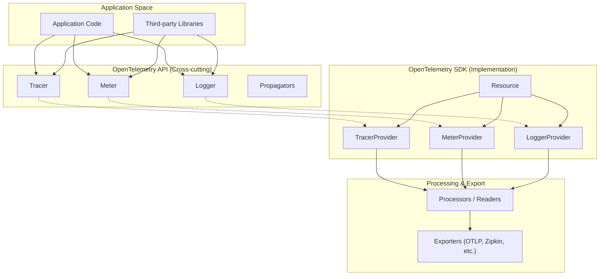
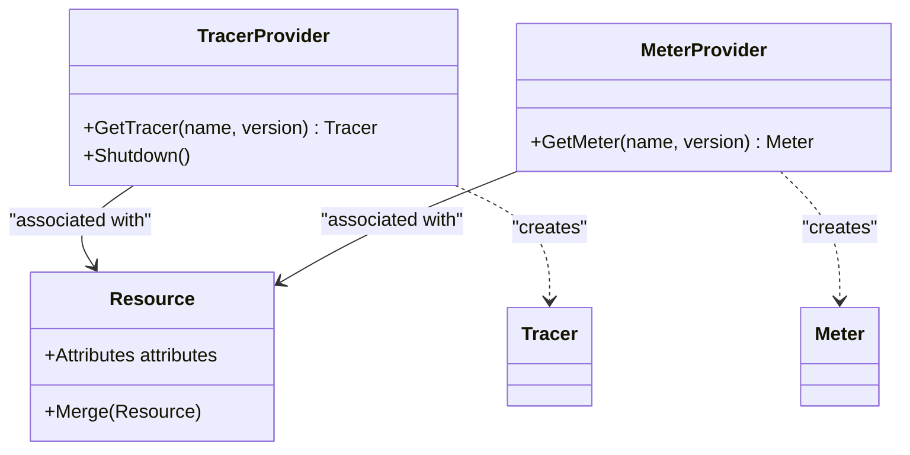

This document provides a high-level overview of the OpenTelemetry architecture, explaining its core components, their relationships, and the design principles that enable vendor-neutral observability across distributed systems.

## Architectural Overview

OpenTelemetry is organized into **signals**, each providing a specialized form of observability. While signals share a common subsystem for context propagation, they function independently to describe different aspects of a system's behavior [specification/overview.md:50-53]().

Sources: [specification/overview.md:46-58](), [specification/library-guidelines.md:37-42]()

## Core Design Principles

### API and SDK Separation
A fundamental principle is the decoupling of the **API** from the **SDK**.
- **API**: Contains the cross-cutting public interfaces used for instrumentation. Instrumentation authors MUST only reference the API [specification/overview.md:61-69]().
- **SDK**: The concrete implementation of the API. It is managed by the application owner and includes constructors and plugin interfaces [specification/overview.md:64-67]().

In the absence of an installed SDK, the API MUST provide a minimal "no-op" implementation to ensure application stability and negligible overhead [specification/library-guidelines.md:54-67]().

### Signal-Based Architecture
The architecture is partitioned into signals (Traces, Metrics, Logs, and Baggage), each with its own lifecycle and stability level [specification/glossary.md:71-76]().

| Signal | Primary API Entry Point | Responsibility |
| :--- | :--- | :--- |
| **Traces** | `Tracer` | Creating `Span`s to track operations [specification/trace/api.md:57-62](). |
| **Metrics** | `Meter` | Creating `Instrument`s for raw measurements [specification/metrics/api.md:72-78](). |
| **Logs** | `Logger` | Emitting `LogRecord`s via appenders [specification/overview.md:29-30](). |
| **Baggage** | `Baggage` | Propagating user-defined properties [specification/baggage/api.md:32-35](). |

## Component Relationships

### Providers and Factories
SDK components are accessed through **Providers** (e.g., `TracerProvider`, `MeterProvider`). These providers are stateful objects that hold configuration, such as `Resource` associations and exporters [specification/trace/api.md:88-93](), [specification/metrics/api.md:107-113]().

Sources: [specification/trace/sdk.md:92-117](), [specification/resource/sdk.md:26-43]()

## Context and Propagation
Context propagation enables the movement of telemetry state (like Trace IDs) across process boundaries.
- **Context API**: Manages the in-process state [specification/trace/api.md:159-171]().
- **Propagators**: Use `Inject` and `Extract` operations to move context through "Carriers" (e.g., HTTP headers) [specification/context/api-propagators.md:81-113]().

For details, see [Propagators and Carriers](#4.2).

## Resource Management
A `Resource` is an immutable representation of the entity producing telemetry (e.g., a service name or host ID) [specification/resource/sdk.md:10-12](). Resources are associated with Providers at creation time and cannot be changed thereafter [specification/resource/sdk.md:26-28]().

For details, see [Resource SDK](#2.2).

## Data Model and Attributes
OpenTelemetry uses a common data model for attributes across all signals. The `AnyValue` type system allows for representing primitives, arrays, and maps consistently [specification/common/README.md:41-56]().

For details, see [Common Data Model and Attributes](#2.1).

## Entities
The **Entities** concept allows for the instantiation and propagation of objects of interest that are not strictly tied to a single trace or metric, such as a specific user or a cloud resource instance.

For details, see [Entities](#2.3).