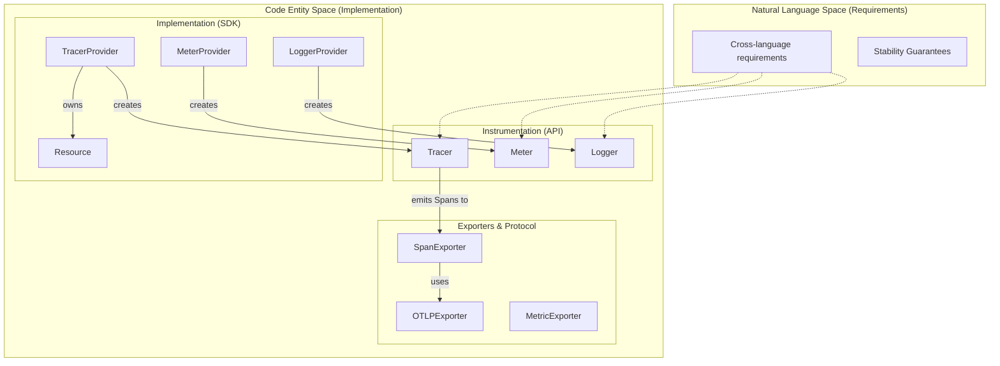
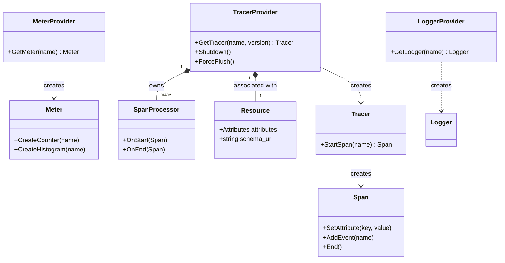

## Purpose and Scope

The **OpenTelemetry Specification** describes the cross-language requirements and expectations for all OpenTelemetry implementations [README.md:10-12](). It establishes common principles, APIs, data models, and protocols needed to instrument applications and libraries with observability features. The specification ensures that OpenTelemetry clients are easy to use and uniform across all supported languages while allowing for language-specific expressiveness [specification/library-guidelines.md:3-4]().

For details on navigation and the document status system (Development/Stable), see [Getting Started and Repository Structure](#1.1). For core design goals like vendor neutrality and the no-op guarantee, see [Specification Principles and Design Goals](#1.2).

Sources: [README.md:10-12](), [specification/library-guidelines.md:1-4](), [specification/overview.md:42-43]()

## OpenTelemetry Architecture

OpenTelemetry is organized into [**signals**](specification/glossary.md#signals), which are specialized forms of observability such as tracing, metrics, logs, and baggage [specification/overview.md:50-52]().

A fundamental principle is the separation between **API** and **SDK** packages. This allows instrumentation code to depend only on a stable, cross-cutting API, while the SDK (the implementation) is managed independently by the application owner [specification/overview.md:60-69]().

### Core Components Diagram

Sources: [specification/overview.md:46-70](), [specification/trace/api.md:57-62](), [specification/metrics/api.md:72-79](), [specification/library-guidelines.md:37-42]()

### Component Relationships

The following diagram maps the logical relationships between the primary code entities defined in the specification.

Sources: [specification/trace/api.md:88-109](), [specification/trace/sdk.md:92-116](), [specification/metrics/api.md:107-120](), [specification/resource/sdk.md:26-43]()

## Package Organization

OpenTelemetry clients are organized into four types of packages [specification/overview.md:57-58]():

1.  **API Packages**: Cross-cutting public interfaces used for instrumentation. They must be clearly decoupled from the implementation [specification/library-guidelines.md:15-17]().
2.  **SDK Packages**: The implementation of the API. It includes plugin interfaces (e.g., `SpanProcessor`) and constructors for application owners [specification/overview.md:65-67]().
3.  **Semantic Conventions**: Standardized keys and values for common concepts (e.g., `http.method`). These are now maintained in a [separate repository](https://github.com/open-telemetry/semantic-conventions) [specification/overview.md:71-75]().
4.  **Contrib Packages**: Optional integrations and plugins maintained by the project (e.g., instrumentation for specific web frameworks) [specification/overview.md:102-116]().

Sources: [specification/overview.md:60-116](), [specification/library-layout.md:7-24](), [specification/library-guidelines.md:13-21]()

## Signal Types

### Traces
Traces represent the progression of a request. A `Trace` is defined implicitly by its `Span`s [specification/overview.md:133-134](). Each `Span` includes an operation name, timestamps, `Attributes`, `Events`, and a `SpanContext` (containing `TraceId` and `SpanId`) [specification/trace/api.md:26-31]().

### Metrics
Metrics are measurements of values over time. The API provides `Instruments` like `Counter`, `Histogram`, and `Gauge` [specification/metrics/api.md:167-175](). The SDK handles aggregation via `Views` and exports data to backends [specification/overview.md:25-28]().

### Logs
Logs represent timestamped text or structured records. OpenTelemetry uses a "Log Appender/Bridge" pattern to ingest logs from existing frameworks into the OpenTelemetry ecosystem [specification/glossary.md:41]().

### Baggage
Baggage is a set of name/value pairs that are passed between services in-band. It is used to annotate telemetry with contextual information [specification/overview.md:301-316]().

Sources: [specification/overview.md:121-316](), [specification/trace/api.md:57-63](), [specification/metrics/api.md:70-79]()

## Context Propagation

Context propagation is the mechanism that allows signals to cross process boundaries. It uses `Propagator`s to read and write context data (like `SpanContext` or `Baggage`) to and from "carriers" (e.g., HTTP headers) [specification/context/api-propagators.md:48-55]().

- **Inject**: Writes the `Context` value into a carrier [specification/context/api-propagators.md:87-89]().
- **Extract**: Reads the value from an incoming request to create a new `Context` [specification/context/api-propagators.md:97-100]().

Sources: [specification/context/api-propagators.md:46-114](), [specification/overview.md:335-352]()

## Resources

A `Resource` is an immutable representation of the entity producing telemetry (e.g., a process in a container) [specification/resource/sdk.md:10-12](). Resources are associated with a `TracerProvider`, `MeterProvider`, or `LoggerProvider` at creation time, and this association cannot be changed later [specification/resource/sdk.md:26-43]().

Sources: [specification/resource/sdk.md:6-43](), [specification/overview.md:323-333]()

## Versioning and Stability

OpenTelemetry follows **Semantic Versioning 2.0** [README.md:49-51]().
- **API Stability**: Backward-incompatible changes to API packages are prohibited unless the major version is incremented [specification/versioning-and-stability.md:104-107]().
- **Signal Lifecycle**: Signals progress through **Development** (breaking changes allowed) to **Stable** (backwards compatibility required) [specification/versioning-and-stability.md:70-100]().

Sources: [README.md:49-51](), [specification/versioning-and-stability.md:68-111]()

## Summary

The OpenTelemetry Specification provides a vendor-neutral framework for observability by standardizing the way telemetry is collected and transmitted. By enforcing a strict separation between API and SDK, it ensures that library instrumentation remains stable while allowing the underlying telemetry implementation to evolve.

Sources: [specification/overview.md:42-58](), [specification/library-guidelines.md:13-21]()