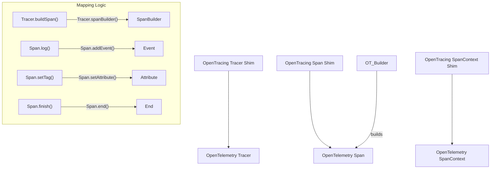
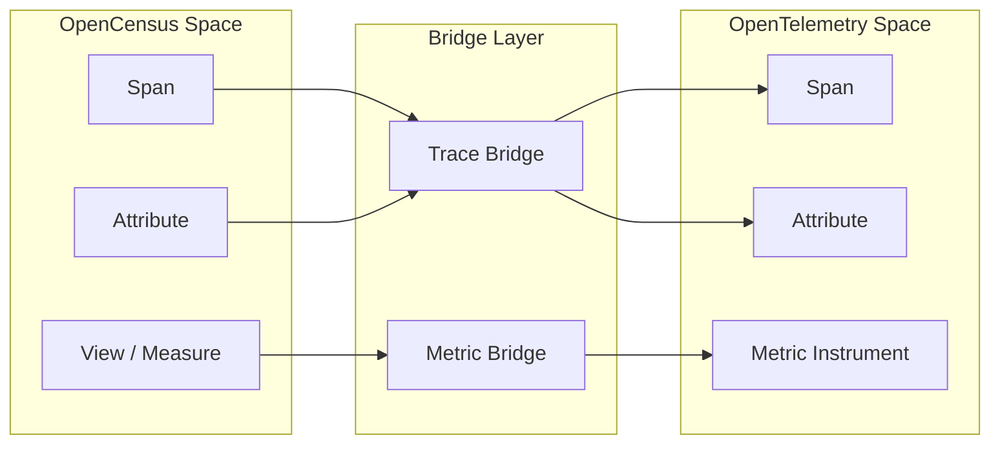

This page provides technical details on the compatibility layers designed to bridge OpenTracing and OpenCensus instrumentation into the OpenTelemetry ecosystem. These components allow existing instrumented codebases to report telemetry through OpenTelemetry SDKs without immediate code modification.

> [!WARNING]
> Both OpenTracing and OpenCensus compatibility requirements are currently **Deprecated**.
> - OpenTracing compatibility requirements are deprecated as of March 2026 [specification/compatibility/opentracing.md:15-15]().
> - OpenCensus compatibility requirements are deprecated as of June 2026 [specification/compatibility/opencensus.md:15-15]().

---

## 1. OpenTracing Shim

The OpenTracing Shim is a bridge layer that implements the OpenTracing API using the OpenTelemetry API [specification/compatibility/opentracing.md:55-57](). It is designed to allow OpenTracing-instrumented libraries to record spans using an OpenTelemetry `TracerProvider` [specification/compatibility/opentracing.md:60-61]().

### 1.1 Tracer Shim Implementation
The shim is initialized by providing an OpenTelemetry `TracerProvider`. The shim uses this provider to obtain an internal `Tracer` named `opentracing-shim` [specification/compatibility/opentracing.md:103-105]().

**Key Initialization Parameters:**
- **TracerProvider**: Used to create the underlying OTel Tracer [specification/compatibility/opentracing.md:103-103]().
- **Propagators**: Optional OpenTelemetry `Propagator` instances for `TextMap` and `HTTPHeaders` formats. If omitted, the global OTel `TextMap` propagator is used [specification/compatibility/opentracing.md:106-110]().

### 1.2 Data Flow: OpenTracing to OpenTelemetry

The following diagram illustrates how OpenTracing API calls are mapped to OpenTelemetry entities within the Shim.

**OpenTracing Shim Mapping**

Sources: [specification/compatibility/opentracing.md:132-153](), [specification/compatibility/opentracing.md:200-210](), [specification/compatibility/opentracing.md:236-240]()

### 1.3 Span and Context Handling
- **Parenting**: If multiple OpenTracing references are provided, the first `Child Of` reference is used as the parent. All references are added as OpenTelemetry `Link` entities with the attribute `opentracing.ref_type` [specification/compatibility/opentracing.md:147-153]().
- **Baggage**: OpenTracing Baggage is mapped to OpenTelemetry `Baggage`. The shim must ensure that baggage from all references is merged when creating a new span [specification/compatibility/opentracing.md:155-159]().
- **Error Mapping**: When an OpenTracing tag `error=true` is set, the shim MUST set the OpenTelemetry Span Status to `Error` [specification/compatibility/opentracing.md:210-214]().

---

## 2. OpenCensus Bridge

The OpenCensus compatibility layer consists of a **Trace Bridge** and a **Metric Bridge**. These components allow OpenCensus instrumentation to coexist with OpenTelemetry in a single process during migration [specification/compatibility/opencensus.md:106-111]().

### 2.1 Trace Bridge
The Trace Bridge implements the OpenCensus Trace API using the OpenTelemetry Trace API [specification/compatibility/opencensus.md:97-99]().

**Implementation Requirements:**
- **Span Mapping**: OpenCensus Spans are wrapped in a shim that delegates to OpenTelemetry Spans [specification/compatibility/opencensus.md:139-141]().
- **Attributes**: OpenCensus attributes (string, bool, int) are mapped to OpenTelemetry attributes.
- **Links and Annotations**: OpenCensus `Annotation` and `NetworkEvent` objects are mapped to OpenTelemetry `Event` entities [specification/compatibility/opencensus.md:143-145]().

### 2.2 Metric Bridge
The Metric Bridge allows OpenCensus `Stats` and `Metrics` to be exported via the OpenTelemetry SDK.

**Bridge Components:**
1. **Producer Bridge**: Implements the OpenCensus `MetricProducer` interface to pull data from the OpenTelemetry SDK (less common) [specification/compatibility/opencensus.md:160-165]().
2. **Consumer Bridge**: Routes OpenCensus `View` data into the OpenTelemetry `Meter` API [specification/compatibility/opencensus.md:167-170]().

**OpenCensus to OpenTelemetry Entity Bridge**

Sources: [specification/compatibility/opencensus.md:97-104](), [specification/compatibility/opencensus.md:156-160]()

---

## 3. API Mapping and Known Limitations

### 3.1 Comparison of Compatibility Layers

| Feature | OpenTracing Shim | OpenCensus Bridge |
| :--- | :--- | :--- |
| **Primary Goal** | Backwards compatibility for libraries [specification/compatibility/opentracing.md:60-61]() | Migration of legacy apps and gRPC [specification/compatibility/opencensus.md:121-125]() |
| **Baggage Support** | Supported via OTel Baggage [specification/compatibility/opentracing.md:155-159]() | Limited/Language dependent |
| **Propagators** | Configurable (W3C, Jaeger, etc.) [specification/compatibility/opentracing.md:118-124]() | Uses W3C TraceContext by default [specification/compatibility/opencensus.md:58-59]() |
| **Error Handling** | Maps `error` tag to Span Status [specification/compatibility/opentracing.md:210-214]() | Maps Canonical Codes to Status [specification/compatibility/opencensus.md:143-145]() |

### 3.2 Known Limitations
- **Implicit Propagation**: In languages like JavaScript with implicit context, mixing OpenTracing and OpenTelemetry APIs can break context propagation [specification/compatibility/opentracing.md:78-81]().
- **Semantic Conventions**: The shims generally do **not** perform automatic mapping of OpenTracing/OpenCensus tags to OpenTelemetry semantic conventions, except for error status [specification/compatibility/opentracing.md:68-70]().
- **Data Loss**: OpenCensus features like `SumOfSquaredDeviations` have no direct equivalent in the OpenTelemetry OTLP metric model and may be dropped or converted with loss of precision [specification/compatibility/opencensus.md:31-31]().

Sources: [specification/compatibility/opentracing.md:68-81](), [specification/compatibility/opencensus.md:27-33]()