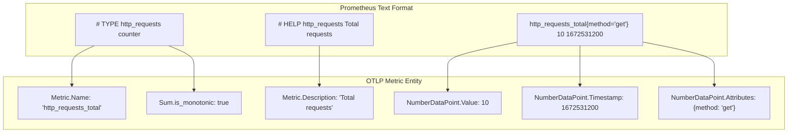
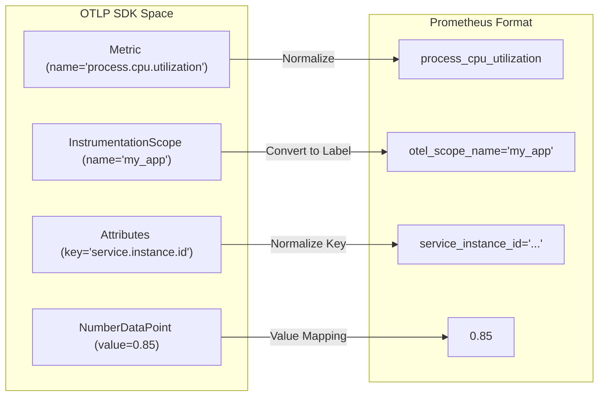

This page documents the bidirectional translation between OpenTelemetry Protocol (OTLP) metrics and Prometheus/OpenMetrics formats. It covers name normalization, type mapping, exemplar translation, Native Histograms, and scope-to-label conversion.

OpenTelemetry supports compatibility with several Prometheus-related formats, including the text exposition format, OpenMetrics (text and protobuf), and Prometheus Remote Write [specification/compatibility/prometheus_and_openmetrics.md:51-64]().

## Prometheus Metric Points to OTLP

The translation from Prometheus to OTLP occurs when OpenTelemetry components (like the Collector) scrape Prometheus endpoints or receive Prometheus Remote Write data.

### Metric Metadata and Timestamps
*   **Name**: The Prometheus Metric Name is mapped directly to the OTLP metric name without alteration [specification/compatibility/prometheus_and_openmetrics.md:89-91]().
*   **Unit**: Prometheus `UNIT` metadata is converted to OTLP units, translating common words to UCUM abbreviations (e.g., `milliseconds` to `ms`, `bytes` to `By`) [specification/compatibility/prometheus_and_openmetrics.md:92-124]().
*   **Description**: Prometheus `HELP` metadata is mapped to the OTLP metric description [specification/compatibility/prometheus_and_openmetrics.md:125-127]().
*   **Type**: The `TYPE` metadata determines the OTLP data type and is stored in OTLP `metric.metadata` under the `prometheus.type` key [specification/compatibility/prometheus_and_openmetrics.md:128-133]().
*   **Timestamps**: Prometheus sample timestamps are converted to OTLP data point timestamps. If a scrape lacks an explicit timestamp, the time of the scrape is used [specification/compatibility/prometheus_and_openmetrics.md:137-142]().

### Type Mapping (Prometheus to OTLP)

| Prometheus Type | OTLP Type | Details |
| :--- | :--- | :--- |
| Counter | Sum (`is_monotonic: true`) | Includes exemplar conversion [specification/compatibility/prometheus_and_openmetrics.md:147-152](). |
| Gauge | Gauge | Direct mapping [specification/compatibility/prometheus_and_openmetrics.md:157-158](). |
| Info | Gauge | Mapped to a Gauge with value 1. Attributes are preserved [specification/compatibility/prometheus_and_openmetrics.md:163-172](). |
| StateSet | Gauge | Mapped to a Gauge with value 1 for the active state [specification/compatibility/prometheus_and_openmetrics.md:183-193](). |
| Histogram | Histogram | Classic buckets are mapped to OTLP Histogram buckets [specification/compatibility/prometheus_and_openmetrics.md:213-220](). |
| Native Histogram | ExponentialHistogram | Mapped to OTLP Exponential Histograms [specification/compatibility/prometheus_and_openmetrics.md:244-245](). |
| Summary | Summary | Direct mapping to OTLP Summary type [specification/compatibility/prometheus_and_openmetrics.md:275-276](). |

### Data Flow: Prometheus Scrape to OTLP
The following diagram illustrates the transformation of a Prometheus text-format scrape into OTLP Metric entities.

Title: Prometheus Scrape to OTLP Entity Mapping

Sources: [specification/compatibility/prometheus_and_openmetrics.md:89-152](), [specification/metrics/data-model.md:27-43]()

## OTLP Metric Points to Prometheus

When exporting OTLP metrics to Prometheus (e.g., via `PrometheusExporter` or Remote Write), OTLP structures must be flattened to fit the Prometheus data model.

### Name Normalization
OTLP metric names and attribute keys are normalized to fit Prometheus requirements:
*   Characters not matching `[a-zA-Z0-9_]` are replaced with underscores `_` [specification/compatibility/prometheus_and_openmetrics.md:586-589]().
*   If a name starts with a digit, it is prefixed with `key_` [specification/compatibility/prometheus_and_openmetrics.md:590-591]().
*   Multiple consecutive underscores are collapsed into a single underscore [specification/compatibility/prometheus_and_openmetrics.md:594-596]().

### Instrumentation Scope to Labels
The OTLP `InstrumentationScope` (name and version) is converted into Prometheus labels:
*   `otel_scope_name` stores the scope name [specification/compatibility/prometheus_and_openmetrics.md:630-631]().
*   `otel_scope_version` stores the scope version [specification/compatibility/prometheus_and_openmetrics.md:632-633]().

### Histogram Mapping
OTLP Histograms can be exported in two ways:
1.  **Prometheus Histograms (PMB)**: OTLP Histograms with explicit boundaries are mapped to Prometheus `_bucket` series. The OTLP `+inf` bucket is mapped to the Prometheus `le="+Inf"` label [specification/compatibility/prometheus_and_openmetrics.md:707-717]().
2.  **Native Histograms (NHCB)**: OTLP Exponential Histograms are mapped to Prometheus Native Histograms if the format supports it (e.g., Protobuf) [specification/compatibility/prometheus_and_openmetrics.md:763-765]().

### Resource Attributes
Resource attributes are typically handled in one of two ways depending on configuration:
*   **Labels**: Each resource attribute is added as a label to every metric series [specification/compatibility/prometheus_and_openmetrics.md:924-925]().
*   **Target Info**: A special `target_info` metric is created with a value of 1, where resource attributes are stored as labels [specification/compatibility/prometheus_and_openmetrics.md:926-932]().

### Code Entity Bridge: OTLP Export to Prometheus
This diagram maps OTLP SDK entities to the resulting Prometheus exposition format.

Title: OTLP SDK to Prometheus Exposition Mapping

Sources: [specification/compatibility/prometheus_and_openmetrics.md:582-610](), [specification/compatibility/prometheus_and_openmetrics.md:627-640](), [specification/compatibility/prometheus_and_openmetrics.md:924-935]()

## Exemplar Translation

OpenTelemetry and Prometheus both support exemplars (sampled trace context associated with a metric point).

*   **OTLP to Prometheus**: OTLP `Exemplar` `trace_id` and `span_id` are converted to `trace_id` and `span_id` labels in Prometheus [specification/compatibility/prometheus_and_openmetrics.md:899-904](). Other OTLP exemplar attributes are mapped to additional labels on the Prometheus exemplar [specification/compatibility/prometheus_and_openmetrics.md:905-906]().
*   **Prometheus to OTLP**: Labels named `trace_id` and `span_id` on a Prometheus exemplar are mapped to the OTLP `trace_id` and `span_id` fields [specification/compatibility/prometheus_and_openmetrics.md:315-321]().

## Handling Unsupported Features

Prometheus formats vary in feature support. The specification mandates specific fallbacks:
*   **Missing Exemplars**: If the format (e.g., text exposition) does not support exemplars, they MUST be dropped [specification/compatibility/prometheus_and_openmetrics.md:73-74]().
*   **Missing Info/StateSet**: If Info or StateSet types are not supported, they MUST be converted to Gauges. Info-typed metrics add an `_info` suffix to the name [specification/compatibility/prometheus_and_openmetrics.md:75-77]().
*   **Native Histograms**: If Exponential Histograms are not supported, they SHOULD be dropped or MAY be converted to fixed-bucket histograms [specification/compatibility/prometheus_and_openmetrics.md:78-79]().

Sources:
- [specification/compatibility/prometheus_and_openmetrics.md:7-133]()
- [specification/compatibility/prometheus_and_openmetrics.md:147-321]()
- [specification/compatibility/prometheus_and_openmetrics.md:582-935]()
- [specification/metrics/data-model.md:27-43]()
- [specification/logs/README.md:132-152]()