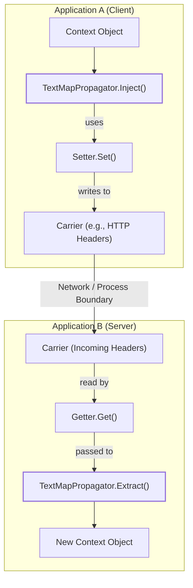
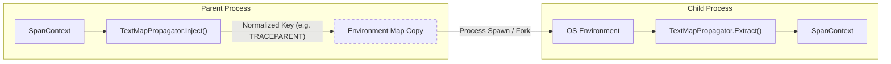

This page details the mechanisms for cross-cutting context propagation in OpenTelemetry. It covers the **TextMapPropagator** for string-based key-value injection and extraction, the use of **CompositePropagators** for handling multiple formats, and the specialized use of **environment variables** as carriers for process-to-process context passing.

## Overview

Cross-cutting concerns (such as Tracing and Baggage) send their state to the next process using **Propagators**. These objects read and write context data to and from messages exchanged by applications [specification/context/api-propagators.md:48-52](). Propagation is typically implemented through library-specific request interceptors that use `Inject` and `Extract` operations [specification/context/api-propagators.md:57-59]().

### Data Flow Architecture

The following diagram illustrates how Propagators bridge the "Natural Language Space" of application logic with the "Code Entity Space" of the OpenTelemetry API.

**Context Propagation Lifecycle**

Sources: [specification/context/api-propagators.md:83-113](), [specification/overview.md:50-55]()

## TextMap Propagator

The `TextMapPropagator` is the primary propagator type defined in the API. It performs injection and extraction of cross-cutting concern values as string key-value pairs into carriers [specification/context/api-propagators.md:68-71]().

### Key Components

*   **Carrier**: The medium used to read/write values (e.g., an HTTP Request or a Map) [specification/context/api-propagators.md:73-77]().
*   **Getter**: A stateless component used during `Extract` to read keys from the carrier without requiring the carrier to implement a specific interface [specification/context/api-propagators.md:125-132]().
*   **Setter**: A stateless component used during `Inject` to write values into the carrier [specification/context/api-propagators.md:165-172]().

### Operations

| Operation | Input | Output | Description |
| :--- | :--- | :--- | :--- |
| `Inject` | `Context`, `Carrier`, `Setter` | None | Retrieves value from Context and writes to Carrier [specification/context/api-propagators.md:87-96](). |
| `Extract` | `Context`, `Carrier`, `Getter` | `Context` | Reads value from Carrier and returns a new Context with the value [specification/context/api-propagators.md:97-113](). |

Sources: [specification/context/api-propagators.md:114-132](), [specification/context/api-propagators.md:155-163]()

## Composite Propagator

A `CompositePropagator` allows multiple propagators to be used for a single `Inject` or `Extract` operation. This is essential when a system must support multiple propagation formats (e.g., W3C TraceContext and B3) [specification/context/api-propagators.md:27-30]().

*   **Composite Inject**: Calls `Inject` on each registered propagator in the order they were added [specification/context/api-propagators.md:214-216]().
*   **Composite Extract**: Calls `Extract` on each propagator sequentially, passing the `Context` returned by the previous propagator to the next one [specification/context/api-propagators.md:209-213]().

Sources: [specification/context/api-propagators.md:201-216]()

## Environment Variable Carriers

Environment variables serve as carriers when network protocols are not applicable, such as in CI/CD pipelines, batch processing, or CLI tools [specification/context/env-carriers.md:32-38]().

### Key Name Normalization
Because environment variable naming rules vary by platform (POSIX vs Windows), the API requires normalization of keys. To normalize a key, implementations must [specification/context/env-carriers.md:66-78]():
1. Replace empty keys with `_`.
2. Uppercase all ASCII letters.
3. Replace non-alphanumeric/non-underscore characters with `_`.
4. Prefix with `_` if the key starts with a digit.

**Example**: `x-b3-traceid` normalizes to `X_B3_TRACEID` [specification/context/env-carriers.md:95-99]().

### Process Spawning and Immutability
Context-related environment variables are treated as process-startup input. When spawning child processes, the parent typically copies its environment, injects the new context into the copy, and provides that copy to the child [specification/context/env-carriers.md:118-135]().

**Process-to-Process Propagation**

Sources: [specification/context/env-carriers.md:129-141](), [oteps/0258-env-context-baggage-carriers.md:73-81]()

## W3C TraceContext Support

OpenTelemetry SDKs include support for the W3C TraceContext propagation format as a core requirement [specification/context/api-propagators.md:34-35](). This involves two primary fields:

1.  **traceparent**: Contains the `version`, `trace-id`, `parent-id`, and `trace-flags` [oteps/0258-env-context-baggage-carriers.md:92-101]().
2.  **tracestate**: Carries vendor-specific contextual information as a set of key-value pairs [oteps/0258-env-context-baggage-carriers.md:111-114]().

Sources: [specification/trace/api.md:26-30](), [oteps/0258-env-context-baggage-carriers.md:89-114]()