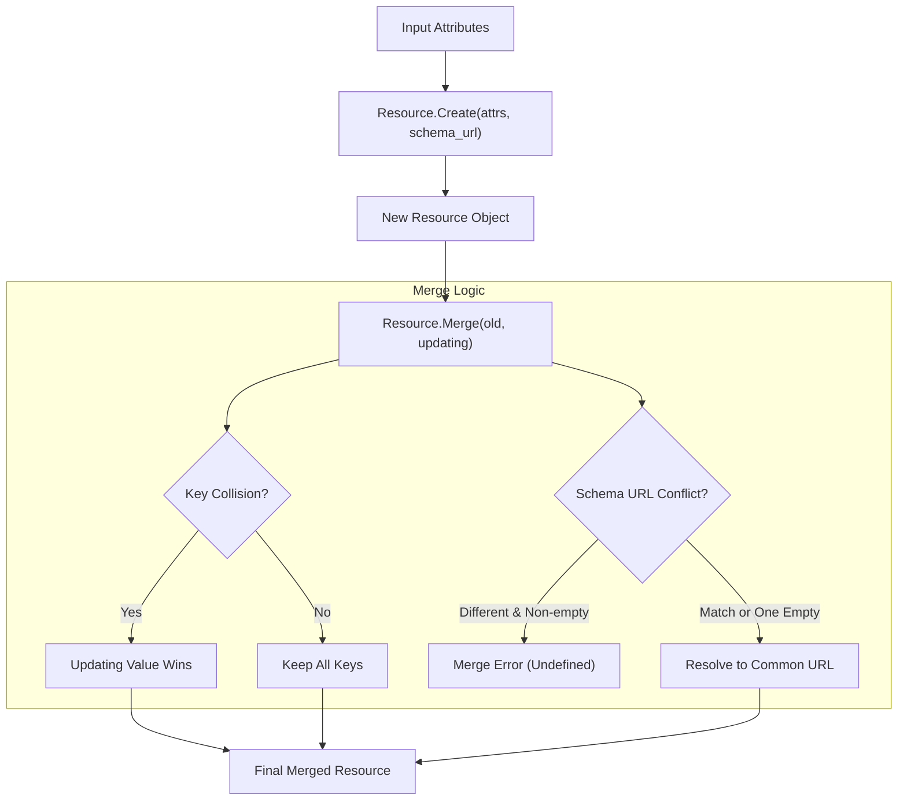
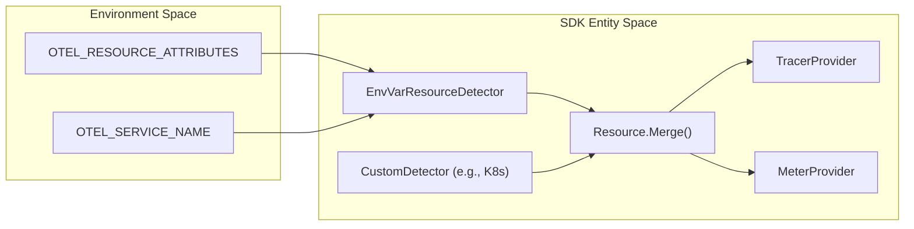

The **Resource SDK** provides the implementation for the `Resource` data model, which represents the observed entity for which telemetry is produced. A Resource is an immutable representation expressed as a collection of [Attributes](https://github.com/open-telemetry/opentelemetry-specification/blob/main/specification/common/README.md#attribute) [specification/resource/sdk.md:10-12]().

The primary purpose of the Resource SDK is to decouple the discovery of resource information from exporters, allowing independent development and customization [specification/resource/sdk.md:20-23]().

## Resource Data Model

A `Resource` is composed of:
*   **Entities**: A set of `Entity` objects associated with the resource [specification/resource/data-model.md:41]().
*   **Attributes**: A map of key-value pairs that identify the resource and MUST not change during its lifetime [specification/resource/data-model.md:42]().
*   **Schema URL**: An optional field specifying the schema version of the attributes [specification/resource/sdk.md:72-74]().

### Immutability and Scope
Resources are **immutable** [specification/resource/sdk.md:10](). Once a resource is associated with a `TracerProvider`, `MeterProvider`, or `LoggerProvider`, the association cannot be changed [specification/resource/sdk.md:27-28](). All spans, metrics, and logs produced by these providers MUST be associated with that `Resource` [specification/resource/sdk.md:30-42]().

**Sources:** [specification/resource/sdk.md:10-42](), [specification/resource/data-model.md:34-43]()

## Key Operations

The SDK supports two primary operations for instantiating and managing resources: `Create` and `Merge`.

### Resource.Create
This operation creates a new resource from a set of attributes.
*   **Parameters**: `Attributes` and an optional `schema_url` [specification/resource/sdk.md:71-74]().
*   **Implementation**: A factory method is recommended to enable caching of resource objects [specification/resource/sdk.md:67-68]().

### Resource.Merge
This operation joins an "old" resource and an "updating" resource into a new resource [specification/resource/sdk.md:78-79]().
*   **Attribute Precedence**: If a key exists in both resources, the value from the **updating** resource is picked [specification/resource/sdk.md:86-88]().
*   **Schema URL Resolution**:
    *   If one is empty, the non-empty one is used [specification/resource/sdk.md:91-94]().
    *   If both are the same, that URL is used [specification/resource/sdk.md:95-96]().
    *   If both are non-empty and different, it is a **merging error**; the result is undefined [specification/resource/sdk.md:97-99]().

#### Logic Flow: Resource Creation and Merging
This diagram bridges the natural language requirements for resource assembly to the SDK operations.

**Sources:** [specification/resource/sdk.md:63-105]()

## Resource Detection

Resource detectors are responsible for gathering information about the environment (e.g., Kubernetes, Cloud Vendors, Container ID) during application initialization.

### Environment Variable Configuration
The SDK MUST support a default detector that reads from the following environment variables:
*   `OTEL_RESOURCE_ATTRIBUTES`: A comma-separated list of `key=value` pairs (e.g., `key1=val1,key2=val2`) [specification/resource/sdk.md:166-173]().
*   `OTEL_SERVICE_NAME`: Specifically used to set the `service.name` attribute. If provided, it takes precedence over `service.name` found in `OTEL_RESOURCE_ATTRIBUTES` [specification/resource/sdk.md:182-187]().

### Custom Detectors
Detectors for specific platforms (Docker, AWS, GCP, etc.) SHOULD be implemented as separate packages to keep the core SDK vendor-neutral [specification/resource/sdk.md:113-116]().
*   **Interface**: A detector MUST provide a method that returns a `Resource` [specification/resource/sdk.md:117-118]().
*   **Performance**: Detection logic is expected to complete quickly to avoid blocking application startup [specification/resource/sdk.md:125-126]().

#### Data Flow: Environment to Provider
This diagram shows how environment variables and detectors flow into the final SDK providers.

**Sources:** [specification/resource/sdk.md:113-132](), [specification/resource/sdk.md:163-187]()

## SDK-Provided Defaults
The SDK MUST provide a default Resource containing at least the attributes defined in the Semantic Conventions for SDK defaults (e.g., `telemetry.sdk.name`, `telemetry.sdk.language`) [specification/resource/sdk.md:46-47](). This default resource is automatically associated with providers unless a custom resource is explicitly provided [specification/resource/sdk.md:48-49]().

### Summary Table: Resource SDK Components

| Component | Role | Immutability |
| :--- | :--- | :--- |
| `Resource` | Data container for entity attributes | Immutable [specification/resource/sdk.md:10]() |
| `Create` | Factory for new Resources | N/A |
| `Merge` | Combines two Resources with precedence | Produces new Resource |
| `Detector` | Discovers environment metadata | N/A |
| `OTEL_SERVICE_NAME` | Environment override for service identity | N/A |

**Sources:** [specification/resource/sdk.md:10-25](), [specification/resource/sdk.md:63-105](), [specification/resource/sdk.md:163-187]()