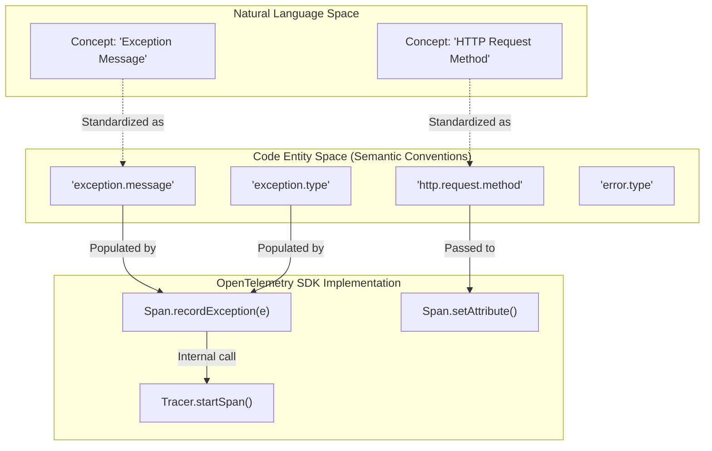
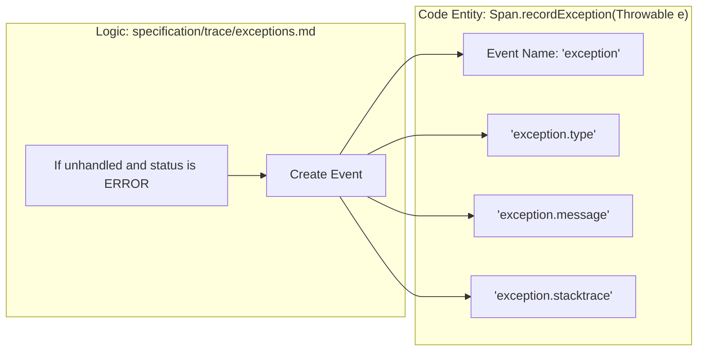

## Purpose and Scope

Semantic Conventions in OpenTelemetry define standardized naming, format, and interpretation of telemetry data attributes and metrics. They provide a common language for telemetry data across all OpenTelemetry implementations, ensuring consistent representation regardless of programming language or deployment environment. This document explains the concept, structure, and application of semantic conventions in the OpenTelemetry ecosystem, including the relationship between the core specification and the dedicated semantic conventions repository.

## Introduction to Semantic Conventions

Semantic Conventions establish a shared vocabulary for telemetry data, enabling:

- Consistent interpretation of telemetry across services.
- Interoperability between observability systems and vendor neutrality.
- Meaningful correlation of data from different sources.
- Simplified analysis and querying of telemetry data via predictable schemas.

OpenTelemetry defines its semantic conventions in a separate repository to allow for faster iteration independent of the core API/SDK lifecycle: [https://github.com/open-telemetry/semantic-conventions](https://github.com/open-telemetry/semantic-conventions) [[specification/semantic-conventions.md:7-8]().]

### Data Flow and Convention Application

The following diagram illustrates how Semantic Conventions bridge the gap between "Natural Language Concepts" (like an HTTP method) and "Code Entities" (the actual attribute keys used in an SDK).

Sources: [specification/semantic-conventions.md:12-24](), [specification/trace/exceptions.md:24-40]()

## Attribute Naming and Requirement Levels

Semantic conventions follow strict naming rules to prevent collisions and ensure discoverability.

### Naming Rules
Attributes are typically namespaced using a dot-separated hierarchy (e.g., `service.name`, `http.request.method`). The `otel.*` namespace is specifically reserved for defining compatibility with non-OpenTelemetry technologies [[specification/semantic-conventions.md:36-39]().]

### Requirement Levels
Requirement levels define whether an attribute MUST, SHOULD, or MAY be present. These are documented in detail in the [Attribute Requirement Levels](https://opentelemetry.io/docs/specs/semconv/general/attribute-requirement-level/) documentation [[specification/common/attribute-requirement-level.md:8-9]().]

## Reserved Attributes and Events

The specification mandates certain attributes that MUST be provided by semantic conventions to ensure baseline interoperability across all signals [[specification/semantic-conventions.md:12-12]().]

### Mandatory Attributes
| Attribute Key | Description |
| :--- | :--- |
| `service.name` | Logical name of the service [[specification/semantic-conventions.md:20]().] |
| `telemetry.sdk.language` | Language of the SDK (e.g., `java`, `python`) [[specification/semantic-conventions.md:21]().] |
| `error.type` | Unique identifier for the error type [[specification/semantic-conventions.md:14]().] |
| `server.address` | Server hostname or IP [[specification/semantic-conventions.md:18]().] |

### Mandatory Events
Semantic conventions MUST provide the `exception` event [[specification/semantic-conventions.md:26-28]().] When recording an exception, the event name MUST be `"exception"` [[specification/trace/exceptions.md:20-20]().]

## Exception Semantic Conventions

Exceptions have specific conventions to ensure stack traces and error types are captured consistently across languages.

Sources: [specification/trace/exceptions.md:14-21](), [specification/trace/exceptions.md:42-52]()

## Relationship to Telemetry Policy

Newer developments introduce **Telemetry Policies**, which allow for intent-based control over attributes and conventions at scale. Policies like `attribute-redaction` or `attribute-filter` can be applied across SDKs and Collectors to enforce semantic convention compliance or data privacy [[oteps/4738-telemetry-policy.md:118-127]().]

### Composite Samplers and Attributes
Semantic conventions also play a role in sampling. Composite samplers can use functions like `GetAttributes` to determine which attributes should be added to a span based on a sampling decision [[oteps/0250-Composite_Samplers.md:105-105]().] When merging attribute sets in composite samplers, if keys conflict, the attribute definition from the last set takes effect [[oteps/0250-Composite_Samplers.md:72-74]().]

## Summary Table: Key Conventions

| Category | Key Files/Namespaces | Purpose |
| :--- | :--- | :--- |
| **Exceptions** | `specification/trace/exceptions.md` | Standardizing error reporting [[specification/trace/exceptions.md:1-3]().] |
| **General** | `specification/semantic-conventions.md` | Defining reserved namespaces and mandatory keys [[specification/semantic-conventions.md:1-5]().] |
| **Naming** | `specification/common/attribute-naming.md` | Rules for attribute key formatting [[specification/common/attribute-naming.md:5-8]().] |
| **Requirements** | `specification/common/attribute-requirement-level.md` | Defining MUST/SHOULD/MAY status [[specification/common/attribute-requirement-level.md:6-9]().] |

Sources: [specification/semantic-conventions.md](), [specification/trace/exceptions.md](), [oteps/0250-Composite_Samplers.md]()