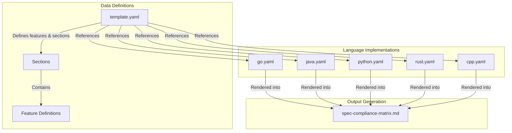
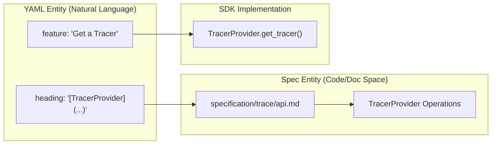

The Spec Compliance Matrix is a system used to track the implementation status of OpenTelemetry features across various language SDKs. It provides a transparent view of feature parity and helps users understand which capabilities are available in their language of choice [spec-compliance-matrix.md:1-8]().

## System Overview

The compliance matrix tracks parity across major language implementations, including Go, Java, JavaScript, Python, Ruby, Rust, C++, .NET, Swift, Kotlin, Erlang, and PHP [spec-compliance-matrix/template.yaml:4-27](). The system relies on a set of YAML files to store status data, which is then rendered into a human-readable table in the specification documentation [spec-compliance-matrix.md:15-18]().

### Compliance Status Legend
The system uses a specific notation to represent the implementation state of a feature:
*   `+`: Feature is fully supported/implemented [spec-compliance-matrix.md:6]().
*   `-`: Feature is not supported [spec-compliance-matrix.md:6]().
*   `?`: Implementation status is unknown [spec-compliance-matrix/cpp.yaml:6]().
*   `N/A`: Feature is not applicable to the specific language architecture [spec-compliance-matrix.md:6]().
*   `Blank`: Status is not known or documented [spec-compliance-matrix.md:8]().

### Data Flow and Architecture
The compliance matrix architecture separates the definition of features (the "Template") from the actual implementation status of each language.

#### Compliance Data Structure

**Sources:** [spec-compliance-matrix/template.yaml:1-28](), [spec-compliance-matrix.md:1-18]()

## YAML Schema and Structure

The system is powered by two types of YAML files: a central template and per-language status files.

### 1. Central Template (`template.yaml`)
This file acts as the source of truth for what features *should* be implemented. It defines the hierarchy of sections (Traces, Metrics, Logs, etc.) and specific feature names [spec-compliance-matrix/template.yaml:1-28]().
*   **Sections**: High-level categories like `Traces`, `Baggage`, or `Metrics` [spec-compliance-matrix/template.yaml:29,122,126]().
*   **Features**: Specific technical requirements, such as "Create TracerProvider" or "IsValid" [spec-compliance-matrix/template.yaml:33,54]().
*   **Optionality**: Features can be marked with `optional: true` [spec-compliance-matrix/template.yaml:77,112]().

### 2. Language Status Files
Each language (e.g., `go.yaml`, `java.yaml`, `rust.yaml`) contains a `sections` list that mirrors the template but adds a `status` field for every feature [spec-compliance-matrix/go.yaml:9-15](), [spec-compliance-matrix/java.yaml:9-15](), [spec-compliance-matrix/rust.yaml:9-15]().

#### Natural Language to Code Entity Mapping
The following diagram bridges the high-level feature descriptions found in the YAML files to the corresponding specification documents and SDK implementation concepts.

**Sources:** [spec-compliance-matrix/template.yaml:31-35](), [spec-compliance-matrix/go.yaml:12-17]()

## Updating the Matrix

To update the compliance status for a specific language, contributors must modify the corresponding YAML file in the `spec-compliance-matrix/` directory.

### Maintenance Workflow
1.  **Identify Feature**: Locate the feature in `spec-compliance-matrix/template.yaml` [spec-compliance-matrix/template.yaml:30-150]().
2.  **Locate Language File**: Open the language-specific file (e.g., `spec-compliance-matrix/python.yaml`) [spec-compliance-matrix/python.yaml:1-9]().
3.  **Update Status**: Change the `status` value for the specific feature to `+`, `-`, or `N/A` [spec-compliance-matrix/python.yaml:15-29]().
4.  **Sync Documentation**: The main `spec-compliance-matrix.md` table is updated to reflect these YAML changes, typically via automated CI processes [spec-compliance-matrix.md:1-18]().

### Example: Adding a New Feature
When the specification adds a new required behavior, the process involves:
1.  Adding the feature to `template.yaml` [spec-compliance-matrix/template.yaml:1-3]().
2.  Adding the feature with a `?` or `-` status to all language YAML files to maintain schema consistency [spec-compliance-matrix/cpp.yaml:6](), [spec-compliance-matrix/dotnet.yaml:6]().

**Sources:** [spec-compliance-matrix/template.yaml:1-28](), [spec-compliance-matrix/go.yaml:1-9](), [spec-compliance-matrix/java.yaml:1-9]()