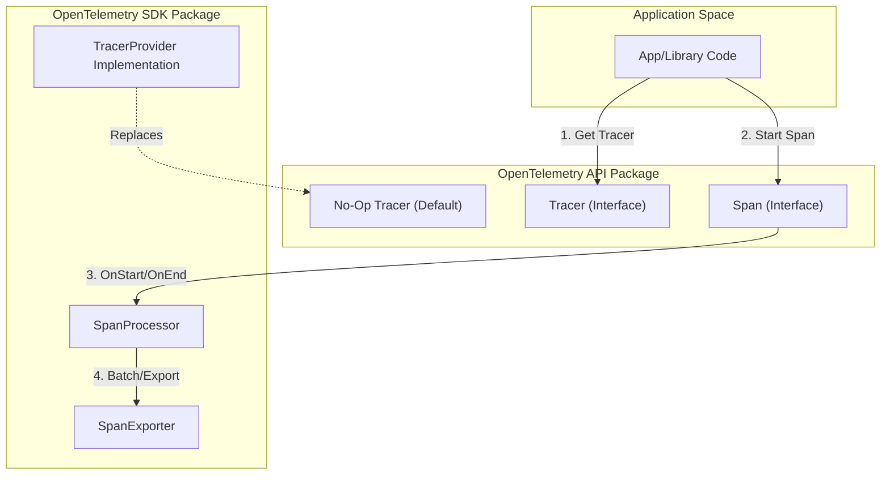
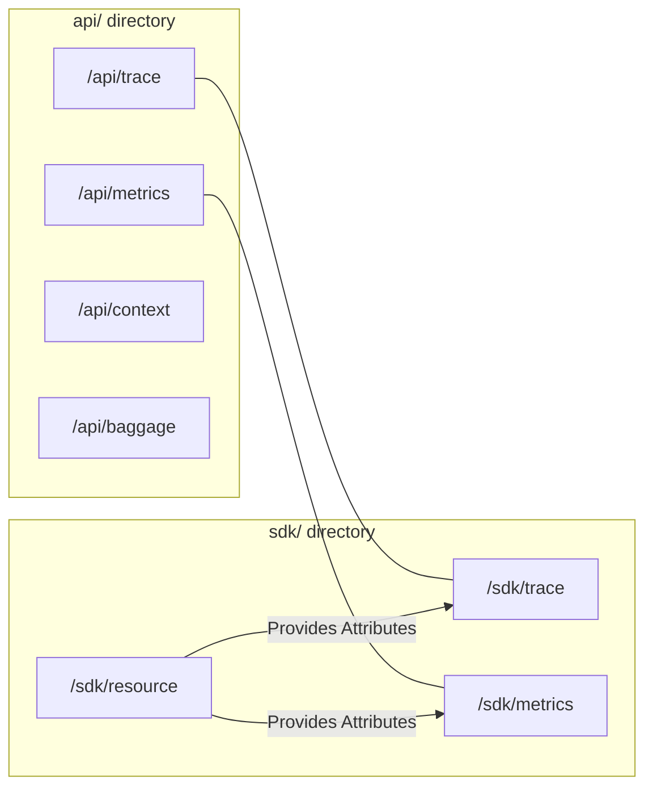

The OpenTelemetry specification establishes a unified set of requirements for all implementations to ensure cross-language consistency, vendor neutrality, and high performance. These principles guide the architecture of the API and SDK, ensuring that telemetry is "built-in" to the software ecosystem without imposing undue burdens on application developers.

## Core Mission and Engineering Values

OpenTelemetry is guided by a set of core values that prioritize ease of use, universality, and stability.

| Value | Description |
| :--- | :--- |
| **Easy & Universal** | Telemetry should be easy to implement and work across all languages and frameworks. |
| **Vendor Neutral** | The specification ensures users are not locked into a specific backend provider. |
| **Loosely Coupled** | Components (API, SDK, Exporters) are decoupled to allow independent evolution. |
| **Stability** | A primary goal: "Don't. Break. Users." Stable components must remain safe to depend on. |
| **Performance** | Telemetry must not significantly degrade the performance of the instrumented application. |

**Sources:** [specification/specification-principles.md:6-22](), [specification/specification-principles.md:76-82]()

## Design Principles

### API and SDK Separation
A fundamental principle of OpenTelemetry is the strict separation between the **API** and the **SDK**.
*   **API Package**: Contains only the interfaces and a minimal implementation. Third-party libraries depend solely on this package [specification/library-guidelines.md:15-18]().
*   **SDK Package**: An optional dependency that provides the actual implementation of the API (e.g., batching, sampling, and exporting) [specification/library-guidelines.md:68-72]().

### No-Op API Guarantee
If an application is instrumented with the OpenTelemetry API but no SDK is provided at runtime, the API calls must result in **no-ops** with minimal overhead [specification/library-guidelines.md:50-51]().
*   API methods MUST NOT throw unhandled exceptions for missing arguments [specification/error-handling.md:15-17]().
*   Methods like `createSpan()` must return a valid, non-null, pre-allocated "no-op" object so that subsequent calls do not crash [specification/library-guidelines.md:63-66](), [specification/error-handling.md:34-36]().

### Performance and Resource Constraints
OpenTelemetry implementations must adhere to strict performance guidelines:
1.  **Non-Blocking by Default**: The library should not block the application's execution path for telemetry collection [specification/performance.md:9-12]().
2.  **Bounded Resource Usage**: The SDK must not consume unbounded memory. Under heavy load, the SDK should prefer dropping telemetry data over crashing the application [specification/performance.md:10-24]().
3.  **Configurable Timeouts**: Operations that *may* block, such as `Shutdown` or explicit `Flush`, must support user-configurable timeouts [specification/performance.md:37-41]().

## System Architecture and Data Flow

The following diagram illustrates the relationship between the instrumented application code, the OpenTelemetry API, and the SDK implementation.

### Logical Data Flow: API to SDK

**Sources:** [specification/library-guidelines.md:39-74](), [specification/library-layout.md:7-24]()

## Code Entity Mapping

The specification defines specific code structures that must be followed across language implementations. The diagram below maps the conceptual components to the standard package layout.

### Code Structure Mapping

**Sources:** [specification/library-layout.md:7-112](), [specification/resource/sdk.md:26-43]()

## Governance and Change Process

The OpenTelemetry specification uses a rigorous process to ensure cross-language compatibility and stability.

### Two-Company Approval Rule
Proposals for changes to the specification (OpenTelemetry Enhancement Proposals or OTEPs) require a "two-company approval" rule. This ensures that no single vendor can steer the project in a proprietary direction, maintaining **vendor neutrality** [README.md:73-90]().

### Prototyping Requirements
Before a change is integrated into the specification, it must be prototyped in at least three different language ecosystems:
1.  **Typed Object-Oriented**: e.g., Java or .NET.
2.  **Dynamically Typed**: e.g., Python or JavaScript.
3.  **Structural**: e.g., Go or Rust.

This ensures that the specification is "User Driven" and "General" enough to be implemented idiomatically in any language [specification/specification-principles.md:55-61]().

### Versioning
The specification follows **Semantic Versioning 2.0**. Changes to the specification are versioned, and specific SDK implementations must document which version of the specification they comply with [README.md:49-51]().

## Self-Observability
SDKs are encouraged to emit "internal" telemetry about their own state (e.g., queue sizes in a `SpanProcessor` or exporter latency) [specification/error-handling.md:45-51](). This self-observability data should follow semantic conventions and must be handled carefully to avoid infinite recursion loops where the SDK generates telemetry about its own telemetry generation [specification/self-observability.md:5-9](), [specification/self-observability-supplementary-guidelines.md:89-96]().

**Sources:** [specification/error-handling.md:45-54](), [specification/self-observability.md:1-24](), [specification/self-observability-supplementary-guidelines.md:117-131]()