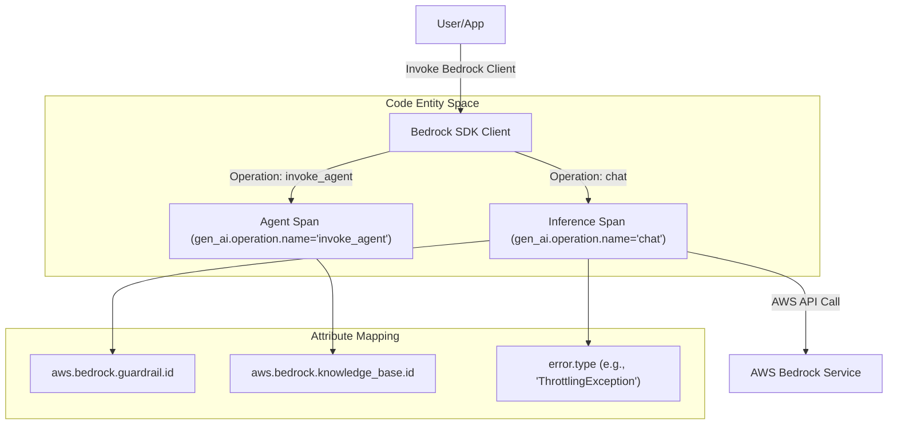
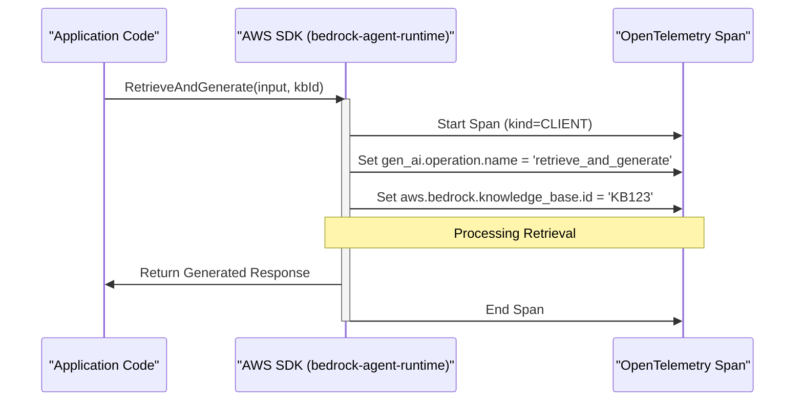

The AWS Bedrock semantic conventions extend the core Generative AI conventions to capture provider-specific metadata and operations unique to the Amazon Bedrock ecosystem. This includes support for Guardrails, Knowledge Bases, and specialized operations like `invoke_agent`.

## Overview

AWS Bedrock instrumentation focuses on capturing the unique identifiers used in the AWS ecosystem to manage model safety and Retrieval Augmented Generation (RAG). It refines the standard `gen_ai` spans by adding attributes for Bedrock-specific features and ensuring that error reporting aligns with AWS service error codes.

### Key Requirements
- **Provider Name**: `gen_ai.provider.name` MUST be set to `"aws.bedrock"` [docs/gen-ai/aws-bedrock.md:14-14]().
- **Span Kind**: Operations SHOULD be captured as `CLIENT` spans [docs/gen-ai/aws-bedrock.md:30-30]().
- **Operation Names**: Common operations include `chat`, `generate_content`, `text_completion`, and the Bedrock-specific `invoke_agent` [docs/gen-ai/aws-bedrock.md:39-39]().

## Provider-Specific Attributes

Bedrock introduces specific attributes to track the usage of safety and data augmentation tools.

| Attribute | Type | Description |
| :--- | :--- | :--- |
| `aws.bedrock.guardrail.id` | `string` | Unique identifier of the Bedrock Guardrail used to safeguard model responses [model/aws-bedrock/registry.yaml:3-9](). |
| `aws.bedrock.knowledge_base.id` | `string` | Unique identifier of the Bedrock Knowledge base used for RAG [model/aws-bedrock/registry.yaml:10-17](). |

**Sources:** [docs/gen-ai/aws-bedrock.md:38-49](), [model/aws-bedrock/registry.yaml:1-18]()

## Data Flow and Operation Mapping

The following diagram illustrates how natural language requests from a user are processed through the Bedrock infrastructure and how they map to specific code entities and span attributes.

### Bedrock Operation Lifecycle

**Sources:** [docs/gen-ai/aws-bedrock.md:38-49](), [docs/gen-ai/aws-bedrock.md:61-63]()

## Retrieval Augmented Generation (RAG)

AWS Bedrock Knowledge Bases allow models to query external data. When a Knowledge Base is utilized, the `aws.bedrock.knowledge_base.id` is recorded on the span to provide traceability for the data source used in the retrieval step.

### RAG Trace Structure

**Sources:** [docs/gen-ai/aws-bedrock.md:49-49](), [model/aws-bedrock/registry.yaml:10-17]()

## Error Handling

Bedrock operations use specific AWS error codes for `error.type`. This allows for fine-grained analysis of failures such as throttling, validation errors, or model-specific issues.

Common `error.type` values for Bedrock include:
- `AccessDeniedException`
- `ThrottlingException`
- `ModelNotReadyException`
- `ValidationException`

**Sources:** [docs/gen-ai/aws-bedrock.md:41-41](), [docs/gen-ai/aws-bedrock.md:61-63]()

## Reference Implementation

The `semantic-conventions-genai` repository provides reference scenarios to validate these conventions against actual AWS SDK behavior.

| Component | Role | Location |
| :--- | :--- | :--- |
| **Scenario** | Validates span attribute emission for Bedrock | [reference/scenarios/aws-bedrock/scenario.py]() |
| **Mock Server** | Simulates Bedrock API responses for testing | [reference/src/semconv_genai/mock_server/bedrock.py]() |

**Sources:** [reference/scenarios/aws-bedrock/scenario.py](), [reference/src/semconv_genai/mock_server/bedrock.py]()