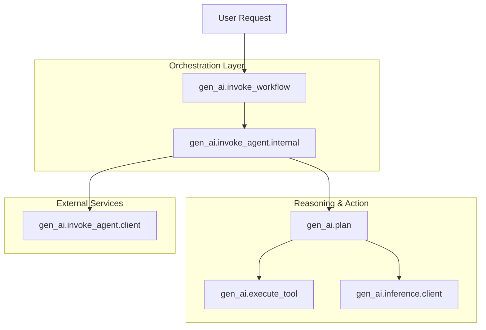
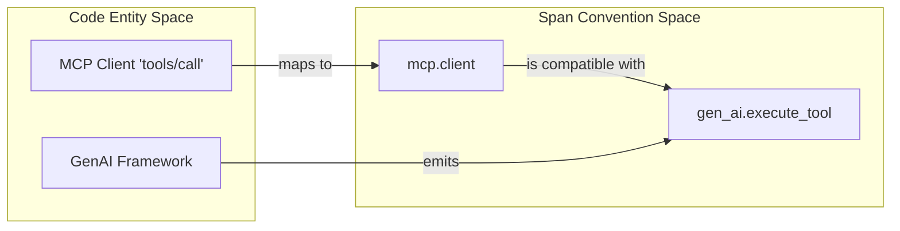

This page describes the semantic conventions for GenAI agents and framework-level operations. As Generative AI models evolve to use tools, plan tasks, and execute multi-step workflows, these conventions provide a standardized way to trace the reasoning, logic, and external information access that characterize "agentic" systems [docs/gen-ai/gen-ai-agent-spans.md:22-24]().

## Overview of Agentic Spans

The conventions distinguish between the lifecycle of an agent (creation), the execution of an agent's logic (invocation), and the higher-level orchestration of multiple steps (workflows and planning).

### Span Types and Hierarchy

| Span Type | Purpose | Span Kind |
| --- | --- | --- |
| `gen_ai.create_agent.client` | Creation of a remote agent service or assistant. | `CLIENT` |
| `gen_ai.invoke_agent.client` | Client-side call to a remote agent service. | `CLIENT` |
| `gen_ai.invoke_agent.internal` | Local execution of agent logic within a framework. | `INTERNAL` |
| `gen_ai.invoke_workflow` | High-level orchestration of multiple GenAI tasks. | `INTERNAL` |
| `gen_ai.plan` | Reasoning or step-generation phase of an agent. | `INTERNAL` |

**Sources:** [docs/gen-ai/gen-ai-agent-spans.md:13-17](), [model/gen-ai/spans.yaml:129-131]()

### Agent Interaction Flow
The following diagram illustrates how these spans relate in a typical agentic system, bridging the "Natural Language Space" (User Intent) to the "Code Entity Space" (Span Operations).

**Title: Agentic System Execution Flow**

**Sources:** [docs/gen-ai/gen-ai-agent-spans.md:22-28](), [model/gen-ai/spans.yaml:130-149]()

---

## Core Agent Operations

### Create Agent
Used primarily when working with remote services that persist agent configurations (e.g., OpenAI Assistants or AWS Bedrock Agents).

*   **Operation Name:** `create_agent` [docs/gen-ai/gen-ai-agent-spans.md:43]()
*   **Span Name:** `create_agent {gen_ai.agent.name}` [docs/gen-ai/gen-ai-agent-spans.md:45]()
*   **Key Attributes:**
    *   `gen_ai.agent.id`: Unique identifier (e.g., `asst_...`) [docs/gen-ai/gen-ai-agent-spans.md:60]()
    *   `gen_ai.system_instructions`: The instructions/persona provided to the agent [docs/gen-ai/gen-ai-agent-spans.md:66]()

### Invoke Agent (Client vs. Internal)
An agent invocation represents the end-to-end process of an agent attempting to fulfill a goal.

*   **Invoke Agent Client:** Represents a call to a managed service (e.g., AWS Bedrock `InvokeAgent`). The span kind is `CLIENT` [docs/gen-ai/gen-ai-agent-spans.md:48]().
*   **Invoke Agent Internal:** Represents a framework (e.g., LangChain, PydanticAI) running an agent loop locally. The span kind is `INTERNAL`.

**Sources:** [docs/gen-ai/gen-ai-agent-spans.md:14-15](), [model/gen-ai/spans.yaml:62-128]()

---

## Workflows and Planning

### Invoke Workflow
Workflows represent complex, often multi-agent, sequences. This span acts as a parent to multiple agent invocations or tool calls.

*   **Operation Name:** `invoke_workflow`
*   **Attributes:** Includes `gen_ai.operation.name` and standard metadata.

### Plan Span
Planning spans capture the "thinking" phase where a model determines which tools to use or what steps to take.

*   **Operation Name:** `plan`
*   **Hierarchy:** Typically a child of `invoke_agent` and a parent of `inference` spans that generate the plan.

**Sources:** [docs/gen-ai/gen-ai-agent-spans.md:16-17](), [model/gen-ai/spans.yaml:129-150]()

---

## Integration: Tools and Data Sources

Agents often interact with external systems via tools or retrieve information from data sources (RAG).

### Tool Execution
When an agent decides to use a tool, it emits a `gen_ai.execute_tool` span. For Model Context Protocol (MCP) integrations, the `mcp.client` span is compatible with the `execute_tool` definition [docs/gen-ai/mcp.md:145-146]().

### Data Source Integration
Attributes are provided to link agent operations to specific knowledge bases or data stores.
*   `gen_ai.data_source.id`: The identifier for the vector database or knowledge base being queried [model/gen-ai/spans.yaml:120-122]().

**Title: Code-to-Span Mapping for Tool Calls**

**Sources:** [docs/gen-ai/mcp.md:145-153](), [model/gen-ai/spans.yaml:59-60]()

---

## Attribute Requirements

The following attributes are frequently used across agent and workflow spans to provide context:

| Attribute | Requirement Level | Description |
| --- | --- | --- |
| `gen_ai.agent.id` | Conditionally Required | Unique ID of the agent [model/gen-ai/spans.yaml:108-110]() |
| `gen_ai.agent.name` | Conditionally Required | Human-readable name [model/gen-ai/spans.yaml:111-113]() |
| `gen_ai.conversation.id` | Conditionally Required | Links spans to a specific session/thread [model/gen-ai/spans.yaml:92-94]() |
| `gen_ai.operation.name` | Required | e.g., `create_agent`, `plan`, `chat` [model/gen-ai/spans.yaml:24-25]() |

**Sources:** [model/gen-ai/spans.yaml:14-123](), [docs/gen-ai/gen-ai-agent-spans.md:54-66]()