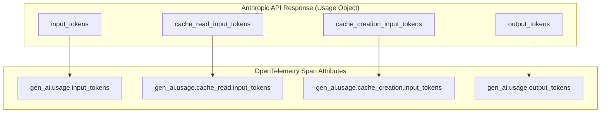
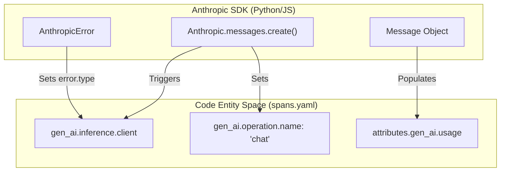

This page defines the provider-specific semantic conventions for [Anthropic](https://www.anthropic.com/) within the Generative AI instrumentation framework. These conventions extend the core GenAI spans and metrics to account for Anthropic-specific features such as prompt caching and reasoning tokens.

## Overview

Anthropic instrumentation focuses on capturing high-fidelity telemetry for Claude models. Key differentiators from the base conventions include specialized token usage tracking (cache hits/misses) and the inclusion of reasoning-specific metrics.

### Key Requirements
*   **Provider Name**: `gen_ai.provider.name` MUST be set to `"anthropic"` [docs/gen-ai/anthropic.md:24-24]().
*   **Span Naming**: The span name MUST follow the format `{gen_ai.operation.name} {gen_ai.request.model}` [docs/gen-ai/anthropic.md:37-37]().
*   **Span Kind**: Operations should be recorded as `CLIENT` spans [docs/gen-ai/anthropic.md:39-39]().

**Sources:** [docs/gen-ai/anthropic.md:24-39]()

---

## Token Calculation Logic

Anthropic provides granular details regarding token usage, particularly for prompt caching. Total input tokens are often a sum of several components.

### Usage Attributes
Anthropic instrumentations SHOULD populate the following attributes to provide a complete picture of cost and performance:

| Attribute | Description |
| :--- | :--- |
| `gen_ai.usage.input_tokens` | The total number of input tokens. [model/gen-ai/spans.yaml:41-42]() |
| `gen_ai.usage.cache_read.input_tokens` | Tokens served from a provider-managed cache (cache hits). [docs/gen-ai/anthropic.md:68-68]() |
| `gen_ai.usage.cache_creation.input_tokens` | Tokens written to a provider-managed cache (cache misses/creation). [docs/gen-ai/anthropic.md:67-67]() |
| `gen_ai.usage.output_tokens` | The number of tokens generated by the model. [model/gen-ai/spans.yaml:47-48]() |

### Data Flow: Usage Attribution
The following diagram illustrates how raw response data from the Anthropic API is mapped to OpenTelemetry attributes.

**Anthropic Token Mapping**

**Sources:** [model/gen-ai/spans.yaml:38-48](), [docs/gen-ai/anthropic.md:67-70]()

---

## Reasoning Tokens

For models supporting reasoning (e.g., Claude 3.7 Sonnet), the instrumentation tracks tokens used for internal chain-of-thought processing. These are captured using the `gen_ai.usage.output_tokens` attribute in conjunction with provider-specific extensions if available.

| Attribute | Purpose |
| :--- | :--- |
| `gen_ai.usage.output_tokens` | Includes both the final visible response and the internal reasoning tokens. [docs/gen-ai/anthropic.md:70-70]() |

**Sources:** [docs/gen-ai/anthropic.md:70-70]()

---

## Attribute Requirements

Anthropic spans refine the requirement levels for several core attributes to ensure consistency across implementations.

### Required and Recommended Attributes
| Attribute | Requirement Level | Note |
| :--- | :--- | :--- |
| `gen_ai.operation.name` | Required | e.g., `chat` [docs/gen-ai/anthropic.md:47-47]() |
| `gen_ai.request.model` | Conditionally Required | The requested model name [docs/gen-ai/anthropic.md:52-52]() |
| `error.type` | Conditionally Required | If the operation fails [docs/gen-ai/anthropic.md:48-48]() |
| `gen_ai.response.id` | Recommended | The unique ID from Anthropic [docs/gen-ai/anthropic.md:64-64]() |
| `gen_ai.request.max_tokens` | Recommended | User-defined limit [docs/gen-ai/anthropic.md:57-57]() |

### Error Handling
When an Anthropic operation fails, the `error.type` attribute SHOULD match the error code returned by the Anthropic API or the exception name from the client library [model/gen-ai/spans.yaml:9-12](). For catastrophic failures, a `gen_ai.client.operation.exception` event should be emitted [docs/gen-ai/gen-ai-exceptions.md:26-28]().

**Sources:** [docs/gen-ai/anthropic.md:45-66](), [model/gen-ai/spans.yaml:3-12](), [docs/gen-ai/gen-ai-exceptions.md:26-31]()

---

## Implementation Diagram

The following diagram bridges the Anthropic SDK concepts to the Semantic Convention model entities.

**SDK to Semantic Convention Mapping**

**Sources:** [model/gen-ai/spans.yaml:130-155](), [docs/gen-ai/anthropic.md:22-43]()