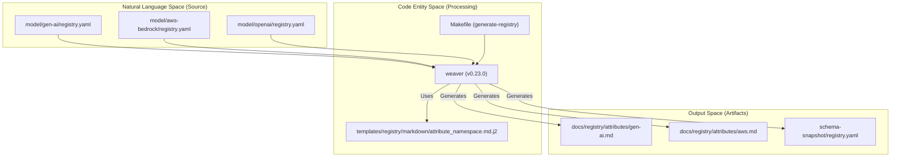
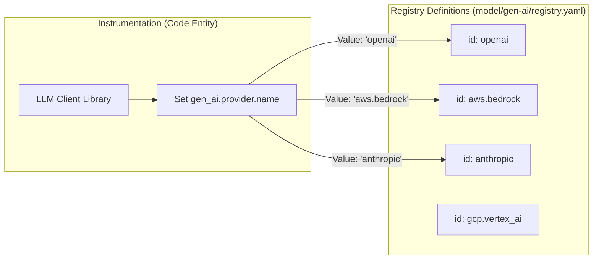

The Attribute Registry serves as the central source of truth for all metadata keys used across Generative AI and Model Context Protocol (MCP) telemetry. By defining attributes in a centralized registry, the project ensures consistency across spans, metrics, and events, regardless of the underlying LLM provider or orchestration framework.

## Architecture and Namespaces

Attributes are partitioned into namespaces to manage scope and prevent collisions. The registry is defined across multiple YAML files within the `model/` directory, which are then processed by the `weaver` toolchain to generate documentation and schema snapshots.

### Key Namespaces
- **`gen_ai.*`**: Core attributes applicable to most Generative AI operations (e.g., `gen_ai.request.model`, `gen_ai.usage.input_tokens`). Defined in [model/gen-ai/registry.yaml:2-100]().
- **`mcp.*`**: Attributes specific to the Model Context Protocol, covering client/server interactions and JSON-RPC method mappings.
- **`openai.*`**: Provider-specific extensions for OpenAI-compatible APIs, such as `openai.response.system_fingerprint`. Defined in [model/openai/registry.yaml:2-40]().
- **`aws.bedrock.*`**: Attributes unique to the AWS Bedrock ecosystem, including Guardrails and Knowledge Bases. Defined in [model/aws-bedrock/registry.yaml:2-18]().

### Attribute Data Flow
The following diagram illustrates how raw YAML definitions in the `model/` directory are transformed into the final registry documentation.

**Registry Transformation Pipeline**

Sources: [model/gen-ai/registry.yaml:1-100](), [versions.env:2-5](), [docs/registry/attributes/gen-ai.md:1-4]()

## Attribute Definitions

Each entry in the registry contains metadata required for both human understanding and automated validation.

### Core Properties
| Property | Description | Code Reference |
| :--- | :--- | :--- |
| `key` | The fully qualified name (e.g., `gen_ai.request.temperature`). | [model/gen-ai/registry.yaml:114]() |
| `type` | Primitive (string, int, double, boolean) or Enum (members). | [model/gen-ai/registry.yaml:115]() |
| `stability` | Typically `development` for GenAI attributes. | [model/gen-ai/registry.yaml:118]() |
| `brief` | A short, one-line description of the attribute's purpose. | [model/gen-ai/registry.yaml:116]() |
| `examples` | An array of valid example values. | [model/gen-ai/registry.yaml:117]() |

### Provider Discriminator: `gen_ai.provider.name`
The `gen_ai.provider.name` attribute is a critical enum that acts as a discriminator for the telemetry format. It determines which provider-specific attributes (like `openai.*` or `aws.bedrock.*`) are expected on a span.

**Provider Logic and Mapping**

Sources: [model/gen-ai/registry.yaml:3-76](), [docs/gen-ai/anthropic.md:24-35]()

## Complex Attributes and JSON Schemas

Some attributes, such as `gen_ai.input.messages` and `gen_ai.output.messages`, represent complex structured data that cannot be captured by simple primitive types.

- **`gen_ai.input.messages`**: Captures chat history, including roles (user, assistant, tool) and content parts (text, image, tool calls). [docs/registry/attributes/gen-ai.md:21]()
- **`gen_ai.output.messages`**: Captures the model's response, including finish reasons and generated content. [docs/registry/attributes/gen-ai.md:28]()

These attributes are defined with `type: any` in the YAML registry but refer to external JSON schemas for validation. This allows the registry to maintain flexibility while providing strict requirements for content recording modes.

## Provider-Specific Registries

### AWS Bedrock
The Bedrock registry extends the base GenAI conventions with infrastructure-specific identifiers.
- `aws.bedrock.guardrail.id`: Used to track which safety guardrail was applied to a request. [model/aws-bedrock/registry.yaml:3-9]()
- `aws.bedrock.knowledge_base.id`: Identifies the RAG (Retrieval-Augmented Generation) source used during the operation. [model/aws-bedrock/registry.yaml:10-17]()

### OpenAI
The OpenAI registry defines attributes for specific API features:
- `openai.api.type`: Distinguishes between `chat_completions` and `responses` APIs. [model/openai/registry.yaml:17-29]()
- `openai.request.service_tier`: Tracks usage of `scale` vs `default` tiers. [model/openai/registry.yaml:3-16]()

## Stability and Requirement Levels

While the registry defines the **type** and **stability**, the **requirement level** (Required, Recommended, Opt-In) is often defined at the point of use within `spans.yaml` or `metrics.yaml`.

- **Development Stability**: Most `gen_ai` attributes are currently marked as `stability: development`, indicating they are subject to change based on feedback from the experimental phase. [model/gen-ai/registry.yaml:98]()
- **Refinements**: Provider-specific documentation (e.g., `anthropic.md`) can refine these requirements. For instance, `gen_ai.request.model` is `Conditionally Required` for Anthropic client spans. [docs/gen-ai/anthropic.md:52]()

Sources: [model/gen-ai/registry.yaml:1-150](), [model/aws-bedrock/registry.yaml:1-18](), [model/openai/registry.yaml:1-40](), [docs/registry/attributes/gen-ai.md:1-30](), [docs/gen-ai/anthropic.md:45-70]()