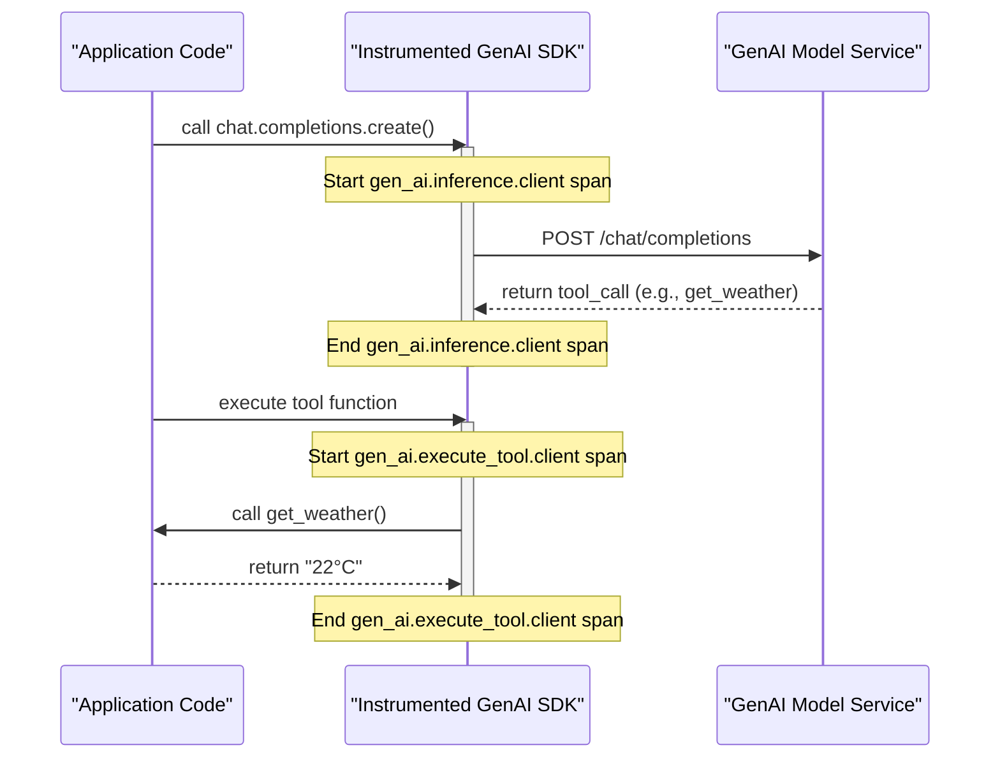
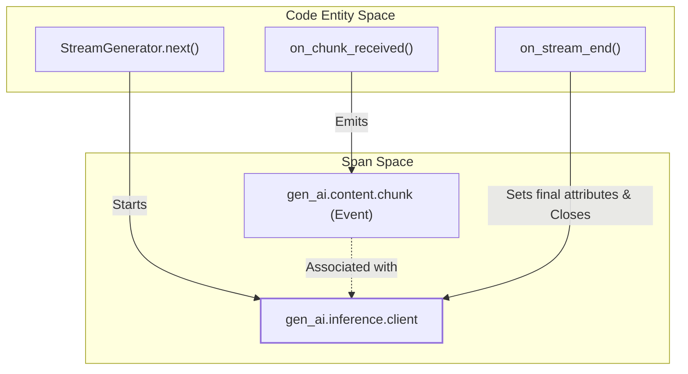

This page details the semantic conventions for generative AI spans, covering the lifecycle of inference, embeddings, retrieval, memory, and tool execution. It defines the required attributes, naming patterns, and content recording strategies for instrumenting GenAI client applications.

## Core Span Types

The GenAI lifecycle is represented by several distinct span types, each capturing specific operations within an AI-driven workflow.

### Inference Span (`gen_ai.inference.client`)
This span represents a client call to a model to generate a response or request a tool call [docs/gen-ai/gen-ai-spans.md:36-36]().

*   **Span Name**: MUST follow the pattern `{gen_ai.operation.name} {gen_ai.request.model}` [docs/gen-ai/gen-ai-spans.md:38-38]().
*   **Span Kind**: Generally `CLIENT`, but `INTERNAL` if the model runs in-process [docs/gen-ai/gen-ai-spans.md:42-45]().

### Embeddings Span (`gen_ai.embeddings.client`)
Represents the process of converting text or other data into vector embeddings [docs/gen-ai/gen-ai-spans.md:120-120]().

### Retrieval Span (`gen_ai.retrieval.client`)
Used for Retrieval Augmented Generation (RAG) to capture the process of fetching relevant documents from a data source [docs/gen-ai/gen-ai-spans.md:175-175]().

### Memory Span (`gen_ai.memory.client`)
Captures operations related to conversation history management, such as reading from or writing to a long-term memory store [docs/gen-ai/gen-ai-spans.md:231-231]().

### Tool Execution Span (`gen_ai.execute_tool.client`)
Represents the client-side execution of a tool (function) requested by the model [docs/gen-ai/gen-ai-spans.md:287-287]().

### Data Flow: Inference and Tool Execution
The following diagram illustrates the relationship between the application code entities and the resulting spans.

Title: GenAI Inference and Tool Execution Data Flow

Sources: [docs/gen-ai/gen-ai-spans.md:27-45](), [docs/gen-ai/gen-ai-spans.md:287-300](), [docs/gen-ai/non-normative/examples-llm-calls.md:35-44]()

---

## Content Recording Modes

Recording sensitive information like prompts and responses is configurable. The conventions support two primary modes for capturing content.

### 1. Recording on Attributes
Content is stored directly on the span or event attributes using structured JSON strings [docs/gen-ai/gen-ai-spans.md:354-354]().
*   **Input**: `gen_ai.input.messages` [docs/gen-ai/gen-ai-spans.md:81-81]()
*   **Output**: `gen_ai.output.messages` [docs/gen-ai/gen-ai-spans.md:82-82]()

### 2. External Storage (Pointer Mode)
Instead of the full text, the span records a reference to an external location (e.g., S3, Blob Storage) where the content is stored [docs/gen-ai/gen-ai-spans.md:368-372]().

| Attribute | Description |
| :--- | :--- |
| `gen_ai.content.url` | The URL where content is uploaded [docs/gen-ai/gen-ai-spans.md:374-374]() |
| `gen_ai.content.upload_status` | The status of the upload operation [docs/gen-ai/gen-ai-spans.md:375-375]() |

Sources: [docs/gen-ai/gen-ai-spans.md:352-376](), [docs/gen-ai/non-normative/examples-llm-calls.md:64-82]()

---

## Streaming Lifecycle

Streaming GenAI calls require specific handling because attributes like `usage` and `finish_reason` are only available in the final chunk.

Title: Streaming Span Lifecycle and Event Association

### Key Streaming Attributes
*   **`gen_ai.request.stream`**: A boolean indicating if the request was streaming [docs/gen-ai/gen-ai-spans.md:61-61]().
*   **`gen_ai.response.time_to_first_chunk`**: Measured from the start of the span to the arrival of the first token [docs/gen-ai/gen-ai-spans.md:73-73]().

Sources: [docs/gen-ai/gen-ai-spans.md:383-400](), [docs/gen-ai/gen-ai-spans.md:61-73]()

---

## Sampling and Performance Attributes

The conventions include attributes to track model configuration and performance metrics within the span.

| Category | Attributes |
| :--- | :--- |
| **Model Config** | `gen_ai.request.temperature`, `gen_ai.request.top_p`, `gen_ai.request.max_tokens` [docs/gen-ai/gen-ai-spans.md:65-69]() |
| **Usage Metrics** | `gen_ai.usage.input_tokens`, `gen_ai.usage.output_tokens` [docs/gen-ai/gen-ai-spans.md:74-75]() |
| **Identifiers** | `gen_ai.response.id`, `gen_ai.conversation.id` [docs/gen-ai/gen-ai-spans.md:56-71]() |

### Content Modalities
The system supports multimodal content (text, image, audio, video) via the `Modality` enum and structured `MessagePart` schemas [docs/gen-ai/gen-ai-input-messages.json:25-36]().

*   **TextPart**: Simple text content [docs/gen-ai/non-normative/models.ipynb:50-55]().
*   **BlobPart**: Inline binary data (base64) [docs/gen-ai/non-normative/models.ipynb:152-159]().
*   **FilePart**: Reference to a file by ID [docs/gen-ai/non-normative/models.ipynb:161-165]().

Sources: [docs/gen-ai/gen-ai-spans.md:51-82](), [docs/gen-ai/gen-ai-input-messages.json:2-125](), [docs/gen-ai/non-normative/models.ipynb:45-165]()