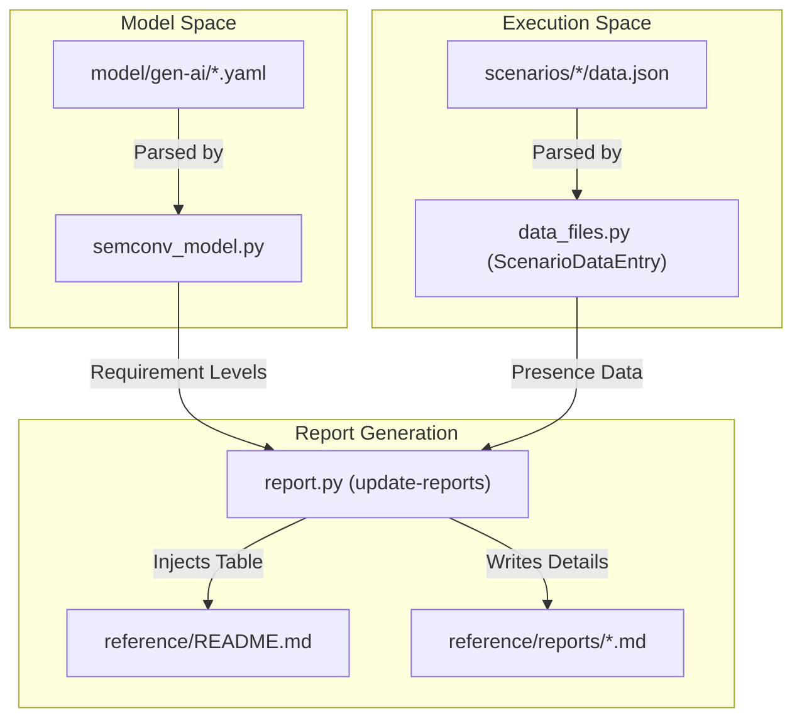
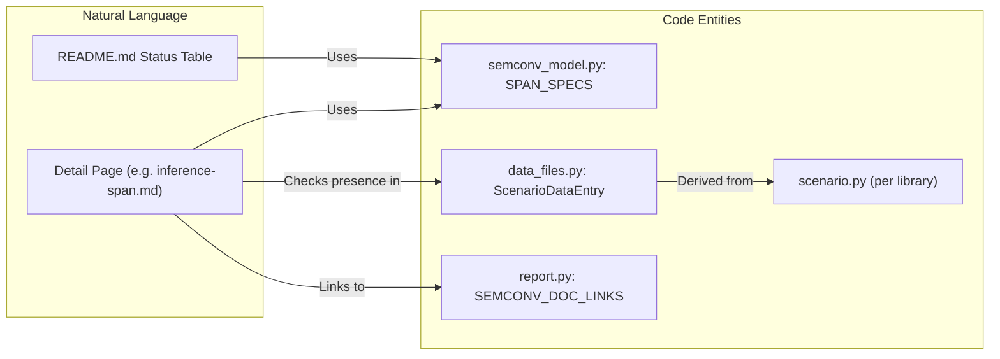

The coverage reporting system provides a human-readable bridge between the abstract semantic convention definitions and the actual telemetry emitted by GenAI libraries. It automates the generation of status tables and detailed markdown reports that track which libraries support which attributes and signals.

## Overview

The reporting logic resides in `reference/src/semconv_genai/report.py` and is responsible for parsing the results of reference scenario runs (stored in `data.json` files) and comparing them against the expected model defined in the YAML registry [reference/src/semconv_genai/report.py:1-11]().

### Key Components
*   **README.md Status Table**: A high-level summary in the `reference/` directory showing which libraries support which span and event types [reference/README.md:22-44]().
*   **Detail Pages**: Individual markdown files in `reference/reports/` (e.g., `inference-span.md`, `gen-ai-evaluation-result-event.md`) that break down support by attribute requirement level [reference/src/semconv_genai/report.py:10-11]().
*   **Model Integration**: The reporter uses `semconv_model.py` to dynamically load attribute requirements from the YAML source at `model/gen-ai/` [reference/src/semconv_genai/semconv_model.py:25-32]().

### Data Flow: From Model to Report

The following diagram illustrates how semantic convention definitions and library execution data are merged to produce the coverage reports.

**Coverage Report Generation Pipeline**

Sources: [reference/src/semconv_genai/semconv_model.py:25-45](), [reference/src/semconv_genai/report.py:1-11](), [reference/src/semconv_genai/data_files.py:25-30]()

## Implementation Details

### Model Specification Parsing
The `semconv_model.py` script parses the YAML files in `model/gen-ai/` to create `AttributeSpec` objects. These objects categorize attributes into four buckets based on the `requirement_level` defined in the schema: `required`, `conditionally_required`, `recommended`, and `opt_in` [reference/src/semconv_genai/semconv_model.py:90-95]().

The resolution logic mirrors the OTel Weaver resolution order, supporting inheritance via `ref_group` entries [reference/src/semconv_genai/semconv_model.py:56-78]().

### Determining Support
A library is considered to "support" a signal type if it emits at least one `required` attribute (or `conditionally_required` if no required attributes exist) for that specific span or event [reference/src/semconv_genai/report.py:182-197]().

The presence of attributes is determined by checking the `ScenarioDataEntry` objects, which represent the state captured in `scenarios/<lib>/data.json` [reference/src/semconv_genai/report.py:105]().

### Supporting Libraries and Link Mapping
The reports include direct links back to the documentation and the source code of the reference scenarios:
*   **SEMCONV_DOC_LINKS**: A mapping that associates internal span/event IDs (e.g., `inference`) with their corresponding generated documentation page in `docs/gen-ai/` [reference/src/semconv_genai/report.py:69-82]().
*   **Library References**: Every library listed in a report is linked to its `scenario.py` file using markdown link-reference definitions [reference/src/semconv_genai/report.py:108-129]().

## Report Structure

### README.md Status Table
The `reference/README.md` file contains two primary tables: **Spans** and **Events**. These are updated by looking for the `<!-- status:begin -->` and `<!-- status:end -->` markers [reference/src/semconv_genai/report.py:44-45]().

| Signal Type | Libraries |
| :--- | :--- |
| [Inference](reports/inference-span.md) | anthropic, openai, langchain, etc. |
| [Execute Tool](reports/execute-tool-span.md) | openai, mistralai, etc. |

Sources: [reference/README.md:23-44](), [reference/src/semconv_genai/report.py:230-240]()

### Per-Type Detail Pages
Each detail page (e.g., `reference/reports/memory-span.md`) follows a strict hierarchy:
1.  **Header**: The signal name and a link to the official Semantic Convention documentation [reference/src/semconv_genai/report.py:139-143]().
2.  **Requirement Sections**: Tables for each requirement level containing the attribute name and the list of supporting libraries [reference/src/semconv_genai/report.py:146-163]().
3.  **Source Links**: A block of reference links pointing to the `scenario.py` files for every library mentioned on the page [reference/src/semconv_genai/report.py:165-168]().

**Report Entity Association**

Sources: [reference/src/semconv_genai/report.py:69-82](), [reference/src/semconv_genai/report.py:131-170](), [reference/src/semconv_genai/semconv_model.py:113-202]()

## Execution

The reports are updated via the `update-reports` entry point.

```bash