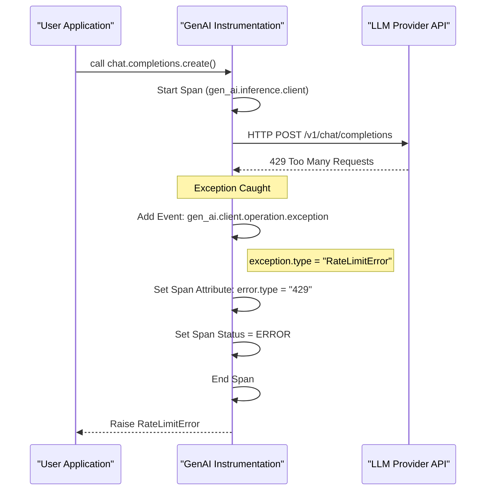

This document details the semantic conventions for recording exceptions during Generative AI operations. It covers the specific event structure, required attributes, and the relationship between span-level error tracking and event-level exception reporting.

## Overview

In the Generative AI semantic conventions, errors are handled at two levels:
1.  **Span Status and Attributes**: High-level error classification on the span itself using `error.type`.
2.  **Exception Events**: Detailed diagnostic information captured as a `gen_ai.client.operation.exception` event.

[docs/gen-ai/gen-ai-exceptions.md:5-10]()

## Generative AI Client Operation Exception

The `gen_ai.client.operation.exception` event is used to record failures such as API errors, rate limiting (429), model-specific errors, or network timeouts that prevent an operation from completing.

### Event Definition
- **Event Name**: `gen_ai.client.operation.exception` [docs/gen-ai/gen-ai-exceptions.md:26-26]()
- **Severity**: Instrumentations SHOULD set the severity to `WARN` (Severity Number 13) [docs/gen-ai/gen-ai-exceptions.md:31-31]().
- **Context**: Instrumentations may optionally populate this event with attributes from the corresponding GenAI span (e.g., `gen_ai.request.model`) to provide better context for the failure [docs/gen-ai/gen-ai-exceptions.md:32-33]().

### Attributes

| Attribute | Requirement Level | Description |
| :--- | :--- | :--- |
| `exception.type` | Conditionally Required | The fully-qualified class name or dynamic type of the exception. [docs/gen-ai/gen-ai-exceptions.md:39-39]() |
| `exception.message` | Conditionally Required | The human-readable exception message. [docs/gen-ai/gen-ai-exceptions.md:38-38]() |
| `exception.stacktrace` | Recommended | The language-natural representation of the stack trace. [docs/gen-ai/gen-ai-exceptions.md:40-40]() |

**Note on Requirement Levels**: `exception.type` is required if `exception.message` is missing, and vice versa. Both are recommended when available [docs/gen-ai/gen-ai-exceptions.md:42-51]().

Sources: [docs/gen-ai/gen-ai-exceptions.md:24-60]()

## Error Handling on Spans

While the exception event provides detailed diagnostics, the parent span must also reflect the failure state to support high-level monitoring and alerting.

### The `error.type` Attribute
Every GenAI span (Inference, Embeddings, Agent, etc.) includes the `error.type` attribute when the operation fails.
- **Requirement**: Conditionally required if the operation ended in an error [model/gen-ai/spans.yaml:7-8]().
- **Value**: SHOULD match the provider's error code, the canonical exception name, or a low-cardinality identifier (e.g., `timeout`, `429`, `invalid_request_error`) [model/gen-ai/spans.yaml:10-12]().

### Span Status
Span status SHOULD follow the standard OTel [Recording Errors](https://github.com/open-telemetry/semantic-conventions/blob/v1.41.1/docs/general/recording-errors.md) guidance. For MCP-specific spans, the status description SHOULD match the `JSONRPCError.message` if available [docs/gen-ai/mcp.md:140-141]().

Sources: [model/gen-ai/spans.yaml:2-13](), [docs/gen-ai/gen-ai-spans.md:47-55](), [docs/gen-ai/mcp.md:139-143]()

## Data Flow and Implementation

The following diagrams illustrate how exceptions are captured and propagated from the library/SDK level into the OpenTelemetry signal space.

### Exception Event Lifecycle
This diagram shows the transition from a library-specific exception (Natural Language/SDK Space) to the structured OTel Event (Code Entity Space).

```mermaid
graph TD
    subgraph "SDK / Provider Space"
        A["OpenAI / Anthropic SDK"] -- "raises" --> B["APIConnectionError"]
        B -- "contains" --> B1["'Connection timed out'"]
    end

    subgraph "Instrumentation Logic (Code Entity Space)"
        C["on_exception() hook"]
        D["gen_ai.client.operation.exception"]
    end

    B --> C
    C -->| "Map type" | D
    C -->| "Map message" | D

    style D stroke-width:2px

    subgraph "Telemetry Output"
        D1["exception.type: 'openai.APIConnectionError'"]
        D2["exception.message: 'Connection timed out'"]
        D3["severity_number: 13 (WARN)"]
    end

    D --- D1
    D --- D2
    D --- D3
```
Sources: [docs/gen-ai/gen-ai-exceptions.md:26-40]()

### Relationship between Spans and Exception Events
This diagram bridges the relationship between the `Span` (tracking the operation) and the `Event` (tracking the specific failure detail).


Sources: [docs/gen-ai/gen-ai-spans.md:55-55](), [model/gen-ai/spans.yaml:130-155](), [docs/gen-ai/gen-ai-exceptions.md:26-31]()