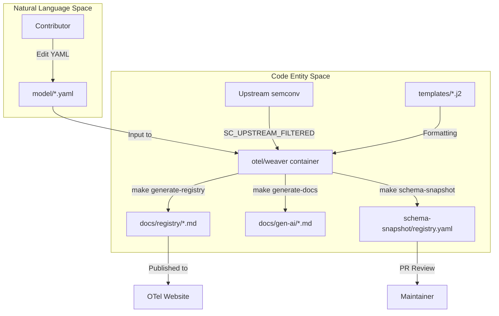
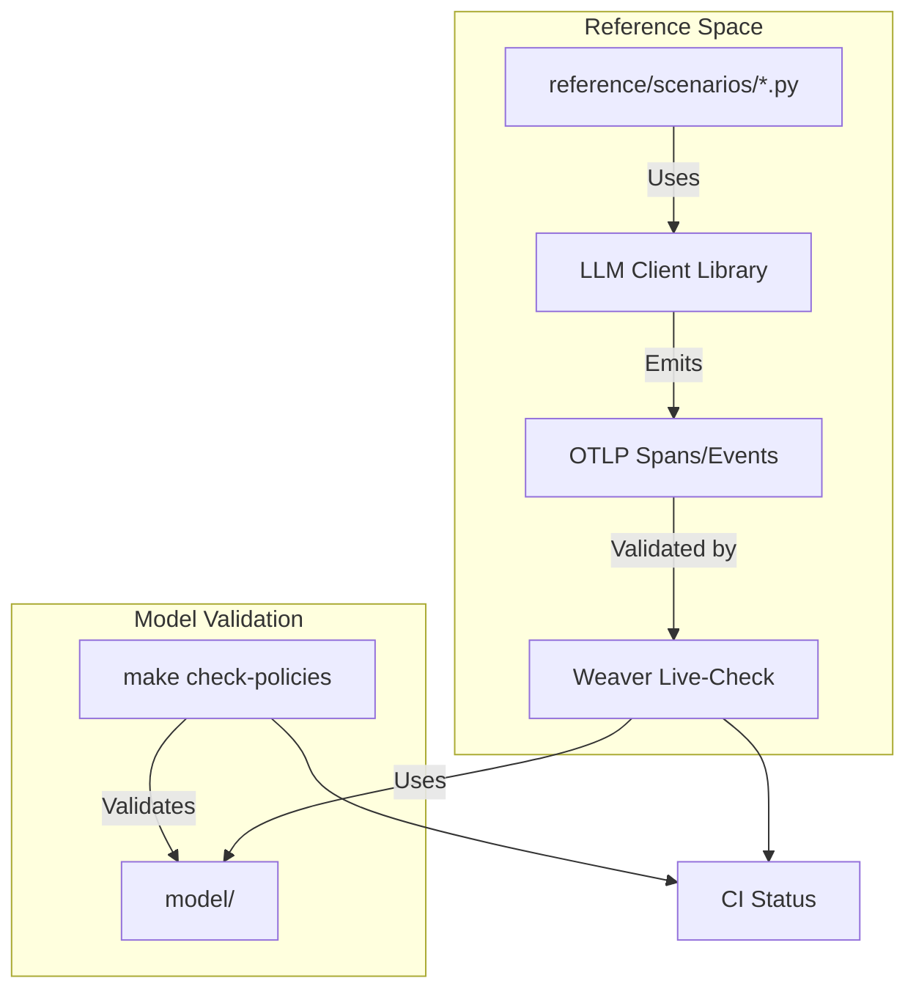

This page provides technical guidance on setting up the development environment, executing the toolchain, and contributing to the OpenTelemetry GenAI Semantic Conventions repository. This repository extends core OpenTelemetry conventions with specific models for Generative AI clients, agents, and the Model Context Protocol (MCP) [README.md:7-11]().

## Repository Layout

The repository is structured to separate the YAML-based semantic models from the generated documentation and validation logic.

| Directory | Purpose |
| :--- | :--- |
| `model/` | Contains the source of truth YAML files for attributes, spans, metrics, and events [CONTRIBUTING.md:25-30](). |
| `docs/` | Contains hand-written prose (`gen-ai/`) and auto-generated registry reference pages (`registry/`) [CONTRIBUTING.md:22-24](). |
| `templates/` | Jinja2 templates used by Weaver to transform the model into documentation [Makefile:126-127](). |
| `schema-snapshot/` | A fully resolved YAML representation of the registry used for PR diff visibility [Makefile:149-156](). |
| `reference/` | Python-based reference implementations and validation scenarios [README.md:23-25](). |

Sources: [CONTRIBUTING.md:21-31](), [README.md:19-25](), [Makefile:12-14]()

## Development Environment Setup

To contribute, you must satisfy the following prerequisites:

1.  **Docker (or Podman)**: Required to run the `otel/weaver` container image. The toolchain uses Docker to ensure a consistent environment without requiring local installation of the Weaver binary [CONTRIBUTING.md:11-13]().
2.  **GNU Make**: Used to orchestrate the generation and validation pipeline [CONTRIBUTING.md:14-17]().
3.  **Python (uv)**: Required for running reference scenarios and generating coverage reports under the `reference/` directory [.github/workflows/ci.yml:106-110]().

### Version Pinning
The repository uses a `versions.env` file to pin external dependencies, including the Weaver version and the upstream `semantic-conventions` version [Makefile:8-9](). These pins are automatically updated via Renovate [.github/renovate.json5:17-24]().

Sources: [CONTRIBUTING.md:9-17](), [Makefile:3-9](), [.github/renovate.json5:14-26]()

## The Toolchain Pipeline

The build system is centered around **Weaver**, an OpenTelemetry tool that resolves semantic convention models and applies templates [README.md:10-11]().

### Data Flow: From Model to Documentation
The following diagram illustrates how YAML definitions in `model/` are processed through Weaver and Jinja2 templates to produce the final artifacts.

**Model Resolution and Generation Flow**

Sources: [Makefile:113-156](), [CONTRIBUTING.md:46-55](), [README.md:19-21]()

### Key Make Targets
The `Makefile` defines the primary entry points for the toolchain:

*   `make generate-all`: Runs the full generation suite, including registry pages, embedded tables in prose docs, and the schema snapshot [Makefile:145]().
*   `make check-policies`: Validates the local model against OpenTelemetry's global semantic convention policies (naming, stability, etc.) [Makefile:113-117]().
*   `make filter-upstream`: Clones the core `semantic-conventions` repository and removes overlapping GenAI/MCP directories to prevent ID collisions during resolution [Makefile:87-108]().

Sources: [Makefile:60-156](), [CONTRIBUTING.md:46-67]()

## Contribution Workflow

### 1. Modifying the Model
All attributes must be defined in the `registry.yaml` of their respective namespace (e.g., `model/gen-ai/registry.yaml`) [CONTRIBUTING.md:33-34](). Spans, metrics, and events are defined in sibling files within the same directory [CONTRIBUTING.md:28-30]().

### 2. Regenerating Artifacts
After any YAML change, you must run `make generate-all` [CONTRIBUTING.md:49](). This updates:
1.  **Registry Pages**: Individual markdown files for every attribute namespace under `docs/registry/` [Makefile:122-129]().
2.  **Markdown Snippets**: Weaver looks for `<!-- weaver ... -->` markers in `docs/gen-ai/*.md` and injects generated tables [Makefile:133-141]().
3.  **Schema Snapshot**: Updates `schema-snapshot/registry.yaml` so reviewers can see exactly how the resolved model has changed [Makefile:149-156]().

### 3. Validation and Reference Scenarios
Proposed changes should be validated using the reference implementation framework.

**Reference Validation Logic**

Sources: [.github/workflows/ci.yml:155-163](), [CONTRIBUTING.md:59-80](), [README.md:23-25]()

### 4. Changelog and PR
Add an entry to `CHANGELOG.md` under the `## Unreleased` section for any consumer-facing changes [CONTRIBUTING.md:84-86](). Ensure the PR is small and focused to facilitate quick review [CONTRIBUTING.md:88-92]().

Sources: [CONTRIBUTING.md:36-92](), [CHANGELOG.md:1-33]()

## Continuous Integration (CI)
The CI pipeline [.github/workflows/ci.yml]() enforces the following checks on every Pull Request:
1.  **Link Integrity**: Uses `lychee` via `mise run links` to check for broken URLs [.github/workflows/ci.yml:20-45]().
2.  **Policy Compliance**: Runs `make check-policies` [.github/workflows/ci.yml:47-64]().
3.  **Sync Check**: Ensures that the committed files in `docs/registry/` and `schema-snapshot/` match the output of `make generate-all` [.github/workflows/ci.yml:80-95]().
4.  **Reference Scenarios**: Executes the Python reference scenarios to ensure the conventions are capturable by real-world instrumentation [.github/workflows/ci.yml:136-163]().

Sources: [.github/workflows/ci.yml:1-200](), [CONTRIBUTING.md:57-74]()