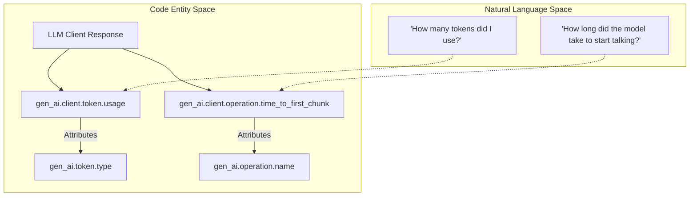
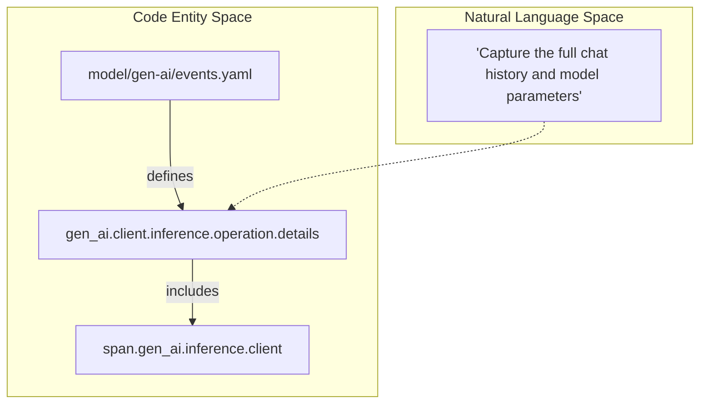

This page describes the semantic conventions for metrics and events in Generative AI systems. These conventions ensure that performance data (latencies, token counts) and discrete lifecycle occurrences (inference details, evaluations) are captured consistently across different providers and instrumentation libraries.

## Metrics Conventions

Generative AI metrics are categorized into client-side, server-side, and workflow-level instruments. Most performance metrics are defined as **Histograms** to capture the distribution of latencies and usage [docs/gen-ai/gen-ai-metrics.md:58-60]().

### Client-Side Metrics
Client metrics focus on the consumer's perspective of GenAI operations, including token consumption and various latency stages.

| Metric Name | Instrument | Unit | Description |
| --- | --- | --- | --- |
| `gen_ai.client.token.usage` | Histogram | `{token}` | Number of input and output tokens used [docs/gen-ai/gen-ai-metrics.md:60](). |
| `gen_ai.client.operation.duration` | Histogram | `s` | Total time for the operation to complete [docs/gen-ai/gen-ai-metrics.md:107](). |
| `gen_ai.client.operation.time_to_first_chunk` | Histogram | `s` | Latency until the first chunk is received in streaming [docs/gen-ai/gen-ai-metrics.md:144](). |

### Server-Side & Workflow Metrics
Server metrics are typically emitted by model providers or self-hosted model gateways, while workflow metrics track higher-level agentic processes.

*   **`gen_ai.server.request.duration`**: Measures the server-side processing time [docs/gen-ai/gen-ai-metrics.md:214]().
*   **`gen_ai.workflow.duration`**: Tracks the end-to-end duration of a complex GenAI workflow (e.g., an agentic loop) [docs/gen-ai/gen-ai-metrics.md:288]().

### Bucket Strategies
To ensure consistent aggregation across backends, specific explicit bucket boundaries are recommended:
*   **Token Usage**: `[1, 4, 16, 64, 256, 1024, 4096, 16384, 65536, 262144, 1048576, 4194304, 16777216, 67108864]` [docs/gen-ai/gen-ai-metrics.md:51]().
*   **Duration (Seconds)**: `[0.01, 0.02, 0.04, 0.08, 0.16, 0.32, 0.64, 1.28, 2.56, 5.12, 10.24, 20.48, 40.96, 81.92]` [docs/gen-ai/gen-ai-metrics.md:111]().

### Data Flow: Metric Emission
The following diagram illustrates how instrumentation libraries map internal provider responses to OpenTelemetry metric instruments.

**GenAI Metric Mapping**

Sources: [docs/gen-ai/gen-ai-metrics.md:40-72](), [docs/gen-ai/gen-ai-metrics.md:144-155]()

## Events Conventions

Events allow for capturing high-cardinality or large-payload data (like full chat histories or evaluation scores) that may be too heavy for span attributes or metrics [docs/gen-ai/gen-ai-events.md:16-19]().

### Core Event Definitions
Definitions are managed in `model/gen-ai/events.yaml` and rendered into documentation.

| Event Name | Purpose | Key Attributes |
| --- | --- | --- |
| `gen_ai.client.inference.operation.details` | Captures full prompt/response and parameters [model/gen-ai/events.yaml:3-6](). | `gen_ai.request.model`, `gen_ai.response.id`, `gen_ai.request.temperature` |
| `gen_ai.evaluation.result` | Records quality/accuracy scores for a GenAI output [model/gen-ai/events.yaml:13-17](). | `gen_ai.evaluation.name`, `gen_ai.evaluation.score.value`, `gen_ai.evaluation.explanation` |
| `gen_ai.client.operation.exception` | Specialized event for errors occurring during client operations [model/gen-ai/events.yaml:39-43](). | `exception.type`, `exception.message`, `exception.stacktrace` |

### Evaluation Events
The `gen_ai.evaluation.result` event is used to store the output of an evaluation process. It SHOULD be parented to the GenAI operation span being evaluated [model/gen-ai/events.yaml:16-17](). If the span context is unavailable, the `gen_ai.response.id` attribute is used to correlate the evaluation with the original inference [model/gen-ai/events.yaml:31-37]().

### Implementation Logic: Event Recording
The following diagram bridges the logical concept of an "Inference Detail" to the YAML definitions and generated event structures.

**Event Definition to Code Mapping**

Sources: [model/gen-ai/events.yaml:3-12](), [docs/gen-ai/gen-ai-events.md:21-36]()

## Exception Handling
When a client operation fails, instrumentations record the `gen_ai.client.operation.exception` event.
*   **Severity**: SHOULD be set to `WARN` (Severity Number 13) [model/gen-ai/events.yaml:47]().
*   **Correlation**: This event provides detailed error metadata that complements the `error.type` attribute found on the parent span [docs/gen-ai/gen-ai-events.md:42]().

Sources: [model/gen-ai/events.yaml:39-60](), [docs/gen-ai/gen-ai-events.md:42]()